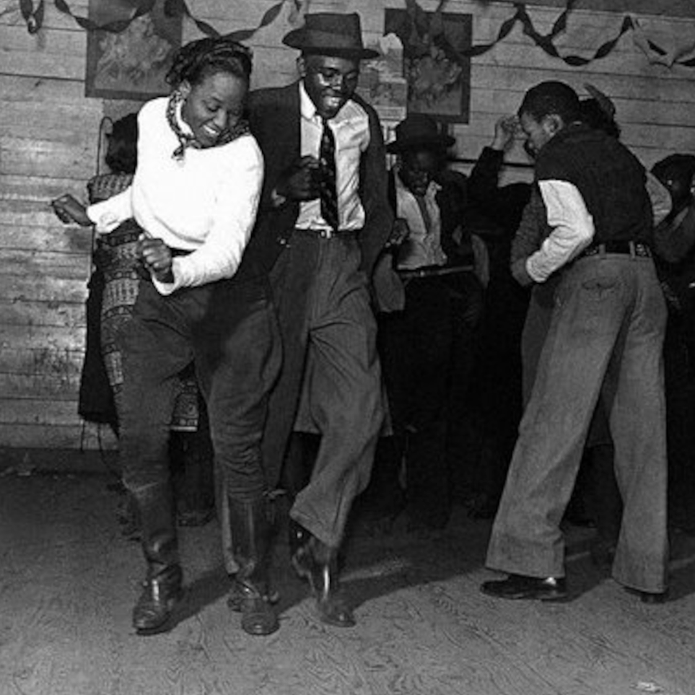
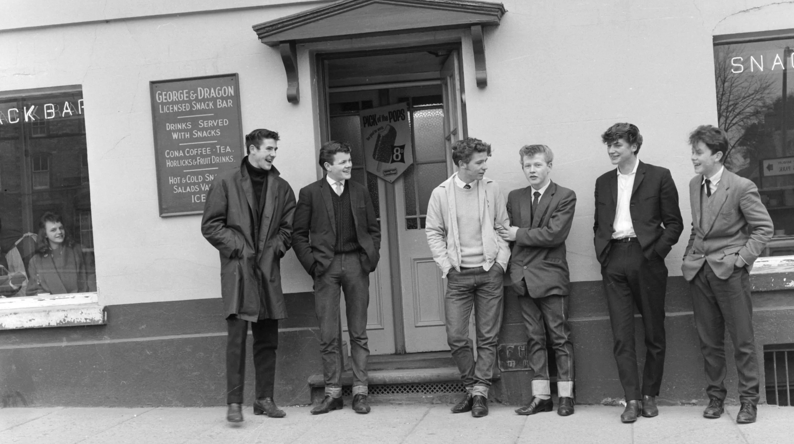
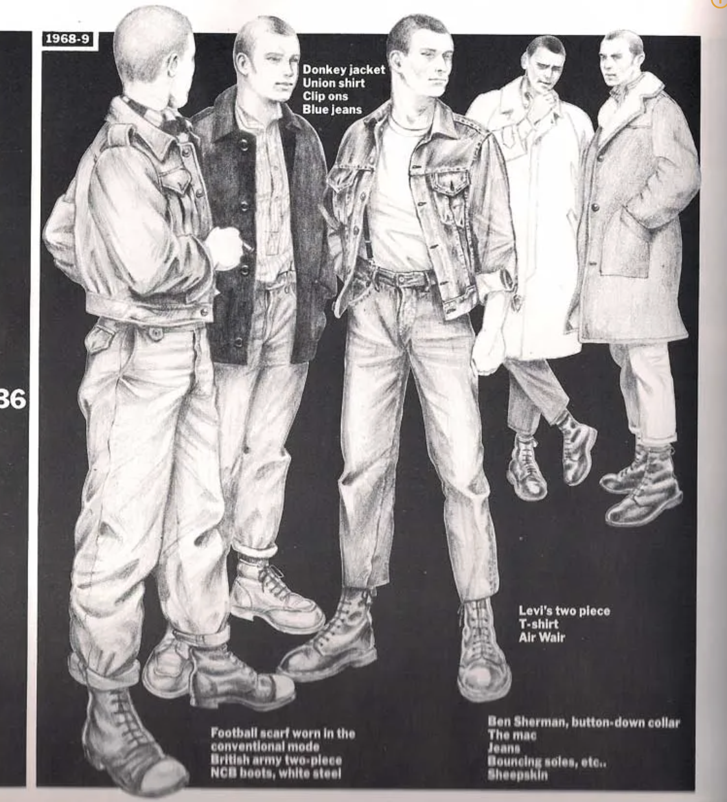
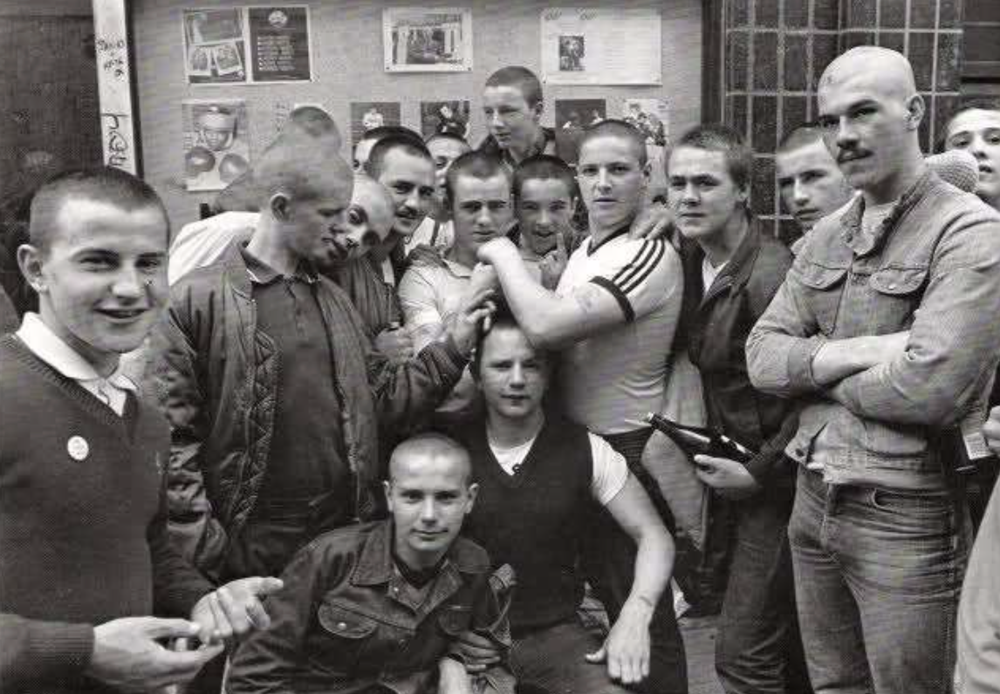
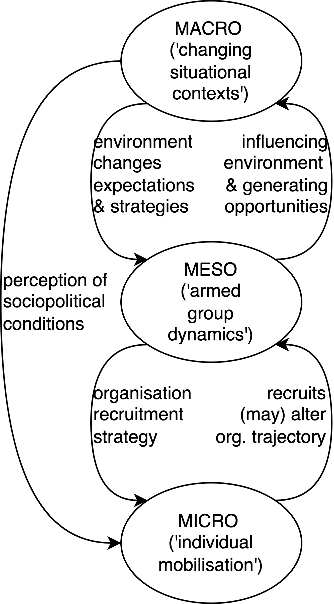
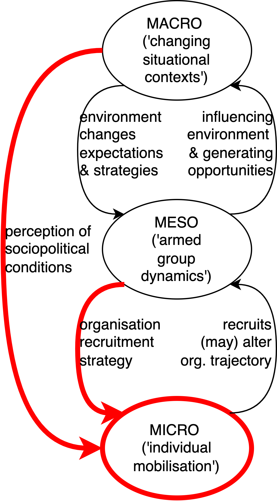
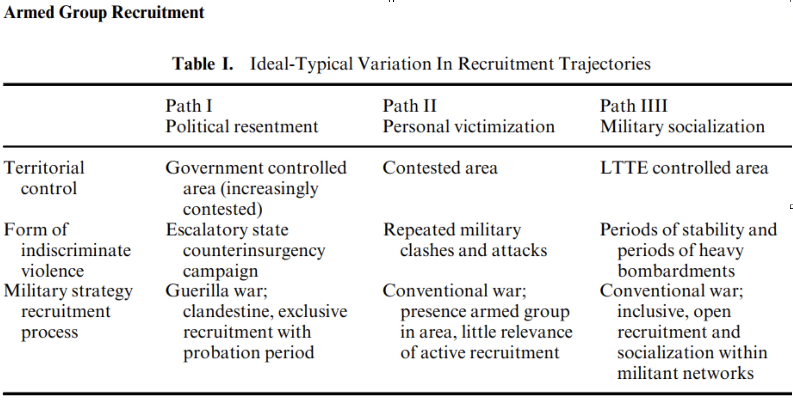

# Opening notes {background-color="#2c844c"}

::: {.tenor-gif-embed data-postid="14209777" data-share-method="host" data-aspect-ratio="1.94" data-width="70%"}
<div class="tenor-gif-embed" data-postid="14209777" data-share-method="host" data-aspect-ratio="1.94" data-width="100%"><a href="https://tenor.com/view/open-gif-14209777">Open Sticker</a>from <a href="https://tenor.com/search/open-stickers">Open Stickers</a></div> <script type="text/javascript" async src="https://tenor.com/embed.js"></script> 
:::

```{=html}
<script type="text/javascript" async src="https://tenor.com/embed.js"></script>
```

## Follow-up from last week 

- factors shaping politically violent groups' [strategy]{style="color:darkred;"}
    + multiple simultaneously 
    + some more based around 'rational' calculation (e.g., available resources, state posture); others less so (e.g., ideology, emotional dynamics) 

. . . 

- [reminder]{style="color:red;"}: cases discussed in course are meant to help clarify theory and concepts

> a great deal of charged politics behind many of these cases---but the justifiability of causes in these cases is not part of this course  

## Presentation groups

<!-- ::: panel-tabset -->
<!-- ## December -->

| Date    | Presenters                       | Method |
| -------:|:---------------------------------|:------:|
| 4 Dec:  | Shahadaan, Kristine, Daichi      | ethnography | 
| 11 Dec: | Bérénice, Zorka, Victoria, Katharina | TBD    | 
| 18 Dec: | Shoam, Aidan, Tara, Sebastian    | TBD    | 

: Presentations line-up

<!-- ## January -->

<!-- | Date    | Presenters                       | Method | -->
<!-- | -------:|:---------------------------------|:------:| -->
<!-- | 8 Jan:  |                                  | TBD    |  -->
<!-- | 15 Jan: |                                  | TBD    |  -->
<!-- | 22 Jan: |                                  | TBD    |  -->
<!-- | 29 Jan: |                                  | TBD    |  -->

<!-- : Presentations line-up -->

<!-- ::: -->

<!-- []{style="font-size:10px;"} -->

# Klausur preview follow-up {background-color="#2c844c"}

:::: {.columns}
:::{.column width="50%"}
- structure of an essay
    1. Broad introductory response
    2. Elaborate in (sufficient) detail to answer the questions
    3. Describe examples
    4. Concluding summary

**[any follow-up questions on this? (full review in late January)]{style="color:red;"}**

:::

::: {.column width="50%" .right}
<div class="tenor-gif-embed" data-postid="21422908" data-share-method="host" data-aspect-ratio="1" data-width="100%"><a href="https://tenor.com/view/mr-bean-benestad-alvesta-exam-mr-bean-exam-gif-21422908">Mr Bean Benestad GIF</a>from <a href="https://tenor.com/search/mr+bean-gifs">Mr Bean GIFs</a></div> <script type="text/javascript" async src="https://tenor.com/embed.js"></script> 
:::
::::


# Subculture {background-color="#2c844c"}

:::: {.columns}
:::{.column width="50%"}
- definition 
- example: from ska to skinhead
- other subculture examples 
- explanatory power: IS foreign fighters

:::

::: {.column width="50%" .right}
<div class="tenor-gif-embed" data-postid="21841153" data-share-method="host" data-aspect-ratio="1.2749" data-width="100%"><a href="https://tenor.com/view/i-love-culture-culture-muppets-kermit-miss-piggy-gif-21841153">I Love Culture Culture GIF</a>from <a href="https://tenor.com/search/i+love+culture-gifs">I Love Culture GIFs</a></div> <script type="text/javascript" async src="https://tenor.com/embed.js"></script> 
:::
::::

## Subculture defined

::: {style="text-align: center;"} 
[[subculture]{style="color:darkred;"} - a cultural group within a larger culture with its own traits, beliefs, and interests, typically distinct from and sometimes at odds with the larger culture]{style="font-size:55px;"} 
::: 

## Subculture example - from ska to skinhead {auto-animate=true}

- 1960s: '[mod]{style="color:forestgreen;"}' subculture in UK (working class youth with upward social mobility, stylish clothes, [American soul]{style="color:violet;"} & [Jamaican ska]{style="color:goldenrod;"})
    + '[hard mods]{style="color:forestgreen;"}': short haircuts, jeans and boots---worker aesthetic
        * [skinheads]{style="color:forestgreen;"}: Jamaican 'rude boys' opposed to authority
- 1970s: skinhead aesthetic, 'street punk'/*Oi!* music
    + [right-wing skins]{style="color:forestgreen;"}: rejection of black/Jamaican roots
        * 'Nazi rock': pioneering bands like *Screwdriver* (Ian Stuart Donaldson) and *Böhse Onkelz* [@Brown2004; @Dyck2016]
        * British-German connections
    + [left-wing skins]{style="color:forestgreen;"}: 'unpolitical' and clinging to Jamaican roots
        * S.H.A.R.P. (Skinheads Against Racial Prejudice)


::: {.r-stack}
{.fragment .absolute top=50 left=200}

{.fragment .absolute top=50 left=50}

{.fragment .absolute top=50 left=200}

{.fragment .absolute top=50 left=100}

:::


## Subculture example - from ska to skinhead {auto-animate=true}

- So this evolution has created a [subculture]{style="color:darkred;"}: music, clothing (e.g., shoelaces), political beliefs and orientation

- 1960s: '[mod]{style="color:forestgreen;"}' subculture in UK (working class youth with upward social mobility, stylish clothes, [American soul]{style="color:violet;"} & [Jamaican ska]{style="color:goldenrod;"})
    + '[hard mods]{style="color:forestgreen;"}': short haircuts, jeans and boots---worker aesthetic
        * [skinheads]{style="color:forestgreen;"}: Jamaican 'rude boys' opposed to authority
- 1970s: skinhead aesthetic, 'street punk'/*Oi!* music
    + [right-wing skins]{style="color:forestgreen;"}: rejection of black/Jamaican roots
        * 'Nazi rock': pioneering bands like *Screwdriver* (Ian Stuart Donaldson) and *Böhse Onkelz* [@Brown2004; @Dyck2016]
        * British-German connections
    + [left-wing skins]{style="color:forestgreen;"}: 'unpolitical' and clinging to Jamaican roots
        * S.H.A.R.P. (Skinheads Against Racial Prejudice)

## For those interested in a more recent example...

:::: {.columns}
:::{.column width="50%"}
A short documentary about the Rechtsrock concert in Ostritz in 2019:

:::

::: {.column width="50%" .right}
<!-- Aspect ratios include 1x1, 4x3, 16x9 (the default), and 21x9. -->
<!-- aspect-ratio="21x9"  -->


:::
::::

But no alcohol allowed... (see further in [Spiegel](https://www.spiegel.de/politik/deutschland/ostritz-in-sachsen-buerger-kaufen-neonazis-das-bier-weg-a-1273834.html) article)

::: panel-tabset
## translated 
> Given the context of the other events and the resulting encounter between the various political camps, as well as the obviously combative and aggressive nature of the event, alcohol consumption would undoubtedly further increase the risk of violent clashes.

## Deutsch (original)

> Vor dem Hintergrund der weiteren Veranstaltungen und der damit einhergehenden Begegnung der verschiedenen politischen Lager sowie des offensichtlich kämpferisch-aggressiven Charakters der Veranstaltung würde ein Alkoholkonsum unzweifelhaft die Gefahr von gewaltsamen Auseinandersetzungen weiter erhöhen.

::: 

<!-- <https://www.spiegel.de/politik/deutschland/ostritz-in-sachsen-buerger-kaufen-neonazis-das-bier-weg-a-1273834.html> -->

<!-- ALSO: <https://www.youtube.com/watch?v=zKX9OjNy_NI> -->

## Other subculture examples?

[Any [subculture]{style="color:darkred;"} examples you know? Any overlap with extremist groups? What are the distinguishing characteristics? Certain clothing, music, symbols, practices?]{style="color:indigo;"} 

. . . 

- From the right-wing extremist scene: Skinheads and [Rechtsrock](https://www.youtube.com/watch?v=ypxkGrrB99I), [football hooligans](https://www.youtube.com/watch?v=fzFDJOH1kcA), [Incels](https://www.youtube.com/watch?v=9p7dRa9-7as), sovereign citizens and [Reichsbürger](https://www.youtube.com/watch?v=aOjHs_pMbOg&pp=ygUNcmVpY2hzYsO8cmdlcg%3D%3D), neo-pagan, occultists, [military veterans (and active service personnel)](https://www.youtube.com/watch?v=RoKt8mYbJuU&pp=ygUaYWJjIGV4dHJlbWlzbSBHZXJtYW55IGFybXk%3D), [biker gangs](https://www.youtube.com/watch?v=kFiSgLVnGto)
    + *__[Der NSU war nicht zu dritt](https://www.amadeu-antonio-stiftung.de/der-nsu-war-nicht-zu-dritt-31205/)__*

. . . 

- [What is the explanatory power of the [subculture]{style="color:darkred;"} concept? Why is it important?]{style="color:indigo;"} 

## Subculture, radical milieu, and mobilisation - an empirical puzzle

> More than **1000 people** from the Balkan region travelled between 2012 and 2016 to become foreign fighters (Azinović & Bećirević 2017), a disproportionately high number.

- [Why might the Balkans account for a disproportionate (compared to western Europe and to the U.S.) number of ISIS foreign fighters? Let's hear some hypotheses!]{style="color:indigo;"} 

. . . 

- @metodieva2022foreign argues that the **[post-conflict radical milieu]{style="color:darkorange;"}** [is the key factor]{style="color:darkorange;"} [cf. @metodieva2023InfluencesIslamistRadicalization]

# @Bosi2012 - Micro-mobilization into Armed Groups {background-color="#2c844c"}

:::: {.columns}
:::{.column width="50%"}
- levels schema 
- cases and case design 
    + Provos/PIRA and Brigate Rosse 
- paths: ideological, instrumental, solidaristic

:::

::: {.column width="50%" .right}
<div class="tenor-gif-embed" data-postid="16609842" data-share-method="host" data-aspect-ratio="1.79775" data-width="100%"><a href="https://tenor.com/view/police-noob-split-biker-drive-gif-16609842">Police Noob GIF</a>from <a href="https://tenor.com/search/police-gifs">Police GIFs</a></div> <script type="text/javascript" async src="https://tenor.com/embed.js"></script> 
:::
::::

## @Bosi2012[p. 364] levels schema

:::: {.columns}
:::{.column width="50%"}
{width="350"}

:::

::: {.column width="50%" .right}
- focus on three central dimensions
    + individual motivations for involvement ([micro]{style="color:blue;"})
    + networks which facilitate the recruitment process ([meso]{style="color:blue;"})
    + effects on individuals of repressive strategies ([macro]{style="color:blue;"})

:::
::::

## @Bosi2012[p. 364] levels schema

:::: {.columns}
:::{.column width="50%"}
{width="350"}

:::

::: {.column width="50%" .right}
- focus on three central dimensions
    + individual motivations for involvement ([micro]{style="color:blue;"})
    + networks which facilitate the recruitment process ([meso]{style="color:blue;"})
    + effects on individuals of repressive strategies ([macro]{style="color:blue;"})

:::
::::

## Cases and case design [@Bosi2012, pp. 365-366]

- aiming to identify "some of the central paths followed by those individuals who join armed groups" [@Bosi2012, p. 361]
- [paired comparison]{style="color:blue;"} of [most-different cases]{style="color:blue;"} of micro-mobilizations into armed activism with the [aim of singling out some similarities]{style="color:blue;"}

> Our cases represent two of the most influential armed groups in Europe, among the few who lasted for more than 10 years, with a broad territorial coverage and a relatively high number of members and sympathizers. They [differ however in their main ideological roots]{style="color:indigo;"}: ethnonationalist for the PIRA, socio-revolutionary for the BR.

- [thoughts on this ideological division?]{style="color:indigo;"}

## Cases and case design [@Bosi2012, pp. 365-366] {auto-animate=true}

some methodological points: scope for generalisation

- [population]{style="color:blue;"}? 
- [scope conditions]{style="color:blue;"}?

## Cases and case design [@Bosi2012, pp. 365-366] {auto-animate=true}

some methodological points: scope for generalisation

- [population]{style="color:blue;"}? 
    + armed groups (in Europe?)
- [scope conditions]{style="color:blue;"}?
    + groups that lasted more than 10 years
    + broad territorial coverage
    + high number of members and sympathizers

## Cases and case design: generalisation [@Bosi2012, pp. 365-366]

> Although our empirical testing concerns PIRA and BR armed activists, we believe that similar micromobilization paths can be found in other armed groups. This is true if we think of the works of Jocelyan Viterna (2006) on the **[women’s mobilization into the FMLN in El Savador]{style="color:darkorange;"}**, that of Fernando Reinares (2001) with **[ETA militants]{style="color:darkorange;"}**, Olivier Roy’s(2004) work with **[Islamic militants mobilization into Al Qaeda]{style="color:darkorange;"}** in the Middle East, or the work of Gilda Zwerman and Patricia Steinhoff (2005) regarding **[left-wing armed groups in the US and Japan in the post 1960s]{style="color:darkorange;"}**.

## Cases: Provos and BR [@Bosi2012]

- ideologically dissimilar, organisationally similar...
    + [PIRA]{style="color:forestgreen;"}... "*hierarchies of leadership and territorial brigades, battalions, and companies. While the active membership of the organization never exceeded a few hundred at any one time, it is estimated that over 10,000 individuals participated in the PIRA in its almost 30 years of military campaigning*"
    + [BR]{style="color:red;"}... "*organized in city columns, which were subdivided into brigades, with “cells” of three to five members each. Throughout the 1970s and the 1980s it was estimated to have over four hundred full-time members, plus an unknown number of supporters.*"
- the grim tally: [PIRA]{style="color:forestgreen;"} "responsible for over 1,750 deaths between 1970 and 1994"; [BR]{style="color:red;"} "claiming responsibility for 145 killings"

## Paths of radicalisation [@Bosi2012]

| Path | Dominant motivations (micro level) | Recruitment- relevant networks (meso level) | Perception of context (macro level) | 
|-------------:|:-------------|:-------------|:-------------| 
| Ideological  | Ideological, identity  | Family and territorial traditions | Potential revolutionary situation | 
| Instrumental | Aspiration to change   | Political groups | Closed opportunities | 
| Solidaristic | Experiential cognition | Peer group | Escalation of political conflict | 

## Paths of radicalisation [@Bosi2012]

(*[generalizability]{style="color:blue;"}*): [Are the described pathways fitting for less violent groups with more limited goals which never included an attack on the state or the status quo? Can the 3 types be used to analyse counterrevolutionary terrorism]{style="color:indigo;"}?

| Path | Dominant motivations | Recruitment- relevant networks | Perception of context | 
|-------------:|:-------------|:-------------|:-------------| 
| Ideological  | Ideological, identity  | Family and territorial traditions | Potential revolutionary situation | 
| Instrumental | Aspiration to change   | Political groups | Closed opportunities | 
| Solidaristic | Experiential cognition | Peer group | Escalation of political conflict | 
## Ideological path - @Bosi2012[p. 372]

> “We were all trusted comrades: we had known each other for a long time and were very good friends” (Alberto Franceschini, quoted in Fasanella and Franceschini 2004, 44). In other words, in their initial phases both armed groups exploited **[pre-existing social and affective ties]{style="color:darkorange;"}** in recruitment processes in order to **[avoid possible infiltrations]{style="color:darkorange;"}**. While in the Northern Ireland case the **[family]{style="color:darkorange;"}** was also relevant in recruitment to the armed group (e.g. interviewees 1, 6, 11 and 17), **[in the Italian case the family remained more important as a cultural symbol, and joining the BR was perceived as a rupture with the family environment]{style="color:darkorange;"}**

**[examples of this path from extremist group cases?]{style="color:indigo;"}**

## Instrumental path - @Bosi2012[p. 374]

> many activists joined armed groups **[after a long search for effective strategies to achieve their political aims]{style="color:darkorange;"}** (Interviewees 2, 5, 18, 19, 20 for the PIRA and Balzerani, Fiore, Peci, Ronconi and Interviewees 26 and 27 for the BR). They usually joined armed groups later in life **[following dissatisfaction with the “ordinary” politics]{style="color:darkorange;"}** in which they were involved. They judged armed groups according to whether or not they had the capacity to stage successful campaigns and lead to concrete results.

**[examples of this path from extremist group cases?]{style="color:indigo;"}**

## Solidarity path - @Bosi2012[p. 380]

> The **[context]{style="color:darkorange;"}** in which these individuals mobilized was in fact one **[of escalation]{style="color:darkorange;"}**. For many individuals the armed struggle was a way to cope with societies which seemed to them in turmoil. **[High repression and counter-movement violence in collaboration with the establishment]{style="color:darkorange;"}** worked for young individuals as a loss of innocence, which further delegitimized the regimes and justified their mobilization in the PIRA and the BR. ... The leadership of the PIRA had, for example, planned to **[provoke street disturbances with the deliberate intention of producing an outward spiral of violence]{style="color:darkorange;"}**, knowing full well the benefits the British Army repression would reap in terms of support and recruits from the nationalist community.

**[examples of this path from extremist group cases?]{style="color:indigo;"}**

<!-- ([Bosi and Porta, 2012, p. 380](zotero://select/library/items/WQLWKHLS)) SUMMARY OF THREE PATHS   -->
<!-- In the ideological path, we singled out the relevance of deeply rooted family and local traditions, which allowed participants to frame the choice ofjoining armed struggles within a narrative of continuity. The family and the immediate environment provided political socialization into an ideological background in which rebellion could be framed as a sort of obligation in a context perceived as ripe for the successful continuation of the old struggle. Within the instrumental path, mobilization passed instead through the belief that non-violent forms of political protest were no longer helpful in the face of closing political opportunities. They were driven mainly by political grievances. Those who followed this path tended to break more with their past when mobilizing in armed groups in comparison to those who followed an ideological path. A third path developed out of solidarity with a community in struggle in an environment characterized by intense emotions (amongst which anger and revenge were often cited). At least initially, violence was not legitimized by reference to ideology or political strategies, but rather as an everyday element in handling conflicts. It appeared to result from a search for meaning and loyalty to the peer group. -->

# @meier2022SpatiotemporalVariationArmed - Armed Group Recruitment of the LTTE {background-color="#2c844c"}

:::: {.columns}
:::{.column width="50%"}
- (Liberation Tigers of Tamil Eelam)
- Sri Lankan Civil War background

:::

::: {.column width="50%" .right}
<div class="tenor-gif-embed" data-postid="18846127" data-share-method="host" data-aspect-ratio="0.746875" data-width="75%"><a href="https://tenor.com/view/sri-lanka-gif-18846127">Sri Lanka GIF</a>from <a href="https://tenor.com/search/sri+lanka-gifs">Sri Lanka GIFs</a></div> <script type="text/javascript" async src="https://tenor.com/embed.js"></script> 
:::
::::

## @meier2022SpatiotemporalVariationArmed - The Sri Lankan Civil War: Background

- Sri Lankan independence from British Colonial Rule 1948
    + $\rightarrow$ Sinhalese 74%, Tamil 18%  
<!-- - “Ethnic outbidding” (DeVotta 2004) -->
- Inter-generational conflicts within the Tamil Movement
- 1983 anti-Tamil riots as transformative event
- From guerrilla to conventional war 
- The LTTE as de facto state
- 2008 military defeat of the LTTE  

## @meier2022SpatiotemporalVariationArmed - territorial aspect


## @meier2022SpatiotemporalVariationArmed - Research interest

- Differential participation in armed groups during civil wars
    + $\rightarrow$ Variation at the sub-national level
    + $\rightarrow$ Temporal and/or spatial variation
- Building on @kalyvas2006logic three different mobilization areas can be distinguished according to the actors in control of the area and the degree to which they exert control
    + Rebel controlled areas
    + Government controlled areas 
    + Contested areas
- $\rightarrow$ Different pathways to militancy within the three mobilization areas? 

## @meier2022SpatiotemporalVariationArmed - Research Process and Methodology

- Selection of research sites
- Interviewing former militants and “similarly placed” civilians
    + $\rightarrow$ [Snowball sampling]{style="color:blue;"} 
- [Life history interviews]{style="color:blue;"}
    + [issues with this approach?]{style="color:indigo;"}

## @meier2022SpatiotemporalVariationArmed - Argument and Contribution to the Literature

- Argument:
    + Depending on the [area where individuals live during civil wars]{style="color:darkorange;"}, they are exposed to [different political orders]{style="color:darkorange;"} and thus experience the conflict in different ways. 
    + Variation in [conflict experience influences people’s decision to take up arms]{style="color:darkorange;"}, resulting in [different individual pathways to militancy]{style="color:darkorange;"} across spatio-temporal contexts 

- Explanatory factors:
    1) actors in control of the area
    2) intensity and form of violence
    3) LTTE recruitment strategy 

## @meier2022SpatiotemporalVariationArmed - Participation Trajectories LTTE Militants 




# Any questions, concerns, feedback for this class? {background-color="#2c844c"}

Anonymous feedback here: <https://forms.gle/NfF1pCfYMbkAT3WP6>

Alternatively, please send me an email: [m.zeller\@lmu.de]{style="color:red;"}


```{r echo=FALSE, message=FALSE, warning=FALSE}
pagedown::chrome_print(file.path("..", "docs/slides", "slides_05.html"))
```

## References
