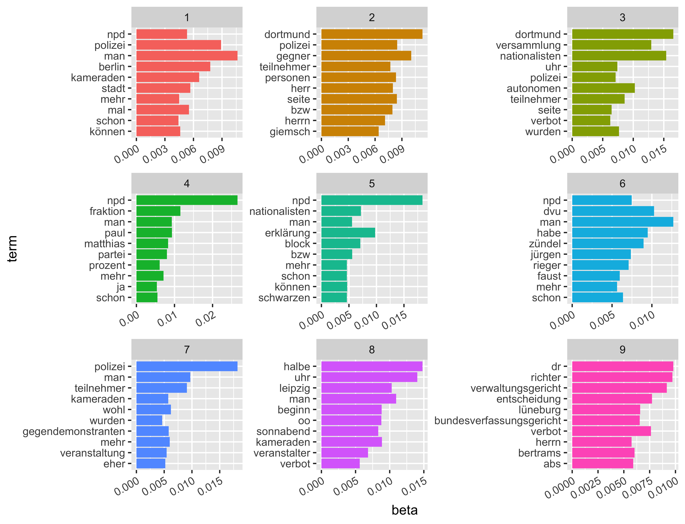
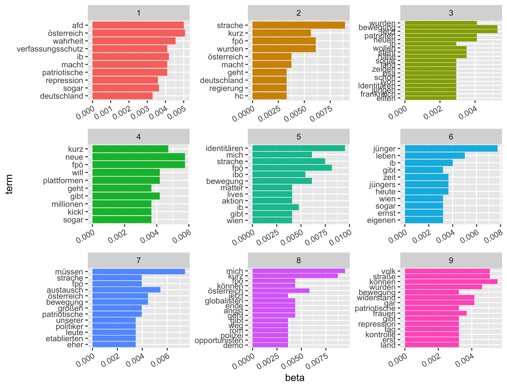
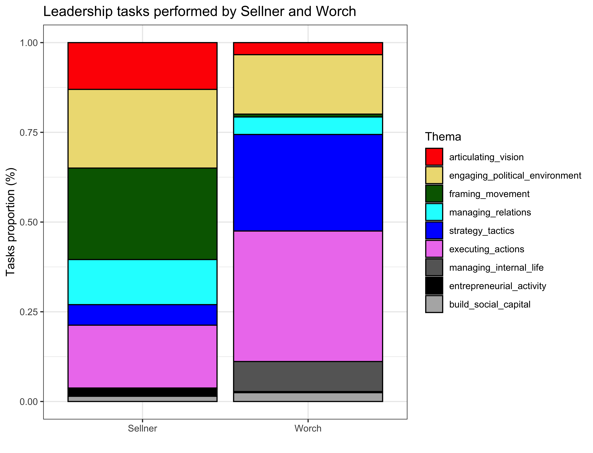
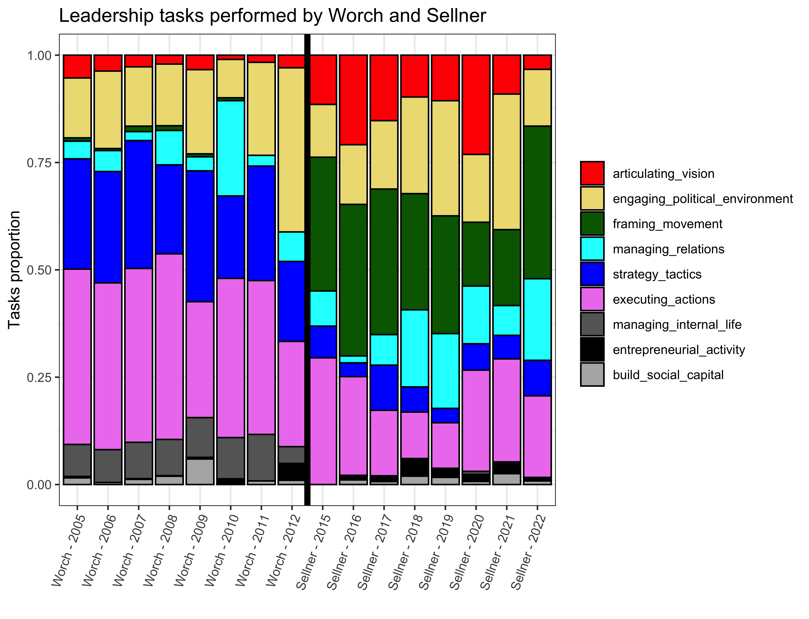
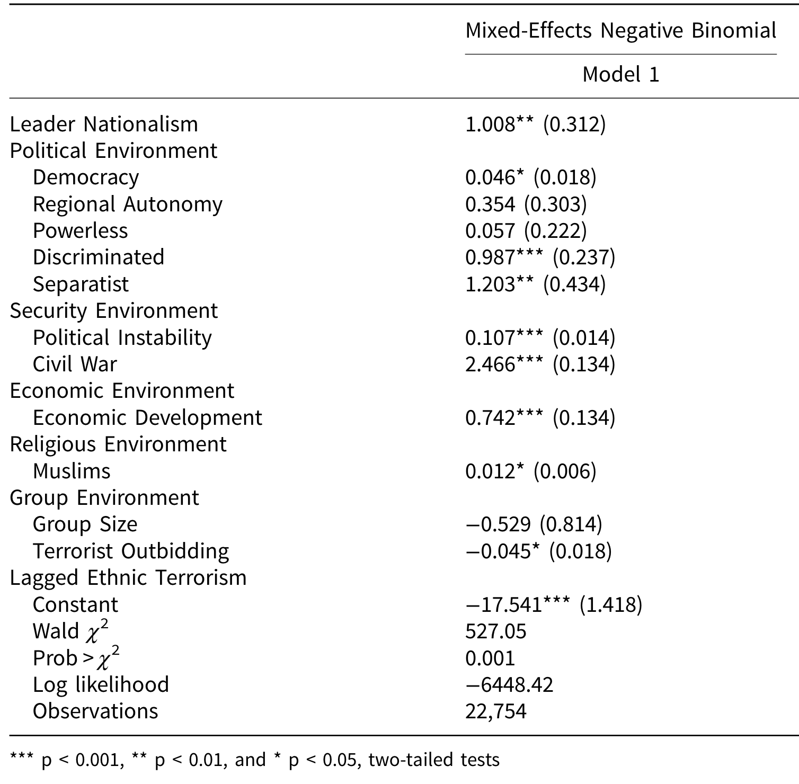
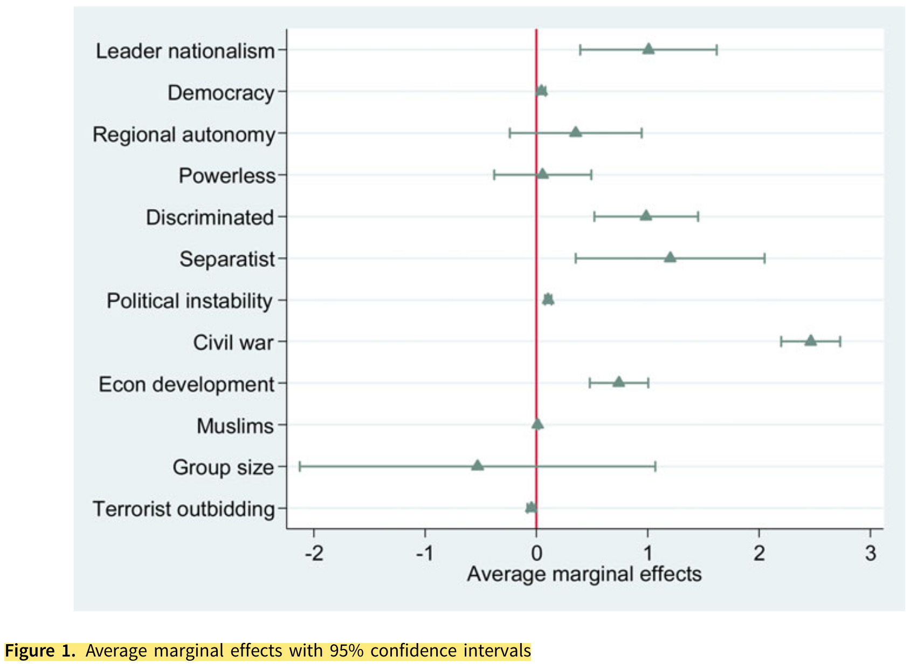
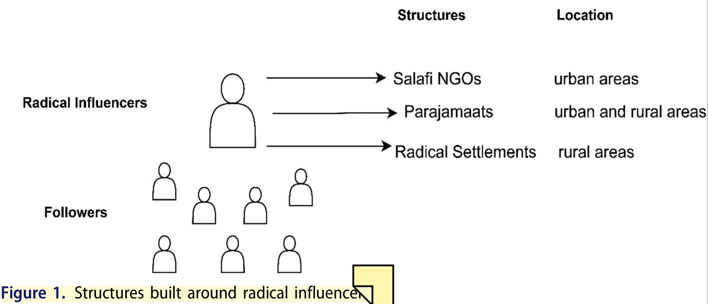
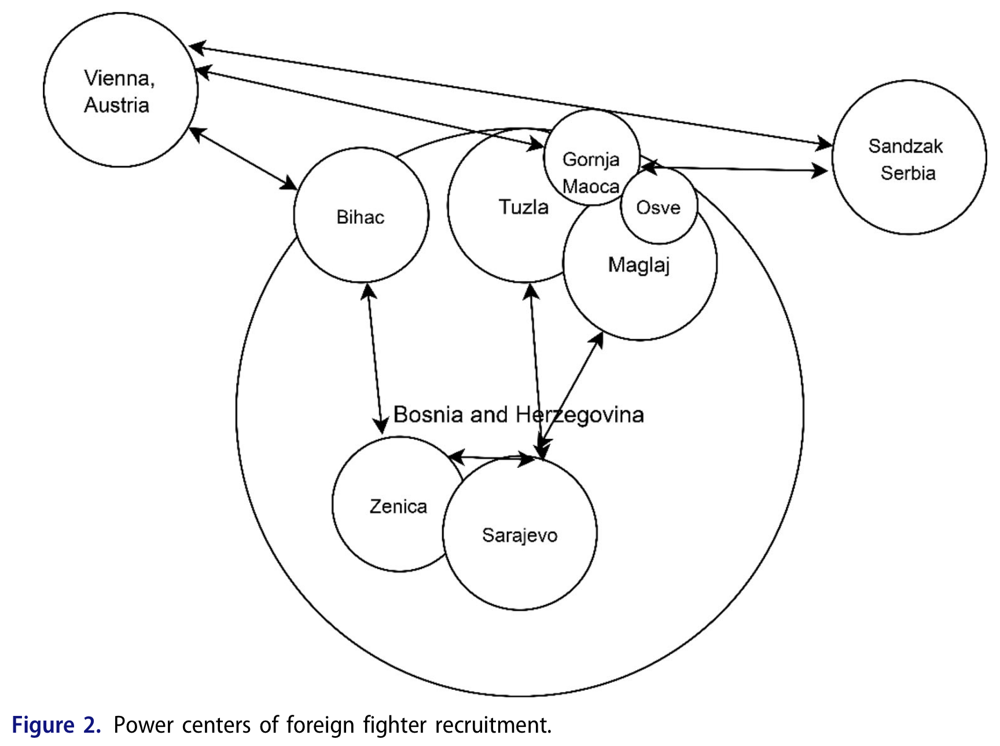

# Opening notes {background-color="#2c844c"}

::: {.tenor-gif-embed data-postid="14209777" data-share-method="host" data-aspect-ratio="1.94" data-width="70%"}
<div class="tenor-gif-embed" data-postid="14209777" data-share-method="host" data-aspect-ratio="1.94" data-width="100%"><a href="https://tenor.com/view/open-gif-14209777">Open Sticker</a>from <a href="https://tenor.com/search/open-stickers">Open Stickers</a></div> <script type="text/javascript" async src="https://tenor.com/embed.js"></script> 
:::

```{=html}
<script type="text/javascript" async src="https://tenor.com/embed.js"></script>
```

## Presentation groups

<!-- ::: panel-tabset -->
<!-- ## December -->

| Date    | Presenters                       | Method |
| -------:|:---------------------------------|:------:|
| 4 Dec:  | Shahadaan, Kristine, Daichi      | ethnography | 
| 11 Dec: | Bérénice, Zorka, Victoria, Katharina | TBD    | 
| 18 Dec: | Shoam, Aidan, Tara, Sebastian    | QCA    | 

: Presentations line-up

<!-- ## January -->

<!-- | Date    | Presenters                       | Method | -->
<!-- | -------:|:---------------------------------|:------:| -->
<!-- | 8 Jan:  |                                  | TBD    |  -->
<!-- | 15 Jan: |                                  | TBD    |  -->
<!-- | 22 Jan: |                                  | TBD    |  -->
<!-- | 29 Jan: |                                  | TBD    |  -->

<!-- : Presentations line-up -->

<!-- ::: -->

<!-- []{style="font-size:10px;"} -->

# Leadership {background-color="#2c844c"}

:::: {.columns}
:::{.column width="50%"}
- theories of leadership
    + Weber
    + @Nepstad2006
    + @Earl2007
- an example from far-right movements

:::

::: {.column width="50%" .right}
<div class="tenor-gif-embed" data-postid="26920475" data-share-method="host" data-aspect-ratio="1.77778" data-width="100%"><a href="https://tenor.com/view/danny-zuko-grease-leader-danny-zuko-leader-grease-leader-gif-26920475">Danny Zuko Grease GIF</a>from <a href="https://tenor.com/search/danny+zuko-gifs">Danny Zuko GIFs</a></div> <script type="text/javascript" async src="https://tenor.com/embed.js"></script> 
:::
::::

## Theories of leadership

- Max Weber (1922): three ideal types: **[legal]{style="color:darkred;"}**, **[traditional]{style="color:darkred;"}**, **[charismatic]{style="color:darkred;"}**
    + shifting denotation of 'charisma' (away from divinity)
        * McDonnell (2016): 'unique qualities, the unconditional acceptance of authority, and strong emotional attachment to leadership.'
    + [examples from this framework]{style="color:indigo;"}?

## Theories of leadership

- Max Weber (1922): three ideal types: **[legal]{style="color:darkred;"}**, **[traditional]{style="color:darkred;"}**, **[charismatic]{style="color:darkred;"}**
    + shifting denotation of 'charisma' (away from divinity)
        * McDonnell (2016): 'unique qualities, the unconditional acceptance of authority, and strong emotional attachment to leadership.'
    + [examples from this framework]{style="color:indigo;"}?
- @Nepstad2006: 'leadership capital' [from Bourdieu, e.g., -@Bourdieu1986]
    + **[social]{style="color:darkred;"}** (building up trust and interpersonal networks), 
    + **[cultural]{style="color:darkred;"}** (applying relevant knowledge and skills), and 
    + **[symbolic]{style="color:darkred;"}** (amassing prestige, honor, and social recognition) components
    + [leaders in politically violent groups that have such 'capital']{style="color:indigo;"}?

## Theories of leadership

- @Earl2007: 'leading tasks' (in movements):
    (1) articulating vision and ideology, 
    (2) engaging the political environment, 
    (3) framing the movement and its issues, 
    (4) managing relations with non-movement actors, 
    (5) making strategic and tactical decisions, 
    (6) organizing specific actions, 
    (7) managing the internal life of the movement, 
    (8) innovating and entrepreneurial activity, and 
    (9) providing social capital 

## Far-right movement leadership [@ZellerVirchow2024]

- *RQs*: (1) How can we characterise recent and contemporary far-right movement leadership? (2) Has leadership changed significantly with the advent of social media?
- *Theory*: modern far-right leadership studies [@Virchow2013_fuehrer; @Busher2018a; @clelandCharismaticLeadershipFarright2020; @Macklin2020]
- *Methods*: [comparative case study]{style="color:blue;"} in adjacent eras of FR activism
    + quantitative text analysis on web-scraped (*rvest*) texts
    + follow-up qualitative analysis: themes and campaign examples

::: {style="margin-top: -40px;"}

```{r}
library(knitr)
library(kableExtra)
library(dplyr)

kable(
  data.frame(
    Author = c("Worch", "Sellner", "Sellner"),
    Source = c("Rundbriefe", "Sezession", "Compact"),
    Years = c("2005–2012", "2015–2022", "2016–2021"),
    `Total texts` = c(260, 100, 54),
    `Total words` = c(209041, 354255, 34926)
  ),
  # format = "latex", caption = "Summary of Text Sources", 
  booktabs = TRUE
) %>% kable_styling(font_size = 35) %>% 
  row_spec(0, bold = T, color = "cadetblue") # , background = "#D7261E"
```

::: 

## FR leadership - Worch topics



## FR leadership - Sellner topics



## FR leadership tasks



## FR leadership tasks by year



## FR leadership - conclusions

- Shared [belief in street politics]{style="color:darkorange;"} <!-- striking similarity -->
    * social media are new tools---but both Worch and Sellner believe in change through mobilisation
    * [mirroring left-wing tactics]{style="color:darkorange;"} ([imitation]{style="color:darkred;"}): IB as 'right-wing clone' of leftist movement organisations (at least according to Sellner); Worch's *autonome Nationalisten*
- But Sellner is broader in his scope of activism, transnational if not global outlook

- Sellner more ideological: articulating vision and framing the movmement, `metapolitik' (e.g., 'Defend Europa' cruise)
- Worch more practical: strategy and tactics and executing actions, emphasis on demonstrations and courts---punishing cities (e.g., Leipzig)


FYI: intro [lecture on QTA]{style="color:blue;"}: <https://www.youtube.com/watch?v=bvqur70ZmyM>
<!-- R-Ladies Bergen (English) - "Taking text data analysis to the next level" -->

# Poll: leadership {background-color="#2c844c"}

:::: {.columns}
:::{.column width="35%"}
{fig-alt="A QR code for the survey."}

:::

::: {.column width="65%" .center}
<!-- go to <https://www.qr-code-generator.com/>, add the link, and screen shot the QR code -->
Take the survey at **<https://forms.gle/QxENrdB3qNpT1jSa8>**

- militants more shaped by leaders than 'ideologies'?
- *charismatic* leaders more likely to lead to violence?
- more horizontally organised groups less likely to be violent?

:::
:::: 

- leaders responsible/liable for violence of their followers?
- incitement through rhetoric similar to explicit orders?
- leaders' ability to control ongoing violence overstated?

<!-- Leaders should be held criminally responsible for the violent acts committed by their followers. -->
<!-- Format: SA / A / D / SD -->
<!-- Invites discussion about command responsibility, moral vs. legal culpability. -->


<!-- Political violence is more often a result of weak leadership than strong leadership. -->
<!-- Format: SA / A / D / SD -->
<!-- Encourages discussion about leadership failure vs. intentional violence. -->

--- 

```{ojs}
md`## Poll results (Respondents: ${respondentCount})`
```


```{ojs}

import { liveGoogleSheet } from "@jimjamslam/live-google-sheet";
import { aq, op } from "@uwdata/arquero";

// UPDATE THE LINK FOR A NEW POLL
surveyResults = liveGoogleSheet(
  "https://docs.google.com/spreadsheets/d/e/" +
    "2PACX-1vTHArn6wAcAH6pniKyOHgZVbrScYn4aFMgEfpRWE_s-E_e1ZGogYOv5jgJTXv7n_99XH0LvWC9KvYWh/" +
    "pub?gid=892835238&single=true&output=csv",
  10000, 1, 7); // adjust the last number to select all relevant columns 

respondentCount = surveyResults.length;

```

Militant movements are more shaped by their leaders than by their ideologies. 

```{ojs}
shapedCounts = aq.from(surveyResults)
  .select("shaped")
  .groupby("shaped")
  .count()
  .derive({ measure: d => "" })

// Calculate the maximum count from your dataset
shaped_maxCountRE = Math.max(...shapedCounts.objects().map(d => d.count));

plot_shaped = Plot.plot({
  marks: [
    Plot.barY(shapedCounts, {
      x: "shaped",
      y: "count",
      fill: "shaped",
      stroke: "black",
      strokeWidth: 1
    }),
    Plot.ruleY([respondentCount], { stroke: "#ffffff99" })
  ],
  color: {
    domain: [
      "Strongly disagree",
      "Disagree",
      "Neutral",
      "Agree",
      "Strongly agree"
    ],
    range: [
      "red",
      "pink",
      "lightgrey",
      "lightgreen",
      "forestgreen"
    ]
  },
  marginBottom: 180,
  x: { label: "", tickSize: 2, tickRotate: -45,
    domain: ["Strongly disagree", "Disagree", "Neutral", "Agree", "Strongly agree"]
  },  
  y: {
    label: "",
    tickSize: 10,
    tickFormat: d => d,
    tickValues: Array.from(
      new Set(shapedCounts.objects().map(d => d.count))
    ).sort((a, b) => a - b),
    domain: [0, shaped_maxCountRE]
  },
  facet: { data: shapedCounts, x: "measure", label: "" },
  marginLeft: 140,
  style: {
    width: 1350,
    height: 500,
    fontSize: 30,
  }
});

```

## Poll results 

:::: {.columns}
:::{.column width="50%"}
Charismatic leadership more likely to lead to political violence

```{ojs}
charismaticCounts = aq.from(surveyResults)
  .select("charismatic")
  .groupby("charismatic")
  .count()
  .derive({ measure: d => "" })

// Calculate the maximum count from your dataset
charismatic_maxCountRE = Math.max(...charismaticCounts.objects().map(d => d.count));

plot_charismatic = Plot.plot({
  marks: [
    Plot.barY(charismaticCounts, {
      x: "charismatic",
      y: "count",
      fill: "charismatic",
      stroke: "black",
      strokeWidth: 1
    }),
    Plot.ruleY([respondentCount], { stroke: "#ffffff99" })
  ],
  color: {
    domain: [
      "Strongly disagree",
      "Disagree",
      "Neutral",
      "Agree",
      "Strongly agree"
    ],
    range: [
      "red",
      "pink",
      "lightgrey",
      "lightgreen",
      "forestgreen"
    ]
  },
  marginBottom: 180,
  x: { label: "", tickSize: 2, tickRotate: -45,
    domain: ["Strongly disagree", "Disagree", "Neutral", "Agree", "Strongly agree"]
  },  
  y: {
    label: "",
    tickSize: 10,
    tickFormat: d => d,
    tickValues: Array.from(
      new Set(charismaticCounts.objects().map(d => d.count))
    ).sort((a, b) => a - b),
    domain: [0, charismatic_maxCountRE]
  },
  facet: { data: charismaticCounts, x: "measure", label: "" },
  marginLeft: 140,
  style: {
    width: 1350,
    height: 500,
    fontSize: 30,
  }
});

```

:::

::: {.column width="50%"}
Groups that reject hierarchical leadership are less likely to become violent

```{ojs}
reject_hierarchyCounts = aq.from(surveyResults)
  .select("reject_hierarchy")
  .groupby("reject_hierarchy")
  .count()
  .derive({ measure: d => "" })

// Calculate the maximum count from your dataset
reject_hierarchy_maxCountRE = Math.max(...reject_hierarchyCounts.objects().map(d => d.count));

plot_reject_hierarchy = Plot.plot({
  marks: [
    Plot.barY(reject_hierarchyCounts, {
      x: "reject_hierarchy",
      y: "count",
      fill: "reject_hierarchy",
      stroke: "black",
      strokeWidth: 1
    }),
    Plot.ruleY([respondentCount], { stroke: "#ffffff99" })
  ],
  color: {
    domain: [
      "Strongly disagree",
      "Disagree",
      "Neutral",
      "Agree",
      "Strongly agree"
    ],
    range: [
      "red",
      "pink",
      "lightgrey",
      "lightgreen",
      "forestgreen"
    ]
  },
  marginBottom: 180,
  x: { label: "", tickSize: 2, tickRotate: -45,
    domain: ["Strongly disagree", "Disagree", "Neutral", "Agree", "Strongly agree"]
  },  
  y: {
    label: "",
    tickSize: 10,
    tickFormat: d => d,
    tickValues: Array.from(
      new Set(reject_hierarchyCounts.objects().map(d => d.count))
    ).sort((a, b) => a - b),
    domain: [0, reject_hierarchy_maxCountRE]
  },
  facet: { data: reject_hierarchyCounts, x: "measure", label: "" },
  marginLeft: 140,
  style: {
    width: 1350,
    height: 500,
    fontSize: 30,
  }
});

```

:::
::::

## Poll results 

:::: {.columns}
:::{.column width="50%"}
Leaders should be held criminally responsible for the violent acts committed by their followers

```{ojs}
responsibleCounts = aq.from(surveyResults)
  .select("responsible")
  .groupby("responsible")
  .count()
  .derive({ measure: d => "" })

// Calculate the maximum count from your dataset
responsible_maxCountRE = Math.max(...responsibleCounts.objects().map(d => d.count));

plot_responsible = Plot.plot({
  marks: [
    Plot.barY(responsibleCounts, {
      x: "responsible",
      y: "count",
      fill: "responsible",
      stroke: "black",
      strokeWidth: 1
    }),
    Plot.ruleY([respondentCount], { stroke: "#ffffff99" })
  ],
  color: {
    domain: [
      "Strongly disagree",
      "Disagree",
      "Neutral",
      "Agree",
      "Strongly agree"
    ],
    range: [
      "red",
      "pink",
      "lightgrey",
      "lightgreen",
      "forestgreen"
    ]
  },
  marginBottom: 180,
  x: { label: "", tickSize: 2, tickRotate: -45,
    domain: ["Strongly disagree", "Disagree", "Neutral", "Agree", "Strongly agree"]
  },  
  y: {
    label: "",
    tickSize: 10,
    tickFormat: d => d,
    tickValues: Array.from(
      new Set(responsibleCounts.objects().map(d => d.count))
    ).sort((a, b) => a - b),
    domain: [0, responsible_maxCountRE]
  },
  facet: { data: responsibleCounts, x: "measure", label: "" },
  marginLeft: 140,
  style: {
    width: 1350,
    height: 500,
    fontSize: 30,
  }
});

```

:::

::: {.column width="50%"}
Leaders who rhetorically incite violence should be prosecuted like those who give orders 

```{ojs}
rhetoricCounts = aq.from(surveyResults)
  .select("rhetoric")
  .groupby("rhetoric")
  .count()
  .derive({ measure: d => "" })

// Calculate the maximum count from your dataset
rhetoric_maxCountRE = Math.max(...rhetoricCounts.objects().map(d => d.count));

plot_rhetoric = Plot.plot({
  marks: [
    Plot.barY(rhetoricCounts, {
      x: "rhetoric",
      y: "count",
      fill: "rhetoric",
      stroke: "black",
      strokeWidth: 1
    }),
    Plot.ruleY([respondentCount], { stroke: "#ffffff99" })
  ],
  color: {
    domain: [
      "Strongly disagree",
      "Disagree",
      "Neutral",
      "Agree",
      "Strongly agree"
    ],
    range: [
      "red",
      "pink",
      "lightgrey",
      "lightgreen",
      "forestgreen"
    ]
  },
  marginBottom: 180,
  x: { label: "", tickSize: 2, tickRotate: -45,
    domain: ["Strongly disagree", "Disagree", "Neutral", "Agree", "Strongly agree"]
  },  
  y: {
    label: "",
    tickSize: 10,
    tickFormat: d => d,
    tickValues: Array.from(
      new Set(rhetoricCounts.objects().map(d => d.count))
    ).sort((a, b) => a - b),
    domain: [0, rhetoric_maxCountRE]
  },
  facet: { data: rhetoricCounts, x: "measure", label: "" },
  marginLeft: 140,
  style: {
    width: 1350,
    height: 500,
    fontSize: 30,
  }
});

```

:::
::::

## Poll results 

Once violence has begun, a leader’s ability to control it is often overstated.

```{ojs}
violence_begunCounts = aq.from(surveyResults)
  .select("violence_begun")
  .groupby("violence_begun")
  .count()
  .derive({ measure: d => "" })

// Calculate the maximum count from your dataset
violence_begun_maxCountRE = Math.max(...violence_begunCounts.objects().map(d => d.count));

plot_violence_begun = Plot.plot({
  marks: [
    Plot.barY(violence_begunCounts, {
      x: "violence_begun",
      y: "count",
      fill: "violence_begun",
      stroke: "black",
      strokeWidth: 1
    }),
    Plot.ruleY([respondentCount], { stroke: "#ffffff99" })
  ],
  color: {
    domain: [
      "Yes",
      "No",
      "Maybe"
    ],
    range: [
      "forestgreen",
      "darkred",
      "goldenrod"
    ]
  },
  marginBottom: 80,
  x: { label: "", tickSize: 2, tickRotate: -1, padding: 0.2,
    domain: ["Yes", "No", "Maybe"]
  },  
  y: {
    label: "",
    tickSize: 10,
    tickFormat: d => d,
    tickValues: Array.from(
      new Set(violence_begunCounts.objects().map(d => d.count))
    ).sort((a, b) => a - b),
    domain: [0, violence_begun_maxCountRE]
  },
  facet: { data: violence_begunCounts, x: "measure", label: "" },
  marginLeft: 60,
  style: {
    width: 1600,
    height: 500,
    fontSize: 40,
  },
});

```

# Research closer look {background-color="#2c844c"}

:::: {.columns}
:::{.column width="50%"}
- @choi2022LeaderNationalismEthnic - Leader Nationalism, Ethnic Identity, and Terrorist Violence
    + key concept - *terrorism*
    + research design
    + results and findings
- @Metodieva2021 - The Radical Milieu and Radical Influencers of Bosnian Foreign Fighters
    + concepts, research design 
    + results and findings

:::

::: {.column width="50%" .right}
<div class="tenor-gif-embed" data-postid="19341620" data-share-method="host" data-aspect-ratio="1.48837" data-width="100%"><a href="https://tenor.com/view/closer-look-gif-19341620">Closer Look GIF</a>from <a href="https://tenor.com/search/closer-gifs">Closer GIFs</a></div> <script type="text/javascript" async src="https://tenor.com/embed.js"></script> 
:::
::::

## Key concept [@choi2022LeaderNationalismEthnic]

::: {style="text-align: center;"}
[**[Terrorism]{style="color:darkred;"}** - 'the threatened or actual use of illegal force, directed against civilian targets, by nonstate actors, in order to attain a political goal, through fear, coercion or intimidation' (LaFree and Ackerman 2009, 348).]{style="font-size:60px;"} 

:::

## Research design [@choi2022LeaderNationalismEthnic, p. 1153] {.smaller .scrollable}

**[Ooof! -- what do we take from this?]{style="color:blue;"}**

> Since the dependent variable is the count of terrorist incidents carried out by related ethnic groups per country-year, I consider a Poisson regression model as the estimation technique. But I find the Pearson goodness-of-fit $x^2$ test to be statistically significant ($x^2$ = 1,842,103, p< 0.001). This suggests that a Poisson regression estimation fails to fit the data correctly. I instead use multilevel mixed-effects negative binomial regression as an alternative estimation method. Because negative binomial regression adds a dispersion parameter to model the unobserved heterogeneity among observations, it can control for the overdispersion found in a Poisson regression model (Hilbe 2007). In addition, given the clustered nature of the data, with ethnic groups nested within year nested within country, I employ a multilevel mixed-effects negative binomial regression in which the ethnic groups comprise the first level, the years comprise the second level, and the countries comprise the third. In doing so, I assume that observations in the same cluster are correlated because they share common-level random effects.

## Research design [@choi2022LeaderNationalismEthnic, p. 1153] {.smaller .scrollable}

> Since the **[dependent variable is the count]{style="color:blue;"}** [[initial technique selection criterion]{style="color:red;"}] of terrorist incidents carried out by related ethnic groups per country-year, I consider a Poisson regression model as the estimation technique. But I find the Pearson goodness-of-fit $x^2$ test to be statistically significant ($x^2$ = 1,842,103, p< 0.001) [[technique diagnostic tool]{style="color:red;"}]. This suggests that a **[Poisson regression estimation fails to fit the data correctly]{style="color:blue;"}** [[technique reselection]{style="color:red;"}]. I instead use multilevel mixed-effects negative binomial regression as an alternative estimation method. Because negative binomial regression **[adds a dispersion parameter to model the unobserved heterogeneity among observations, it can control for the overdispersion found in a Poisson regression model]{style="color:blue;"}** [[technical adjustment]{style="color:red;"}] (Hilbe 2007). In addition, given the **[clustered nature of the data]{style="color:blue;"}**, with ethnic groups nested within year nested within country, I employ a multilevel mixed-effects negative binomial regression in which the ethnic groups comprise the first level, the years comprise the second level, and the countries comprise the third. In doing so, I assume that observations in the same cluster are correlated because they share common-level random effects.

<!-- ## Research design [@choi2022LeaderNationalismEthnic, p. 1153] -->

<!-- - sample of 766 ethnic groups from 163 countries during the period from 1970 to 2009 -->

<!-- - **discussion questions**:  -->
<!--     + Can quantitative research generalizing huge amounts of different cases into one data set analysed simultaneously give us meaningful explanations for the occurrence of political violence? Can the occurrence of political violence (even if limited to the more specific type of ‘ethnic’ terrorism) and its facilitating/inhibiting factors be that easily generalized across the whole spectrum? -->
<!--     + Is it methodologically justifiable in any way to simply pick one case study (out of 766) that **fits your statistical findings perfectly as a means to validate** such findings? (e.g., Choi on Tamils) -->
<!--         * cf. @seawrightCaseSelectionTechniques2008a ("Case Selection Techniques in Case Study Research: A Menu of Qualitative and Quantitative Options") on selecting cases from quantitative research -->

<!-- The study proposes the use of the multilevel mixed-effects negative binomial regression model, which accounts for overdispersion of count data and intra-cluster correlation in longitudinal or panel data. Additional advantages of the proposed modeling approach, such as controlling for omitted-variable bias (OVB) and regression-to-the-mean bias (RTM)... -->
<!-- It consists of two main parts namely fixed effects and random effects. The fixed effects part of the model allows the estimation of regression coefficients of the covariates. The random effects are introduced in the model using a covariance matrix to account for intra-cluster correlation emanating from each sample. The identity covariance matrix with equal variance for random effects was used in this study. The intra-cluster correlation arises from the count data that have been observed from the same site (Booth et al. Citation2003). -->

<!-- The results show that leader nationalism is a significant driver of ethnic terrorism. -->

## Research design [@choi2022LeaderNationalismEthnic, p. 1153] {.scrollable}

- sample of 766 ethnic groups from 163 countries during the period from 1970 to 2009
- sample data structured by ethnic group and year-country
    + unit of analysis is **[group-year-country]{style="color:blue;"}**
- terrorist attacks executed by ethnic groups in response to nationalist leaders
    + [DV]{style="color:blue;"}: *[Ethnic Terrorism]{style="color:darkred;"}* - the total number of terrorist attacks carried out by related ethnic groups per year
- multilevel mixed-effects negative binomial regression analysis
    + [multilevel]{style="color:blue;"}: hierarchic data structure
    + [mixed-effects]{style="color:blue;"}: typically, *fixed* and *random* effects
        * **fixed**: estimation of regression coefficients of the covariates
        * **random**: used to estimate the effect of individual-specific characteristics that are typically unmeasurable
    + [negative binomial regression]{style="color:blue;"}: usually for over-dispersed count outcome variables

## Reading a regression table

<!-- http://svmiller.com/blog/2014/08/reading-a-regression-table-a-guide-for-students/ -->

Remember: regression is a tool for understanding a phenomenon as a linear function (generally) &rarr; (y = mx + b)

1. Numbers not in parentheses next to a variable: __[regression coefficient]{style="color:blue;"}__: expected change in DV for a one-unit increase in IV. NB: ositive or negative relationship?

2. Numbers inside parentheses next to a variable: __[standard error]{style="color:blue;"}__: estimate of the standard deviation of the coefficient

3. Asterisks/'stars': __[statistical significance]{style="color:blue;"}__: probability of results as extreme as observed result, under the assumption that the null hypothesis is correct. Smaller p-value means such an observation would be less likely under null hypothesis; hence, significance. Statistical significance suggests more precise estimates---NOT necessarily that one IV is more important than another.

## Regression results [@choi2022LeaderNationalismEthnic, p. 1153]



## Plotting average marginal effects (AME) [@choi2022LeaderNationalismEthnic, p. 1153] {.smaller}

AME: average change in the predicted counts when predictor increases by one unit. E.g., a one-unit increase in nationalism is predicted to prompt 1.5 terrorist attacks, all else equal. 



<!-- This visual analysis confirms the positive relationship between nationalism and terrorism: when leaders play the nationalist card, disfavored ethnic groups are more likely to turn to terrorist violence. -->

## Sri Lanka: Sinhalese-LTTE case [@choi2022LeaderNationalismEthnic, p. 1153]

- 1948: Dudley Senanayake approves Ceylon Citizenship Act, denies citizenship to 'migrant workers' (incl. Tamils)
- 1956: Prime Minister Solomon Bandaranaike, Sinhalese nationalist and elevation of Buddhist myths and rituals
    + Sinhala Only Act, recognizing Sinhala as only official language of government
    + discrimination against, torture, murder of Tamils
- LTTE forms in 1976, major mobilisation in 1983
    + terrorist attacks, including assassinations, e.g., President Ranasinghe Premadasa in 1993.
    + case is consistent with large-N finding: leader nationalism precipitates ethnic terrorism

## Findings [@choi2022LeaderNationalismEthnic, p. 1153]

- [hardline nationalist leaders]{style="color:darkorange;"} $\rightarrow$ more likely to [provoke violence]{style="color:darkorange;"} from disfavoured ethnic groups
- [Political environment matters]{style="color:darkorange;"} (remember concept from last class: **[opportunity structure]{style="color:darkred;"}**). Democracy allows "disfavored ethnic groups to exploit the opportunities of political institutions such as freedom of association and freedom of the press to garner support for terrorist activity." (cf. Jenne 2007)

<!-- **\textcolor{red}{Your impressions of this dense piece of interential statistics}?** -->

<!-- ## Findings [@choi2022LeaderNationalismEthnic, p. 1153] -->

<!-- \vspace{-3mm} -->

<!-- - hardline nationalist leaders $\rightarrow$ more likely to provoke violence from disfavoured ethnic groups -->
<!-- - Political environment matters (remember concept from last class: **opportunity structure**). Democracy allows "disfavored ethnic groups to exploit the opportunities of political institutions such as freedom of association and freedom of the press to garner support for terrorist activity." (cf. Jenne 2007) -->

<!-- \vspace{-3mm} -->

<!-- **\textcolor{red}{Your impressions of this dense piece of interential statistics}?** -->

<!-- \vspace{-3mm} -->

<!-- - **discussion questions**:  -->
<!--     + do (we as) social researchers have a responsibility to contextualize statistical correlations and show sensitivity toward the political implications that may come from not providing further explanations or relevant details? (c.f. Choi’s article simply stating that “a sizable Muslim population is a significant factor in the occurrence of terrorist attacks (for example, Piazza 2008)” (p.1160)) -->
<!--     + Is it morally justifiable to publish a research paper that implies that the problem with (leader) nationalism is not nationalism itself but rather marginalized groups’ politically violent responses to it? -->

## Concepts [@Metodieva2021] {.scrollable}

- **[radical milieu]{style="color:darkred;"}** - conducive environments for [radicalisation]{style="color:darkred;"}, recruitment, and eventual [engagement]{style="color:darkred;"} in violent extremism [@VidraZeller2022] (a *[family resemblance]{style="color:blue;"}* concept, many different types and manifestations)
- **parajamaats** - illegal praying congregations ('parallel mosque')
- **power centres** - hotspots of radical activism, centred on influencers, who pushed followers to become foreign fighters

- **[radical influencers]{style="color:darkred;"}** - prominent, often charismatic individuals capable of attracting followers
    + various functions: e.g., *ruqya* (spiritual healing)
    + [parallels to cases you know of?]{style="color:indigo;"}
- **[foreign fighters]{style="color:darkred;"}** - indiviuals who travel to a conflict zone from another territory (prima facie evidence of radicalism $\rightarrow$ *[engagement]{style="color:darkred;"}* in political violence; a 'security failure' by authority of origin state?)

<!-- four power centers that arguably had an impact on the recruitment of Bosnian foreign fighters: three of them set in the Balkans (BiH and Serbia [Novi Pazar, Sandzak]) and one in the European diaspora, which appeared around some extremist influencers of Bosnian origin based in Vienna, Austria (see Figure 2). -->
<!-- ruqya [spiritual healing] to people who later become foreign fighters.56 The practice of ruqya was a way to encourage followers who sought help, often with problems of drug or alcohol abuse, to follow the path to jihad on the day when Bosnic was arrested.57 -->

## Structures around radical influencers [@Metodieva2021]



## Balkans particularly important for IS [@Metodieva2021]

three reasons: 

1. linked to large diaspora communities in western Europe
2. societies with historical ties to Islam
3. region is marked by recent wars, and thus also by frozen but unresolved political and ethnic disputes

## Research design [@Metodieva2021]

- aim: "in what way leadership networks and authority affect how recruitment is done at the local level"; two claims
    1. wartime fuelled the growth of the Salafist movement in BiH (**[creation and maintenance of radical milieu]{style="color:darkorange;"}**--[context! structure!]{style="color:cadetblue;"})
    2. \large radical influencers who emerged had an ideological and organizational impact on the foreign fighter recruitment (**meso --> micro level [recruitment processes]{style="color:darkorange;"}**---[agency!]{style="color:cadetblue;"})

- [case-based research]{style="color:blue;"}: 11 radical influencers
    + [purposive selection]{style="color:blue;"}: *advocated violence* (17 nonviolent cases)
        * [selecting on the DV]{style="color:blue;"} (a no-no in inferential statistics---often desirable in case-based research where explaining outcomes [**not 'explaining variation'**] is the objective)

## Data

- biographical data for 28 Salafi influencers
    + selected based on their (prominent) radical activism (videos, sermons, organising events)
    + 8 categorical variables: ([1]{style="color:violet;"}) influencer’s place of origin, ([2]{style="color:violet;"}) role in the radical milieu, ([3]{style="color:violet;"}) promotion/non-promotion of violence, ([4]{style="color:violet;"}) online and offline activism, ([5]{style="color:violet;"}) background in religious studies, ([6]{style="color:violet;"}) participation in the Bosnian War, ([7]{style="color:violet;"}) power center of influence, and ([8]{style="color:violet;"}) current status

- [issues here? omissions?]{style="color:indigo;"} 

## Data {.scrollable}

- biographical data for 28 Salafi influencers
    + selected based on their (prominent) radical activism (videos, sermons, organising events)
    + 8 categorical variables: ([1]{style="color:violet;"}) influencer’s place of origin, ([2]{style="color:violet;"}) role in the radical milieu, ([3]{style="color:violet;"}) promotion/non-promotion of violence, ([4]{style="color:violet;"}) online and offline activism, ([5]{style="color:violet;"}) background in religious studies, ([6]{style="color:violet;"}) participation in the Bosnian War, ([7]{style="color:violet;"}) power center of influence, and ([8]{style="color:violet;"}) current status

- [issues here? omissions?]{style="color:indigo;"} 
    + good data collection practices (collect more than needed)
    + perhaps not ideal conceptualisation/measurement procedure
        1. background concept $\rightarrow$ 2. systematised concept $\rightarrow$ 3. indicators $\rightarrow$ 4. scoring cases [@adcock2001MeasurementValid]

## Power centres of fighter recruitment [@Metodieva2021]



## Profiles of key influencers [@Metodieva2021, p. 13]

```{r, echo=FALSE, message=FALSE, warning=FALSE, engine = 'tikz'}

\usetikzlibrary{calc}
\usetikzlibrary{shapes.geometric, arrows}

\begin{tikzpicture}[venncircle/.style={draw, circle, minimum size=20em, align=center}, node distance=6em] 
    \node[venncircle] (circle1) {};    
    \node[venncircle, right of=circle1] (circle2) {};
    \node[xshift=-2em, yshift=9em] (NI1)  at ($(circle1)$){\textbf{Nusret}}; 
    \node[xshift=-3em, yshift=8em] (NI2)  at ($(circle1)$){\textbf{Imamović}}; 
    \node[xshift=-7em, yshift=3em] (NI3)  at ($(circle1)$){Advocated}; 
    \node[xshift=-7em, yshift=2em] (NI4)  at ($(circle1)$){for al-Nusra}; 
    \node[xshift=-7em, yshift=1em] (NI5)  at ($(circle1)$){Front}; 
    \node[xshift=-7em, yshift=-1em] (NI6)  at ($(circle1)$){Travelled}; 
    \node[xshift=-7em, yshift=-2em] (NI7)  at ($(circle1)$){to Syria}; 
    \node[xshift=1em, yshift=9em] (BB1)  at ($(circle2)$){\textbf{Bilal}}; 
    \node[xshift=2em, yshift=8em] (BB2)  at ($(circle2)$){\textbf{Bosnić}};
    \node[xshift=7em, yshift=3em] (BB3)  at ($(circle2)$){Advocated}; 
    \node[xshift=7em, yshift=2em] (BB4)  at ($(circle2)$){for IS}; 
    \node[xshift=7em, yshift=-1em] (BB5)  at ($(circle2)$){Sentenced}; 
    \node[xshift=7em, yshift=-2em] (BB6)  at ($(circle2)$){in BiH}; 
    \node[yshift=8em] (SHARED1) at ($(circle1)!0.5!(circle2)$){\textbf{Shared}};
    \node[yshift=7em] (SHARED2) at ($(circle1)!0.5!(circle2)$){\textbf{characteristics}};
    \node[yshift=4em] (S1) at ($(circle1)!0.5!(circle2)$){\scriptsize{--ideological influence on}};
    \node[yshift=3.25em] (S2) at ($(circle1)!0.5!(circle2)$){\scriptsize{parts of radical milieu}};
    \node[yshift=2em] (S3) at ($(circle1)!0.5!(circle2)$){\scriptsize{--`jihad' in speeches/sermons}};
    \node[yshift=1em] (S4) at ($(circle1)!0.5!(circle2)$){\scriptsize{--opposed state and religious institutions}};
    \node (S5) at ($(circle1)!0.5!(circle2)$){\scriptsize{--recruited foreign fighters}};
    \node[yshift=-1em] (S6) at ($(circle1)!0.5!(circle2)$){\scriptsize{--lectures, preaching around radical milieu}};
    \node[yshift=-2em] (S7) at ($(circle1)!0.5!(circle2)$){\scriptsize{--Educated in Shariah law}};
    \node[yshift=-3em] (S8) at ($(circle1)!0.5!(circle2)$){\scriptsize{--personal connections to Saudi}};
    \node[yshift=-3.75em] (S9) at ($(circle1)!0.5!(circle2)$){\scriptsize{Islamic centre in Vienna}};
    \node[yshift=-5em] (S10) at ($(circle1)!0.5!(circle2)$){\scriptsize{--Former members of El Mudzahid}};
    \node[yshift=-5.75em] (S11) at ($(circle1)!0.5!(circle2)$){\scriptsize{in the Bosnian War}};
\end{tikzpicture} 

```


<!-- ## next -->

<!-- MAKE PROCESS VISUALISATION (p9) -->
<!-- In building their authority through parajamaats, radical influencers could expand their influence beyond communities exposed to war and postwar Salafi activism and reach audiences in the region that did not suffer the Bosnian War themselves. As a result, larger Bosnian Muslim communities across the region had come across radical narratives by the time of the foreign fighter recruitment for Syria. -->

## Conclusion [@Metodieva2021, p. 17]

> Radical influencers may have **[different pathways]{style="color:darkorange;"}** and histories across cases of foreign fighter recruitment. They may vary in the resources they rely on. **[In the postwar context of BiH, radical influencers shape]{style="color:darkorange;"}** the recruitment of foreign fighters by managing preexisting “institutions” of the radical milieu. Influencers may fill a variety of power gaps and thus be able to access and target their followers. The reference to influencers instead of “recruiters” or “radical imams”, points to the finding that radical authority figures may have both ideological and (sometimes) operational functions in recruitment. Although they may lack strategic links to the centralized leadership of a terror organization, they have the power to influence the “bottom,” where prospective foreign fighters are situated.

<!-- # points for discussion -->

<!-- ## Questions -->

<!-- \vspace{-3mm} -->

<!-- - Descriptive questions -->
<!--     + Relationship across the movement: how do nonviolent actors deal with violent actors/groups within their movement ('**radical flanks**')? Infighting or solidarity? -->

<!-- \vspace{-4mm} -->

<!-- - Conceptual questions -->
<!--     + How would different waves of mobilisation fit into the theories in the texts we read? Most of the texts thus far have not really addressed the issue that many of these movements are multigenerational with abeyances(group)/breaks(individual) and demobilisation(group)/dropout(individual) in between. -->
<!--     + how do we conceptualise and analyse gender in politically violent groups (e.g., Lakwena/HSM compared to LRA)? -->

<!-- \vspace{-4mm} -->

<!-- - Causal questions -->
<!--     + Could a military-style management structure within an organization contribute to an escalation of violence? -->

<!-- ## Questions -->

<!-- - How much “stimulus” does it need from nationalist leaders of the state for a group/movement to pick up terrorist practices? -->
<!-- - What is the difference between nationalism fomented by state leader and ethnic group leaders? -->
<!-- - How does British nationalism in Northern Ireland and Northern Irish-nationalism translate to political violence and ethnic terrorism? -->
<!-- - Would ethnic terrorism end if the political exclusion and cultural repression of the disfavored group would stop? -->
<!-- - Is it possible to transgress the distinction of ing-roup/out-group, especially when it’s a distinction that is integral to culture and has been passed on by tradition? -->
<!-- - How can a (nationalist) leader hinder or even stop political violence and terror? Is there an antidote for nationalism? -->
<!-- - How can an ethnic conflict be transformed? -->


# Any questions, concerns, feedback for this class? {background-color="#2c844c"}

Anonymous feedback here: <https://forms.gle/NfF1pCfYMbkAT3WP6>

Alternatively, please send me an email: [m.zeller\@lmu.de]{style="color:red;"}


```{r echo=FALSE, message=FALSE, warning=FALSE}
pagedown::chrome_print(file.path("..", "docs/slides", "slides_06.html"))
```

## References

Jenne, E. K. (2007). *Ethnic bargaining: The paradox of minority empowerment*. Cornell University Press.

McDonnell, D. (2016.) "Populist Leaders and Coterie Charisma." *Political Studies 64*(3): 719-733.

Weber, M. (1922). *Wirtschaft und Gesellschaft: Grundriss der verstehenden Soziologie*. Tübingen: Mohr

