# Opening notes {background-color="#2c844c"}

::: {.tenor-gif-embed data-postid="14209777" data-share-method="host" data-aspect-ratio="1.94" data-width="70%"}
<div class="tenor-gif-embed" data-postid="14209777" data-share-method="host" data-aspect-ratio="1.94" data-width="100%"><a href="https://tenor.com/view/open-gif-14209777">Open Sticker</a>from <a href="https://tenor.com/search/open-stickers">Open Stickers</a></div> <script type="text/javascript" async src="https://tenor.com/embed.js"></script> 
:::

```{=html}
<script type="text/javascript" async src="https://tenor.com/embed.js"></script>
```

## Presentation groups

<!-- ::: panel-tabset -->
<!-- ## December -->

| Date    | Presenters                       | Method |
| -------:|:---------------------------------|:------:|
|         |                                  |        | 

: Presentations line-up

<!-- | Date    | Presenters                       | Method | -->
<!-- | -------:|:---------------------------------|:------:| -->
<!-- | 4 Dec:  | Shahadaan, Kristine, Daichi      | ethnography |  -->
<!-- | 11 Dec: | Bérénice, Zorka, Victoria, Katharina | TBD    |  -->
<!-- | 18 Dec: | Shoam, Aidan, Tara, Sebastian    | QCA    |  -->

<!-- ## January -->

<!-- | Date    | Presenters                       | Method | -->
<!-- | -------:|:---------------------------------|:------:| -->
<!-- | 8 Jan:  |                                  | TBD    |  -->
<!-- | 15 Jan: |                                  | TBD    |  -->
<!-- | 22 Jan: |                                  | TBD    |  -->
<!-- | 29 Jan: |                                  | TBD    |  -->

<!-- : Presentations line-up -->

<!-- ::: -->

<!-- []{style="font-size:10px;"} -->

<!-- For a course on 'political violence' and a class on 'foreign fighters', can you suggest some discussion questions to ask students? Ideally, the questions should have multiple choice responses, or yes/no/maybe responses, or strongly agree/agree/disagree/strongly disagree responses? -->


# Foreign fighers {background-color="#2c844c"}

:::: {.columns}
:::{.column width="50%"}
- definition 
- examples 

:::

::: {.column width="50%"}
<div class="tenor-gif-embed" data-postid="19267861" data-share-method="host" data-aspect-ratio="1.77778" data-width="100%"><a href="https://tenor.com/view/aircraft-airplane-boeing777-b777-pakistan-international-gif-19267861">Aircraft Airplane Sticker</a>from <a href="https://tenor.com/search/aircraft-stickers">Aircraft Stickers</a></div> <script type="text/javascript" async src="https://tenor.com/embed.js"></script>  
:::
::::

## Foreign fighters

- **[foreign fighters]{style="color:darkred;"}** - individuals who travel to a conflict zone from another territory (prima facie evidence of radicalism $\rightarrow$ *[engagement]{style="color:darkred;"}* in political violence; a 'security failure' by authority of origin state?)

- [examples historically? from cases you know of?]{style="color:indigo;"}

## Foreign fighters examples 

:::: {.columns}
:::{.column width="50%"}
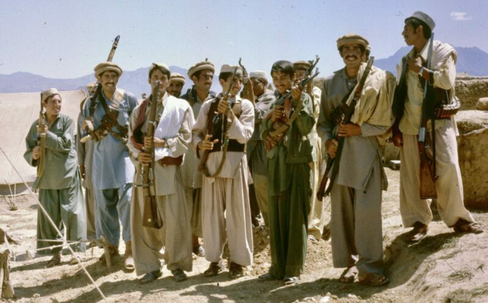
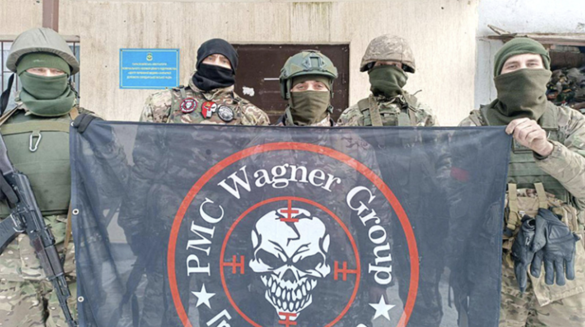

:::

::: {.column width="50%"}
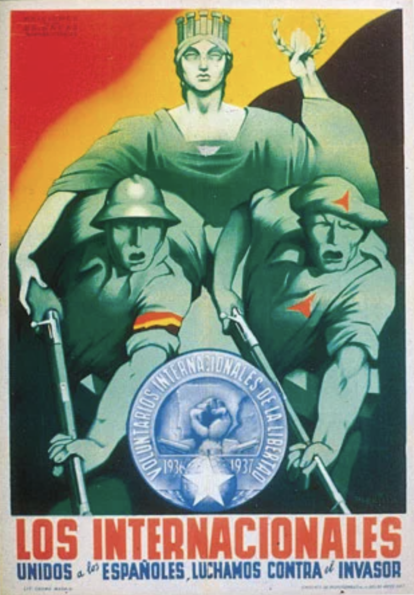{width="200"} 
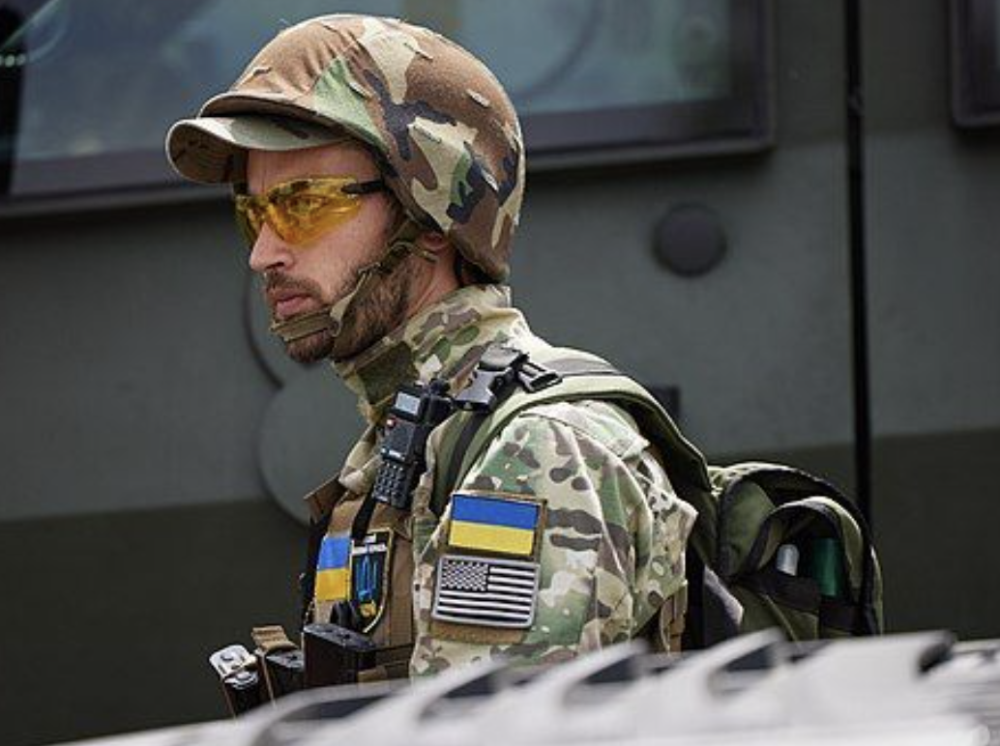{width="400"} 
 
:::
::::


## Foreign fighters

- **[foreign fighters]{style="color:darkred;"}** - individuals who travel to a conflict zone from another territory (prima facie evidence of radicalism $\rightarrow$ *[engagement]{style="color:darkred;"}* in political violence; a 'security failure' by authority of origin state?)

- [examples historically? from cases you know of?]{style="color:indigo;"}

[FF is a widespread part and enduring element of political violence across the world]{style="color:red;"}

# Poll: foreign fighters {background-color="#2c844c"}

:::: {.columns}
:::{.column width="35%"}
{fig-alt="A QR code for the survey."}

:::

::: {.column width="65%" .center}
<!-- go to <https://www.qr-code-generator.com/>, add the link, and screen shot the QR code -->
Take the survey at **<https://forms.gle/JJ7ufLwrLJYKAbvg8>**

::: {style="margin-top: -20px; font-size: 0.7em;"} 
- should states have laws banning travel to conflict zones?
- most effective for addressing foreign fighters phenomenon?
- top policy priority for dealing with returning fighters?
- are returning foreign fighters a significant threat?
- should states be able to revoke fighters' citizenship?

:::

:::
:::: 

::: {style="margin-top: -20px;"}
[[Questions about groups]{style="color:violet;"}: (1) Did the group emerge in response to political repression? (2) Did the absence of (opportunity for) peaceful political participation contribute to the group's use of violence? (3) Did the group actively recruit members from outside its primary country of operation? (4) How important were cross-border networks to this group's activities? (5) Was the group's cause was framed as an international struggle?]{style="font-size: 0.7em;"}

:::

--- 

```{ojs}
md`## Group responses (Respondents: ${respondentCount}) - emergence`
```


```{ojs}

import { liveGoogleSheet } from "@jimjamslam/live-google-sheet";
import { aq, op } from "@uwdata/arquero";

// UPDATE THE LINK FOR A NEW POLL
surveyResults = liveGoogleSheet(
  "https://docs.google.com/spreadsheets/d/e/" +
    "2PACX-1vTCOL_6dhwjrpQW9BGa1-p-uRlIknFTjWEkgBgHyaML3dziFgSxIgMU1pUmTfxJyHHm27Jv4_ZZUYT3/" +
    "pub?gid=164736256&single=true&output=csv",
  10000, 1, 12); // adjust the last number to select all relevant columns 

respondentCount = surveyResults.length;

likertOrder = [
  "Strongly disagree",
  "Disagree",
  "Neutral",
  "Agree",
  "Strongly agree"
];

ynmOrder = [
  "Yes",
  "No",
  "Maybe"
];

groupOrder = [
  "Antifa",
  "RAF",
  "IS",
  "alQaeda",
  "NPD/Heimat",
  "NSU",
  "PKK"
];

groupColors = [
  "pink",
  "red",
  "grey",
  "black",
  "#d2b48c", // lightbrown - could also use 'peru'
  "brown",
  "green"
];

```

:::: {.columns}
:::{.column width="48%"}
group emerged in response to repression?

```{ojs}
// need to replace 'g_emerge_after_repress'

g_emerge_after_repressCounts = aq.from(surveyResults)
  .groupby("g_emerge_after_repress", "group")
  .count()
  .objects();

plot_g_emerge_after_repress = Plot.plot({
  marks: [
    Plot.frame({
      fill: "#f7f7f7",
      stroke: "black",
      strokeWidth: 1
    }),
    
    Plot.barY(g_emerge_after_repressCounts, {
      fx: "g_emerge_after_repress",
      x: "group",
      y: "count",
      fill: "group",
      stroke: "white"
    })
  ],

  color: {
    domain: groupOrder,
    range: groupColors,
    legend: true,
    style: { fontSize: "20px" }
  },

  fx: {
    domain: ynmOrder,
    label: "",
    tickRotate: 0
  },

  x: {
    domain: groupOrder,
    axis: null, // clears the entire x-axis (ticks and labels)
    // tickFormat: () => "",
    label: ""
  },

  y: {
    label: ""
  },

  marginBottom: 130,
  style: {
    width: 900,
    height: 500,
    fontSize: 20
  }
});

``` 

:::

:::{.column width="4%"}
<div style="height: 600px; border-left: 2px solid #999; margin: 0 auto;"></div>
:::


::: {.column width="48%"}

lack of peaceful participation led to group's use of violence

```{ojs}
// need to replace 'g_absence_of_peaceful_part'

g_absence_of_peaceful_partCounts = aq.from(surveyResults)
  .groupby("g_absence_of_peaceful_part", "group")
  .count()
  .objects();

plot_g_absence_of_peaceful_part = Plot.plot({
  marks: [
    Plot.frame({
      fill: "#f7f7f7",
      stroke: "black",
      strokeWidth: 1
    }),
    
    Plot.barY(g_absence_of_peaceful_partCounts, {
      fx: "g_absence_of_peaceful_part",
      x: "group",
      y: "count",
      fill: "group",
      stroke: "white"
    })
  ],

  color: {
    domain: groupOrder,
    range: groupColors,
    legend: true,
    style: { fontSize: "20px" }
  },

  fx: {
    domain: likertOrder,
    label: "",
    tickRotate: -55
  },

  x: {
    domain: groupOrder,
    axis: null, // clears the entire x-axis (ticks and labels)
    // tickFormat: () => "",
    label: ""
  },

  y: {
    label: ""
  },

  marginBottom: 130,
  style: {
    width: 900,
    height: 500,
    fontSize: 20
  }
});

```

::: 
::::

## Group responses - external connections 

:::: {.columns}
:::{.column width="48%"}
group recruited from outside primary country?

```{ojs}
// need to replace 'g_recruit_outside'

g_recruit_outsideCounts = aq.from(surveyResults)
  .groupby("g_recruit_outside", "group")
  .count()
  .objects();

plot_g_recruit_outside = Plot.plot({
  marks: [
    Plot.frame({
      fill: "#f7f7f7",
      stroke: "black",
      strokeWidth: 1
    }),
    
    Plot.barY(g_recruit_outsideCounts, {
      fx: "g_recruit_outside",
      x: "group",
      y: "count",
      fill: "group",
      stroke: "white"
    })
  ],

  color: {
    domain: groupOrder,
    range: groupColors,
    legend: true,
    style: { fontSize: "20px" }
  },

  fx: {
    domain: ynmOrder,
    label: "",
    tickRotate: 0
  },

  x: {
    domain: groupOrder,
    axis: null, // clears the entire x-axis (ticks and labels)
    // tickFormat: () => "",
    label: ""
  },

  y: {
    label: ""
  },

  marginBottom: 130,
  style: {
    width: 900,
    height: 500,
    fontSize: 20
  }
});

``` 

:::

:::{.column width="4%"}
<div style="height: 600px; border-left: 2px solid #999; margin: 0 auto;"></div>
:::


::: {.column width="48%"}
cross-border networks importance?

```{ojs}
// need to replace 'g_crossborder_netz'

g_crossborder_netzCounts = aq.from(surveyResults)
  .groupby("g_crossborder_netz", "group")
  .count()
  .objects();

plot_g_crossborder_netz = Plot.plot({
  marks: [
    Plot.frame({
      fill: "#f7f7f7",
      stroke: "black",
      strokeWidth: 1
    }),
    
    Plot.barY(g_crossborder_netzCounts, {
      fx: "g_crossborder_netz",
      x: "group",
      y: "count",
      fill: "group",
      stroke: "white"
    })
  ],

  color: {
    domain: groupOrder,
    range: groupColors,
    legend: true,
    style: { fontSize: "20px" }
  },

  fx: {
    // domain: likertOrder,
    label: "",
    tickRotate: -45
  },

  x: {
    domain: groupOrder,
    axis: null, // clears the entire x-axis (ticks and labels)
    // tickFormat: () => "",
    label: ""
  },

  y: {
    label: ""
  },

  marginBottom: 130,
  style: {
    width: 900,
    height: 500,
    fontSize: 20
  }
});


```


::: 
::::

## Group responses - framing of violence

group's cause framed as an international struggle rather than local?

```{ojs}
// need to replace 'g_international_struggle'

g_international_struggleCounts = aq.from(surveyResults)
  .groupby("g_international_struggle", "group")
  .count()
  .objects();

plot_g_international_struggle = Plot.plot({
  marks: [
    Plot.frame({
      fill: "#f7f7f7",
      stroke: "black",
      strokeWidth: 1
    }),
    
    Plot.barY(g_international_struggleCounts, {
      fx: "g_international_struggle",
      x: "group",
      y: "count",
      fill: "group",
      stroke: "white"
    })
  ],

  color: {
    domain: groupOrder,
    range: groupColors,
    legend: true,
    style: { fontSize: "20px" }
  },

  fx: {
    domain: likertOrder,
    label: "",
    tickRotate: -55
  },

  x: {
    domain: groupOrder,
    axis: null, // clears the entire x-axis (ticks and labels)
    // tickFormat: () => "",
    label: ""
  },

  y: {
    label: ""
  },

  marginBottom: 130,
  style: {
    width: 900,
    height: 500,
    fontSize: 20
  }
});

```

# Who becomes a foreign fighter, how are returnees addressed {background-color="#2c844c"}

:::: {.columns}
:::{.column width="80%"}
- @morris2023WhoBecomesForeign - Who Becomes a Foreign Fighter? Characteristics of the Islamic State's Soldiers
    + context, casing, data, locales of fighter mobilisation
    + results and findings 
- dealing with returning foreign fighters 

:::

::: {.column width="20%"}

  
:::
::::

## @morris2023WhoBecomesForeign - Context

**MENA (Middle East, North Africa) countries have sent the largest numbers of foreign fighters to Syria**

- Why is this the case? What are the relevant contextual factors?

## @morris2023WhoBecomesForeign - Context

**MENA (Middle East, North Africa) countries have sent the largest numbers of foreign fighters to Syria**

- Why is this the case? What are the relevant contextual factors?
    + religious ideology (*jihad*)
    + religious internationalism (history of MENA alliance, e.g., in wars and campaigns against Israel)
    + contexts of deprivation? travelling to fight as a 'way out'

## @morris2023WhoBecomesForeign - Casing {.scrollable}

- Three countries analysed: **Morocco**, **Egypt**, and **Turkey**
    + Morocco represents foreign fighters from the Maghreb (Northwest Africa). (_**[representative country context]{style="color:blue;"}**_)
    + Egyptian foreign fighters are more alike to ISIS recruits from the Levant than North Africa. (_**[representative country context]{style="color:blue;"}**_)
    + Turkey,
        * Turkey’s historical, political, and socioeconomic traits make it as a \textcolor{red}{least likely case of jihadi foreign fighter mobilisation} (_**[least likely mobilisation context]{style="color:blue;"}**_)
        * Turkish foreign fighters may be more like Islamic State members from the Middle East and Central Asia than the other two countries. (_**[representative country context]{style="color:blue;"}**_)

- NB: Two [casing logics]{style="color:blue;"} at work here: (1) thinking in terms of population of foreign fighters and clusters therein and (2) thinking in terms of country cases in comparison with other country cases

## @morris2023WhoBecomesForeign - data

- data from leaked IS personnel records
- [explanatory variables]{style="color:blue;"} 
    + **occupation**: unemployed, unskilled, student, skilled
    + **education**: none, primary, secondary, university
    + **marital status**: single, married
    + **children**: yes, no
    + **age**
- any major factors that seem [omitted]{style="color:blue;"}?

## @morris2023WhoBecomesForeign - locales of fighter mobilisation

:::: {.columns}
:::{.column width="50%"}
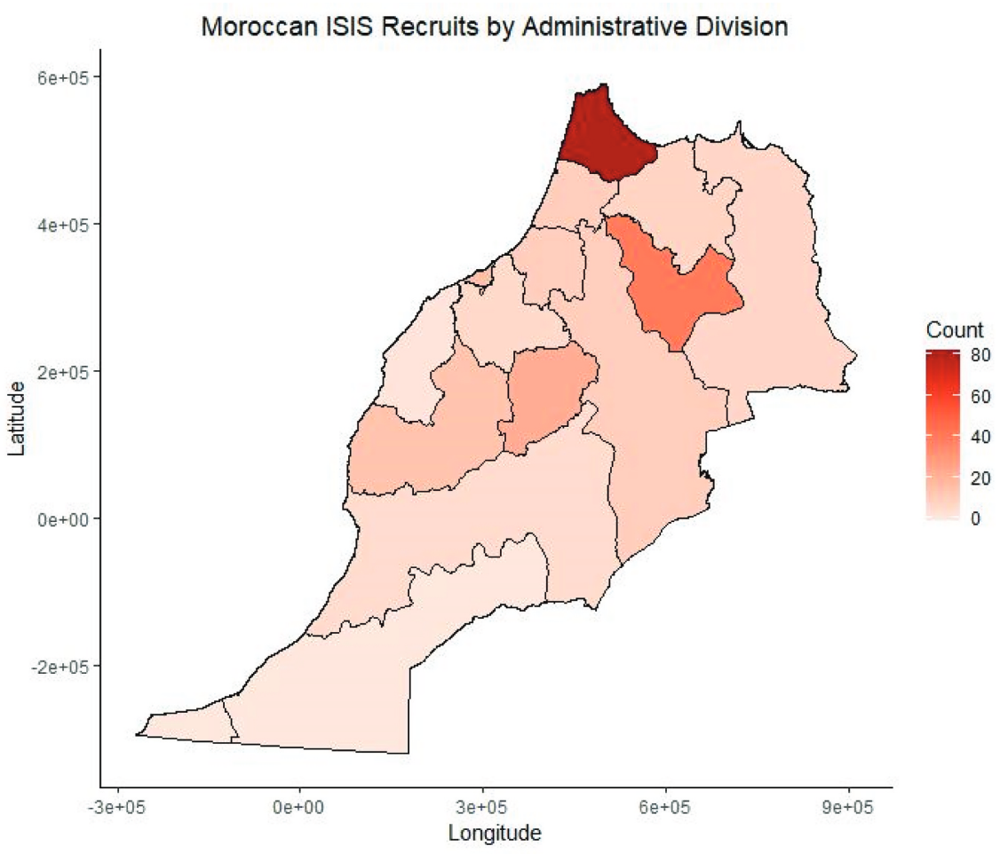{width="400"}
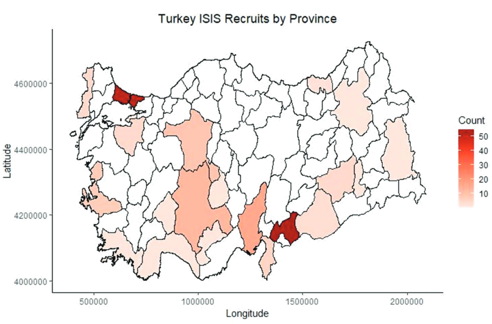{width="400"}

:::

::: {.column width="50%"}
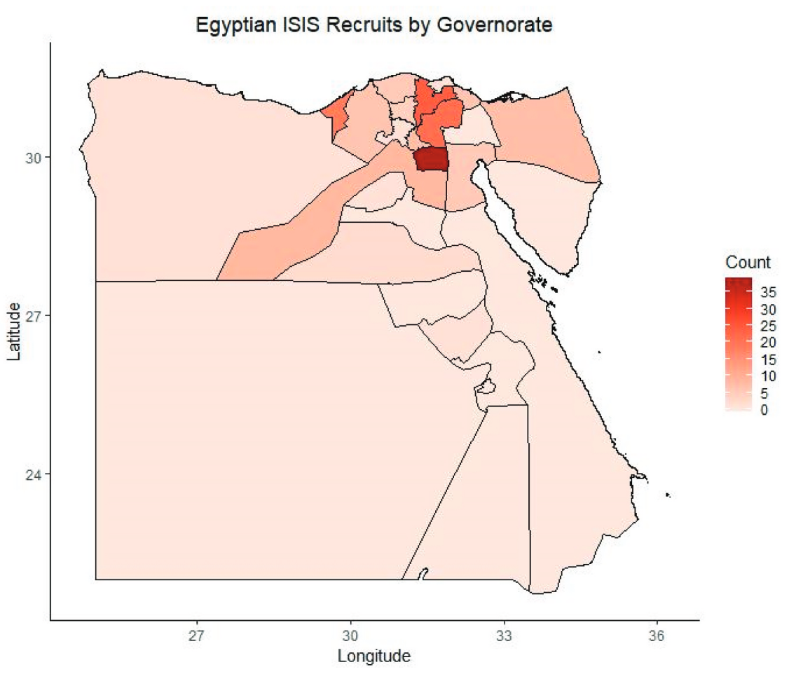{width="400"}

*Major centres*: Tangier, Tetouan, and surrounding region, and Fes; Cairo, Alexandria, and lower Nile area; Istanbul and Antep

[any visualisation problems?]{style="color:indigo;"}

:::
::::

## @morris2023WhoBecomesForeign - regression results (*how to interpret*?)

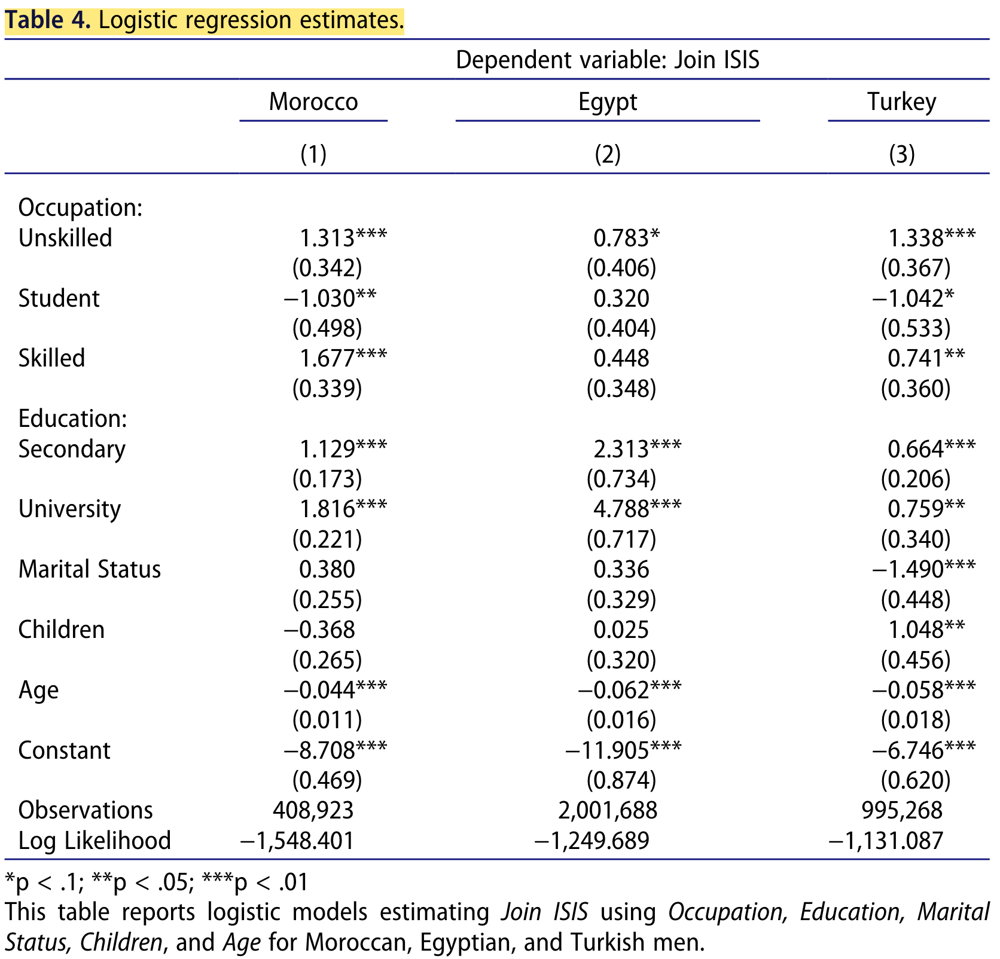

## Reading a regression table

<!-- http://svmiller.com/blog/2014/08/reading-a-regression-table-a-guide-for-students/ -->

Remember: regression is a tool for understanding a phenomenon as a linear function (generally) &rarr; (y = mx + b)

1. Numbers not in parentheses next to a variable: __[regression coefficient]{style="color:blue;"}__: expected change in DV for a one-unit increase in IV. NB: ositive or negative relationship?

2. Numbers inside parentheses next to a variable: __[standard error]{style="color:blue;"}__: estimate of the standard deviation of the coefficient

3. Asterisks/'stars': __[statistical significance]{style="color:blue;"}__: probability of results as extreme as observed result, under the assumption that the null hypothesis is correct. Smaller p-value means such an observation would be less likely under null hypothesis; hence, significance. Statistical significance suggests more precise estimates---NOT necessarily that one IV is more important than another.

## @morris2023WhoBecomesForeign - regression results (*how to interpret*?)

> a university education is the strongest correlate of joining a terrorist organization.


## @morris2023WhoBecomesForeign - regression results

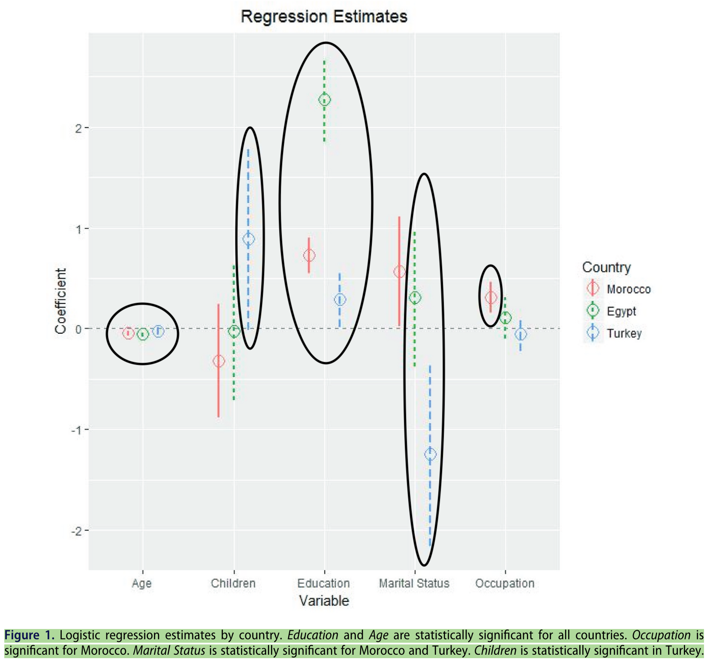

## Findings

> Despite the difference in space and time, ISIS foreign fighters have a similar profile to members of Hamas, Hezbollah, the Palestinian Islamic Jihad, and even violent political activists in Bengal. The men in all these samples are predominately **[male]{style="color:darkorange;"}**, **[well-educated]{style="color:darkorange;"}**, **[urban]{style="color:darkorange;"}**, **[unmarried]{style="color:darkorange;"}**, and **[young]{style="color:darkorange;"}**.

. . . 

>> a university education is the strongest correlate of joining a terrorist organization.

. . . 

::: {style="margin-top: -50px;"} 
- [any of characteristics stand out for]{style="color:indigo;"}... theoretical reasons? compared to other cases you know?
- [IS attracted both unskilled and skilled workers]{style="color:darkorange;"} = offered to improve the livelihood of its members
:::


## Poll results - dealing with potential FFs

:::: {.columns}
:::{.column width="50%"}
laws banning travel to conflict zones? 

```{ojs}
banning_travelCounts = aq.from(surveyResults)
  .select("banning_travel")
  .groupby("banning_travel")
  .count()
  .derive({ measure: d => "" })

// Calculate the maximum count from your dataset
banning_travel_maxCountRE = Math.max(...banning_travelCounts.objects().map(d => d.count));

plot_banning_travel = Plot.plot({
  marks: [
    Plot.barY(banning_travelCounts, {
      x: "banning_travel",
      y: "count",
      fill: "banning_travel",
      stroke: "black",
      strokeWidth: 1
    }),
    Plot.ruleY([respondentCount], { stroke: "#ffffff99" })
  ],
  color: {
    domain: [
      "Yes",
      "No",
      "Maybe"
    ],
    range: [
      "forestgreen",
      "darkred",
      "goldenrod"
    ]
  },
  marginBottom: 80,
  x: { label: "", tickSize: 2, tickRotate: -1, padding: 0.2,
    domain: ["Yes", "No", "Maybe"]
  },  
  y: {
    label: "",
    tickSize: 10,
    tickFormat: d => d,
    tickValues: Array.from(
      new Set(banning_travelCounts.objects().map(d => d.count))
    ).sort((a, b) => a - b),
    domain: [0, banning_travel_maxCountRE]
  },
  facet: { data: banning_travelCounts, x: "measure", label: "" },
  marginLeft: 60,
  style: {
    width: 1600,
    height: 500,
    fontSize: 40,
  },
});

```

:::

::: {.column width="50%"}
most effective for addressing foreign fighters phenomenon?

```{ojs}
effective_addressingCounts = aq.from(surveyResults)
  .select("effective_addressing")
  .groupby("effective_addressing")
  .count()
  .derive({ measure: d => "" })

// Calculate the maximum count from your dataset
effective_addressing_maxCountRE = Math.max(...effective_addressingCounts.objects().map(d => d.count));

plot_effective_addressing = Plot.plot({
  marks: [
    Plot.barY(effective_addressingCounts, {
      x: "effective_addressing",
      y: "count",
      fill: "effective_addressing",
      stroke: "black",
      strokeWidth: 1
    }),
    Plot.ruleY([respondentCount], { stroke: "#ffffff99" })
  ],
  color: {
    domain: [
      "border security", 
      "social work programmes", 
      "block recruitment/propaganda", 
      "other"
    ],
    range: [
      "darkred",
      "goldenrod",
      "cadetblue",
      "gray"
    ]
  },
  marginBottom: 400,
  x: { label: "", tickSize: 2, tickRotate: -40, padding: 0.2,
    domain: ["border security", "social work programmes", "block recruitment/propaganda", "other"]
  },  
  y: {
    label: "",
    tickSize: 10,
    tickFormat: d => d,
    tickValues: Array.from(
      new Set(effective_addressingCounts.objects().map(d => d.count))
    ).sort((a, b) => a - b),
    domain: [0, effective_addressing_maxCountRE]
  },
  facet: { data: effective_addressingCounts, x: "measure", label: "" },
  marginLeft: 60,
  style: {
    width: 1600,
    height: 500,
    fontSize: 40,
  },
});

```

:::
::::

## Dealing with returning foreign fighters (1)

Spain example 

<video src="slide_files/07/ff_spain_return.mp4" width="80%" 
controls controlslist="nodownload"></video>

<!-- poster="slide_files/03/spotlight_cover.png" -->


## Dealing with returning foreign fighters (2)

Economist (a bit sensationalist and some graphic imagery)

<!-- Aspect ratios include 1x1, 4x3, 16x9 (the default), and 21x9. -->
<!-- aspect-ratio="21x9"  -->


## Dealing with returning foreign fighters (3)

David Malet 

<!-- https://www.youtube.com/watch?v=ripWaGOboq8 -->

<video src="slide_files/07/ff_malet.mp4" width="99%" 
controls controlslist="nodownload"></video>


## Poll results - returning foreign fighters

:::: {.columns}
:::{.column width="33%"}

top policy priority for dealing with returning fighters?

```{ojs}
top_priorityCounts = aq.from(surveyResults)
  .select("top_priority")
  .groupby("top_priority")
  .count()
  .derive({ measure: d => "" })

// Calculate the maximum count from your dataset
top_priority_maxCountRE = Math.max(...top_priorityCounts.objects().map(d => d.count));

plot_top_priority = Plot.plot({
  marks: [
    Plot.barY(top_priorityCounts, {
      x: "top_priority",
      y: "count",
      fill: "top_priority",
      stroke: "black",
      strokeWidth: 1
    }),
    Plot.ruleY([respondentCount], { stroke: "#ffffff99" })
  ],
  color: {
    domain: [
      "prosecution",
      "surveillance",
      "deradicalisation programmes",
      "reintegration service",
      "deportation",
      "citizenship revocation",
      "other"
    ],
    range: [
      "indigo",
      "goldenrod",
      "darkred",
      "cadetblue",
      "darkorange",
      "forestgreen",
      "violet"
    ]
  },
  marginBottom: 500,
  x: { label: "", tickSize: 2, tickRotate: -60, padding: 0.2,
    domain: ["prosecution", "surveillance", "deradicalisation programmes", "reintegration service", "deportation", "citizenship revocation", "other"]
  },  
  y: {
    label: "",
    tickSize: 10,
    tickFormat: d => d,
    tickValues: Array.from(
      new Set(top_priorityCounts.objects().map(d => d.count))
    ).sort((a, b) => a - b),
    domain: [0, top_priority_maxCountRE]
  },
  facet: { data: top_priorityCounts, x: "measure", label: "" },
  marginLeft: 60,
  style: {
    width: 1600,
    height: 500,
    fontSize: 40,
  },
});

```
 
:::

:::{.column width="33%"}

are returning foreign fighters a significant threat?

```{ojs}
threatCounts = aq.from(surveyResults)
  .select("threat")
  .groupby("threat")
  .count()
  .derive({ measure: d => "" })

// Calculate the maximum count from your dataset
threat_maxCountRE = Math.max(...threatCounts.objects().map(d => d.count));

plot_threat = Plot.plot({
  marks: [
    Plot.barY(threatCounts, {
      x: "threat",
      y: "count",
      fill: "threat",
      stroke: "black",
      strokeWidth: 1
    }),
    Plot.ruleY([respondentCount], { stroke: "#ffffff99" })
  ],
  color: {
    domain: [
      "Strongly disagree",
      "Disagree",
      "Neutral",
      "Agree",
      "Strongly agree"
    ],
    range: [
      "red",
      "pink",
      "lightgrey",
      "lightgreen",
      "forestgreen"
    ]
  },
  marginBottom: 180,
  x: { label: "", tickSize: 2, tickRotate: -45,
    domain: ["Strongly disagree", "Disagree", "Neutral", "Agree", "Strongly agree"]
  },  
  y: {
    label: "",
    tickSize: 10,
    tickFormat: d => d,
    tickValues: Array.from(
      new Set(threatCounts.objects().map(d => d.count))
    ).sort((a, b) => a - b),
    domain: [0, threat_maxCountRE]
  },
  facet: { data: threatCounts, x: "measure", label: "" },
  marginLeft: 140,
  style: {
    width: 1350,
    height: 500,
    fontSize: 30,
  }
});

```

:::

::: {.column width="33%"}

should states be able to revoke fighters' citizenship?

```{ojs}
revokeCounts = aq.from(surveyResults)
  .select("revoke")
  .groupby("revoke")
  .count()
  .derive({ measure: d => "" })

// Calculate the maximum count from your dataset
revoke_maxCountRE = Math.max(...revokeCounts.objects().map(d => d.count));

plot_revoke = Plot.plot({
  marks: [
    Plot.barY(revokeCounts, {
      x: "revoke",
      y: "count",
      fill: "revoke",
      stroke: "black",
      strokeWidth: 1
    }),
    Plot.ruleY([respondentCount], { stroke: "#ffffff99" })
  ],
  color: {
    domain: [
      "Strongly disagree",
      "Disagree",
      "Neutral",
      "Agree",
      "Strongly agree"
    ],
    range: [
      "red",
      "pink",
      "lightgrey",
      "lightgreen",
      "forestgreen"
    ]
  },
  marginBottom: 180,
  x: { label: "", tickSize: 2, tickRotate: -45,
    domain: ["Strongly disagree", "Disagree", "Neutral", "Agree", "Strongly agree"]
  },  
  y: {
    label: "",
    tickSize: 10,
    tickFormat: d => d,
    tickValues: Array.from(
      new Set(revokeCounts.objects().map(d => d.count))
    ).sort((a, b) => a - b),
    domain: [0, revoke_maxCountRE]
  },
  facet: { data: revokeCounts, x: "measure", label: "" },
  marginLeft: 140,
  style: {
    width: 1350,
    height: 500,
    fontSize: 30,
  }
});

```

:::
::::

# Open data - Rebel Foreign Fighters {background-color="#ffe0b2"}

::: panel-tabset
### Visualisation

Foreign Fighters and Rebel Organisation Characteristics

```{r w7-foreign-fighters, warning=FALSE, message=FALSE}

library(tidyverse)
library(haven)
library(plotly)

ff <- read_dta("../resources/data/Schwartz_ReplicationData/RFFD_Output_.dta")

ff <- ff %>%
  mutate(

    ideology = case_when(
      islamist == 1 ~ "Islamist",
      nationalist == 1 ~ "Nationalist",
      leftist == 1 ~ "Leftist",
      TRUE ~ "Other"
    ),

    foreign_territory_label = ifelse(
      foreign_territory == 1,
      "Foreign Territory",
      "Domestic Conflict"
    ),

    support_label = ifelse(
      transconstsupp > 0,
      "Transnational Support",
      "No Transnational Support"
    )

  )

plot_ly(
  data = ff,

  x = ~rebestimate_ln,

  y = ~log1p(best_fatality),

  color = ~ideology,

  size = ~foreign_f,

  type = "scatter",
  width = "100%",
  height = "100%",
  mode = "markers",

  text = ~paste(
    "<b>Organisation:</b>", side_b,
    "<br><b>Country:</b>", country,
    "<br><b>Foreign Fighters:</b>", foreign_f,
    "<br><b>Foreign Fighter Type:</b>", ff_type,
    "<br><b>Transnational Support:</b>", support_label,
    "<br><b>Conflict Type:</b>", foreign_territory_label,
    "<br><b>Fatalities:</b>", best_fatality
  ),

  hoverinfo = "text"
) %>%
layout(
  xaxis = list(
      title = list(
        text = "Rebel Strength (log)",
        font = list(size = 20)
      ),
      tickfont = list(size = 18)
    ),
  yaxis = list(
      title = list(
        text = "Conflict Fatalities (log)",
        font = list(size = 20)
      ),
      tickfont = list(size = 18)
    ),
    legend = list(
      font = list(size = 18)
    ),
    hoverlabel = list(
      font = list(size = 18)
    )
)
```

### Explanatory note

This visualisation is of the [Rebel Foreign Fighter Dataset](https://doi.org/10.1177/00223433231168183) (RFFD), which contains information on insurgent organisations involved in civil wars. It charts the relationship between rebel strength, conflict fatalities, and ideological orientation. Each bubble represents a rebel organisation. The x-axis indicates estimated rebel strength, while the y-axis reflects conflict fatalities. Bubble size corresponds to the presence of foreign fighters, and colours indicate ideological orientation. The visualisation allows comparison of organisations that successfully attract foreign fighters with those that do not.

### Data download  

::: {.callout-note collapse="true" style="margin-top: -15px;"}
#### Data download

```{r echo = F, collapse = TRUE, comment = "#>", message = FALSE, warning=FALSE}
library(downloadthis)

ff %>% download_this(
    output_name = "ff",
    output_extension = ".csv",
    button_label = "Download dataset as csv",
    button_type = "warning",
    has_icon = TRUE,
    icon = "fa fa-save"
  )
```

:::

::: 

# Political violence in an authoritarian contexts {background-color="#2c844c"}

:::: {.columns}
:::{.column width="50%"}
- questions 
- @JohannesDueEnstad2018 - Right-Wing Terrorism and Violence in Putin's Russia
    + data overview 

:::

::: {.column width="50%"}
<div class="tenor-gif-embed" data-postid="1285984849164287010" data-share-method="host" data-aspect-ratio="1.77778" data-width="100%"><a href="https://tenor.com/view/authoritarian-wayne%27s-world-mike-meyers-asphinctersayswhat-gif-1285984849164287010">Authoritarian Wayne&#39;S World GIF</a>from <a href="https://tenor.com/search/authoritarian-gifs">Authoritarian GIFs</a></div> <script type="text/javascript" async src="https://tenor.com/embed.js"></script>  
:::
::::

## Political violence in an authoritarian context

**[What are the special conditions of political violence in within an authoritarian regime?]{style="color:indigo;"}**

. . . 

- more extreme possibilities of repression

. . . 

- against the state or against others?

. . . 

- combatted by, tolerated by, or supported by the state?


## @JohannesDueEnstad2018 - an empirical puzzle?

> Putin's Russia has seen much more right-wing violence than any other comparable country in the past 25 years.

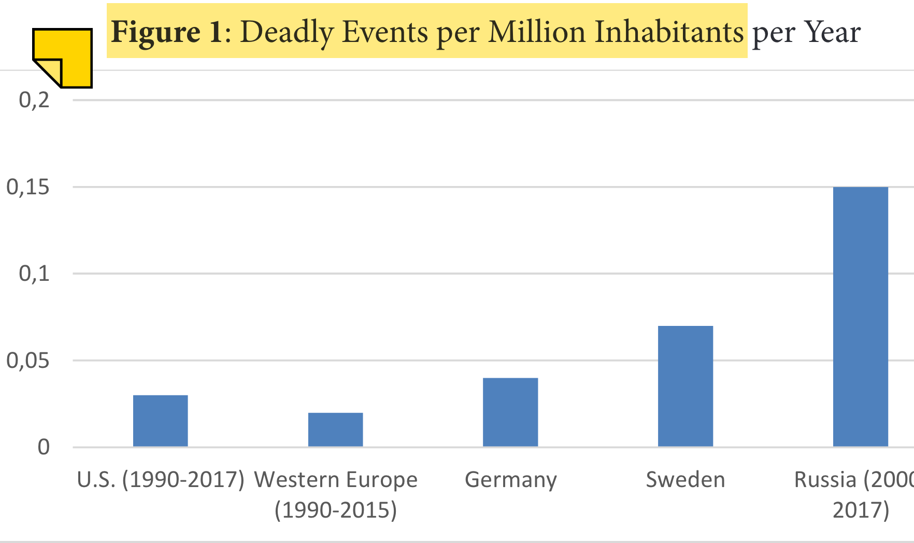

## @JohannesDueEnstad2018 - aim and data

- [descriptive research aim]{style="color:blue;"}: comparison of countries and regions, patterns and trends

> The RTV-RUSSIA dataset currently consists of 495 events, including 406 deadly events causing 459 deaths over a period of eighteen years (2000-2017). RTV-RUSSIA has been patterned on the RTV dataset (RightWing Terrorism and Violence in Western Europe) compiled by Jacob Ravndal,[4] and features the same set of variables (date, location, event type, perpetrator type, perpetrator’s organizational affiliation, victim, weapon(s) used, number of casualties, as well as a description of the event).

## @JohannesDueEnstad2018 - data overview

```{r}
library(kableExtra)

data <- data.frame(
  `Perpetrator type` = c(
    "Organized groups", 
    "Affiliated members", 
    "Autonomous cells", 
    "<span style='color:red;'>Gangs</span>", 
    "<span style='color:red;'>Unorganized</span>", 
    "Lone actors", 
    "Shadow groups", 
    "Unknown", 
    "**Total**"
  ),
  `Premeditated attacks` = c(48, 10, 34, 121, 74, 16, 0, 104, 408),
  `Spontaneous attacks` = c(3, 1, 0, 12, 15, 8, 0, 7, 46),
  `Plots` = c(2, 2, 7, 0, 1, 2, 0, 2, 16),
  `Preparation for armed struggle` = c(0, 0, 0, 0, 0, 1, 0, 1, 2),
  `Unknown` = c(1, 1, 0, 2, 1, 1, 1, 16, 23),
  `Sum` = c(54, 14, 41, 135, 91, 28, 1, 130, 495)
)

# Generate the kable table
kable(data, format = "html", escape = FALSE, align = "lcccccc", 
      col.names = c("Perpetrator type", 
                    "Premeditated attacks", 
                    "Spontaneous attacks", 
                    "Plots", 
                    "Preparation for armed struggle", 
                    "Unknown", 
                    "Sum")) %>%
  kable_styling(full_width = FALSE, bootstrap_options = c("striped", "hover", "condensed"),
                font_size = 22) %>%
  add_header_above(c(" " = 1, "Type of violence" = 6)) %>%
  column_spec(1, bold = TRUE)

```


<!-- \begin{table} -->
<!--   \scriptsize -->
<!-- 	\addtolength{\leftskip}{-1cm} -->
<!-- 	\addtolength{\rightskip}{-1cm} -->
<!-- {\begin{tabular}{R{2cm}|C{1.8cm}|C{1.8cm}|c|C{1.5cm}|c|c} \toprule -->
<!--  & \multicolumn{3}{l}{\textbf{Type of violence}} \\ \cmidrule{2-7} -->
<!-- Perpetrator type & \textcolor{red}{Premeditated attacks} & Spontaneous attacks & Plots & Preparation for armed struggle & Unknown & Sum \\ \midrule -->
<!-- Organized groups   & 48  & 3  & 2  & - & 1  & 54  \\ \midrule -->
<!-- Affiliated members & 10  & 1  & 2  & - & 1  & 14  \\ \midrule -->
<!-- Autonomous cells   & 34  & -  & 7  & - & -  & 41  \\ \midrule -->
<!-- \textcolor{red}{Gangs}              & 121 & 12 & -  & - & 2  & 135 \\ \midrule -->
<!-- \textcolor{red}{Unorganized}        & 74  & 15 & 1  & - & 1  & 91  \\ \midrule -->
<!-- Lone actors        & 16  & 8  & 2  & 1 & 1  & 28  \\ \midrule -->
<!-- Shadow groups      & -   & -  & -  & - & 1  & 1   \\ \midrule -->
<!-- Unknown            & 104 & 7  & 2  & 1 & 16 & 130 \\ \midrule -->
<!-- Total              & 408 & 46 & 16 & 2 & 23 & 495 \\ \bottomrule -->
<!-- \end{tabular}} -->
<!-- \label{data} -->
<!-- \end{table} -->

## @JohannesDueEnstad2018 - region comparison

::: {.r-stack}
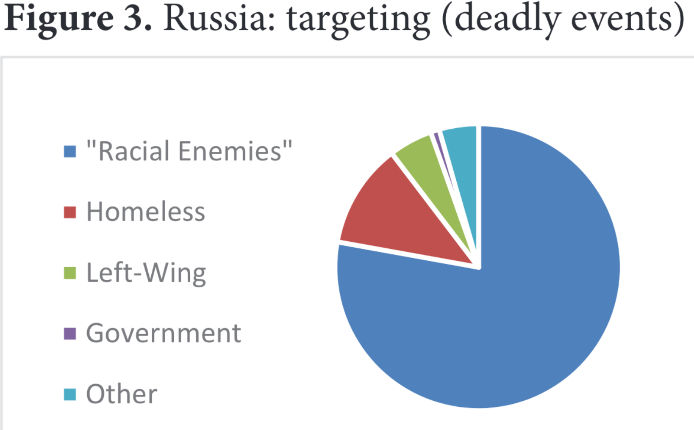{.fragment .absolute top=100 left=0 height="300"}

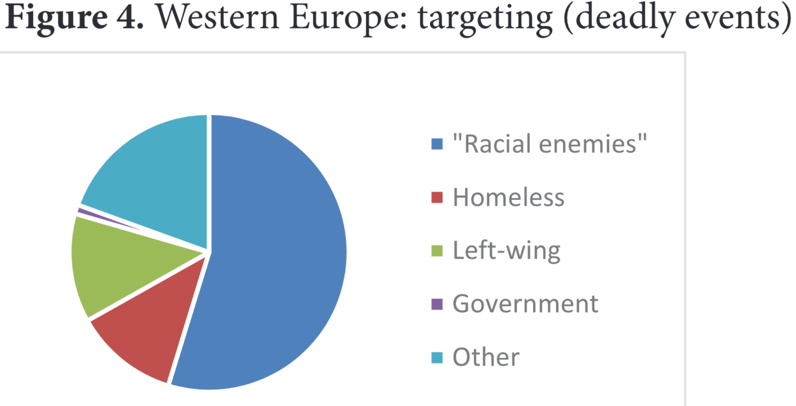{.fragment .absolute bottom=10 right=10 height="350"}

:::


## @JohannesDueEnstad2018 - longitudinal comparison

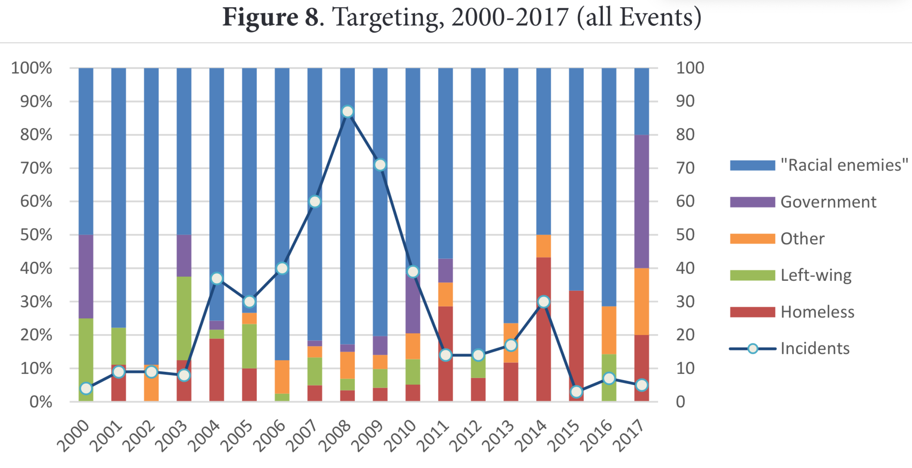

## @JohannesDueEnstad2018 - findings

1. **[Russian activists have operated much more violently]{style="color:darkorange;"}** compared to their counterparts in the United States and Western Europe.
2. [Russian activists have operated **more purposefully**]{style="color:darkorange;"}, with premeditated attacks vastly outnumbering spontaneous ones.
3.  gangs and unorganized groups have been the most common perpetrators; the overall **[share of lone actors has been much lower than in the West]{style="color:darkorange;"}**

# Any questions, concerns, feedback for this class? {background-color="#2c844c"}

Anonymous feedback here: <https://forms.gle/NfF1pCfYMbkAT3WP6>

Alternatively, please send me an email: [m.zeller\@lmu.de]{style="color:red;"}

```{r echo=FALSE, message=FALSE, warning=FALSE}
pagedown::chrome_print(file.path("..", "docs/slides", "slides_07.html"))
```

<hr>
    
[Questions about groups next meeting]{style="color:violet;"}: (1) Does the group's violence increase around elections? (2) How is the group's violence connected to elections? (3) Has the group intimidated/targeted voters? (4) Has the group intimidated/targeted candidates/office-holders?  

## References


