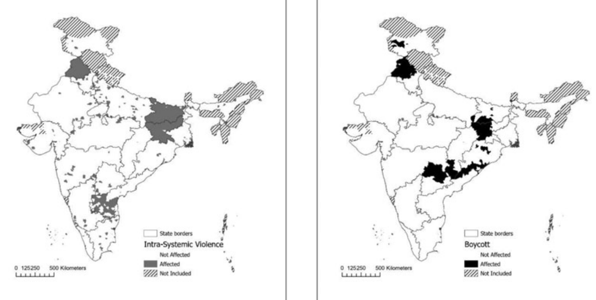
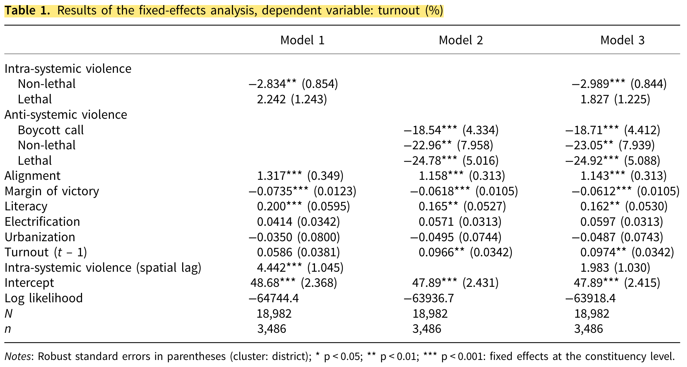
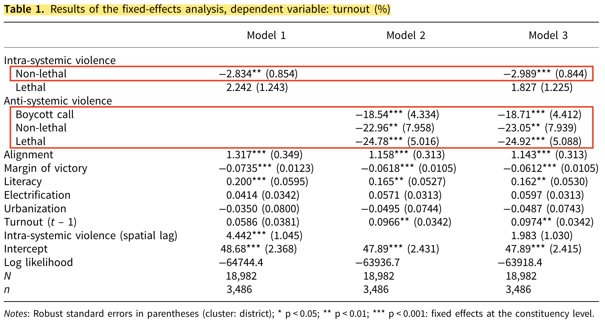
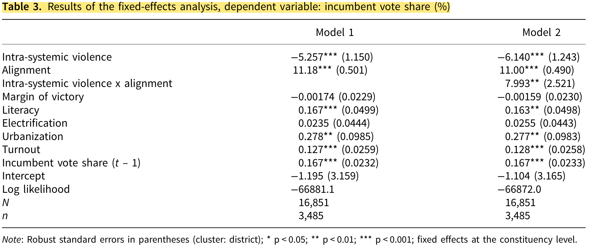
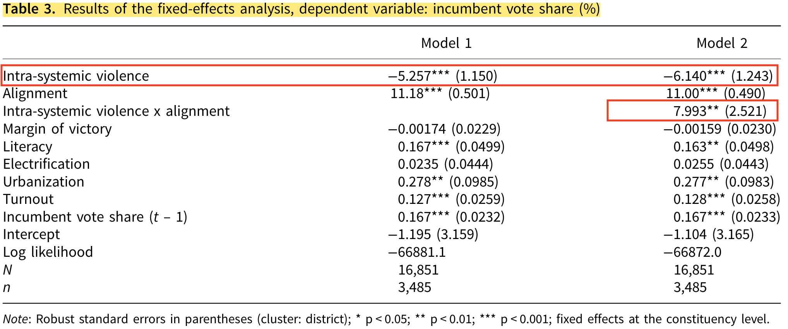
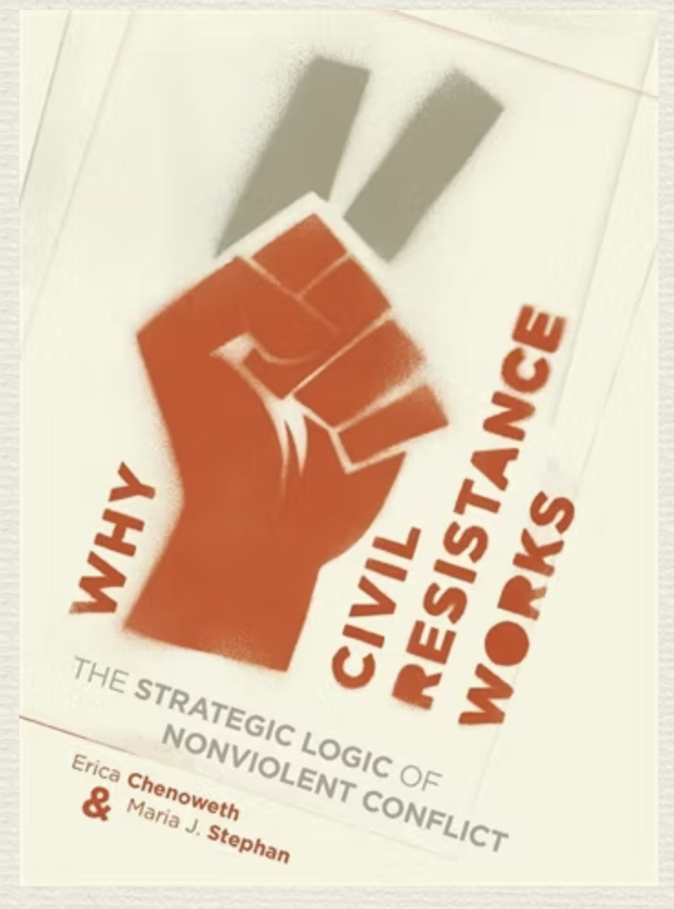

# Opening notes {background-color="#2c844c"}

::: {.tenor-gif-embed data-postid="14209777" data-share-method="host" data-aspect-ratio="1.94" data-width="70%"}
<div class="tenor-gif-embed" data-postid="14209777" data-share-method="host" data-aspect-ratio="1.94" data-width="100%"><a href="https://tenor.com/view/open-gif-14209777">Open Sticker</a>from <a href="https://tenor.com/search/open-stickers">Open Stickers</a></div> <script type="text/javascript" async src="https://tenor.com/embed.js"></script> 
:::

```{=html}
<script type="text/javascript" async src="https://tenor.com/embed.js"></script>
```

## Presentation groups

::: panel-tabset
## December

| Date    | Presenters                       | Method |
| -------:|:---------------------------------|:------:|
| 4 Dec:  |                                  | TBD    | 
| 11 Dec: |                                  | TBD    | 
| 18 Dec: |                                  | TBD    | 

: Presentations line-up

## January

| Date    | Presenters                       | Method |
| -------:|:---------------------------------|:------:|
| 8 Jan:  |                                  | TBD    | 
| 15 Jan: |                                  | TBD    | 
| 22 Jan: |                                  | TBD    | 
| 29 Jan: |                                  | TBD    | 

: Presentations line-up

:::

<!-- []{style="font-size:10px;"} -->

<!-- For a course on 'political violence' and a class on 'foreign fighters', can you suggest some discussion questions to ask students? Ideally, the questions should have multiple choice responses, or yes/no/maybe responses, or strongly agree/agree/disagree/strongly disagree responses? -->


# Election-related violence {background-color="#2c844c"}

:::: {.columns}
:::{.column width="50%"}
- Starter questions
- @harbers2022ShapingElectoralOutcomes
    + research design 
    + analyses:
        * DV: turnout
        * DV: incumbent vote
    + conclusions

:::

::: {.column width="50%"}
<div class="tenor-gif-embed" data-postid="18999252" data-share-method="host" data-aspect-ratio="1" data-width="100%"><a href="https://tenor.com/view/on-election-night-dont-be-silent-dont-be-violent-silence-violence-gif-18999252">On Election Night Dont Be Silent GIF</a>from <a href="https://tenor.com/search/on+election+night-gifs">On Election Night GIFs</a></div> <script type="text/javascript" async src="https://tenor.com/embed.js"></script> 
:::
::::

## Starter questions

::: {style="text-align: center;"}
**[What actors might strategically use violence before or during an election? Why?]{style="color:indigo; font-size:60px;"}** 
:::

. . . 

::: {style="text-align: center;"}
**[Can you think of any cases of election-related violence?]{style="color:indigo; font-size:60px;"}** 
:::

## @harbers2022ShapingElectoralOutcomes - concepts 

> [electoral violence]{style="color:darkred;"} (p. 3): "coercion directed towards actors and/or objects during the electoral cycle ... part of a menu of electoral manipulation, which includes threats and coercion targeting voters, candidates and officials involved in the process" 

. . . 

- **[intra-systemic violence]{style="color:darkred;"}**
    + "try to win under the existing system"
    + "suppress or drown out the voices of political opponents"
- **[anti-systemic violence]{style="color:darkred;"}**
    + "burn down the house and alter the status quo"
    + "depress participation as much as possible in order to undermine the legitimacy of the election"

## @harbers2022ShapingElectoralOutcomes - concepts 

- **[intra-systemic violence]{style="color:darkred;"}**
    + "try to win under the existing system"
    + "suppress or drown out the voices of political opponents"
- **[anti-systemic violence]{style="color:darkred;"}**
    + "burn down the house and alter the status quo"
    + "depress participation as much as possible in order to undermine the legitimacy of the election"

- [examples from cases? any difference in the *form* of violence? applicable beyond modern democracies? (e.g., KKK, Wilson, and *The Birth of a Nation*)]{style="color:indigo;"}

<!-- intra-systemic violence benefits state governments electorally. It decreases the vote share of constituency-level incumbents in non-aligned constituencies but does not negatively impact incumbent vote share in aligned constituencies. This pattern illustrates how the selective targeting of intra-systemic electoral violence benefits the party in control of the state government. -->

## @harbers2022ShapingElectoralOutcomes - concepts 

- **[intra-systemic violence]{style="color:darkred;"}**
- **[anti-systemic violence]{style="color:darkred;"}**

- [examples from cases? any difference in the *form* of violence?]{style="color:indigo;"}
    + intra-systemic: riots or group clashes between party supporters and violent attacks on candidates, politicians or voters. ... ‘booth capture’, where armed goons take over polling places
    + anti-systemic: coercion of or threats against candidates, voters, poll workers or security, as well as destruction of election infrastructure

## intra-systemic violence (left) and anti-systemic violence (right) in India, 1985-2008



## @harbers2022ShapingElectoralOutcomes - design

- research aim: looking at *[sub-national election-related violence in India]{style="color:cadetblue;"}*: what effect on electoral outcomes ([DVs: turnout, incumbent vote percentage]{style="color:blue;"}) does [violence before elections]{style="color:cadetblue;"} ([IV]{style="color:blue;"}) have?
- Method: series of fixed-effects and Poisson regression models
    + $\hookrightarrow$ fixed-effects - intercept of model varies across units/cases to control for unvarying attributes of specific units/cases
    + $\hookrightarrow$ Poisson - often used to model 'count' data
- Data (collection procedure detailed on p. 8): 
    + Times of India (ToI) new reports, *sub-national* elections
    + [Unit of analysis/case]{style="color:blue;"}: constituency-year <!-- (i.e., sub-national unit-year) -->
    + coded: violence [intra-systemic]{style="color:darkred;"} or part of [armed group's tactic]{style="color:darkred;"}

## Reg table, DV: turnout

[what findings can you pick out?]{style="color:indigo;"}



## Reg table, DV: turnout {.smaller}



- [intra-systemic]{style="color:darkred;"} and [anti-systemic]{style="color:darkred;"} violence are [negatively associated with turnout]{style="color:darkorange;"} (in separate and combined models)
- [intra-systemic]{style="color:darkred;"} violence, the [negative effect emerges only for non-lethal events]{style="color:darkorange;"} (88.2% of all intra-systemic violence in data). Coefficient for lethal events is not significant.
- [effect of anti-systemic violence on turnout is stronger]{style="color:darkorange;"} than the effect of intra-systemic violence (Model 3)

<!-- FROM MODEL 2 -->
<!-- This means that the less competitive the race, the higher the likelihood of violence. Especially with regard to intra-systemic violence, this finding is remarkable, as previous research on India has highlighted that close electoral races lead to riots (Wilkinson 2006). One possible interpretation is that the violence that appears in our dataset, which is generally limited in scale, is qualitatively different from full-blown communal riots. -->

## Reg table, DV: incumbent vote

[what findings can you pick out?]{style="color:indigo;"}



## Reg table, DV: incumbent vote {.smaller}



- violence is [associated with fewer votes for the constituency-level incumbent party]{style="color:darkorange;"}
- positive interaction term ($\beta$ = 7.993***) indicates ... the [negative effect of violence is diminished if the incumbent is aligned with the state government]{style="color:darkorange;"}
    + suggests that within non-aligned constituencies, intra-systemic violence is targeted at supporters of the state-level opposition

<!-- violence is associated with fewer votes for the constituency-level incumbent party. Further, the positive coefficient of alignment indicates that incumbents who belong to a party in power at the state level have comparatively higher vote shares than incumbents belonging to an opposition party. The positive interaction term (β = 7.993***) indicates that the negative effect of intra-systemic violence on incumbent vote share is positively mitigated by alignment, that is, that the negative effect of violence is diminished if the incumbent is aligned with the state government. This is consistent with our theoretical expectations: vote shares of incumbents belonging to opposition parties suffer more due to intrasystemic violence than vote shares of incumbents belonging to the party that governs the state. This suggests that within non-aligned constituencies, intra-systemic violence is targeted at supporters of the state-level opposition and thus strategically depresses turnout among supporters of the local incumbent. Combined, our analyses lend support to the idea that intra-systemic violence benefits state-level incumbents. -->

## @harbers2022ShapingElectoralOutcomes - conclusions

- violence decreases turnout but that the **[effect is larger for anti-systemic violence]{style="color:darkorange;"}**
- intra-systemic violence appears intended to **[selectively depress turnout]{style="color:darkorange;"}** among opposition supporters
- **[anti-systemic violence]{style="color:darkred;"}** "[extremely effective in terms of keeping voters away from the polls and thus discrediting the electoral results due to low participation rates]{style="color:darkorange;"}"
    + [ethics question: qualms about reporting this finding?]{style="color:indigo;"}

<!-- Our results show that violence decreases turnout but that the effect is larger for anti-systemic violence. Intra-systemic violence appears intended to selectively depress turnout among opposition supporters, as it is more likely to occur in constituencies where the local incumbent belongs to the state-level opposition and it decreases the vote share of local incumbents within such non-aligned constituencies. For anti-systemic violence, the incidence of violence is not systematically related to the institutional geography of elections. However, the negative effect on turnout is larger than for intra-systemic violence due to the compounding effects of the boycott call and violence (both lethal and non-lethal), indicating that this type of violence is extremely effective in terms of keeping voters away from the polls and thus discrediting the electoral results due to low participation rates. -->

- open data on subnational violence: @zhukov2019IntroducingXSubNew

. . . 

::: {style="text-align: center;"}
**[how should states respond to electoral violence?]{style="color:indigo; font-size:40px;"}** 
:::

# Back to Violence / Nonviolence {background-color="#2c844c"}

:::: {.columns}
:::{.column width="50%"}
- background: @Chenoweth2011
- @Kudelia2018 and the case of Euromaidan in Ukraine 
    + a puzzling case? 
    + productive and counter-productive effects of violence
    + findings 
- concluding question 

:::

::: {.column width="50%"}
<div class="tenor-gif-embed" data-postid="9356306307403535357" data-share-method="host" data-aspect-ratio="1" data-width="100%"><a href="https://tenor.com/view/violence-bun-bunny-violent-rabbit-gif-9356306307403535357">Violence Bun GIF</a>from <a href="https://tenor.com/search/violence-gifs">Violence GIFs</a></div> <script type="text/javascript" async src="https://tenor.com/embed.js"></script>  
:::
::::

## Background: study of @Chenoweth2011

:::: {.columns}
:::{.column width="40%"}


:::

::: {.column width="60%"}
- research aim: determine relative success of nonviolent ('civil resistance' - [Gene Sharp]{style="color:forestgreen;"}) or violent resistance 
- cases of violent and non-violent campaigns between [1900 and 2006]{style="color:violet;"}: 323 cases 
  
:::
::::

## Background: study of @Chenoweth2011

:::: {.columns}
:::{.column width="35%"}


:::

::: {.column width="65%"}
- cases of violent and non-violent campaigns between 1900 and 2006: 323 cases 
    + [inferential stats]{style="color:blue;"} analysis of data
    + new dataset: @dahl2025MassMobilizationModern 
    + three [case studies]{style="color:blue;"}: Philippine people power movement (1983–86), FALANTIL struggles for East Timor independence (1988–99), and Burmese civil resistance (1988–1990)
- [non-violent more than twice as likely to achieve full or partial success compared to violent cases]{style="color:darkorange;"}
  
:::
::::

## Background: study of @Chenoweth2011

Pay attention to the mechanisms that Prof. Chenoweth specifies in her brief explanation

<!-- Aspect ratios include 1x1, 4x3, 16x9 (the default), and 21x9. -->
<!-- aspect-ratio="21x9"  -->


## Background: study of @Chenoweth2011

Pay attention to the mechanisms that Prof. Chenoweth specifies in her brief explanation

- nonviolent campaigns are better at eliciting broad and diverse support
- nonviolent campaigns create more defections among the opposition
- nonviolent campaigns have a broader set of tactics at their disposal
- nonviolent campaigns often maintain discipline even in the face of escalating oppression

## @Kudelia2018 - refining @Chenoweth2011

- Ukraine's Euromaidan
    + [what's going on in this case?]{style="color:indigo;"}
        * Yanukovych's regime: semi-authoritarian

. . . 

- violent protests occurred...
    + **but** accounted for just 12 percent of all protests
    + **yet** concentrated in final month (Jan.-Feb. 2014) and in Kyiv

## @Kudelia2018 - refining @Chenoweth2011

- Ukraine's Euromaidan
    + [what's going on in this case?]{style="color:indigo;"}
        * Yanukovych's regime: semi-authoritarian
- violent protests occurred...
    + **but** accounted for just 12 percent of all protests
    + **yet** concentrated in final month (Jan.-Feb. 2014) and in Kyiv

> "The success of violent protest tactics in Ukraine’s case, **puzzling** from the standpoint of recent findings, has received no systematic, theoretically-driven scholarly treatment."

- violent tactics effective - [is it puzzling]{style="color:indigo;"}? [cf. @Chenoweth2011]

## (empirically, theoretically) puzzling or not... 

- @Kudelia2018 - within-case qualitative process tracing of "actors' choices using a rationalist theoretical"
    + rationalist = strategic choice rather than spontaneous reaction

## (counter-)productive effects of violence - @Kudelia2018

- violence **counter-productive**
    (1) alienate current and potential supporters
    (2) provoke a coercive response
    (3) dampen international support for protests
- violence **productive**
    (1) participatory character of protest violence
    (2) embeddedness of violent groups and practices in a generally non-violent movement (*[radical flanks]{style="color:darkred;"}*)
    (3) capacity and willingness of violent activists to escalate beyond the [cost-tolerance threshold]{style="color:red;"} of the regime
        * i.e., how much will regime tolerate? will it offer concessions?

<!-- In this framework, the key criterion for effectiveness is regime responsiveness, which DeNardo defines as its “willingness to trade concessions for tranquility.”49 Peaceful demonstrations produce concessions primarily by increasing the number of protest participants, but regimes’ responsiveness to the same size of protest may vary considerably. If demonstrations and other non-violent tactics are insufficiently disruptive for regime to concede, protesters could ultimately consider violent resistance. Violent protest is inherently distasteful to a regime because it exposes the government’s weakening authority. As a result, it can decrease regime’s utility (or satisfaction) levels quicker than non-violent mobilization. When combined with continued large-scale mobilization on the streets, violence can push unresponsive regime to major concessions. -->

## @Kudelia2018 - findings

- [violence complementing **already** and **continuing** high mobilisation is effective in making regime more sensitive to protest costs]{style="color:darkorange;"}
- "a regime's repressive escalation may decrease net participation costs by broadening support for militants among rank-and-file protesters and outside sympathizers"
- two-tiered orgs.: a violent vanguard and a non-violent base
    + strengthens the leverage of moderate opposition elites in bargaining with the regime
    + when used in conjunction with non-violent actions in response to intensifying repression, it **may deter** the regime **or even tip** the balance of power against it.

- [your thoughts on these findings?]{style="color:indigo;"}

## Concluding discussion 

Relationship across a movement: 

::: {style="text-align: center;"}
**[how do (or should) nonviolent actors deal with violent actors/groups within their movement ('[radical flanks]{style="color:darkred;"}')? Infighting or solidarity?]{style="color:indigo; font-size:80px;"}** 
:::


# Any questions, concerns, feedback for this class? {background-color="#2c844c"}

Anonymous feedback here: <https://forms.gle/NfF1pCfYMbkAT3WP6>

Alternatively, please send me an email: [m.zeller\@lmu.de]{style="color:red;"}


```{r echo=FALSE, message=FALSE, warning=FALSE}
pagedown::chrome_print(file.path("..", "docs/slides", "slides_08.html"))
```

## References


