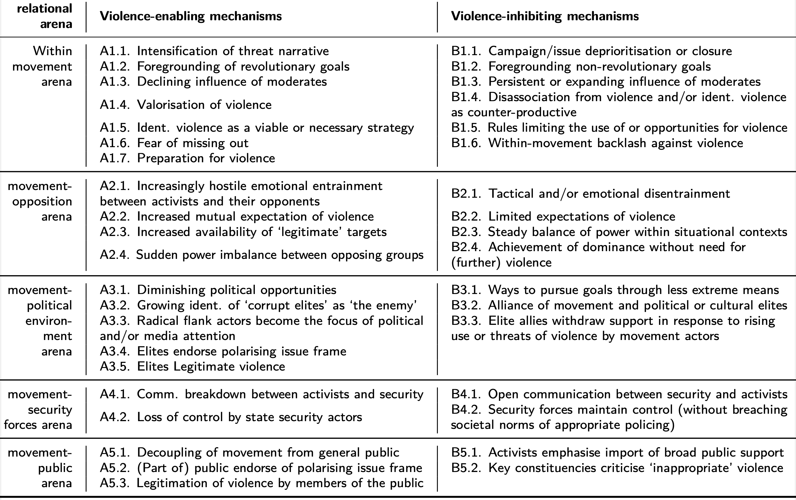

# Opening notes {background-color="#2c844c"}

::: {.tenor-gif-embed data-postid="14209777" data-share-method="host" data-aspect-ratio="1.94" data-width="70%"}
<div class="tenor-gif-embed" data-postid="14209777" data-share-method="host" data-aspect-ratio="1.94" data-width="100%"><a href="https://tenor.com/view/open-gif-14209777">Open Sticker</a>from <a href="https://tenor.com/search/open-stickers">Open Stickers</a></div> <script type="text/javascript" async src="https://tenor.com/embed.js"></script> 
:::

```{=html}
<script type="text/javascript" async src="https://tenor.com/embed.js"></script>
```

## Presentation groups

<!-- ::: panel-tabset -->
<!-- ## December -->

| Date    | Presenters                       | Method |
| -------:|:---------------------------------|:------:|
| 4 Dec:  | Shahadaan, Kristine, Daichi      | TBD    | 
| 11 Dec: | Bérénice, Zorka, Victoria, Katharina | TBD    | 
| 18 Dec: | Shoam, Aidan, Tara, Sebastian    | TBD    | 

: Presentations line-up

<!-- ## January -->

<!-- | Date    | Presenters                       | Method | -->
<!-- | -------:|:---------------------------------|:------:| -->
<!-- | 8 Jan:  |                                  | TBD    |  -->
<!-- | 15 Jan: |                                  | TBD    |  -->
<!-- | 22 Jan: |                                  | TBD    |  -->
<!-- | 29 Jan: |                                  | TBD    |  -->

<!-- : Presentations line-up -->

<!-- ::: -->

<!-- []{style="font-size:10px;"} -->

<!-- For a course on 'political violence' (focused mainly on politically violent groups and movements) and a class on 'escalation and restraint', can you suggest some discussion questions to ask students? Ideally, the questions should have multiple choice responses, or yes/no/maybe responses, or strongly agree/agree/disagree/strongly disagree responses? -->

# Antifa {background-color="#2c844c"}

:::: {.columns}
:::{.column width="50%"}
- opening discussion
- debatable proposition and pressing policy issue 
- antifa in Germany 
- @CopseyMerrill2020: antifa in the U.S.

:::

::: {.column width="50%"}
<div class="tenor-gif-embed" data-postid="1459673259347829360" data-share-method="host" data-aspect-ratio="1.35593" data-width="100%"><a href="https://tenor.com/view/revolution-antifa-riot-black-block-anarchy-gif-1459673259347829360">Revolution Antifa GIF</a>from <a href="https://tenor.com/search/revolution-gifs">Revolution GIFs</a></div> <script type="text/javascript" async src="https://tenor.com/embed.js"></script> 
:::
::::

## Opening discussion 

::: {style="text-align: center;"}
**[What should we, students of political violence, know about _antifa_? (causes? organisation/leadership? radical subcultures and mobilisation? strategies?)]{style="color:indigo; font-size:40px;"}** 
:::

. . . 


::: {style="text-align: center;"}
**[is antifa a 'gang' [@Pyrooz2018]? is antifa a 'group' [@LaFree2018]?]{style="color:indigo; font-size:40px;"}** 
:::

- [gang]{style="color:cadetblue;"} - 'durable and street-oriented youth group whose involvement in illegal activity is part of its group identity' [@Pyrooz2018, p. 230]
- [group]{style="color:cadetblue;"} - 'some stable organisation that persists over time and has some discernible leadership structure' [@LaFree2018, p. 249], see also GTF database: <https://www.start.umd.edu/gtd/>

## Debatable proposition: antifa as terrorist org.?

::: {style="text-align: center;"}
**[@Pyrooz2018[p. 233]: "the history of antifa reads like a history of violence"]{style="color:blue; font-size:50px;"}** 
:::

::: {style="text-align: center;"}
**[vs.]{style="font-size:50px;"}** 
:::


::: {style="text-align: center;"}
**[@Bray2017[p. 169]: "In truth, violence represents a small though vital sliver of anti-fascist activity."]{style="color:red; font-size:50px;"}** 
:::

. . . 

::: {style="text-align: center;"}
**[Should state security (in Germany, elsewhere) designate antifa as _extremist/terrorist_]{style="color:indigo; font-size:50px;"}** 
:::

## antifa (recently) in Germany {.smaller}

ARD series (in German): <https://www.ardaudiothek.de/sendung/die-fascho-jaegerin-der-fall-lina-e-und-seine-folgen/94838298/>

- 28-year-old antifa activist, Lina E., and three accomplices jailed for either membership of or support for a criminal organisation.
    + politicised/radicalised by revelations about NSU in 2011
- attacks on (assumed) right-wing extremists in Thüringen and Sachsen between 2018 and 2020
- judge...
    + acknowledged deficiency of criminal punishment of neo-Nazis
    + described right-wing extremism as a greater threat to Germany
    + but asserted 'even Nazis have inalienable rights'
    + criticized the defense lawyers for describing the trial as "political justice."

recent journal article: @jones2024GhostlyMilitanzLoss

## @CopseyMerrill2020 - background

- Since 2001, [right-wing extremists]{style="color:red;"} in the U.S. responsible for [110 politically motivated deaths]{style="color:red;"} --- [antifa: 0]{style="color:red;"} (or maximum one, in case of 2020 death of Patriot Prayer supporter)

> In putting their “bodies on the line,” militant anti-fascists aspire to defeat fascist organizing, to de-stabilize it, and ultimately de-mobilize it. At its root, anti-fascist militancy is the promise to effect intimidation, humiliation and de-moralization upon fascists. This involves a physical commitment to “no platforming” (p. 124)

- lots of informative background information about U.S. antifa in the article

## @CopseyMerrill2020 - research design

- [semi-structured interviews]{style="color:blue;"} with activists from RCA in Portland
    + conditions of anonymity 
    + between [October 2019 and February 2020]{style="color:blue;"}. <!-- [any importance in this period?]{style="color:indigo;"} -->

- sample of 3971 tweets (including 2484 retweets) shared by RCA’s Twitter account (\@RoseCityAntifa)
    + between [13 March 2018 and 28 August 2019]{style="color:blue;"} 
    + collected using *Tweepy* in accordance with Twitter’s regulations
    + 'more militant' tweets---"648 tweets (including 279 retweets) from within this sample which featured variants of “violence,” “attack,” “assault,” “fight,” and “terror”"
        * close reading; quantitatively and qualitatively analysed with [critical discourse analysis]{style="color:blue;"} approach

## @CopseyMerrill2020 - findings/points raised

- violent disruption of “fascist” assembly is an axiom of antifa praxis
- how far does the label 'fascist' extend?
    + "*[legitimacy of anti-fascist action is thus drawn from the illegitimacy of its opponent]{style="color:darkorange;"}*"
- antifa's "[pre-emptive self-defence]{style="color:darkorange;"}"
    + premised on ([a]{style="color:goldenrod;"}) deadliness of fascist movements of any size and ([b]{style="color:goldenrod;"}) rapid growth potential of fascist movements
- there are '*internal* [tactical]{style="color:darkred;"} and rhetorical [strategies]{style="color:darkred;"} that *limit* violence' from antifa --- BUT, consistent danger of antifa slipping into glorification of violence

# Poll: escalation and restraint {background-color="#2c844c"}

:::: {.columns}
:::{.column width="35%"}
{fig-alt="A QR code for the survey."}

:::

::: {.column width="65%" .center}
<!-- go to <https://www.qr-code-generator.com/>, add the link, and screen shot the QR code -->
Take the survey at **<https://forms.gle/12tV7fgjcAyC8iVG6>**

- ideology secondary to pragmatic issues in choosing to use violence?
- most important in allowing *restraint*?
- most likely to provoke *escalation*?

:::
:::: 

- should states remain open to negotiating with violent groups? 
- groups more likely to escalate violence if they feel they are losing support?


<!-- The ideology of a group is secondary to pragmatic considerations when it comes to use violence or not -->
<!-- - strongly agree/agree/disagree/strongly disagree -->


<!-- in your view, what is the most important factor that typically allows a political group to restrain violent impulses? -->
<!-- - strategic factors  -->
<!-- - resource constraints  -->
<!-- - moral convictions -->
<!-- - strong/weak organisation -->
<!-- - other -->


<!-- Which of the following is most likely to provoke an escalation in political violence? -->
<!-- - limited political access -->
<!-- - state repression -->
<!-- - economic inequality -->
<!-- - other  -->


<!-- States should remain open to negotiating with politically violent groups, even when they escalate their violence. -->
<!-- - strongly agree/agree/disagree/strongly disagree -->


<!-- Groups are more likely to escalate violence if they feel they are losing support. -->
<!-- - y/n/m -->


--- 

```{ojs}
md`## Poll results (Respondents: ${respondentCount})`
```


```{ojs}

import { liveGoogleSheet } from "@jimjamslam/live-google-sheet";
import { aq, op } from "@uwdata/arquero";

// UPDATE THE LINK FOR A NEW POLL
surveyResults = liveGoogleSheet(
  "https://docs.google.com/spreadsheets/d/e/" +
    "2PACX-1vSzXDDMtCvL7AeQx2C5Qwg_FEhFHA6dWov5vprYGiQLzzFJARc0RJQniUe-InSkwTCCqTdTv_XXKeEi/" +
    "pub?gid=720467942&single=true&output=csv",
  10000, 1, 6); // adjust the last number to select all relevant columns 

respondentCount = surveyResults.length;

```

<!-- The ideology of a group is secondary to pragmatic considerations when it comes to use violence or not -->
<!-- - strongly agree/agree/disagree/strongly disagree -->


<!-- in your view, what is the most important factor that typically allows a political group to restrain violent impulses? -->
<!-- - strategic factors  -->
<!-- - resource constraints  -->
<!-- - moral convictions -->
<!-- - strong/weak organisation -->
<!-- - other -->


<!-- Which of the following is most likely to provoke an escalation in political violence? -->
<!-- - limited political access -->
<!-- - state repression -->
<!-- - economic inequality -->
<!-- - other  -->


<!-- States should remain open to negotiating with politically violent groups, even when they escalate their violence. -->
<!-- - strongly agree/agree/disagree/strongly disagree -->


<!-- Groups are more likely to escalate violence if they feel they are losing support. -->
<!-- - y/n/m -->


:::: {.columns}
:::{.column width="50%"}
ideology secondary to pragmatic issues?

```{ojs}
ideology_secondCounts = aq.from(surveyResults)
  .select("ideology_second")
  .groupby("ideology_second")
  .count()
  .derive({ measure: d => "" })

// Calculate the maximum count from your dataset
ideology_second_maxCountRE = Math.max(...ideology_secondCounts.objects().map(d => d.count));

plot_ideology_second = Plot.plot({
  marks: [
    Plot.barY(ideology_secondCounts, {
      x: "ideology_second",
      y: "count",
      fill: "ideology_second",
      stroke: "black",
      strokeWidth: 1
    }),
    Plot.ruleY([respondentCount], { stroke: "#ffffff99" })
  ],
  color: {
    domain: [
      "Strongly disagree",
      "Disagree",
      "Neutral",
      "Agree",
      "Strongly agree"
    ],
    range: [
      "red",
      "pink",
      "lightgrey",
      "lightgreen",
      "forestgreen"
    ]
  },
  marginBottom: 180,
  x: { label: "", tickSize: 2, tickRotate: -45,
    domain: ["Strongly disagree", "Disagree", "Neutral", "Agree", "Strongly agree"]
  },  
  y: {
    label: "",
    tickSize: 10,
    tickFormat: d => d,
    tickValues: Array.from(
      new Set(ideology_secondCounts.objects().map(d => d.count))
    ).sort((a, b) => a - b),
    domain: [0, ideology_second_maxCountRE]
  },
  facet: { data: ideology_secondCounts, x: "measure", label: "" },
  marginLeft: 140,
  style: {
    width: 1350,
    height: 500,
    fontSize: 30,
  }
});

```

:::

::: {.column width="50%"}
more likely to escalate if losing support?

```{ojs}
losing_supportCounts = aq.from(surveyResults)
  .select("losing_support")
  .groupby("losing_support")
  .count()
  .derive({ measure: d => "" })

// Calculate the maximum count from your dataset
losing_support_maxCountRE = Math.max(...losing_supportCounts.objects().map(d => d.count));

plot_losing_support = Plot.plot({
  marks: [
    Plot.barY(losing_supportCounts, {
      x: "losing_support",
      y: "count",
      fill: "losing_support",
      stroke: "black",
      strokeWidth: 1
    }),
    Plot.ruleY([respondentCount], { stroke: "#ffffff99" })
  ],
  color: {
    domain: [
      "Yes",
      "No",
      "Maybe"
    ],
    range: [
      "forestgreen",
      "darkred",
      "goldenrod"
    ]
  },
  marginBottom: 80,
  x: { label: "", tickSize: 2, tickRotate: -1, padding: 0.2,
    domain: ["Yes", "No", "Maybe"]
  },  
  y: {
    label: "",
    tickSize: 10,
    tickFormat: d => d,
    tickValues: Array.from(
      new Set(losing_supportCounts.objects().map(d => d.count))
    ).sort((a, b) => a - b),
    domain: [0, losing_support_maxCountRE]
  },
  facet: { data: losing_supportCounts, x: "measure", label: "" },
  marginLeft: 60,
  style: {
    width: 1600,
    height: 500,
    fontSize: 40,
  },
});

```

:::
::::

## Poll results: escalation and restraint

:::: {.columns}
:::{.column width="50%"}
most important factor allowing *restraint*?

```{ojs}
allows_restraintCounts = aq.from(surveyResults)
  .select("allows_restraint")
  .groupby("allows_restraint")
  .count()
  .derive({ measure: d => "" })

// Calculate the maximum count from your dataset
allows_restraint_maxCountRE = Math.max(...allows_restraintCounts.objects().map(d => d.count));

plot_allows_restraint = Plot.plot({
  marks: [
    Plot.barY(allows_restraintCounts, {
      x: "allows_restraint",
      y: "count",
      fill: "allows_restraint",
      stroke: "black",
      strokeWidth: 1
    }),
    Plot.ruleY([respondentCount], { stroke: "#ffffff99" })
  ],
  color: {
    domain: [
      "strategic factors", 
      "resource constraints", 
      "moral convictions", 
      "strong/weak organisation", 
      "other"
    ],
    range: [
      "darkred",
      "goldenrod",
      "cadetblue",
      "forestgreen",
      "gray"
    ]
  },
  marginBottom: 400,
  x: { label: "", tickSize: 2, tickRotate: -40, padding: 0.2,
    domain: ["strategic factors", "resource constraints", "moral convictions", "strong/weak organisation", "other"]
  },  
  y: {
    label: "",
    tickSize: 10,
    tickFormat: d => d,
    tickValues: Array.from(
      new Set(allows_restraintCounts.objects().map(d => d.count))
    ).sort((a, b) => a - b),
    domain: [0, allows_restraint_maxCountRE]
  },
  facet: { data: allows_restraintCounts, x: "measure", label: "" },
  marginLeft: 60,
  style: {
    width: 1600,
    height: 500,
    fontSize: 40,
  },
});

```

:::

::: {.column width="50%"}
most likely to provoke *escalation*?

```{ojs}
provoke_escalationCounts = aq.from(surveyResults)
  .select("provoke_escalation")
  .groupby("provoke_escalation")
  .count()
  .derive({ measure: d => "" })

// Calculate the maximum count from your dataset
provoke_escalation_maxCountRE = Math.max(...provoke_escalationCounts.objects().map(d => d.count));

plot_provoke_escalation = Plot.plot({
  marks: [
    Plot.barY(provoke_escalationCounts, {
      x: "provoke_escalation",
      y: "count",
      fill: "provoke_escalation",
      stroke: "black",
      strokeWidth: 1
    }),
    Plot.ruleY([respondentCount], { stroke: "#ffffff99" })
  ],
  color: {
    domain: [
      "state repression",
      "economic inequality",
      "limited political access",
      "other"
    ],
    range: [
      "violet",
      "indigo",
      "goldenrod",
      "orange"
    ]
  },
  marginBottom: 500,
  x: { label: "", tickSize: 2, tickRotate: -60, padding: 0.2,
    domain: ["state repression", "economic inequality", "limited political access", "other"]
  },  
  y: {
    label: "",
    tickSize: 10,
    tickFormat: d => d,
    tickValues: Array.from(
      new Set(provoke_escalationCounts.objects().map(d => d.count))
    ).sort((a, b) => a - b),
    domain: [0, provoke_escalation_maxCountRE]
  },
  facet: { data: provoke_escalationCounts, x: "measure", label: "" },
  marginLeft: 60,
  style: {
    width: 1600,
    height: 500,
    fontSize: 40,
  },
});

```
 
:::
::::

## Poll results: negotiation

states should remain open to negotiating with politically violent groups? 

:::: {.columns}
:::{.column width="50%"}

```{ojs}
negotiatingCounts = aq.from(surveyResults)
  .select("negotiating")
  .groupby("negotiating")
  .count()
  .derive({ measure: d => "" })

// Calculate the maximum count from your dataset
negotiating_maxCountRE = Math.max(...negotiatingCounts.objects().map(d => d.count));

plot_negotiating = Plot.plot({
  marks: [
    Plot.barY(negotiatingCounts, {
      x: "negotiating",
      y: "count",
      fill: "negotiating",
      stroke: "black",
      strokeWidth: 1
    }),
    Plot.ruleY([respondentCount], { stroke: "#ffffff99" })
  ],
  color: {
    domain: [
      "Strongly disagree",
      "Disagree",
      "Neutral",
      "Agree",
      "Strongly agree"
    ],
    range: [
      "red",
      "pink",
      "lightgrey",
      "lightgreen",
      "forestgreen"
    ]
  },
  marginBottom: 180,
  x: { label: "", tickSize: 2, tickRotate: -45,
    domain: ["Strongly disagree", "Disagree", "Neutral", "Agree", "Strongly agree"]
  },  
  y: {
    label: "",
    tickSize: 10,
    tickFormat: d => d,
    tickValues: Array.from(
      new Set(negotiatingCounts.objects().map(d => d.count))
    ).sort((a, b) => a - b),
    domain: [0, negotiating_maxCountRE]
  },
  facet: { data: negotiatingCounts, x: "measure", label: "" },
  marginLeft: 140,
  style: {
    width: 1350,
    height: 500,
    fontSize: 30,
  }
});

```

:::

::: {.column width="50%"}

relates to our Week 11-12 classes on state responses

:::
::::


# Mechanisms of escalation and restraint {background-color="#2c844c"}

:::: {.columns}
:::{.column width="50%"}
- escalation and restraint concepts 
- catalogue of mechanisms 
- grouped/summarised mechanisms
    + restraint 
    + escalation 

:::

::: {.column width="50%"}
<div class="tenor-gif-embed" data-postid="5112090" data-share-method="host" data-aspect-ratio="1.91" data-width="100%"><a href="https://tenor.com/view/escalated-quickly-anchorman-drinking-gif-5112090">Escalated Quickly Anchorman GIF</a>from <a href="https://tenor.com/search/escalated+quickly-gifs">Escalated Quickly GIFs</a></div> <script type="text/javascript" async src="https://tenor.com/embed.js"></script> 
:::
::::

## escalation and restraint

- **[escalation]{style="color:darkred;"}** - a rise in the frequency and/or severity of violent actions
- **[restraint]{style="color:darkred;"}** - a deliberate restriction (either reducing or completely stopping) of violent actions

. . . 

[are there significant examples of [escalation]{style="color:darkred;"} and/or [restraint]{style="color:darkred;"} in cases you know of?]{style="color:indigo;"}

## Mechanisms of escalation and restraint



## summarising logics of restraint - [@BusherETAL2022; @bjorgo2020WhyNordicResistance]

['ascending the [ladder of abstraction]{style="color:blue;"}', @Sartori1970]

1. A **[strategic logic]{style="color:violet;"}** (violence is counterproductive in the present circumstances)
2. A **[moral logic]{style="color:cadetblue;"}** (certain forms of violence are illegitimate)
3. A **[logic of ego maintenance]{style="color:forestgreen;"}** (we are not a violent organization)
4. A **[logic of outgroup definition]{style="color:brown;"}** (softening views on putative outgroups)
5. An **[organisational logic]{style="color:goldenrod;"}** (the organisation evolves in ways that undermine the logics of violent escalation)

## summarising logics of escalation - @BusherETAL2022

['ascending the [ladder of abstraction]{style="color:blue;"}', @Sartori1970]

1. **[framing logic]{style="color:red;"}** (intensity of context/threat, revolutionary goals, glorification of violence, violence as viable/necessary, increasing vilification of 'enemies')
2. **[strategic logic]{style="color:green;"}** (cope with changing dynamics with opponents and/or state, deal with diminishing opportunity, loss of state control)
3. **[organisational logic]{style="color:goldenrod;"}** (declining moderate influence, logistical/practical preparation for violence)
4. **[constituency/social logic]{style="color:violet;"}** (endorsement/legitimation from elites and/or public, politics/media focuses on radical flank)

# A case of RWE restraint? {background-color="#2c844c"}

:::: {.columns}
:::{.column width="50%"}
- Nordic Resistance Movement (NRM) at a glance
- Tore Bjørgo on NRM
    + findings

:::

::: {.column width="50%"}
<div class="tenor-gif-embed" data-postid="13416157" data-share-method="host" data-aspect-ratio="1.775" data-width="100%"><a href="https://tenor.com/view/restraint-restraining-oder-elf-restrain-yourself-gif-13416157">Restraint GIF</a>from <a href="https://tenor.com/search/restraint-gifs">Restraint GIFs</a></div> <script type="text/javascript" async src="https://tenor.com/embed.js"></script> 
:::
::::

## NRM at a glance

:::: {.columns}
:::{.column width="65%"}
- Territory of action: Scandinavia [@blomberg2019FlashbackRhetoricalOnline; ]  
- Organisational structure: hierarchical national branches
- Membership: moderate [varies by country, e.g., @stiftelsenexpo2025SvenskRasideologiskMiljo] 
- (main) Objective: white ethno-state 
- (common) Targets: political and ethnic opponents 

:::

:::{.column width="35%"}

:::
::::

- Repertoire of actions: low-level violence, connected to terrorism [e.g., Finland, @ravndal2020EmergenceTransnationalStreet; @Kotonen2021; @ZellerVaughan2023Proscribing] 

## Nordic Resistance Movement (NRM) - Tore Bjørgo

**Tore Bjørgo** on Why the Nordic Resistance Movement Restrains its Use of Violence [@bjorgo2020WhyNordicResistance]

<!-- Aspect ratios include 1x1, 4x3, 16x9 (the default), and 21x9. -->
<!-- aspect-ratio="21x9"  -->


## Nordic Resistance Movement (NRM) - Tore Bjørgo

1. *When, why does NRM permit use of violence*?
    + no **[moral restraints]{style="color:red;"}**, rather [violence perceived as **counter-productive**]{style="color:darkorange;"} (to gaining support and freely propagating views)
    + try to **[expand boundaries of acceptable violence]{style="color:darkorange;"}** with acts against police and political enemies
2. *Why, how does NRM restrain use of violence*?
    + to maintain **[strategic position]{style="color:darkred;"}**
    + commit members to **maintaining nonviolent discipline**
3. *How does NRM leadership respond to cases where members overstep and act violently*?
    + **honouring** rather than **punishing** activists who overstep
    + BUT ALSO **distancing** from any affiliation or connection


# Any questions, concerns, feedback for this class? {background-color="#2c844c"}

Anonymous feedback here: <https://forms.gle/NfF1pCfYMbkAT3WP6>

Alternatively, please send me an email: [m.zeller\@lmu.de]{style="color:red;"}


```{r echo=FALSE, message=FALSE, warning=FALSE}
pagedown::chrome_print(file.path("..", "docs/slides", "slides_09.html"))
```

## References


