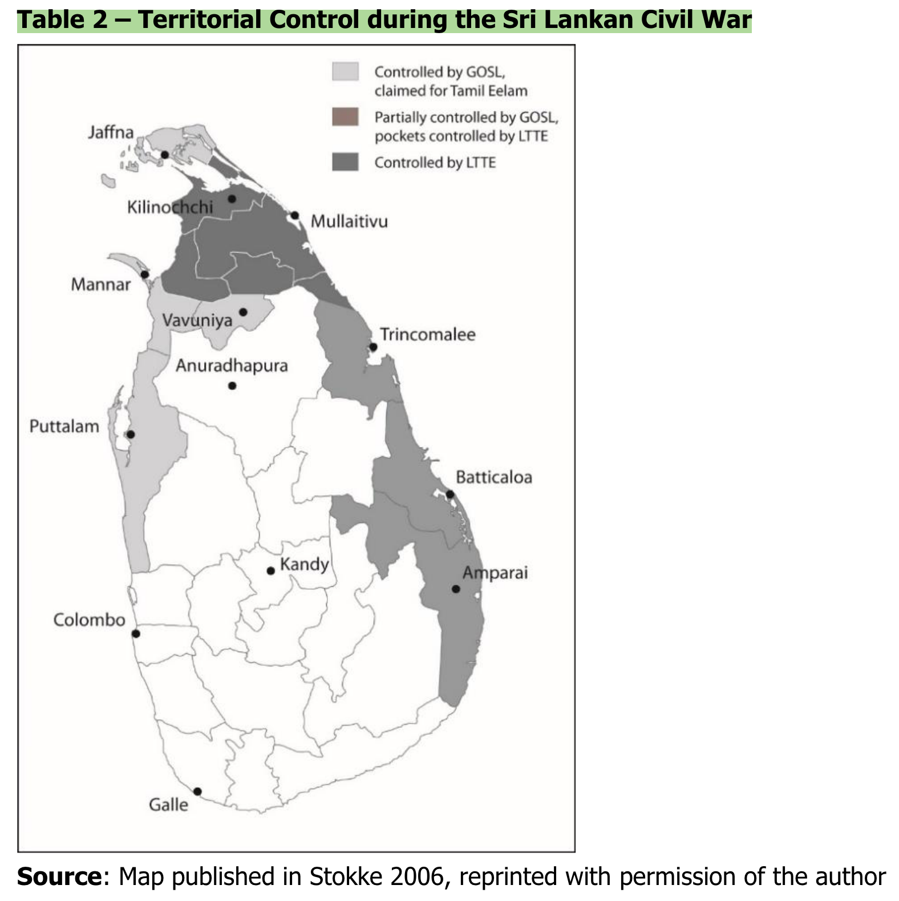
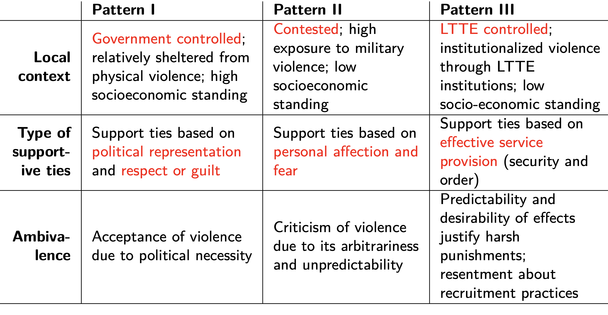
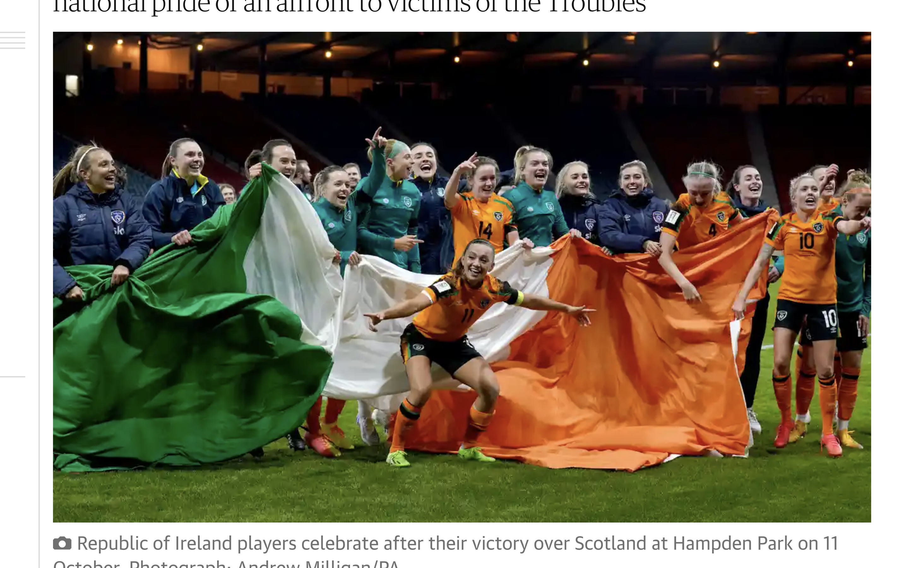
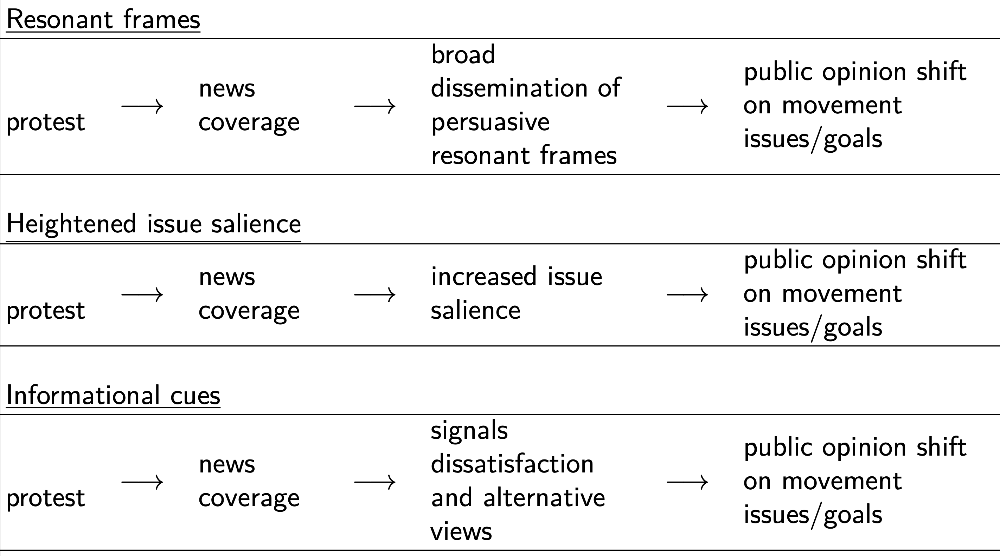
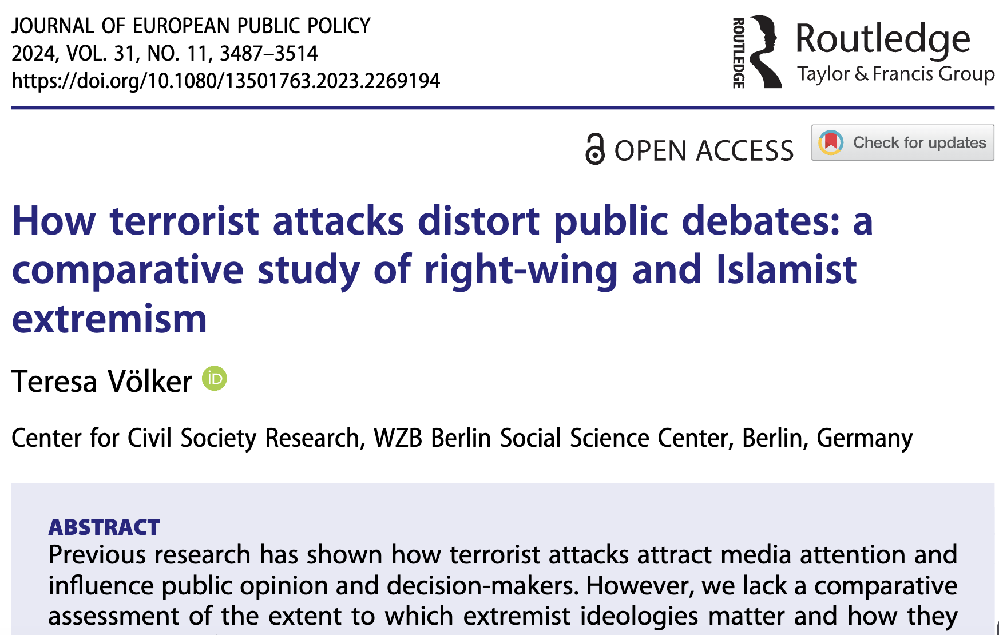
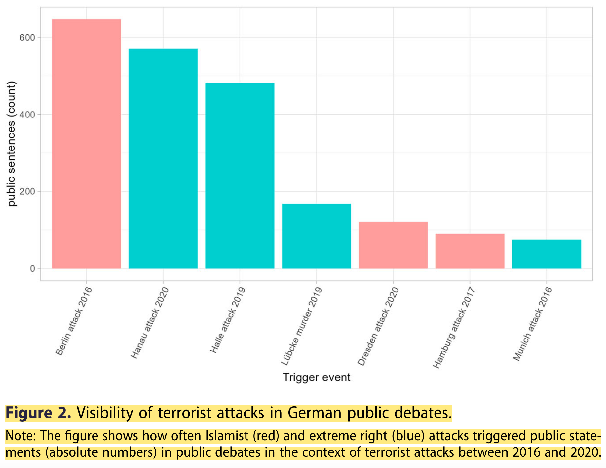
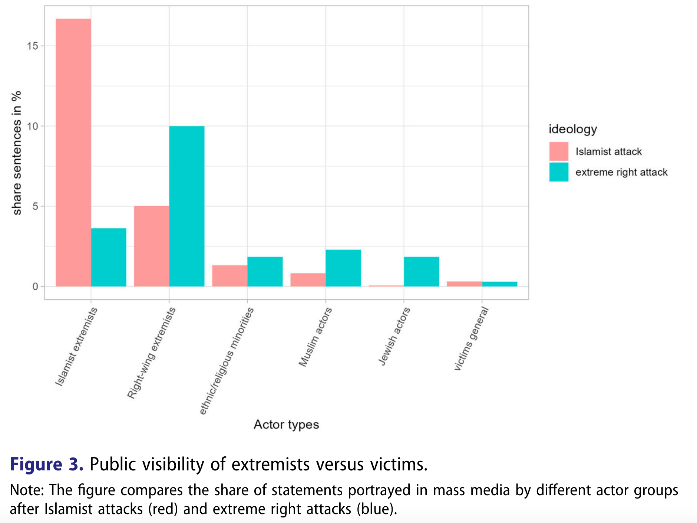
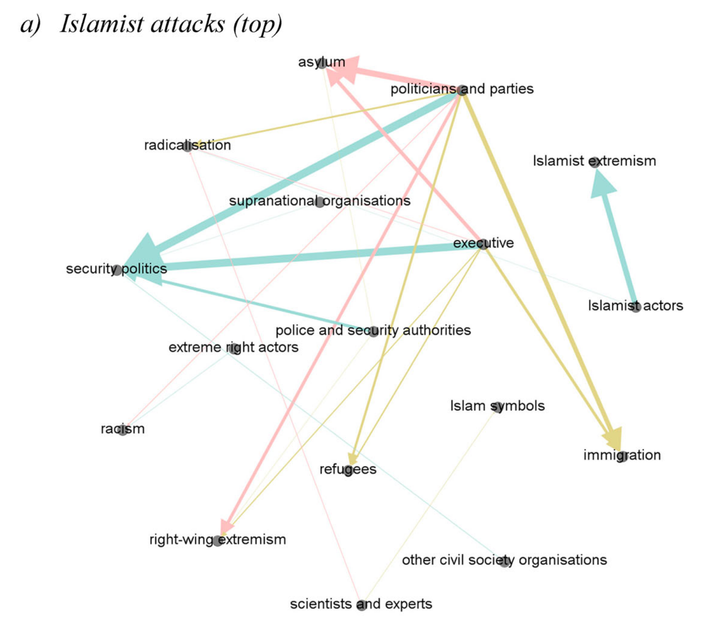
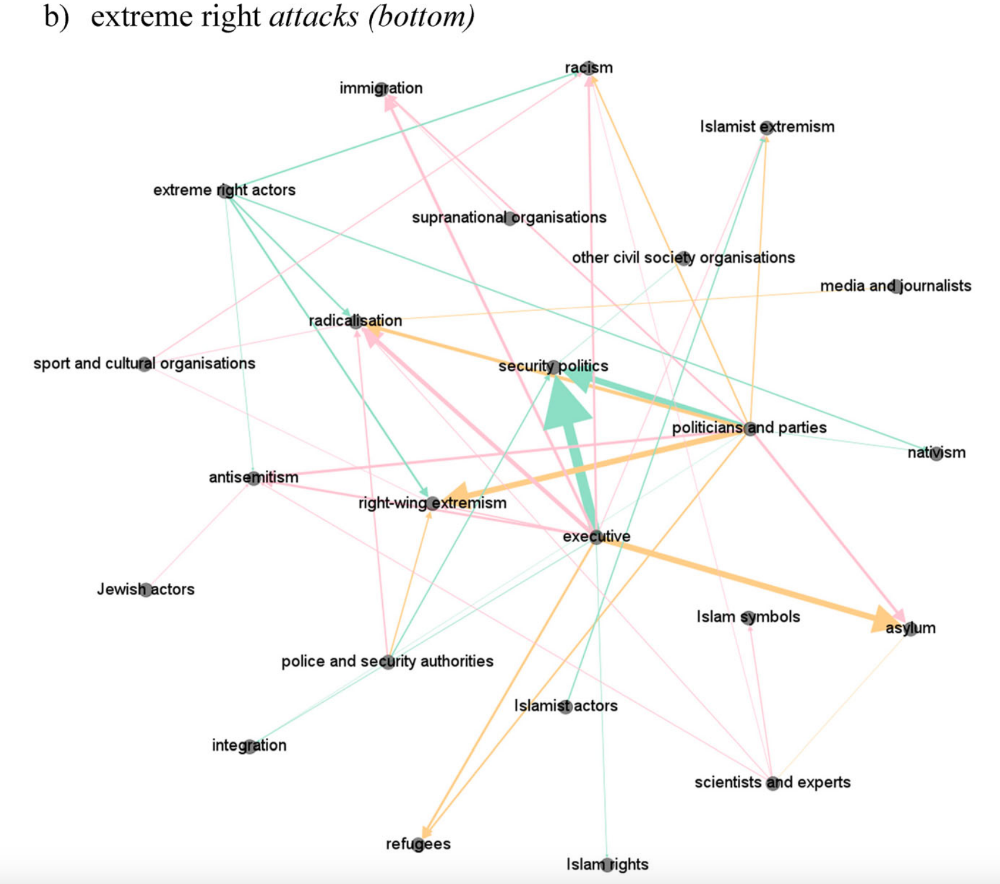

# Opening notes {background-color="#2c844c"}

::: {.tenor-gif-embed data-postid="14209777" data-share-method="host" data-aspect-ratio="1.94" data-width="70%"}
<div class="tenor-gif-embed" data-postid="14209777" data-share-method="host" data-aspect-ratio="1.94" data-width="100%"><a href="https://tenor.com/view/open-gif-14209777">Open Sticker</a>from <a href="https://tenor.com/search/open-stickers">Open Stickers</a></div> <script type="text/javascript" async src="https://tenor.com/embed.js"></script> 
:::

```{=html}
<script type="text/javascript" async src="https://tenor.com/embed.js"></script>
```

## Presentation groups

<!-- ::: panel-tabset -->
<!-- ## December -->

| Date    | Presenters                       | Method |
| -------:|:---------------------------------|:------:|
| 4 Dec:  | Shahadaan, Kristine, Daichi      | TBD    | 
| 11 Dec: | Bérénice, Zorka, Victoria, Katharina | TBD    | 
| 18 Dec: | Shoam, Aidan, Tara, Sebastian    | TBD    | 

: Presentations line-up

<!-- ## January -->

<!-- | Date    | Presenters                       | Method | -->
<!-- | -------:|:---------------------------------|:------:| -->
<!-- | 8 Jan:  |                                  | TBD    |  -->
<!-- | 15 Jan: |                                  | TBD    |  -->
<!-- | 22 Jan: |                                  | TBD    |  -->
<!-- | 29 Jan: |                                  | TBD    |  -->

<!-- : Presentations line-up -->

<!-- ::: -->

<!-- []{style="font-size:10px;"} -->

<!-- For a course on 'political violence' and a class on 'local support and public reaction', can you suggest some discussion questions to ask students? Ideally, the questions should have multiple choice responses, or yes/no/maybe responses, or strongly agree/agree/disagree/strongly disagree responses? -->

# Support in an armed conflict setting {background-color="#2c844c"}

:::: {.columns}
:::{.column width="50%"}
- @meier2022CoercionRepresentationExploring
    + Tamils in Sri Lanka 
    + territory 
    + three patterns

:::

::: {.column width="50%"}
<div class="tenor-gif-embed" data-postid="19844587" data-share-method="host" data-aspect-ratio="1.77778" data-width="100%"><a href="https://tenor.com/view/intractable-conflict-hugh-grant-tennyson-foss-death-to2020-hard-to-control-gif-19844587">Intractable Conflict Hugh Grant GIF</a>from <a href="https://tenor.com/search/intractable+conflict-gifs">Intractable Conflict GIFs</a></div> <script type="text/javascript" async src="https://tenor.com/embed.js"></script> 
:::
::::

## @meier2022CoercionRepresentationExploring - context and research design {.smaller}

- anti-Tamil riots in July 1983, thousands of Tamils killed
    + drove armed conflict, with 8,000-10,000 strong Tamil Tigers
- Justification of approach: “*Focusing on actions alone would deprive us of a crucial facet of support relations: the meaning people attach to actors and events. For instance, we can only understand why respondents continued to support the LTTE despite their increasing brutality and hostility if we consider the beliefs and affects that composed support relations and upheld them regardless of the LTTE’s ruthlessness.*”
    + [actions, beliefs/meanings]{style="color:violet;"} - [epistemologic focal points]{style="color:blue;"}
- Data: [30 life history interviews]{style="color:blue;"} with [former]{style="color:blue;"} Tigers
    + "*sample is [too small to derive generalizable conclusions]{style="color:blue;"} ... enabling us to explore how people evaluate, make sense of and rationalize behaviors by conflict actors and to uncover some of the fluctuation, contradictions and ambivalences in peoples’ beliefs and actions towards armed groups*"

## Sri Lanka map

 


## @meier2022CoercionRepresentationExploring - 3 patterns

(1) political representation and social distance; (2) fear and the relevance of affective ties; (3) security and (forceful) recruitment.

 

## @meier2022CoercionRepresentationExploring - 3 patterns

- respondents [in]{style="color:red;"} LTTE territory, interacting with LTTE’s political and administrative institutions, [more likely to support LTTE]{style="color:darkorange;"}, having experienced them as service providers rather than as armed attackers.
- LTTE support [not "solely coerced or entirely free of force"]{style="color:darkorange;"}
- (p. 171) "it is more fruitful to explore how civilians cope with and react to this ambivalence. As the empirical evidence has demonstrated, [depending on the type of force and the group targeted, violence was perceived as more or less justified]{style="color:darkorange;"}."

# Poll: local support and public reaction {background-color="#2c844c"}

:::: {.columns}
:::{.column width="35%"}
{fig-alt="A QR code for the survey."}

:::

::: {.column width="65%" .center}
<!-- go to <https://www.qr-code-generator.com/>, add the link, and screen shot the QR code -->
Take the survey at **<https://forms.gle/VZJuzHbzXXtNW2KN9>**

- local support necessary violent group to have success?
- violent escalation tends to alienate the public, reducing support?
- most common reason people support politically violent groups?

:::
:::: 

- citizens react differently to political violence depending on the the ideological motivations underlying the violence.
- when states respond repressively, it usually strengthens politically violent groups' legitimacy?

## A recent controversy

<!-- https://www.youtube.com/watch?v=y1BnocehF2w -->
<!-- https://www.youtube.com/watch?v=KkGfRbh2_Vw -->

:::: {.columns}
:::{.column width="45%"}


:::

::: {.column width="55%"}
In October 2023, the Irish Women's Football team qualified for the Women's World Cup. In the days after, the Irish public was ablaze with debate, politicians took turns condemning and defending the players, and UEFA launched an investigation that ended in a 20,000 EUR fine. Why? For singing a certain song...

:::
:::: 

## A recent controversy

<!-- Brian Kerr on the pro-IRA song controversy around the Ireland team -->

<!-- Aspect ratios include 1x1, 4x3, 16x9 (the default), and 21x9. -->
<!-- aspect-ratio="21x9"  -->


::: {style="margin-top: -50px;"} 
<!-- Are Younger People Desensitised to the Meaning of Pro-IRA Chants? | The Tonight Show -->
see also 8-minute roundtable: <https://www.youtube.com/watch?v=KkGfRbh2_Vw>
::: 

--- 

```{ojs}
md`## Poll results (Respondents: ${respondentCount})`
```


```{ojs}

import { liveGoogleSheet } from "@jimjamslam/live-google-sheet";
import { aq, op } from "@uwdata/arquero";

// UPDATE THE LINK FOR A NEW POLL
surveyResults = liveGoogleSheet(
  "https://docs.google.com/spreadsheets/d/e/" +
    "2PACX-1vROlIm6z3iEJH16_NhePQ5TQJKNti8GrDmGTH5dPJ0SPtPNbKc_WVmfu463ijQzJrsrnwcPf-2KZo_g/" +
    "pub?gid=870695621&single=true&output=csv",
  10000, 1, 6); // adjust the last number to select all relevant columns 

respondentCount = surveyResults.length;

```

<!-- Is local support necessary for a politically violent group to have success? -->
<!-- y/n/m -->


<!-- Violent escalation by politically violent groups tends to alienate the public, reducing long-term support for their cause. -->
<!-- - strongly agree/agree/disagree/strongly disagree -->


<!-- In your opinion, what is the most common reason people support politically violent groups? -->
<!-- - political grievances -->
<!-- - economic grievances -->
<!-- - ideological beliefs -->
<!-- - identity factors -->
<!-- - other -->

<!-- Citizens react differently to political violence depending on the the ideological motivations underlying the violence. -->
<!-- - strongly agree/agree/disagree/strongly disagree -->


<!-- When states respond repressively to political violence (e.g., through military force), it usually strengthens the movement's legitimacy among local populations. -->
<!-- - strongly agree/agree/disagree/strongly disagree -->


:::: {.columns}
:::{.column width="50%"}
local support necessary violent group to have success?

```{ojs}
local_supportCounts = aq.from(surveyResults)
  .select("local_support")
  .groupby("local_support")
  .count()
  .derive({ measure: d => "" })

// Calculate the maximum count from your dataset
local_support_maxCountRE = Math.max(...local_supportCounts.objects().map(d => d.count));

plot_local_support = Plot.plot({
  marks: [
    Plot.barY(local_supportCounts, {
      x: "local_support",
      y: "count",
      fill: "local_support",
      stroke: "black",
      strokeWidth: 1
    }),
    Plot.ruleY([respondentCount], { stroke: "#ffffff99" })
  ],
  color: {
    domain: [
      "Yes",
      "No",
      "Maybe"
    ],
    range: [
      "forestgreen",
      "darkred",
      "goldenrod"
    ]
  },
  marginBottom: 80,
  x: { label: "", tickSize: 2, tickRotate: -1, padding: 0.2,
    domain: ["Yes", "No", "Maybe"]
  },  
  y: {
    label: "",
    tickSize: 10,
    tickFormat: d => d,
    tickValues: Array.from(
      new Set(local_supportCounts.objects().map(d => d.count))
    ).sort((a, b) => a - b),
    domain: [0, local_support_maxCountRE]
  },
  facet: { data: local_supportCounts, x: "measure", label: "" },
  marginLeft: 60,
  style: {
    width: 1600,
    height: 500,
    fontSize: 40,
  },
});

```

:::

::: {.column width="50%"}
**[Why do you think so? What might 'success' mean and does that affect the 'necessity' of local support?]{style="color:indigo; font-size:40px;"}** 

:::
::::

## Poll results: escalation and support 

:::: {.columns}
:::{.column width="50%"}
violent escalation tends to alienate the public, reducing support?

```{ojs}
escalationCounts = aq.from(surveyResults)
  .select("escalation")
  .groupby("escalation")
  .count()
  .derive({ measure: d => "" })

// Calculate the maximum count from your dataset
escalation_maxCountRE = Math.max(...escalationCounts.objects().map(d => d.count));

plot_escalation = Plot.plot({
  marks: [
    Plot.barY(escalationCounts, {
      x: "escalation",
      y: "count",
      fill: "escalation",
      stroke: "black",
      strokeWidth: 1
    }),
    Plot.ruleY([respondentCount], { stroke: "#ffffff99" })
  ],
  color: {
    domain: [
      "Strongly disagree",
      "Disagree",
      "Neutral",
      "Agree",
      "Strongly agree"
    ],
    range: [
      "red",
      "pink",
      "lightgrey",
      "lightgreen",
      "forestgreen"
    ]
  },
  marginBottom: 180,
  x: { label: "", tickSize: 2, tickRotate: -45,
    domain: ["Strongly disagree", "Disagree", "Neutral", "Agree", "Strongly agree"]
  },  
  y: {
    label: "",
    tickSize: 10,
    tickFormat: d => d,
    tickValues: Array.from(
      new Set(escalationCounts.objects().map(d => d.count))
    ).sort((a, b) => a - b),
    domain: [0, escalation_maxCountRE]
  },
  facet: { data: escalationCounts, x: "measure", label: "" },
  marginLeft: 140,
  style: {
    width: 1350,
    height: 500,
    fontSize: 30,
  }
});

```

:::

::: {.column width="50%"}
most common reason people support politically violent groups?

```{ojs}
reasonCounts = aq.from(surveyResults)
  .select("reason")
  .groupby("reason")
  .count()
  .derive({ measure: d => "" })

// Calculate the maximum count from your dataset
reason_maxCountRE = Math.max(...reasonCounts.objects().map(d => d.count));

plot_reason = Plot.plot({
  marks: [
    Plot.barY(reasonCounts, {
      x: "reason",
      y: "count",
      fill: "reason",
      stroke: "black",
      strokeWidth: 1
    }),
    Plot.ruleY([respondentCount], { stroke: "#ffffff99" })
  ],
  color: {
    domain: [
      "political grievances",
      "economic grievances",
      "ideological beliefs",
      "identity factors",
      "other"
    ],
    range: [
      "indigo",
      "goldenrod",
      "cadetblue",
      "forestgreen",
      "violet"
    ]
  },
  marginBottom: 500,
  x: { label: "", tickSize: 2, tickRotate: -60, padding: 0.2,
    domain: ["political grievances", "economic grievances", "ideological beliefs", "identity factors", "other"]
  },  
  y: {
    label: "",
    tickSize: 10,
    tickFormat: d => d,
    tickValues: Array.from(
      new Set(reasonCounts.objects().map(d => d.count))
    ).sort((a, b) => a - b),
    domain: [0, reason_maxCountRE]
  },
  facet: { data: reasonCounts, x: "measure", label: "" },
  marginLeft: 60,
  style: {
    width: 1600,
    height: 500,
    fontSize: 40,
  },
});

```
 
:::
::::

## Poll results: reaction and repression 

:::: {.columns}
:::{.column width="50%"}
different reaction depending on ideological motivation of violence?

```{ojs}
react_differentlyCounts = aq.from(surveyResults)
  .select("react_differently")
  .groupby("react_differently")
  .count()
  .derive({ measure: d => "" })

// Calculate the maximum count from your dataset
react_differently_maxCountRE = Math.max(...react_differentlyCounts.objects().map(d => d.count));

plot_react_differently = Plot.plot({
  marks: [
    Plot.barY(react_differentlyCounts, {
      x: "react_differently",
      y: "count",
      fill: "react_differently",
      stroke: "black",
      strokeWidth: 1
    }),
    Plot.ruleY([respondentCount], { stroke: "#ffffff99" })
  ],
  color: {
    domain: [
      "Strongly disagree",
      "Disagree",
      "Neutral",
      "Agree",
      "Strongly agree"
    ],
    range: [
      "red",
      "pink",
      "lightgrey",
      "lightgreen",
      "forestgreen"
    ]
  },
  marginBottom: 180,
  x: { label: "", tickSize: 2, tickRotate: -45,
    domain: ["Strongly disagree", "Disagree", "Neutral", "Agree", "Strongly agree"]
  },  
  y: {
    label: "",
    tickSize: 10,
    tickFormat: d => d,
    tickValues: Array.from(
      new Set(react_differentlyCounts.objects().map(d => d.count))
    ).sort((a, b) => a - b),
    domain: [0, react_differently_maxCountRE]
  },
  facet: { data: react_differentlyCounts, x: "measure", label: "" },
  marginLeft: 140,
  style: {
    width: 1350,
    height: 500,
    fontSize: 30,
  }
});

```

:::

::: {.column width="50%"}
state repression usually strengthens violent groups' legitimacy?

```{ojs}
repressionCounts = aq.from(surveyResults)
  .select("repression")
  .groupby("repression")
  .count()
  .derive({ measure: d => "" })

// Calculate the maximum count from your dataset
repression_maxCountRE = Math.max(...repressionCounts.objects().map(d => d.count));

plot_repression = Plot.plot({
  marks: [
    Plot.barY(repressionCounts, {
      x: "repression",
      y: "count",
      fill: "repression",
      stroke: "black",
      strokeWidth: 1
    }),
    Plot.ruleY([respondentCount], { stroke: "#ffffff99" })
  ],
  color: {
    domain: [
      "Strongly disagree",
      "Disagree",
      "Neutral",
      "Agree",
      "Strongly agree"
    ],
    range: [
      "red",
      "pink",
      "lightgrey",
      "lightgreen",
      "forestgreen"
    ]
  },
  marginBottom: 180,
  x: { label: "", tickSize: 2, tickRotate: -45,
    domain: ["Strongly disagree", "Disagree", "Neutral", "Agree", "Strongly agree"]
  },  
  y: {
    label: "",
    tickSize: 10,
    tickFormat: d => d,
    tickValues: Array.from(
      new Set(repressionCounts.objects().map(d => d.count))
    ).sort((a, b) => a - b),
    domain: [0, repression_maxCountRE]
  },
  facet: { data: repressionCounts, x: "measure", label: "" },
  marginLeft: 140,
  style: {
    width: 1350,
    height: 500,
    fontSize: 30,
  }
});

```

:::
::::


# Public opinion on political violence {background-color="#2c844c"}

:::: {.columns}
:::{.column width="50%"}
- @setter2022HowSocialMovemenst
    + background 
    + research design 
    + mechanisms 
    + findings  
- @volker2023HowTerroristAttacks
    + concepts 
    + visibility, resonance, legitimacy 
    + influential actors 

:::

::: {.column width="50%"}
<div class="tenor-gif-embed" data-postid="21779558" data-share-method="host" data-aspect-ratio="1.90476" data-width="100%"><a href="https://tenor.com/view/public-opinion-meme-news-journalism-indoctrination-gif-21779558">Public Opinion Meme GIF</a>from <a href="https://tenor.com/search/public+opinion-gifs">Public Opinion GIFs</a></div> <script type="text/javascript" async src="https://tenor.com/embed.js"></script> 
:::
::::

## background on the George Floyd protests - @setter2022HowSocialMovemenst

- what are the most important points to know from this **[context]{style="color:indigo;"}** and **[catalysing event]{style="color:indigo;"}**?
- what factors might *[escalate]{style="color:darkred;"}* activism to political violence? what factors might *[restrain]{style="color:darkred;"}*?

## refresher: logics of restraint/escalation {.smaller}

[restraint]{style="color:darkred; font-size:40px;"}

1. A **[strategic logic]{style="color:violet;"}** (violence is counterproductive in the present circumstances)
2. A **[moral logic]{style="color:cadetblue;"}** (certain forms of violence are illegitimate)
3. A **[logic of ego maintenance]{style="color:forestgreen;"}** (we are not a violent organization)
4. A **[logic of outgroup definition]{style="color:brown;"}** (softening views on putative outgroups)
5. An **[organisational logic]{style="color:goldenrod;"}** (the organisation evolves in ways that undermine the logics of violent escalation)

[escalation]{style="color:darkred; font-size:40px;"}

1. **[framing logic]{style="color:red;"}** (intensity of context/threat, revolutionary goals, glorification of violence, violence as viable/necessary, increasing vilification of 'enemies')
2. **[strategic logic]{style="color:green;"}** (cope with changing dynamics with opponents and/or state, deal with diminishing opportunity, loss of state control)
3. **[organisational logic]{style="color:goldenrod;"}** (declining moderate influence, logistical/practical preparation for violence)
4. **[constituency/social logic]{style="color:violet;"}** (endorsement/legitimation from elites and/or public, politics/media focuses on radical flank)

## @setter2022HowSocialMovemenst - design

- RQ: *When such events happen, how does this shape citizens’ views on politically-oriented violence?*
- Context: 
    + 'U.S. citizens [expect protesters to conduct themselves nonviolently]{style="color:red;"}...' (p. 430)
    + YET - "people find violence more acceptable when traditional political methods are incapable of adequately addressing social injustices"
- Data:
    + from the **American National Election Study’s (ANES)** [2016]{style="color:blue;"} and [2020]{style="color:blue;"} samples

## how SMs influence public opinion - @setter2022HowSocialMovemenst



## support for political violence (%) - [-@setter2022HowSocialMovemenst]

:::: {.columns}
:::{.column width="50%"}

```{r}
library(kableExtra)
library(tidyr)

data <- data.frame(
  Demographic = c("Sample Overall", "Extremely Liberal", "Liberal", "Slightly Liberal", "Moderate", "Slightly Conservative", "Conservative", "Extremely Conservative",
                  "White", "Black", "Men", "Women", "Age 18-29", "Age 30-39", "Age 40-49", "Age 50-59", "Age 60-69", "Age 70-79", "Age 80+", "Attends Church", "Does Not Attend Church"),
  `2016` = c(15.28, 14.55, 10.02, 16.83, 15.93, 14.84, 9.24, 12.71, 11.79, 24.37, 16.45, 14.17, 28.40, 16.42, 14.54, 13.12, 9.86, 9.35, 15.03, 16.10, 14.00),
  `2020` = c(14.34, 30.79, 17.36, 16.23, 16.30, 8.59, 5.45, 8.22, 10.89, 24.41, 14.13, 14.63, 30.42, 21.13, 16.85, 10.76, 7.15, 7.57, 6.02, 12.82, 15.81)
)

setter_reg_tab <- kable(data, format = "html", 
      col.names = c("Demographic", "2016", "2020"), 
      align = c("r", "c", "c")) %>% 
  kable_styling(full_width = FALSE, font_size = 16) %>%
  row_spec(0, bold = TRUE)
setter_reg_tab

```

:::

::: {.column width="50%"}
[any numbers that you think are noteworthy?]{style="color:indigo;"}

:::
::::

## support for political violence (%) - [-@setter2022HowSocialMovemenst]

:::: {.columns}
:::{.column width="50%"}

```{r}
library(dplyr)

setter_reg_tab %>% 
  column_spec(3, 
              color = "black", 
              bold = T,
              background = case_when(
                data$X2020 == 17.36 | data$X2020 == 30.79 ~ "red",
                data$X2020 == 8.59 | data$X2020 == 5.45 ~ "pink",
                data$X2020 == 30.42 | data$X2020 == 21.13 ~ "red",
                data$X2020 == 10.76 | data$X2020 == 7.15 | data$X2020 == 7.57 ~ "pink",
                TRUE ~ "white"
              )) %>% 
  column_spec(2, 
              color = "black", 
              bold = T,
              background = case_when(
                data$X2020 == 17.36 | data$X2020 == 30.79 ~ "pink",
                data$X2020 == 8.59 | data$X2020 == 5.45 ~ "red",
                data$X2020 == 30.42 | data$X2020 == 21.13 ~ "pink",
                data$X2020 == 10.76 | data$X2020 == 7.15 | data$X2020 == 7.57 ~ "red",
                TRUE ~ "white"
              ))
                
```

:::

::: {.column width="50%"}
- "[liberals became much more likely]{style="color:darkorange;"} to find political violence acceptable ... [conservatives became much less likely]{style="color:darkorange;"} to find themselves in support of violence..."
- "[Younger respondents were more likely]{style="color:darkorange;"} to support political violence in 2020 ... while their [older counterparts were more opposed]{style="color:darkorange;"} than before"

:::
::::

## support for political violence (%) - [-@setter2022HowSocialMovemenst] 

:::: {.columns}
:::{.column width="30%"}

```{r}
setter_reg_tab %>% 
  column_spec(2, color = "black", bold = T,
              background=ifelse(data$X2016 == 15.03, "lightblue", "white"))
```

:::

::: {.column width="70%"}
> One strange outlier is the 2016 survey’s proportion of 80+ year-olds who find political violence acceptable. We have checked the coding on this variable multiple times to ensure that there is nothing wrong with it, and it has remained accurate every time. Either the 2016 ANES just happened to capture a particularly rowdy set of senior citizens, or there was some cohort effect among that sample’s oldest respondents that was not shared among the 2020 cohort—such as lingering memories of WWII or the 1960s movements.

:::
::::

## @setter2022HowSocialMovemenst - findings


## @setter2022HowSocialMovemenst - findings

- support for Black Lives Matter is [significantly correlated]{style="color:darkorange;"} with support for political violence.
- "The [impact of age intensified between 2016 and 2020]{style="color:darkorange;"}. In the 2016 model, each additional year of age corresponds to a .2% lower likelihood of supporting political violence. In 2020, each additional year corresponds to a decrease of .4%, two times the impact of the previous model. In other words, [in 2016, a fifty-year-old respondent would be 6% less likely to support political violence than a twenty-year-old respondent]{style="color:darkorange;"}, net of all other factors. In 2020, by contrast, they would be 12% less likely to support political violence, net of all other factors."
- significance of higher education: [having a college degree decreases support for political violence by 3.4%]{style="color:darkorange;"}.

## @setter2022HowSocialMovemenst - findings, revised model


## @setter2022HowSocialMovemenst - findings

> the George Floyd riots functioned as a new “**[situational variation]{style="color:cadetblue;"}**” that shifted people’s attitudes, increasing the proportion of liberals and ardent BLM movement supporters who felt that the political violence was justifiable."

- "**people may shift their attitudes about political violence yet again when a different movement poses a new situational variation. In one instance, people can be supportive of political violence and then, in a different instance, be morally opposed to it. The key factor shaping beliefs in any particular moment is how a person feels about the movement that is using political violence.**"

- [What do we take from these findings? How does local support (or opposition) manifest cases you know of?]{style="color:indigo;"}

## terrorist attacks and public debate - @volker2023HowTerroristAttacks RQs 

:::: {.columns}
:::{.column width="50%"}
> to what extent and how do terrorist attacks influence public debates? What are the differences between public debates after extreme right and Islamist terrorist attacks?

[What do you expect, hypothesise?]{style="color:indigo;"}

:::

::: {.column width="50%"}


:::
::::

## @volker2023HowTerroristAttacks - key concepts (1)

- **[Discursive opportunity structures]{style="color:darkred;"}** - pre-existing values and visions around issues in the broader political culture of a country [@Koopmans2004]
    + **_issue-specific_ [discursive opportunity structures]{style="color:darkred;"}** determine which actors and issues gain access to and influence public debates [@volker2023HowTerroristAttacks, p. 2]
- **discursive [critical junctures]{style="color:darkred;"}** - moments that intensify polarisation and transform existing political alignments and visions around issues
    + **[can you think of an example?]{style="color:indigo;"}**

## @volker2023HowTerroristAttacks - key concepts (2) 

Author's own **[discursive radicalisation model]{style="color:cadetblue;"}** - how radical actors may shape public debates after critical events such as terrorist attacks

1. *[visibility]{style="color:goldenrod;"}* - how much do events/actors attract attention
2. *[resonance]{style="color:goldenrod;"}* - political reactions that radical actors and events provoke and how they shape discourse dynamics on contested issues
3. *[legitimacy]{style="color:goldenrod;"}* - extent to which actors and issues resonate positively and gain support

## @volker2023HowTerroristAttacks - research design 

- [data]{style="color:blue;"}: mass media coverage after (for two weeks) all seven fatal politically violent attacks since 2015 (four by extreme right, three by Islamist)
    + 2016 in München, 2019 Walter Lübcke, 2019 Halle, 2020 Hanau; 2016 in Berlin, 2017 in Hamburg, 2020 in Dresden
- methods: [relational quantitative content analysis, frame analysis, network analysis]{style="color:blue;"}
    + *[diagnostic]{style="color:darkred;"}* and [*prognostic* frames]{style="color:darkred;"}
    + data and methods transparency! see online article: <https://doi.org/10.1080/13501763.2023.2269194>

## Visibility

:::: {.columns}
:::{.column width="25%"}
Finding: the most publicised terrorist attacks were those where the debate centred on the [ideological motives of the perpetrators and the political consequences]{style="color:darkorange;"} of the act

:::

::: {.column width="75%"}



:::
::::

## Visibility

:::: {.columns}
:::{.column width="75%"}



:::

::: {.column width="25%"}
Finding: [extremists]{style="color:darkorange;"} (esp. Islamists) [gain more discursive space after attacks]{style="color:darkorange;"} 


::: 
:::: 


## Resonance {.smaller} 

- "[politicians from right-wing parties were more visible]{style="color:darkorange;"} than politicians from left-wing parties in political debates [after extreme right and Islamist attacks]{style="color:darkorange;"}" <!-- (**H2a supported**) -->
    + Right-wing parties were able to share their perspective as subjects in the debate in 59% of political statements after Islamist attack; 57% after extreme right attack
        * [AfD politicians often the most visible actors]{style="color:darkorange;"}
    + *[why do you suppose this is the case?]{style="color:indigo;"}* <!-- right wing could be more media savvy, conforms with right-wing ownership of 'law and order' issues, easily adaptable to right-wing issue concentrations -->

- "the [content of public debates after terrorist attacks was related to the ideological motive]{style="color:darkorange;"} behind the attack" <!-- (**H2b supported**) -->
    + after [Islamist attacks]{style="color:darkorange;"} there is a [*broad* debate about immigration and asylum]{style="color:darkorange;"} 
        * "debate evolved around the question of how and to what extent migration and Islam may be a breeding ground for radicalisation"
    + after [extreme right attacks]{style="color:darkorange;"} there is a [*narrow* debate about RW extremism]{style="color:darkorange;"}
        * "focus of the debate was on the perpetrator’s motives, individual radicalisation and right-wing extremism"

## Resonance {.smaller} 

- "[politicians from right-wing parties were more visible]{style="color:darkorange;"} than politicians from left-wing parties in political debates [after extreme right and Islamist attacks]{style="color:darkorange;"}" <!-- (**H2a supported**) -->
    + Right-wing parties were able to share their perspective as subjects in the debate in 59% of political statements after Islamist attack; 57% after extreme right attack
        * [AfD politicians often the most visible actors]{style="color:darkorange;"}
    + *[why do you suppose this is the case?]{style="color:indigo;"}* <!-- right wing could be more media savvy, conforms with right-wing ownership of 'law and order' issues, easily adaptable to right-wing issue concentrations -->
        * [right-wing actors are successful issue entrepreneurs in moments of crisis]{style="color:red;"} (Della Porta et al., 2020, *Discursive turns and critical junctures: Debating citizenship after the Charlie Hebdo attacks*)

- "the [content of public debates after terrorist attacks was related to the ideological motive]{style="color:darkorange;"} behind the attack" <!-- (**H2b supported**) -->
    + after [Islamist attacks]{style="color:darkorange;"} there is a [*broad* debate about immigration and asylum]{style="color:darkorange;"} 
        * "debate evolved around the question of how and to what extent migration and Islam may be a breeding ground for radicalisation"
    + after [extreme right attacks]{style="color:darkorange;"} there is a [*narrow* debate about RW extremism]{style="color:darkorange;"}
        * "focus of the debate was on the perpetrator’s motives, individual radicalisation and right-wing extremism"


## Legitimacy {.smaller} 

comparing level of public support for issues and actors as object of statements one week before and one week after Islamist and extreme right attacks: captures change of (average) positions on issues and actors as the objects of statements (-1 stands for a negative relationship and 1 for a positive relationship) covered in the mass media

```{r}
data_voelker <- tribble(
  ~Variable, ~`Islamist attacks`, ~`Extreme right attacks`,
  "extreme right actors", -0.18, -0.35,
  "Islamist actors", -0.28, -0.37,
  "Islam", -0.35, -0.11,
  "migration", -0.19, -0.55,
  "nationalism", -0.19, -0.16,
  "radicalisation", 0.01, -0.06
)

voelker_tab <- kable(data_voelker, "html", escape = FALSE, 
      col.names = c(" ", "Islamist attacks", "Extreme right attacks")) %>%
  kable_styling("striped", full_width = FALSE, font_size = 25) %>% 
  pack_rows("Statements referring to Actors", 1, 2) %>% 
  pack_rows("Statements referring to Issues", 3, 6) %>% 
  add_header_above(c(" " = 1, "Public legitimacy shift (average position)" = 2)) 
voelker_tab

```

## Legitimacy 

```{r}
voelker_tab %>% 
  column_spec(2, color = "black", bold = T,
              background=ifelse(data_voelker$`Islamist attacks` == -0.18 |
                                  data_voelker$`Islamist attacks` == -0.28,
                                "red", "white")) %>% 
  column_spec(3, color = "black", bold = T,
              background=ifelse(data_voelker$`Islamist attacks` == -0.18 |
                                  data_voelker$`Islamist attacks` == -0.28,
                                "red", "white"))
```

Terrorist [attacks reduce the public legitimacy of extremist actors and their political agenda]{style="color:darkorange;"} in public debates 

## Legitimacy 

```{r}
voelker_tab %>% 
  column_spec(2, color = "black", bold = T,
              background=ifelse(data_voelker$`Islamist attacks` == -0.35,
                                "red", "white")) %>% 
  column_spec(3, color = "black", bold = T,
              background=ifelse(data_voelker$`Extreme right attacks` == -0.16,
                                "red", "white"))
```

[legitimacy of Islam decreases more]{style="color:darkorange;"} after Islamist attacks than the legitimacy of nationalism does after extreme right attacks (*issues*)

## influential actors - @volker2023HowTerroristAttacks

Who were the most influential actors in pushing frames and issues onto the media agenda? 

To answer this, @volker2023HowTerroristAttacks creates '[discourse networks]{style="color:blue;"}'

- the discourse networks have two types of **[nodes]{style="color:blue;"}**: *actors* and *issues*
- [directed ties]{style="color:blue;"} (**arrows**) show which issues actors focus on
    + **size** of the arrow represents number of statements
    + **color** of the arrow represents average position
        * **[positive]{style="color:teal;"}**
        * **[negative]{style="color:pink;"}**
        * **[neutral]{style="color:olive;"}**

## influential actors (after Islamist attacks)

:::: {.columns}
:::{.column width="40%"}
- **[nodes]{style="color:blue;"}**: *actors* and *issues*
- [directed ties]{style="color:blue;"} (**arrows**) show which issues actors focus on
    + **size** of the arrow represents number of statements
    + **color** of the arrow represents average position
        * **[positive]{style="color:teal;"}**, **[negative]{style="color:pink;"}**, **[neutral]{style="color:olive;"}**

:::

::: {.column width="60%"}



:::
:::: 

## influential actors (after extreme right attacks)

:::: {.columns}
:::{.column width="40%"}
- **[nodes]{style="color:blue;"}**: *actors* and *issues*
- [directed ties]{style="color:blue;"} (**arrows**) show which issues actors focus on
    + **size** of the arrow represents number of statements
    + **color** of the arrow represents average position
        * **[positive]{style="color:teal;"}**, **[negative]{style="color:pink;"}**, **[neutral]{style="color:olive;"}**

:::

::: {.column width="60%"}

 

::: 
::::

## @volker2023HowTerroristAttacks - findings

- similar actor constellations emerged and dominated public debates after terrorist attacks
    + **[governmental actors]{style="color:darkorange;"}** and **[political parties]{style="color:darkorange;"}** [drive post-attack debates]{style="color:darkorange;"}
    + emphasis is on **[security policies]{style="color:darkorange;"}** and **[strengthening counter-terrorism]{style="color:darkorange;"}** ('securitisation')

. . . 

Public and political reactions drive [state policy]{style="color:cadetblue;"} and [repressive responses]{style="color:cadetblue;"} (covered in the next two weeks)

(*relates to repressive responses that we will address in Week 12*)

# some 2025 news of interest to PV students {background-color="#2c844c" .smaller} 

- Extreme right (online) group 'Terrorgram' listed as terrorist group by U.S. [@AlJazeera2025-1-13]
- WWII historical reparations between Poland-Ukraine [@Rankin2025-1-16]
- Coup plotters (2022) jailed [@Guardian2025-3-6] 
- Extreme right groups recruiting younger and younger [@Bryant2025-3-30; @Litschko2025-5-21]
- Germany bans *Königreich Deutschland* group [@BA2025-4-3; @Zeit2025-5-13]
- investigate reporting on extremist networks on Facebook [@Firoz2025-4-9; @Juergens2025-5-26; @DuncanETAL2025-9-28; @HernandesETAL2025-9-28]
- high rate of proscription in France [@AmsallemETAL2025-6-23] 
- transnational terror group operating in Ukraine [@Makuch2025-7-16]
- TikTok's online trust and safety team replaced by AI [@Kerr2025-8-10] 
- Irish rap group banned from Canada for 'glorifying terrorism' [@PAmedia2025-9-19; @Weaver2025-9-26]

## next meeting

- state responses 
- in the meantime... 


::: {style="text-align: center;"}
**[_Io Saturnalia!_ and happy holidays]{style="color:forestgreen; font-size:120px;"}** 
:::

# Any questions, concerns, feedback for this class? {background-color="#2c844c"}

Anonymous feedback here: <https://forms.gle/NfF1pCfYMbkAT3WP6>

Alternatively, please send me an email: [m.zeller\@lmu.de]{style="color:red;"}


```{r echo=FALSE, message=FALSE, warning=FALSE}
pagedown::chrome_print(file.path("..", "docs/slides", "slides_10.html"))
```

## References


