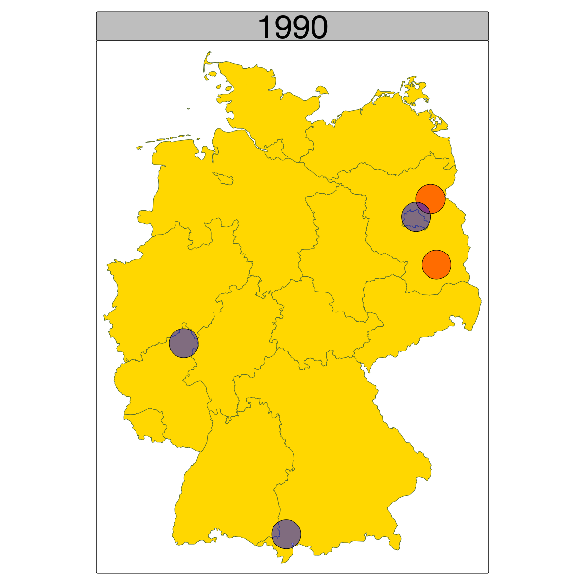

# Opening notes {background-color="#2c844c"}

::: {.tenor-gif-embed data-postid="14209777" data-share-method="host" data-aspect-ratio="1.94" data-width="70%"}
<div class="tenor-gif-embed" data-postid="14209777" data-share-method="host" data-aspect-ratio="1.94" data-width="100%"><a href="https://tenor.com/view/open-gif-14209777">Open Sticker</a>from <a href="https://tenor.com/search/open-stickers">Open Stickers</a></div> <script type="text/javascript" async src="https://tenor.com/embed.js"></script> 
:::

```{=html}
<script type="text/javascript" async src="https://tenor.com/embed.js"></script>
```

- **short synopsis** for final essay due **Friday (17 January)** (send to me via email)
- 29 January: pre-Klausur review (incl. important course content and how to structure an exam essay)

<!-- ## Presentation groups -->

<!-- ::: panel-tabset -->
<!-- ## December -->

<!-- | Date    | Presenters                       | Method | -->
<!-- | -------:|:---------------------------------|:------:| -->
<!-- | 4 Dec:  | Shahadaan, Kristine, Daichi      | ethnography |  -->
<!-- | 11 Dec: | Bérénice, Zorka, Victoria, Katharina | content analysis | -->
<!-- | 18 Dec: | Shoam, Aidan, Tara, Sebastian    | QCA |  -->

<!-- : Presentations line-up -->

<!-- ## January -->

<!-- | Date    | Presenters                       | Method | -->
<!-- | -------:|:---------------------------------|:------:| -->
<!-- | 8 Jan:  |                                  | TBD    |  -->
<!-- | 15 Jan: |                                  | TBD    |  -->
<!-- | 22 Jan: |                                  | TBD    |  -->
<!-- | 29 Jan: |                                  | TBD    |  -->

<!-- : Presentations line-up -->

<!-- ::: -->

<!-- []{style="font-size:10px;"} -->

<!-- NEXT WEEK: ALLOW TIME AT START FOR COURSE FEEDBACK -->
<!-- For a course on 'political violence' and a class on 'state responses: policies', can you suggest some discussion questions to ask students? Ideally, the questions should have multiple choice responses, or yes/no/maybe responses, or strongly agree/agree/disagree/strongly disagree responses, or short-answer (i.e., one or two words should suffice) responses? -->

<!-- SHORT ANSWER -->
<!-- What is the biggest obstacle to successful reintegration? -->
<!-- (e.g., stigma, monitoring, employment) -->
<!-- What type of support matters most during disengagement? -->
<!-- (e.g., family, jobs, mentorship) -->
<!-- what should be the primary priority of counter-extremism policy? -->
<!-- (One or two words: prevention, protection, rehabilitation, deterrence, etc.) -->
<!-- What is one non-repressive strategy that states can use to address political violence? -->

<!-- Do you believe that addressing economic inequality through social welfare programs and progressive taxation is an effective long-term strategy to prevent political violence? -->
<!-- strongly agree/agree/disagree/strongly disagree -->

<!-- In situations where political violence is rooted in ethnic or sectarian conflict, which policy approach do you think is most likely to foster lasting peace? -->
<!-- A. Power-sharing arrangements and inclusive governance -->
<!-- B. Truth and reconciliation commissions -->
<!-- C. Establishing amnesty programs for former combatants -->
<!-- D. Creating national dialogue forums that involve all stakeholders -->
<!-- E. Other -->

<!-- Do you think that criminalizing hate speech and political incitement through new laws can prevent the escalation of political violence? -->
<!-- yes/no/maybe -->

<!-- Which of the following policy measures do you think is most effective in preventing radicalization and violent extremism? -->
<!-- A. Community-based programs aimed at de-radicalizing individuals -->
<!-- B. Interventions that provide economic opportunities to at-risk youth -->
<!-- C. Educational reforms that emphasize tolerance and pluralism -->
<!-- D. Restricting access to extremist content online -->

<!-- Do you think that de-radicalisation programs (e.g., rehabilitation of former extremists) are more successful than punitive measures (e.g., imprisonment) in preventing future political violence? -->
<!-- yes/no/maybe -->

<!-- Which approach is most likely to succeed in long-term disengagement? -->
<!-- A. Ideological re-education (deradicalisation) -->
<!-- B. Vocational training (functional reintegration)  -->
<!-- C. social support (social reintegration) -->
<!-- D. (longer) prison sentences (disengagement) -->

<!-- Should participation in de-radicalisation programmes be mandatory for terrorism-related offenders/referrals? -->
<!-- yes/no/maybe -->

<!-- Should states fund religious or ideological mentors as part of counter-extremism policy? -->
<!-- yes/no/maybe -->

<!-- De-radicalisation programmes are more effective when delivered by trusted community actors rather than by state officials. -->
<!-- strongly agree/agree/disagree/strongly disagree -->


# State policy responses {background-color="#2c844c"}

:::: {.columns}
:::{.column width="50%"}
- What options/possibilities are there
- One policy example 
- deradicalisation programmes
    + @membrives2022CounteringViolentExtremism

:::

::: {.column width="50%"}
<div class="tenor-gif-embed" data-postid="13864082" data-share-method="host" data-aspect-ratio="1.77778" data-width="100%"><a href="https://tenor.com/view/they-can-reform-their-policies-make-changes-address-a-problem-improvement-amendment-gif-13864082">They Can Reform Their Policies Make Changes GIF</a>from <a href="https://tenor.com/search/they+can+reform+their+policies-gifs">They Can Reform Their Policies GIFs</a></div> <script type="text/javascript" async src="https://tenor.com/embed.js"></script> 
:::
::::

## Starting question 

::: {style="text-align: center;"}
**[What *policies* can states apply to address (potential) political violence? Can we categorise them somehow?]{style="color:indigo; font-size:60px;"}** 
:::

## One policy example 

[Does anyone recognise this site?]{style="color:indigo"}


## One policy example 


- Valley of the Fallen (incl., Catholic basilica), outside Madrid
- monument constructed under Franco, using forced/convict labour
- burial place for Franco (exhumed 24.10.2019) and Primo de Rivera (exhumed 23.4.2023)
- *Ley de Memoria Histórica*: recognises and broadens "the rights and establishes measures in favour of those who suffered persecution or violence during the civil war and the dictatorship."

## Deradicalisation programmes 

- definition: initiatives to help individuals stop extremist [behaviour]{style="color:red"} and abandon extremist [beliefs]{style="color:red"}
- common elements: 
    (i) mixed programme elements 
    (ii) *credible* deradicalisation 
    (iii) post-treatment follow-up
    (iv) create commitments (to family, work, etc.) 
    (v) material inducement (but not relying on this)

## Deradicalisation programme - Indonesia

<!-- Aspect ratios include 1x1, 4x3, 16x9 (the default), and 21x9. -->
<!-- aspect-ratio="21x9"  -->



<!-- <https://www.youtube.com/watch?v=T5WKyn6nQEs> -->

## @membrives2022CounteringViolentExtremism[p. 19] - the aim of derad./exit programmes

> The [Radicalization Awareness Network](https://home-affairs.ec.europa.eu/networks/radicalisation-awareness-network-ran_en) evaluation of exit programs understands that “success for exit programs usually consists of [disengagement]{style="color:darkred;"} (leaving a radical environment and violent behaviour), [deradicalization]{style="color:darkred;"} (leaving a radical ideology), [functional integration]{style="color:darkred;"} (such as housing, employment and health care) and [social reintegration]{style="color:darkred;"} (family, friends, community) in the long term.

## @membrives2022CounteringViolentExtremism - research approach

- RQ: what are the challenges of intervening with juvenile offenders involved in terrorism?

. . . 

- [cases]{style="color:blue;"}: five radicalized minors from Spain who were convicted of membership of a jihadist terrorist organisation, now engaged in derad. programmes
- data: semi-structured [interviews]{style="color:blue;"}
- [four stages of intervention]{style="color:red;"} 
    1. evaluation of the youths’ risks and needs
    2. hypothesis formulation of each individual case
    3. design and implementation of objectives, actions, and activities
    4. final evaluation

## @membrives2022CounteringViolentExtremism - initial risk evaluation

::: {style="margin-top: -20px;"} 

[what do you think of these 'factors' for assessing risk?]{style="color:indigo;"} 

::: 

::: {style="margin-top: -30px;"} 

```{r}
library(dplyr)
library(kableExtra)

data <- data.frame(
  Factor = c(
    "1. Past and present offenses and sentences",
    "2. educational guidelines in family environment",
    "3. formal education/ employment",
    "4. relationship with peer group",
    "5. Substance misuse",
    "6. leisure/hobbies",
    "7. Personality/ behavior",
    "8. Attitudes, values, and beliefs",
    "General risk level",
    "",
    ""),
  Nadia = c("low", "moderate", "high", "moderate", "low", "high", "moderate", "moderate", 21, "from moderate (9–22) to very high", ""),
  Oscar = c("low", "moderate", "moderate", "high", "moderate", "high", "moderate", "high", 22, "from moderate (9–22) to very high", ""),
  Dafya = c("low", "low", "moderate", "low", "low", "moderate", "moderate", "moderate", 5, "from low (0–8) to moderate", ""),
  Thamir = c("low", "moderate", "low", "high", "low*", "high", "moderate", "high", 19, "from moderate (9–22) to very high", ""),
  Caleb = c("low", "moderate", "low", "high", "low*", "high", "moderate", "high", 18, "from moderate (9–22) to very high", "")
)

kable(data, "html", col.names = c("Factor", "Nadia", "Oscar", "Dafya", "Thamir", "Caleb")) %>%
  kable_styling(font_size = 23) %>%
  column_spec(1, width = "9cm") %>%
  column_spec(2:6, width = "2.5cm")
```

:::

## @membrives2022CounteringViolentExtremism - activities {.scrollable}

::: {style="margin-top: -20px;"} 

[why these activities for a derad. programme? what's the reasoning? do you think it would be effective?]{style="color:indigo;"} 

::: 

::: {style="margin-top: -30px;"} 

```{r}
data <- data.frame(
  Area = c("formative", 
           "formative", 
           "formative", 
           "Pre-work", 
           "Pre-work", 
           "Pre-work", 
           "Pre-work", 
           "Pre-work", 
           "Personal development and social competence", 
           "Personal development and social competence", 
           "Personal development and social competence", 
           "Personal development and social competence", 
           "Personal development and social competence", 
           "occupational workshop", 
           "occupational workshop", 
           "leisure and free time", 
           "leisure and free time", 
           "leisure and free time", 
           "leisure and free time"),
  Activity = c("School classroom at the Center", 
               "School support and encouragement for reading", 
               "Vocational training", 
               "Book binding", 
               "restoration", 
               "pottery", 
               "modeling, sculpture, decoration", 
               "handcrafted wood turning", 
               "Central educational and therapeutic treatment Program for Young offenders", 
               "Program on Personal development and Social Competence", 
               "Program on Personal development and Civic-ethic education", 
               "Program on Preparation for an independent life", 
               "Workshop on equal opportunities", 
               "dance workshop", 
               "Painting on canvas, decoration, models", 
               "Sports", 
               "Video-forum", 
               "Group leisure", 
               "individual leisure"),
  Nadia = c("X", "", "", "X", "X", "X", "", "", "X", "X", "X", "", "X", "X", "X", "X", "X", "X", "X"),
  Oscar = c("X", "", "", "X", "X",  "", "", "", "X", "X", "X","X",  "",  "", "X", "X", "X", "X", "X"),
  Dafya = c("X","X","X",  "",  "",  "","X", "", "X", "X", "X", "", "X",  "", "X", "X", "X", "X", "X"),
  Thamir =c("X", "", "", "X",  "",  "", "","X", "X", "X", "X", "", "X",  "", "X", "X", "X", "X", "X"),
  Caleb = c("X","X", "",  "", "X",  "","X","X", "X", "X", "X", "",  "",  "", "X", "X", "X", "X", "X")
)

# Create the table using kable for HTML output
kable(data, format = "html", col.names = c("Area", "Activity", "Nadia", "Oscar", "Dafya", "Thamir", "Caleb"), 
      # caption = "Activity and Participation by Area and Person", 
      escape = FALSE) %>% 
  kable_styling(font_size = 21) # %>%
  # column_spec(1, width = "9cm") %>%
  # column_spec(2:6, width = "2.5cm")

```

::: 

## @membrives2022CounteringViolentExtremism - activities rated according to

**activities rated according to**...

1. **[Implementation]{style="color:violet;"}**: efforts have been made by the practitioners who remain awaiting the assimilation and response by the minor; 

2. **[Development]{style="color:cadetblue;"}**: the minor has assimilated ideas and has begun to respond making some efforts; 

3. **[Reinforcement]{style="color:forestgreen;"}**: the minor has made considerable progress, but it is necessary to continue supervising him/her; 

4. **[Finalized]{style="color:goldenrod;"}**: the minor has met the objective; 

5. **[Interrupted]{style="color:brown;"}**: it has not been possible to work on the objective and/or activity.

## @membrives2022CounteringViolentExtremism - takeaways

1. Traditional objectives of [criminal justice must give way to rehabilitation and restorative justice]{style="color:darkorange;"} objectives when dealing [with minors]{style="color:darkorange;"}. 
    + **[do you agree or disagree? This is an ongoing debate in public policy]{style="color:indigo;"}**

. . . 

2. The Spanish judicial framework provides the framework for the judicial response against offences committed by youths in Spain, with the [guiding principles of any intervention being its sanctioning-educational nature and the superior interest of the minor]{style="color:darkorange;"}.

<!-- ## another policy example -->

<!-- Ongoing project: **D.Rad** is a comparative study of radicalisation and polarisation in Europe and beyond, aiming at *measurable evaluations of de-radicalisation programmes*. -->


<!-- - art programme: <https://www.youtube.com/watch?v=aWW2VlV3ed4> -->

# Poll: state policies {background-color="#2c844c"}

:::: {.columns}
:::{.column width="35%"}
{fig-alt="A QR code for the survey."}

:::

::: {.column width="65%" .center}
<!-- go to <https://www.qr-code-generator.com/>, add the link, and screen shot the QR code -->
Take the survey at **<https://forms.gle/WskY6kmGLEjXvo586>**

- policy approach to pacify ethnic/sectarian conflict?
- de-radicalisation programmes more successful than punishment?
- criminalising hate speech and incitement? 

:::
:::: 

::: {style="margin-top: -40px;"} 
- most important support during *disengagement*?
- effective policy measures preventing radicalisation?
- participation in de-radicalisation programmes be mandatory?
- should states fund religious or ideological mentors? 
::: 

--- 

```{ojs}
md`## Poll results (Respondents: ${respondentCount})`
```


```{ojs}

import { liveGoogleSheet } from "@jimjamslam/live-google-sheet";
import { aq, op } from "@uwdata/arquero";

// UPDATE THE LINK FOR A NEW POLL
surveyResults = liveGoogleSheet(
  "https://docs.google.com/spreadsheets/d/e/" +
    "2PACX-1vSPyp6CIK_YgBLLJa_9102x68NIz6cjOfC67UTad0alyXY6cngKS6fOdxzh4zAG4WV0YtHx7_P8eZ34/" +
    "pub?gid=1695767618&single=true&output=csv",
  10000, 1, 8); // adjust the last number to select all relevant columns 

respondentCount = surveyResults.length;

```

<!-- Where political violence is rooted in ethnic or sectarian conflict, which policy approach do you think is most likely to foster lasting peace?  -->
<!-- - amnesty; power-sharing governance; reconciliation commissions; intergroup dialogue; other -->

<!-- Do you think that de-radicalisation programmes are more successful than punitive measures (e.g., imprisonment) in preventing future political violence?  -->
<!-- - yes/no/maybe  -->

<!-- What type of support matters most during disengagement?  -->
<!-- - family, employment, mentorship, education, other -->

<!-- Which policy measures is most effective in preventing radicalisation? -->
<!-- - community social programmes; job opportunities; programmes on tolerance; restricting extreme content; other -->

<!-- Criminalising hate speech and incitement through new laws can curb political violence. -->
<!-- - strongly agree/agree/disagree/strongly disagree -->

<!-- Should participation in de-radicalisation programmes be mandatory for terrorism-related offenders/referrals?  -->
<!-- - yes/no/maybe  -->

<!-- Should states fund religious or ideological mentors as part of counter-extremism policy? -->
<!-- - yes/no/maybe  -->

policy approach to pacify ethnic/sectarian conflict?

```{ojs}
lasting_peaceCounts = aq.from(surveyResults)
  .select("lasting_peace")
  .groupby("lasting_peace")
  .count()
  .derive({ measure: d => "" })

// Calculate the maximum count from your dataset
lasting_peace_maxCountRE = Math.max(...lasting_peaceCounts.objects().map(d => d.count));

plot_lasting_peace = Plot.plot({
  marks: [
    Plot.barY(lasting_peaceCounts, {
      x: "lasting_peace",
      y: "count",
      fill: "lasting_peace",
      stroke: "black",
      strokeWidth: 1
    }),
    Plot.ruleY([respondentCount], { stroke: "#ffffff99" })
  ],
  color: {
    domain: [
      "amnesty",
      "power-sharing governance",
      "reconciliation commissions",
      "intergroup dialogue",
      "other"
    ],
    range: [
      "indigo",
      "goldenrod",
      "cadetblue",
      "forestgreen",
      "violet"
    ]
  },
  marginBottom: 500,
  x: { label: "", tickSize: 2, tickRotate: -60, padding: 0.2,
    domain: ["amnesty","power-sharing governance","reconciliation commissions","intergroup dialogue", "other"]
  },  
  y: {
    label: "",
    tickSize: 10,
    tickFormat: d => d,
    tickValues: Array.from(
      new Set(lasting_peaceCounts.objects().map(d => d.count))
    ).sort((a, b) => a - b),
    domain: [0, lasting_peace_maxCountRE]
  },
  facet: { data: lasting_peaceCounts, x: "measure", label: "" },
  marginLeft: 60,
  style: {
    width: 1600,
    height: 500,
    fontSize: 40,
  },
});

```
 

## Poll results: state policy responses 

:::: {.columns}
:::{.column width="50%"}
de-radicalisation programmes more successful than punishment?

```{ojs}
derad_successCounts = aq.from(surveyResults)
  .select("derad_success")
  .groupby("derad_success")
  .count()
  .derive({ measure: d => "" })

// Calculate the maximum count from your dataset
derad_success_maxCountRE = Math.max(...derad_successCounts.objects().map(d => d.count));

plot_derad_success = Plot.plot({
  marks: [
    Plot.barY(derad_successCounts, {
      x: "derad_success",
      y: "count",
      fill: "derad_success",
      stroke: "black",
      strokeWidth: 1
    }),
    Plot.ruleY([respondentCount], { stroke: "#ffffff99" })
  ],
  color: {
    domain: [
      "Yes",
      "No",
      "Maybe"
    ],
    range: [
      "forestgreen",
      "darkred",
      "goldenrod"
    ]
  },
  marginBottom: 80,
  x: { label: "", tickSize: 2, tickRotate: -1, padding: 0.2,
    domain: ["Yes", "No", "Maybe"]
  },  
  y: {
    label: "",
    tickSize: 10,
    tickFormat: d => d,
    tickValues: Array.from(
      new Set(derad_successCounts.objects().map(d => d.count))
    ).sort((a, b) => a - b),
    domain: [0, derad_success_maxCountRE]
  },
  facet: { data: derad_successCounts, x: "measure", label: "" },
  marginLeft: 60,
  style: {
    width: 1600,
    height: 500,
    fontSize: 40,
  },
});

```

:::

::: {.column width="50%"}
most important support during *disengagement*?

```{ojs}
disengage_supportCounts = aq.from(surveyResults)
  .select("disengage_support")
  .groupby("disengage_support")
  .count()
  .derive({ measure: d => "" })

// Calculate the maximum count from your dataset
disengage_support_maxCountRE = Math.max(...disengage_supportCounts.objects().map(d => d.count));

plot_disengage_support = Plot.plot({
  marks: [
    Plot.barY(disengage_supportCounts, {
      x: "disengage_support",
      y: "count",
      fill: "disengage_support",
      stroke: "black",
      strokeWidth: 1
    }),
    Plot.ruleY([respondentCount], { stroke: "#ffffff99" })
  ],
  color: {
    domain: [
      "education",
      "employment",
      "family",
      "mentorship",
      "other"
    ],
    range: [
      "indigo",
      "goldenrod",
      "cadetblue",
      "forestgreen",
      "violet"
    ]
  },
  marginBottom: 500,
  x: { label: "", tickSize: 2, tickRotate: -60, padding: 0.2,
    domain: ["education", "employment", "family", "mentorship", "other"]
  },  
  y: {
    label: "",
    tickSize: 10,
    tickFormat: d => d,
    tickValues: Array.from(
      new Set(disengage_supportCounts.objects().map(d => d.count))
    ).sort((a, b) => a - b),
    domain: [0, disengage_support_maxCountRE]
  },
  facet: { data: disengage_supportCounts, x: "measure", label: "" },
  marginLeft: 60,
  style: {
    width: 1600,
    height: 500,
    fontSize: 40,
  },
});

```
 
:::
::::

## Poll results: state policy responses 

:::: {.columns}
:::{.column width="50%"}
effective policy measures preventing radicalisation?

```{ojs}
preventing_radCounts = aq.from(surveyResults)
  .select("preventing_rad")
  .groupby("preventing_rad")
  .count()
  .derive({ measure: d => "" })

// Calculate the maximum count from your dataset
preventing_rad_maxCountRE = Math.max(...preventing_radCounts.objects().map(d => d.count));

plot_preventing_rad = Plot.plot({
  marks: [
    Plot.barY(preventing_radCounts, {
      x: "preventing_rad",
      y: "count",
      fill: "preventing_rad",
      stroke: "black",
      strokeWidth: 1
    }),
    Plot.ruleY([respondentCount], { stroke: "#ffffff99" })
  ],
  color: {
    domain: [
      "community social programmes", 
      "job opportunities", 
      "programmes on tolerance", 
      "restricting extreme content",
      "other"
    ],
    range: [
      "indigo",
      "goldenrod",
      "cadetblue",
      "forestgreen",
      "violet"
    ]
  },
  marginBottom: 500,
  x: { label: "", tickSize: 2, tickRotate: -60, padding: 0.2,
    domain: ["community social programmes", "job opportunities", "programmes on tolerance", "restricting extreme content", "other"]
  },  
  y: {
    label: "",
    tickSize: 10,
    tickFormat: d => d,
    tickValues: Array.from(
      new Set(preventing_radCounts.objects().map(d => d.count))
    ).sort((a, b) => a - b),
    domain: [0, preventing_rad_maxCountRE]
  },
  facet: { data: preventing_radCounts, x: "measure", label: "" },
  marginLeft: 60,
  style: {
    width: 1600,
    height: 500,
    fontSize: 40,
  },
});

```

:::

::: {.column width="50%"}
criminalising hate speech and incitement? 

```{ojs}
hate_speechCounts = aq.from(surveyResults)
  .select("hate_speech")
  .groupby("hate_speech")
  .count()
  .derive({ measure: d => "" })

// Calculate the maximum count from your dataset
hate_speech_maxCountRE = Math.max(...hate_speechCounts.objects().map(d => d.count));

plot_hate_speech = Plot.plot({
  marks: [
    Plot.barY(hate_speechCounts, {
      x: "hate_speech",
      y: "count",
      fill: "hate_speech",
      stroke: "black",
      strokeWidth: 1
    }),
    Plot.ruleY([respondentCount], { stroke: "#ffffff99" })
  ],
  color: {
    domain: [
      "Strongly disagree",
      "Disagree",
      "Neutral",
      "Agree",
      "Strongly agree"
    ],
    range: [
      "red",
      "pink",
      "lightgrey",
      "lightgreen",
      "forestgreen"
    ]
  },
  marginBottom: 180,
  x: { label: "", tickSize: 2, tickRotate: -45,
    domain: ["Strongly disagree", "Disagree", "Neutral", "Agree", "Strongly agree"]
  },  
  y: {
    label: "",
    tickSize: 10,
    tickFormat: d => d,
    tickValues: Array.from(
      new Set(hate_speechCounts.objects().map(d => d.count))
    ).sort((a, b) => a - b),
    domain: [0, hate_speech_maxCountRE]
  },
  facet: { data: hate_speechCounts, x: "measure", label: "" },
  marginLeft: 140,
  style: {
    width: 1350,
    height: 500,
    fontSize: 30,
  }
});

```

:::
::::

## Poll results: state policy responses 

:::: {.columns}
:::{.column width="50%"}
participation in de-radicalisation programmes be mandatory? 

```{ojs}
mandatory_deradCounts = aq.from(surveyResults)
  .select("mandatory_derad")
  .groupby("mandatory_derad")
  .count()
  .derive({ measure: d => "" })

// Calculate the maximum count from your dataset
mandatory_derad_maxCountRE = Math.max(...mandatory_deradCounts.objects().map(d => d.count));

plot_mandatory_derad = Plot.plot({
  marks: [
    Plot.barY(mandatory_deradCounts, {
      x: "mandatory_derad",
      y: "count",
      fill: "mandatory_derad",
      stroke: "black",
      strokeWidth: 1
    }),
    Plot.ruleY([respondentCount], { stroke: "#ffffff99" })
  ],
  color: {
    domain: [
      "Yes",
      "No",
      "Maybe"
    ],
    range: [
      "forestgreen",
      "darkred",
      "goldenrod"
    ]
  },
  marginBottom: 80,
  x: { label: "", tickSize: 2, tickRotate: -1, padding: 0.2,
    domain: ["Yes", "No", "Maybe"]
  },  
  y: {
    label: "",
    tickSize: 10,
    tickFormat: d => d,
    tickValues: Array.from(
      new Set(mandatory_deradCounts.objects().map(d => d.count))
    ).sort((a, b) => a - b),
    domain: [0, mandatory_derad_maxCountRE]
  },
  facet: { data: mandatory_deradCounts, x: "measure", label: "" },
  marginLeft: 60,
  style: {
    width: 1600,
    height: 500,
    fontSize: 40,
  },
});

```

:::

::: {.column width="50%"}
should states fund religious or ideological mentors?

```{ojs}
mentorsCounts = aq.from(surveyResults)
  .select("mentors")
  .groupby("mentors")
  .count()
  .derive({ measure: d => "" })

// Calculate the maximum count from your dataset
mentors_maxCountRE = Math.max(...mentorsCounts.objects().map(d => d.count));

plot_mentors = Plot.plot({
  marks: [
    Plot.barY(mentorsCounts, {
      x: "mentors",
      y: "count",
      fill: "mentors",
      stroke: "black",
      strokeWidth: 1
    }),
    Plot.ruleY([respondentCount], { stroke: "#ffffff99" })
  ],
  color: {
    domain: [
      "Yes",
      "No",
      "Maybe"
    ],
    range: [
      "forestgreen",
      "darkred",
      "goldenrod"
    ]
  },
  marginBottom: 80,
  x: { label: "", tickSize: 2, tickRotate: -1, padding: 0.2,
    domain: ["Yes", "No", "Maybe"]
  },  
  y: {
    label: "",
    tickSize: 10,
    tickFormat: d => d,
    tickValues: Array.from(
      new Set(mentorsCounts.objects().map(d => d.count))
    ).sort((a, b) => a - b),
    domain: [0, mentors_maxCountRE]
  },
  facet: { data: mentorsCounts, x: "measure", label: "" },
  marginLeft: 60,
  style: {
    width: 1600,
    height: 500,
    fontSize: 40,
  },
});

```

:::
::::

# criminal justice responses {background-color="#2c844c"}

:::: {.columns}
:::{.column width="50%"}
- criminal justice responses to political violence 
- @Koehler2019 - Violence and Terrorism from the Far-Right: Policy Options to Counter an Elusive Threat

:::

::: {.column width="50%"}
<div class="tenor-gif-embed" data-postid="15710318" data-share-method="host" data-aspect-ratio="1.47465" data-width="100%"><a href="https://tenor.com/view/remember-the-titans-cruel-and-unusual-punishment-earl-c-poitier-gif-15710318">Remember The Titans Cruel And Unusual Punishment GIF</a>from <a href="https://tenor.com/search/remember+the+titans-gifs">Remember The Titans GIFs</a></div> <script type="text/javascript" async src="https://tenor.com/embed.js"></script> 
:::
::::

## criminal justice responses to political violence - an example [@TaylorSuliman2021-1-21]

- 21-years-old British man, Ben John, with neo-Nazi sympathies
- collected extremist documents (including a book that contains bomb-making instructions, illegal in the UK) on computer <!-- Anarchist Cookbook -->
    + possessing information likely to be useful for preparing an act of terrorism, punishable by up to 15 years in prison under Section 58 of UK’s Terrorism Act


::: {style="margin-top: -40px;"} 
[recommended sentencing? what do you think?]{style="color:indigo;"} (keeping in mind British judges have lots of leeway with sentencing)
:::

. . . 

- sentenced by judge to read works of great literature by Jane Austen, William Shakespeare, Thomas Hardy and Charles Dickens
- appeals court overturns ruling, sentenced to two years in prison

## @Koehler2019 - EU context

**[Comparing right-wing extremist terrorism to other forms]{style="font-size:50px;"}**

> [Even though the number of arrests related to right-wing extremist terrorism within the European Union almost doubled to **[20 in 2017 from 12 in 2016]{style="color:red;"}**, it pales in comparison to other forms of political violence, at least in terms of numbers (e.g. **[705 jihadists in 2017]{style="color:red;"}**).]{style="font-size:50px;"}

```{r out.width='100%'}
library(reshape2)
library(ggplot2)
library(wesanderson)

df <- data.frame(
  year = c(2001:2021),
  explosive = c(1,0,0,2,3,1,1,0,0,2,0,1,2,6,18,10,5,0,2,2,1), #Herbeiführen einer Sprengstoffexplosion
  arson = c(16,20,24,37,14,18,24,29,18,29,20,21,11,21,99,113,42,11,6,25,11), #Brandstiftungen
  gesamt = c(980,940,845,832,1034,1115,1054,1113,959,806,828,842,837,1029,1485,1600,1054,1088,925,1023,945), 
  open129 = c(2,1,4,1,1,3,3,1,0,0,1,15,2,2,1,4,6,4,16,1,"-"), #129(a, b)
  closed129 = c(1,2,0,0,0,2,2,3,1,0,0,0,0,2,0,0,0,0,0,0,"-"),
  charged129 = c(0,0,1,0,0,0,0,0,0,0,0,1,0,0,1,1,0,0,1,1,"-"),
  verdict129 = c(1,0,3,0,2,0,0,0,0,0,0,0,0,0,0,0,0,2,3,1,"-")
)

# SEE ANSWERS TO 12, SUBQUESTIONS 1a, 3, 4, 6
# 2018 on 129: https://dserver.bundestag.de/btd/19/097/1909773.pdf
# 2019 on 129: https://dserver.bundestag.de/btd/19/192/1919232.pdf
# 2020 on 129: https://dserver.bundestag.de/btd/19/291/1929128.pdf
# 2021 on 129: 

dfx = subset(df, select = c(year,explosive,arson))
df_melt <- melt(dfx, id="year")
df_melt$gesamt <- df$gesamt

k <- ggplot(df_melt, aes(x=year))+
  geom_col(aes(y=value,fill=variable), position="dodge",colour="black")+
  scale_fill_manual("", values= wes_palette("Darjeeling1", n = 2))+
  geom_point(aes(y=gesamt/12))+
  geom_line(aes(y=gesamt/12))+
  theme_bw()+
  scale_x_continuous("", breaks=seq(2001,2021,1),minor_breaks=seq(2001,2021,1)) +
  scale_y_continuous("(bars)", breaks = seq(0,130,10), sec.axis = sec_axis(~ . * 12, name = "(line) RWE violent crimes", breaks = seq(0,1700,100)))+
  theme(axis.text.x = element_text(angle = 90, vjust = 0.5, hjust=1))+
  theme(legend.position = "bottom")+
  theme(text = element_text(size = 25))+
  theme(legend.position = c(0.25,0.85))

dfz <- subset(df, select = c(year, open129, closed129, charged129, verdict129))
dfz <- subset(dfz, year < 2021)
dfz_melt <- melt(dfz, id="year")
dfz_melt$value <- as.numeric(dfz_melt$value)
```

## @Koehler2019 - focusing in on Germany

```{r k, out.width='100%'}
k
```

RWE explosives & arson crimes (bars); all RWE violent crimes (line)

[Looking at ... explosives attacks or arson, crimes usually but not always (legally) framed as terrorism, statistics from Germany indicate a surge during the so-called “refugee crisis” between 2015 and 2016. ...]{style="font-size:20px;"}

## @Koehler2019 - focusing in on Germany, homicides

Recognised by BRD vs. identified by [Amadeu Antonio Stiftung](https://www.amadeu-antonio-stiftung.de/todesopfer-rechter-gewalt/)

```{r}
library(rvest)
library(stringr)
library(dplyr)
library(magrittr)
library(httr)
library(lubridate)

# scraping data -----------------------------------------------------------

# links to news stories

# LINK <- read_html("https://www.amadeu-antonio-stiftung.de/todesopfer-rechter-gewalt/") %>% 
#   html_nodes("#main .text-grey-light a") %>% 
#   html_attr("href")
# 
# DATE <- read_html("https://www.amadeu-antonio-stiftung.de/todesopfer-rechter-gewalt/") %>% 
#   html_nodes(".bigdate") %>% 
#   html_text()
# 
# DATE <- dmy(DATE)
# 
# YEAR <- format(DATE, format="%Y")
# 
# VICTIM <- read_html("https://www.amadeu-antonio-stiftung.de/todesopfer-rechter-gewalt/") %>% 
#   html_nodes("#main .no-underline") %>% 
#   html_text()
# VICTIM <- VICTIM[1:237]
# 
# AGE <- read_html("https://www.amadeu-antonio-stiftung.de/todesopfer-rechter-gewalt/") %>% 
#   html_nodes(".md\\:block:nth-child(3)") %>% 
#   html_text()
# # 27.07.2000 - no age; 04.04.1992 - no age
# AGE <- append(AGE, "46", after = 24)
# AGE <- append(AGE, "0", after = 130)
# AGE <- AGE[1:237]
# AGE <- gsub(" Jahre","",as.character(AGE))
# AGE <- gsub("13 Monate","1",as.character(AGE))
# 
# LOCATION <- read_html("https://www.amadeu-antonio-stiftung.de/todesopfer-rechter-gewalt/") %>% 
#   html_nodes(".mt-2.md\\:block") %>% 
#   html_text()
# 
# LAND <- regmatches(LOCATION, gregexpr( "(?<=\\().+?(?=\\))", LOCATION, perl = T))
# LAND <- str_remove_all(LAND, "Saale")
# 
# OFFICIAL <- c(F,T,F,T,F,F,F,T,F,T,T,T,F,T,T,F,F,F,F,F,F,T,T,T,F,T,T,T,T,F,F,F,T,T,T,T,F,T,T,T,T,F,F,T,F,T,T,F,F,T,F,T,T,T,T,T,T,F,F,F,T,F,F,F,F,T,F,F,F,F,F,F,T,F,F,F,F,F,F,F,F,F,F,F,F,T,T,T,F,F,F,T,T,F,T,T,T,F,F,T,F,T,F,F,F,T,T,T,F,T,T,T,T,T,F,F,F,F,T,F,F,T,T,T,F,F,F,F,F,T,F,T,T,T,T,F,F,F,F,T,T,T,F,F,T,F,T,F,F,F,T,F,F,F,F,F,F,F,T,T,T,T,F,F,F,F,F,F,F,T,F,F,T,T,F,F,T,T,F,F,T,F,F,F,T,F,T,F,F,T,F,T,F,F,F,F,T,F,F,F,T,F,F,T,T,T,T,T,T,T,T,T,F,T,T,F,T,F,T,T,T,F,T,T,T,T,T,T,T,T,T,F,F,T,T,T,T)
# 
# COUNTRYCODE <- rep("DE",237)
# 
# df <- data.frame(YEAR, DATE, LOCATION, LAND, VICTIM, AGE, OFFICIAL, COUNTRYCODE, LINK)
# df$AGE <- as.numeric(df$AGE)
# 
# df[119, 4] = "Sachsen-Anhalt"
# df[220, 4] = "Sachsen-Anhalt"
# df[221, 4] = "Sachsen-Anhalt"
# 
# df$LOCATION <- gsub("\\s*\\([^\\)]+\\)","",as.character(df$LOCATION))
# 
# dfOFFIC <- subset(df, OFFICIAL == T)
# rownames(dfOFFIC) = seq(length=nrow(dfOFFIC))

df <- read.csv("slide_files/11/FR_homicides2023-01-20.csv", row.names=1, header = TRUE)

dfUNOFFIC <- subset(df, OFFICIAL == F)
rownames(dfUNOFFIC) = seq(length=nrow(dfUNOFFIC))

dfOFFIC <- subset(df, OFFICIAL == T)
rownames(dfOFFIC) = seq(length=nrow(dfOFFIC))

dfplot <- df %>% 
  group_by(YEAR) %>% 
  summarise(DEATHS = length(YEAR))
dfplot$YEAR <- as.numeric(dfplot$YEAR)
dfplot$DEATHS <- as.numeric(dfplot$DEATHS)

dfplotofficial <- dfOFFIC %>% 
  group_by(YEAR) %>% 
  summarise(OFFICIAL = length(YEAR))
dfplotofficial$YEAR <- as.numeric(dfplotofficial$YEAR)
dfplotofficial$OFFICIAL <- as.numeric(dfplotofficial$OFFICIAL)


dfX <- merge(dfplot, dfplotofficial, by=c("YEAR"), all = TRUE)
dfX[is.na(dfX)] <- 0

library(ggplot2)
library(reshape2)

a <- ggplot(dfX, aes(x=YEAR))+
  geom_col(aes(y=DEATHS), colour = "black", fill = "grey60", width = 1)+
  geom_col(aes(y=OFFICIAL), colour = "black", fill = "black", width = 0.5)+
  scale_x_continuous("", breaks = seq(1990,2021,1))+
  scale_y_continuous("Deaths", breaks = seq(0,30,5), minor_breaks = seq(0,30,1), limits = c(0,30))+
  theme_bw()+
  theme(text = element_text(size=15), axis.text.x = element_text(angle = 90, vjust = 0.5, hjust=1))
a

# df_melt <- melt(dfX, id="YEAR")
# 
# b <- ggplot(df_melt, aes(x = YEAR, y = value, fill = variable)) +
#   geom_col(position = "dodge", colour = "black", width = 0.8) +
#   scale_y_continuous("Deaths", breaks = seq(0,30,5), minor_breaks = seq(0,30,1), limits = c(0,30))+
#   scale_fill_manual("", values=c("grey60","black")) + # "Darjeeling1", n = 4)
#   scale_x_continuous("", breaks = seq(1990,2021,1), minor_breaks = seq(1990,2021,1))+
#   theme_bw()+
#   theme(text = element_text(size=15), axis.text.x = element_text(angle = 90, vjust = 0.5, hjust=1))+
#   theme(legend.position = c(0.6, 0.8),
#         text = element_text(size=15),
#         legend.title=element_blank(),
#         legend.box.background = element_rect(colour = "black"))
# b
```

## @Koehler2019 - focusing in on Germany, homicides


```{r out.width='110%'}
# map plot -------------------------------------------

# SOURCE DATA AND VISUALISATIONS
# - https://www.amadeu-antonio-stiftung.de/todesopfer-rechter-gewalt/
# - https://de.wikipedia.org/wiki/Todesopfer_rechtsextremer_Gewalt_in_der_Bundesrepublik_Deutschland
# - https://www.zeit.de/gesellschaft/zeitgeschehen/2018-09/todesopfer-rechte-gewalt-karte-portraet
# - https://www.zeit.de/gesellschaft/zeitgeschehen/2020-09/rechte-gewalt-todesopfer-bundeskriminalamt-wiedervereinigung/komplettansicht?utm_referrer=https%3A%2F%2Fde.wikipedia.org%2F

library(raster)
library(sf)

# germany <- getData(country = "Germany", level = 1) 
germany <- readRDS("slide_files/11/germany.rds")

## ALTERNATIVE APPROACH USING sf PACKAGE
# germany <- 
#   getData(country = "Germany", level = 1) %>% 
#   st_as_sf() %>% 
#   left_join(dat, by = c("NAME_1" = "Bundesland"))

diff_col2 <- ggplot() +
  geom_polygon(data = germany,
               aes(x = long, y = lat, group = group),
               colour = "black", fill = "grey90") +
  geom_point(data = dfUNOFFIC,
             aes(x = LON, y = LAT),
             position = position_jitter(w = 0.1, h = 0.1),
             shape = 1, size = 3, color = "blue", stroke = 0.8) +
  geom_point(data = dfOFFIC,
             aes(x = LON, y = LAT),
             position = position_jitter(w = 0.1, h = 0.1),
             shape = 1, size = 3, color = "red", stroke = 0.8) +
  coord_map() +
  theme_void() +
  # xlab("Longitude") + ylab("Latitude") +
  theme(legend.position = "none")
# labs(color = 'Record length')

```


```{r}
#| message: false
#| warning: false
#| fig-height: 4
#| fig-width: 4
#| include: false
#| paged-print: false
library(tidyverse)
library(sf)
library(tmap)
library(rnaturalearth)
library(gganimate)
library(gifski)

dfOFFIC$CATEGORY <- "Official"
dfUNOFFIC$CATEGORY <- "Unofficial"

dfALL <- rbind(dfOFFIC, dfUNOFFIC)

dfALLgrouped <- dfALL %>% 
  group_by(YEAR)

dfALLgrouped <- as.data.frame(dfALLgrouped)

dfALLgrouped$Latitude <- dfALLgrouped$LAT
dfALLgrouped$Longitude <- dfALLgrouped$LON

dfALLgrouped$LATjit <- jitter(dfALLgrouped$LAT, factor = 300)
dfALLgrouped$LONjit <- jitter(dfALLgrouped$LON, factor = 300)

dfALLgrouped_sf <- dfALLgrouped %>% drop_na(LAT)

dfALLgrouped_sf <- dfALLgrouped_sf %>% 
  st_as_sf(
    coords = c("LONjit", "LATjit"),
    crs = st_crs("EPSG:32632") # CRS for Germany
  )

DE = ne_states(returnclass = "sf") |>
  filter(admin == "Germany") 

st_crs(dfALLgrouped_sf) <- st_crs(DE)

fr_hom_anim <- tm_shape(DE)+
  tm_polygons(fill="gold", col="darkolivegreen")+
  tm_shape(dfALLgrouped_sf)+
  tm_bubbles(shape=21, size=4, col="CATEGORY", 
             palette = c("Official" = "red","Unofficial" = "blue"),
             scale=8, alpha=0.5, border.col="black")+
  tm_facets(pages="YEAR")+
  tm_layout(legend.show = FALSE,
            panel.label.size = 4, panel.label.color = 'black',
            panel.label.bg.color = 'grey', panel.label.height = 3,
            legend.text.size = 1.5)
tmap_animation(
  fr_hom_anim, filename = "fr_hom_anim.gif",
  delay = 50, width = 1200, height = 1200
)

```

:::: {.columns}
::: {.column width="40%" .right}

``` r 
library(tmap)
library(tidyverse)
library(sf)
library(rnaturalearth)
library(gganimate)
library(gifski)

dfALLgrouped <- dfALL %>% 
  group_by(YEAR)

dfALLgrouped <- as.data.frame(dfALLgrouped)

dfALLgrouped$Latitude <- dfALLgrouped$LAT
dfALLgrouped$Longitude <- dfALLgrouped$LON

dfALLgrouped$LATjit <- jitter(dfALLgrouped$LAT, factor = 300)
dfALLgrouped$LONjit <- jitter(dfALLgrouped$LON, factor = 300)

dfALLgrouped_sf <- dfALLgrouped %>% drop_na(LAT)

dfALLgrouped_sf <- dfALLgrouped_sf %>% 
  st_as_sf(
    coords = c("LONjit", "LATjit"),
    crs = st_crs("EPSG:32632") # CRS for Germany
  )

DE = ne_states(returnclass = "sf") |>
  filter(admin == "Germany") 

st_crs(dfALLgrouped_sf) <- st_crs(DE)

fr_hom_anim <- tm_shape(DE)+
  tm_polygons(fill="gold", col="darkolivegreen")+
  tm_shape(dfALLgrouped_sf)+
  tm_bubbles(shape=21, 
             size=5, 
             col="CATEGORY", 
             palette = c("Official" = "red","Unofficial" = "blue"),
             scale=8, 
             alpha=0.5, 
             border.col="black")+
  tm_facets(pages="YEAR")+
  tm_layout(legend.show = FALSE,
            panel.label.size = 4, 
            panel.label.color = 'black',
            panel.label.bg.color = 'grey', 
            panel.label.height = 3,
            legend.text.size = 1.5)
tmap_animation(
  fr_hom_anim, 
  filename = "fr_hom_anim.gif",
  delay = 50, 
  width = 1200, 
  height = 1200
)

```

[o]{style="color:red;"}: recognised by BRD  
[o]{style="color:blue;"}: identified by Amadeu Antonio Stiftung

:::

:::{.column width="60%"}

{width="800px"}

:::

::::

<!-- ::: -->

<!-- ::: {.column width="40%"} -->

<!-- [o]{style="color:red;"}: officially recognised by BRD -->

<!-- [o]{style="color:blue;"}: identified by Amadeu Antonio Stiftung -->

<!-- data available: <https://michaelzeller.de/data/index_data.html> -->

<!-- ::: -->
<!-- :::: -->


## @Koehler2019 - focusing in on Germany, homicides

```{r}
diff_col2
```


::: {style="margin-top: -40px;"}
[o]{style="color:red;"}: officially recognised by BRD    
[o]{style="color:blue;"}: identified by Amadeu Antonio Stiftung  
<!-- data available: <https://michaelzeller.de/data/index_data.html> -->
:::


```{r eval=FALSE, include=FALSE}
if(!require("ggplot2")) {install.packages("ggplot2"); library("ggplot2")}
if(!require("raster")) {install.packages("raster"); library("raster")}
if(!require("dplyr")) {install.packages("dplyr"); library("dplyr")}
if(!require("sf")) {install.packages("sf"); library("sf")}


dat <- data.frame(Bundesland = c("Baden-Württemberg", "Bayern", "Berlin", 
                                 "Brandenburg", "Bremen", "Hamburg", "Hessen", 
                                 "Mecklenburg-Vorpommern", "Niedersachsen", 
                                 "Nordrhein-Westfalen", "Rheinland-Pfalz", 
                                 "Saarland", "Sachsen", "Sachsen-Anhalt", 
                                 "Schleswig-Holstein", "Thüringen"),
                  Percentage = c(0.056737589,0.113475177,0.063829787,0.092198582,0.007092199,0.010638298,0.056737589,0.053191489,0.04964539,0.120567376,0.028368794,0.017730496,0.156028369,0.067375887,0.039007092,0.067375887),
                  Absolut = c(16,32,18,26,2,3,16,15,14,34,8,5,44,19,11,19),
                  Percapita = c(0.001441046,0.002435278,0.004912546,0.010272331,0.002940614,0.001619452,0.002542445,0.001874199,0.008691474,0.001896732,0.001951986,0.005081347,0.01084561,0.008712863,0.003778932,0.008961262))
# View(dat)

germany <- 
  getData(country = "Germany", level = 1) %>% 
  st_as_sf() %>% 
  left_join(dat, by = c("NAME_1" = "Bundesland"))

x <- ggplot(germany) +
  geom_sf(aes(fill = Percentage))+
  geom_sf_text(aes(label = scales::percent(Percentage)))+
  scale_fill_gradient(low = "white", high = "gray40")+
  theme(legend.position = "none") +
  theme_void()
x

# png(file=paste0(as.character(Sys.Date()), "RTV_de_map_auto", ".png"), width = 200, height = 177, units = 'mm', res = 600)
# plot(x)
# dev.off()

y <- ggplot(germany) +
  geom_sf(aes(fill = Percentage))+
  scale_fill_gradient(low = "white", high = "gray20")+
  theme(legend.position = "none") +
  theme_void()
y

# png(file=paste0(as.character(Sys.Date()), "RTV_de_map", ".png"), width = 200, height = 177, units = 'mm', res = 600)
# plot(y)
# dev.off()
```

## @Koehler2019 - focusing in on Germany, law enforcement

:::: {.columns}
:::{.column width="60%"}


```{r out.width='100%'}

ggplot(dfz_melt, aes(x=year, y=value, color=variable, group=variable))+
  geom_line(linewidth=2)+
  scale_colour_manual(values = c("red","blue","green","purple"))+
  theme_bw()+
  scale_x_continuous("", breaks = seq(2001,2020,1), minor_breaks = seq(2001,2020,1))+
  scale_y_continuous("", breaks = seq(0,16,2), minor_breaks = seq(0,16,1), limits = c(0,16))+
  theme(legend.position = c(0.25,0.7))+
  theme(axis.text.x = element_text(angle = 90, vjust = 0.5, hjust=1))+
  theme(text = element_text(size = 30))

```

::: {style="margin-top: -50px;"} 
[*Ermittlungsverfahren*/opened 129 case]{style="color:red;"}  
[closed/discontinued 129 case]{style="color:blue;"}  
[charges in 129 case]{style="color:green;"}   
[verdict/conviction in 129 case]{style="color:purple;"}  
[compare: jihadist terrorism in 2017: 952 opened cases, 460 closed]{style="font-size:20px;"} 
:::

:::

::: {.column width="40%"}

- [§129: forming or membership in criminal or terrorist org.]{style="font-size:30px;"} 
- [more terror investigations paralleling spikes in right-wing extremist violence]{style="font-size:30px;"} 
    + [2012 (15) spike, reaction to NSU]{style="font-size:30px;"} 
    + [i.e., triggered by political and popular pressure]{style="font-size:30px;"} 
<!-- - "*[However, even if keeping in mind that one group could have been responsible for more than one arson or explosive attack, the number of new investigations still falls short of the overall level of severe violence (four and six new investigations in 2016 and 2017).]{style="font-size:28px;"}*" -->

:::
::::

::: {style="margin-top: -30px;"}
- "*[However, even if keeping in mind that one group could have been responsible for more than one arson or explosive attack, the number of new investigations still falls short of the overall level of severe violence (four and six new investigations in 2016 and 2017).]{style="font-size:26px;"}*" 
::: 

## debate raised by @Koehler2019: hate crime - terrorism

- [hate crimes]{style="color:darkred;"}: "*a criminal act that is motivated by a bias toward the victim or victims real or perceived identity group*", may include the desire to "*terrorize a broader group*"

## debate raised by @Koehler2019: hate crime - terrorism

::: {style="margin-top: -30px;"} 
1. RWE hate crimes - terrorism: **close cousins**
    + "the target of an offense is selected because of his or her group identity, not because of his or her individual behaviour, and because the effect of both is to wreak terror on a greater number of people than those directly affected by violence"
2. RWE hate crimes - terrorism: **distant relatives**
    + terrorism: lots of planning, usually; actively seek publicity
    + hate crimes: more spontaneous, usually; seldom seek publicity
3. RWE violence can be **both**
    + depending on the degree to which it pursues political and social objectives (prerequisite for terrorism---not for hate crimes) 

:::

::: {style="margin-top: -20px;"} 
[what does your expertise tell you? what is your position?]{style="color:indigo;"}
:::

<!-- 9 - TRIPARTITE DIVISION, UNPACK WITH STUDENTS -->
<!-- In many Western countries, right-wing violence has been analysed under the rubric of hate crimes,32 which do indeed share a number of characteristics with terrorism.33 Hate crimes, defined here as “a criminal act that is motivated by a bias toward the victim or victims real or perceived identity group”,34 may include the desire to “terrorize a broader group”.35 The overlap between hate crimes and terrorism has led some scholars to label them close cousins, all the more so as “the target of an offense is selected because of his or her group identity, not because of his or her individual behaviour, and because the effect of both is to wreak terror on a greater number of people than those directly affected by violence”.36 However, other scholars have disagreed and maintained that the differences between hate crimes and terrorism outweigh the similarities – arguing that the two are in fact two distinct forms of violence more akin to “distant relatives” than “close cousins.” 37 This counterargument emphasises such differences such as the relative lack of planning that presages hate crimes when compared to terrorist attacks and their generally more spontaneous nature, as well as the fact that perpetrators of hate crimes seldom seek publicity, whereas most terrorists actively seek it out. A third position is occupied by Mark Hamm, who argues that right-wing violence can actually be both a hate crime and terrorism depending on the degree to which it pursues political and social objectives, which would be – according to Hamm – a prerequisite for “terrorism” and lacking in “hate crimes”. 38 Based on this brief overview, it seems reasonable to assume that hate crimes and (right-wing) terrorism do share important characteristics and – to a certain level – are indeed linked to each other. -->

## @Koehler2019: selected recommendations

- Avoid [double standards]{style="color:red;"} between forms of political violence 
- allocate [adequate resources]{style="color:red;"} to counter RWE 
- appropriate [judicial responses]{style="color:red;"} ('quick and efficient') 
- increase funding for research on FR violence and terrorism 
- acknowledge [relationship between hate crimes and terrorism]{style="color:red;"} 
    + reporting mechanisms about right-wing terrorism should not only be based on legal prosecutions and convictions using the '*terrorism*' label, but also consider psychological effects on the target group of violent acts and specific attack forms used.
- [expand EXIT programmes]{style="color:red;"} for RWE

. . . 

[what do you make of these recommendations (or others)?]{style="color:indigo;"}

## Democracy-building policy example

::: {style="margin-top: -25px;"} 
[Demokratie leben!](https://www.demokratie-leben.de/en/programme) - 'practising and maintaining democratic culture'
:::

::: {style="margin-top: -25px;"} 
- finances projects all over Germany that develop and trial new ideas and innovative approaches in promoting democracy, encouraging diversity, and preventing extremism.
::: 

<!-- Aspect ratios include 1x1, 4x3, 16x9 (the default), and 21x9. -->
<!-- aspect-ratio="21x9"  -->


# Snapshot: stopping ethnic violence {background-color="#2c844c"}

- @varshney2001EthnicConflictCivil: Hindu-Muslim violence in India (urban and locally concentrated)---breakouts of violence in some cities (e.g., Aligarh) and not others (e.g., Calicut)---[why?]{style="color:goldenrod;"}
    + Calicut: 
        * 'peace committees' work across communities, quash rumours 
        * Hindus and Muslims: 84% [visit each other regularly]{style="color:violet;"}; 83% [eat together]{style="color:goldenrod;"}; 90% [children play together]{style="color:black;"}
    + Aligarh: 
        * peace committees tend to be *[intrareligious]{style="color:yellow;"}*, not interreligious
        * Hindus and Muslims: 60% [visit each other regularly]{style="color:violet;"}; 54% [eat together]{style="color:goldenrod;"}; 42% [children play together]{style="color:black;"} 

## Snapshot: stopping ethnic violence {background-color="#2c844c"}

- @varshney2001EthnicConflictCivil: Hindu-Muslim violence in India (urban and locally concentrated)---breakouts of violence in some cities (e.g., Aligarh) and not others (e.g., Calicut)---[why?]{style="color:goldenrod;"}

> The [preexisting local networks of civic engagement between the two communities]{style="color:darkorange;"} stand out as the single most important proximate explanation for the difference between peace and violence.

This argument, it should be clarified, is [probabilistic, not lawlike]{style="color:blue;"}.

. . . 

- @darby1986intimidation: sectarian violence in Belfast communities (Kileen/Banduff, Upper Ashbourne Estates) and absence (Dunville)
    + Dunville: [non-segregated]{style="color:violet;"} service, sport, and parent clubs


<!-- The project, therefore, considered all reported Hindu-Muslim riots in the country between 1950 and 1995.20 For purposes of identifying larger trends, two results were crucial. -->

<!-- Hindu-Muslim violence turns out to be primarily an urban phenomenon. Second, within urban India, too, Hindu-Muslim riots are highly locally concentrated. Eight cities21 account for a hugely dis proportionate share of communal violence in the country: nearly 46 percent of all deaths in Hindu-Muslim violence -->

<!-- What are the mechanisms that link civic networks and ethnic conflict? And why is associational engagement a sturdier bulwark of peace than everyday engagement? One can identify two mechanisms that connect civil society and ethnic conflict. First, by promoting communication between members of different religious communities, civic networks often make neighborhood-level peace possible. Routine engagement allows people to come together and form organizations in times of tension. Such organizations, though only temporary, turned out to be highly significant. Called peace committees and consisting of members of both communities, they policed neighborhoods, killed rumors, provided information to the local administration, and facilitated communication between communities in times of tension. Such neighborhood organizations were difficult to form in cities where everyday interaction did not cross religious lines, or where Hindus and Muslims lived in highly segregated neighborhoods. Sustained prior interaction or cordiality facilitated the emergence of appropriate, crisis-managing organizations. The second mechanism also allows us to sort out why associational forms of engagement are sturdier than everyday forms in dealing with ethnic tensions. If vibrant organizations serving the economic, cultural, and social needs of the two communities exist, the support for communal peace tends not only to be strong but also to be more solidly expressed. Everyday forms of engagement may make associational forms possible, but associations can often serve interests that are not the object of quotidian interactions. Intercommunal business organizations survive because they connect the business interests of many Hindus with those of Muslims, not because of neighborhood warmth between Hindu and Muslim families. Though valuable in itself, the latter does not necessarily constitute the bedrock for strong civic organizations. -->

<!-- This argument, it should be clarified, is probabilistic, not lawlike. It indicates the odds but should not be taken to mean that there can be no exceptions to the generalization. Indeed, pending further empirical investigation, lawlike generalizations about ethnic violence may not be possible at all. Upsetting the probabilities, for example, a state bent on inciting ethnic pogroms and deploying its military may indeed succeed in creating a veritable ethnic hell. My argument, therefore, would be more applicable to riots than to pogroms or civil wars. A theory of civil wars or pogroms would have to be analytically distinguished from one that deals with the more common form of ethnic violence: riots. -->

<!-- The first pair consists of Aligarh and Calicut. The second pair---Hyderabad and Lucknow---added two controls to population percentages, one of previous Muslim rule and a second of reasonable cultural similarities. The third pair---Ahmedabad and Surat---was the most tightly controlled.  -->

<!-- The first pair consists of Aligarh and Calicut.  -->
<!-- Calicut the local administration was able to maintain law and order.  -->
<!-- In Calicut the peace committees and the press helped the administration quash the rumors.  -->
<!-- the city of Aligarh plunged into horrendous violence. -->
<!-- politicians of all parties helped establish peace in the city, instead of polarizing communities, as in Aligarh.  -->
<!-- By contrast, those peace committees that do emerge from below in Aligarh have often tended to be intrareligious, not interreligious.  -->
<!-- According to survey results, nearly 83 percent of Hindus and Muslims in Calicut often eat together in social settings; only 54 per cent in Aligarh do.37 About 90 percent of Hindu and Muslim families in Calicut report that their children play together; in Aligarh a mere 42 percent report that to be the case. Close to 84 percent of Hindu and Muslims in the Calicut survey visit each other regularly; in Ali garh only 60 percent do, and not often at that.  -->
<!-- To sum up, the civic lives of the two cities are worlds apart. So many Muslims and Hindus are interlocked in associational and neighbor hood relationships in Calicut that peace committees during periods of tension are simply an extension of the preexisting local networks of engage ment. 51A considerable reservoir of social trust is formed out of the as sociational and everyday interactions between Muslims and Hindus. Routine familiarity facilitates communication between the two com munities; rumors are squelched through better communication; and all of this helps the local administration keep peace. In Aligarh, however, the average Hindu and Muslim do not meet in those civic settings? economic, social, educational?where mutual trust can be forged. Lacking the support of such networks, even competent police and civil administrators look on helplessly, as riots unfold. -->

<!-- @darby1986intimidation -->
<!-- John Darby, for example, has studied three local communities in Greater Belfast?Kileen/Banduff, the Upper Ash bourne Estates, and Dunville.56 All three communities have mixed populations, but the first two have seen a lot of violence since the late 1960s, whereas the third has been quiet. Darby found that churches, schools, and political parties were segregated in all three communities, but Dunville had some distinctive features not shared by the other two. In contrast to the segregated voluntary groups in the first two commu nities, Dunville had mixed rotary and lions clubs, soccer clubs, and bowling clubs, as well as clubs for cricket, athletics, boxing, field hockey, swimming, table tennis, and golf. There was also a vigorous and mixed single parents club. These results are quite consistent with my Indian findings. -->

# Any questions, concerns, feedback for this class? {background-color="#2c844c"}

Anonymous feedback here: <https://forms.gle/NfF1pCfYMbkAT3WP6>

Alternatively, please send me an email: [m.zeller\@lmu.de]{style="color:red;"}

```{r echo=FALSE, message=FALSE, warning=FALSE}
pagedown::chrome_print(file.path("..", "docs/slides", "slides_11.html"))
```

## References


