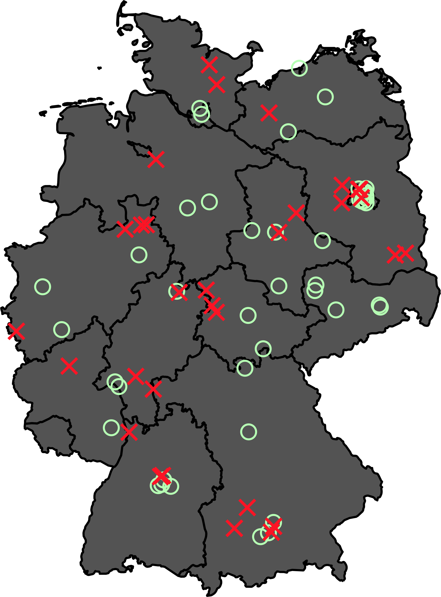

# Opening notes {background-color="#2c844c"}

::: {.tenor-gif-embed data-postid="14209777" data-share-method="host" data-aspect-ratio="1.94" data-width="70%"}
<div class="tenor-gif-embed" data-postid="14209777" data-share-method="host" data-aspect-ratio="1.94" data-width="100%"><a href="https://tenor.com/view/open-gif-14209777">Open Sticker</a>from <a href="https://tenor.com/search/open-stickers">Open Stickers</a></div> <script type="text/javascript" async src="https://tenor.com/embed.js"></script> 
:::

```{=html}
<script type="text/javascript" async src="https://tenor.com/embed.js"></script>
```

- **short synopsis** for final essay due **Friday (17 January)** (send to me via email)

<!-- ## Presentation groups -->

<!-- ::: panel-tabset -->
<!-- ## December -->

<!-- | Date    | Presenters                       | Method | -->
<!-- | -------:|:---------------------------------|:------:| -->
<!-- | 4 Dec:  | Shahadaan, Kristine, Daichi      | ethnography |  -->
<!-- | 11 Dec: | Bérénice, Zorka, Victoria, Katharina | content analysis | -->
<!-- | 18 Dec: | Shoam, Aidan, Tara, Sebastian    | QCA |  -->

<!-- : Presentations line-up -->

<!-- ## January -->

<!-- | Date    | Presenters                       | Method | -->
<!-- | -------:|:---------------------------------|:------:| -->
<!-- | 8 Jan:  |                                  | TBD    |  -->
<!-- | 15 Jan: |                                  | TBD    |  -->
<!-- | 22 Jan: |                                  | TBD    |  -->
<!-- | 29 Jan: |                                  | TBD    |  -->

<!-- : Presentations line-up -->

<!-- ::: -->

<!-- []{style="font-size:10px;"} -->

<!-- NEXT WEEK: ALLOW TIME AT START FOR COURSE FEEDBACK -->
<!-- For a course on 'political violence' and a class on 'state responses: repression', can you suggest some discussion questions to ask students? Ideally, the questions should have multiple choice responses, or yes/no/maybe responses, or strongly agree/agree/disagree/strongly disagree responses, or short-answer (i.e., one or two words should suffice) responses? -->


## Course feedback {background-color="#2c844c"}

Please take a few minutes to fill in the course feedback survey (check your LMU email).

If have an opinion on these points in the comments:

- Would you have preferred getting a specific [assigned organisation]{style="color:violet;"} to independently study in depth? [Yes]{style="color:blue;"}/[No]{style="color:red;"}
- Would you have liked more [structured discussions]{style="color:violet;"} (e.g., set debates on class topics)? [Yes]{style="color:blue;"}/[No]{style="color:red;"}
- Would you rather that class readings are drawn from [textbook(s)]{style="color:violet;"} than journal articles? [Yes]{style="color:blue;"}/[No]{style="color:red;"}
- changes or additions to the course website?

# State repressive responses {background-color="#2c844c"}

:::: {.columns}
:::{.column width="50%"}
- What options/possibilities are there
- dimensions of repression/social control
- @Al-Anani2019 - Rethinking the repression-dissent nexus
- a repressive measure recently in the news 

:::

::: {.column width="50%"}
<div class="tenor-gif-embed" data-postid="16574758" data-share-method="host" data-aspect-ratio="1.66667" data-width="100%"><a href="https://tenor.com/view/help-repressed-panic-dance-medieval-gif-16574758">Help Repressed GIF</a>from <a href="https://tenor.com/search/help-gifs">Help GIFs</a></div> <script type="text/javascript" async src="https://tenor.com/embed.js"></script> 
:::
::::

<!-- https://www.youtube.com/watch?v=YAA-G947ofg -->

## Starting question 

::: {style="text-align: center;"}
**[What repressive measures can be applied to address (potential) political violence? In democratic systems? In authoritarian systems?]{style="color:indigo; font-size:60px;"}** 
:::

## 3 dimensions of repression/social control [@Earl2003]

```{r}
library(tidyr)
library(kableExtra)

table_data <- tribble(
  ~a, ~b, ~c, ~d,
  "Identity of repressive agent", "State agents tightly connected with national political elites (e.g., military units)", "State agents loosely connected with national political elites (e.g., local police departments)",  "Private agents (e.g., counter-demonstrators)",
  
  "Character of repressive action", "Coercion (e.g., use of tear gas and rubber bullets)", "Channelling (e.g., restrictions on registered organisations)", "", 
  
  "Whether repressive action is observable", "Observable (i.e., overt; e.g., Tiananmen Square)", "Unobserved (i.e., covert or latent; e.g., COINTELPRO)", "",
)

kable(table_data, "html", escape = FALSE,
      col.names = c("", "", "", "")) %>%
  kable_styling(bootstrap_options = c("striped", "hover", "responsive"), font_size = 24) %>%
  column_spec(1, bold = TRUE)

```

[What sort of repression/social control in cases do you know of? Was it effective? Why/How?]{style="color:indigo;"}

## @Al-Anani2019 - responses to repression

- [collective responses to repression]{style="color:darkred;"}
    + opposition movements’ tactics in responding to repression (i.e. mobilisation, backlash, de-escalation, etc.)

- [individual responses to repression]{style="color:darkred;"}
    + specific individuals' reactions to repression, shaped by [emotions]{style="color:darkred;"}, memory, personal experiences, and [grievances]{style="color:darkred;"} (e.g., [disengagement]{style="color:darkred;"}, [radicalisation]{style="color:darkred;"})

## @Al-Anani2019 - research in brief

- 20 [interviews]{style="color:blue;"} between [2016 and 2018]{style="color:blue;"} with current and former members of Muslim Brotherhood
    + any notes about [Egyptian context or specifics of Muslim Brotherhood]{style="color:indigo;"}?

. . . 

- repression has [differential (individual-specific) effect]{style="color:darkorange;"}

> Emotions such as **[anger]{style="color:red;"}**, **[hate]{style="color:red;"}**, and **[despair]{style="color:red;"}** have played a key role in shaping their response to repression. Members had different responses that ranged from adopting revolutionary and confrontational tactics to political apathy. [p. 8]

## @Al-Anani2019 - research in brief

- 20 [interviews]{style="color:blue;"} between [2016 and 2018]{style="color:blue;"} with current and former members of Muslim Brotherhood
    + any notes about [Egyptian context or specifics of Muslim Brotherhood]{style="color:indigo;"}?

- [conjunctural cause]{style="color:blue;"} of **[disengagement]{style="color:darkred;"}**

> The **[high cost of protesting]{style="color:darkorange;"}** and political participation **[coupled with frustration]{style="color:darkorange;"}** from the Brotherhood’s **[incapable leadership]{style="color:darkorange;"}** disenchanted several members who not only **[broke ties]{style="color:darkorange;"}** with the Brotherhood but also with politics as a whole.

## Discussion point: pressure against Höcke

- GG [Article 18](https://www.gesetze-im-internet.de/englisch_gg/englisch_gg.html#p0100) enables the BVerfG to **[suspend an individual's fundamental rights]{style="color:cadetblue;"}** (i.e., free expression, freedom of the press, and the right to vote and hold public office)
- the federal government has filed against 4 people in history of BRD
    + 1. [Otto Ernst Remer](https://www.kas.de/de/web/extremismus/rechtsextremismus/falsche-vorbilder-otto-ernst-remer) in 1960; 2. [Gerhard Frey](https://www.zeit.de/politik/deutschland/2013-02/dvu-frey) in 1974; 3. [Heinz Reisz](https://taz.de/Dienel-und-Reisz-Zwei-Einpeitscher-der-Rechten/!1639813/) in 1992; 4. [Thomas Dienel](https://taz.de/Dienel-und-Reisz-Zwei-Einpeitscher-der-Rechten/!1639813/) in 1992
    + **all rejected by BVerfG**

<!-- https://dserver.bundestag.de/btd/13/049/1304993.pdf -->
<!-- https://www.ardmediathek.de/video/panorama/nazi-als-chefredakteur-steuergelder-fuer-rechtsterroristen/das-erste/Y3JpZDovL25kci5kZS8zMGZiNzgwMi1hMjM2LTRiM2QtOGI4NC02M2IzZDhmYjc2YTY -->

. . . 

::: {style="margin-top: -40px;"} 
- calls to file against Björn Höcke (AfD Thüringen) [e.g., @dpa2024-1-15]
    + [2019]{style="color:violet;"}: Verwaltungsgericht Meiningen rules that *he may be described as 'fascist'* ([link](https://www.zeit.de/politik/deutschland/2019-09/afd-bjoern-hoecke-faschist-verwaltungsgericht-meinigen)); [2023]{style="color:violet;"}: Hamburger Staatsanwaltschaft, it is not a legal offence (*Beleidigung*) to call Höcke a 'Nazi' ([link](https://www.fr.de/politik/afd-bjoern-hoecke-staatsanwaltschaft-faschist-nazi-hamburg-frankfurt-zr-92664548.html))

::: 

::: {style="margin-top: -38px;"} 
[should the government file the complaint? should it be granted?]{style="color:indigo;"}

::: 

# Poll: Repressive measures {background-color="#2c844c"}

:::: {.columns}
:::{.column width="35%"}
{fig-alt="A QR code for the survey."}

:::

::: {.column width="65%" .center}
<!-- go to <https://www.qr-code-generator.com/>, add the link, and screen shot the QR code -->
Take the survey at **<https://forms.gle/C3mgptnc3oX4hYd57>**

- Repression reduces (non-state) violence?
- Repression more likely to *deter* than to *radicalise* bystanders?
- Strategy most likely to end political violence?

:::
:::: 

- Why do you think states ban groups?

::: {style="margin-top: -40px;"}
[[Questions about groups]{style="color:violet;"}: (1) The state infiltrated or monitored the group? (2) Repression is a central to the state's strategy? (3) Repression against group viewed as legitimate? (4) Repression reduced group's operational capacity? (5) State cooperates internationally against group?]{style="font-size: 0.7em;"}

:::

--- 

```{ojs}
md`## Poll results (Respondents: ${respondentCount})`
```


```{ojs}

import { liveGoogleSheet } from "@jimjamslam/live-google-sheet";
import { aq, op } from "@uwdata/arquero";

// UPDATE THE LINK FOR A NEW POLL
surveyResults = liveGoogleSheet(
  "https://docs.google.com/spreadsheets/d/e/" +
    "2PACX-1vTZQp7fXXtMesfkjSS-tdlb0ra7RlDl2qrXrKQbGrCSSxFj0jTh07P_c7cEC5287yMvtPfaVGOznb03/" +
    "pub?gid=1923031727&single=true&output=csv",
  10000, 1, 11); // adjust the last number to select all relevant columns 

respondentCount = surveyResults.length;

likertOrder = [
  "Strongly disagree",
  "Disagree",
  "Neutral",
  "Agree",
  "Strongly agree"
];

ynmOrder = [
  "Yes",
  "No",
  "Maybe"
];

groupOrder = [
  "Antifa",
  "RAF",
  "IS",
  "alQaeda",
  "NPD/Heimat",
  "NSU",
  "PKK"
];

groupColors = [
  "pink",
  "red",
  "grey",
  "black",
  "#d2b48c", // lightbrown - could also use 'peru'
  "brown",
  "green"
];

```

<!-- Repression ultimately reduces non-state political violence. -->
<!-- strongly agree/agree/disagree/strongly disagree -->

<!-- Repression is more likely to deter than to radicalise bystanders. -->
<!-- yes/no/maybe -->

<!-- Why do states ban groups? -->
<!-- SHORT ANSWER, or... -->
<!-- - to stop illegal activity -->
<!-- - to disrupt extremist networks  -->
<!-- - to deter extremist activists -->
<!-- - other -->

<!-- When democracies repress, they are more likely to: -->
<!-- A) Use legalistic and bureaucratic repression -->
<!-- B) Outsource repression to non-state actors -->
<!-- C) Use emergency powers -->
<!-- D) Engage in covert repression -->
<!-- other -->

<!-- Which strategy is most likely to end violence? -->
<!-- A) Repression alone -->
<!-- B) Concessions alone -->
<!-- C) Repression followed by concessions -->
<!-- D) Concessions followed by repression -->
<!-- E) Neither repression nor concessions -->

<!-- When is repression ineffective/counterproductive? -->
<!-- A. When groups have strong popular support -->
<!-- B. When repression is indiscriminate -->
<!-- C. When repression is highly visible -->
<!-- other -->


:::: {.columns}
:::{.column width="50%"}
Repression reduces non-state political violence?

```{ojs}
reducesCounts = aq.from(surveyResults)
  .select("reduces")
  .groupby("reduces")
  .count()
  .derive({ measure: d => "" })

// Calculate the maximum count from your dataset
reduces_maxCountRE = Math.max(...reducesCounts.objects().map(d => d.count));

plot_reduces = Plot.plot({
  marks: [
    Plot.barY(reducesCounts, {
      x: "reduces",
      y: "count",
      fill: "reduces",
      stroke: "black",
      strokeWidth: 1
    }),
    Plot.ruleY([respondentCount], { stroke: "#ffffff99" })
  ],
  color: {
    domain: [
      "Strongly disagree",
      "Disagree",
      "Neutral",
      "Agree",
      "Strongly agree"
    ],
    range: [
      "red",
      "pink",
      "lightgrey",
      "lightgreen",
      "forestgreen"
    ]
  },
  marginBottom: 180,
  x: { label: "", tickSize: 2, tickRotate: -45,
    domain: ["Strongly disagree", "Disagree", "Neutral", "Agree", "Strongly agree"]
  },  
  y: {
    label: "",
    tickSize: 10,
    tickFormat: d => d,
    tickValues: Array.from(
      new Set(reducesCounts.objects().map(d => d.count))
    ).sort((a, b) => a - b),
    domain: [0, reduces_maxCountRE]
  },
  facet: { data: reducesCounts, x: "measure", label: "" },
  marginLeft: 140,
  style: {
    width: 1350,
    height: 500,
    fontSize: 30,
  }
});

```

:::

::: {.column width="50%"}
Repression more likely to *deter* than to *radicalise* bystanders?

```{ojs}
deterCounts = aq.from(surveyResults)
  .select("deter")
  .groupby("deter")
  .count()
  .derive({ measure: d => "" })

// Calculate the maximum count from your dataset
deter_maxCountRE = Math.max(...deterCounts.objects().map(d => d.count));

plot_deter = Plot.plot({
  marks: [
    Plot.barY(deterCounts, {
      x: "deter",
      y: "count",
      fill: "deter",
      stroke: "black",
      strokeWidth: 1
    }),
    Plot.ruleY([respondentCount], { stroke: "#ffffff99" })
  ],
  color: {
    domain: [
      "Yes",
      "No",
      "Maybe"
    ],
    range: [
      "forestgreen",
      "darkred",
      "goldenrod"
    ]
  },
  marginBottom: 80,
  x: { label: "", tickSize: 2, tickRotate: -1, padding: 0.2,
    domain: ["Yes", "No", "Maybe"]
  },  
  y: {
    label: "",
    tickSize: 10,
    tickFormat: d => d,
    tickValues: Array.from(
      new Set(deterCounts.objects().map(d => d.count))
    ).sort((a, b) => a - b),
    domain: [0, deter_maxCountRE]
  },
  facet: { data: deterCounts, x: "measure", label: "" },
  marginLeft: 60,
  style: {
    width: 1600,
    height: 500,
    fontSize: 40,
  },
});

```

:::
:::: 

## Poll results - ending violence

Strategy most likely to end political violence?

```{ojs}
end_pvCounts = aq.from(surveyResults)
  .select("end_pv")
  .groupby("end_pv")
  .count()
  .derive({ measure: d => "" })

// Calculate the maximum count from your dataset
end_pv_maxCountRE = Math.max(...end_pvCounts.objects().map(d => d.count));

plot_end_pv = Plot.plot({
  marks: [
    Plot.barY(end_pvCounts, {
      x: "end_pv",
      y: "count",
      fill: "end_pv",
      stroke: "black",
      strokeWidth: 1
    }),
    Plot.ruleY([respondentCount], { stroke: "#ffffff99" })
  ],
  color: {
    domain: [
      "Repression alone",
      "Concessions alone",
      "Repression followed by concessions",
      "Concessions followed by repression",
      "Neither repression nor concessions"
    ],
    range: [
      "indigo",
      "goldenrod",
      "cadetblue",
      "forestgreen",
      "violet"
    ]
  },
  marginBottom: 600,
  x: { label: "", tickSize: 2, tickRotate: -60, padding: 0.2,
    domain: ["Repression alone", "Concessions alone", "Repression followed by concessions", "Concessions followed by repression", "Neither repression nor concessions"]
  },  
  y: {
    label: "",
    tickSize: 10,
    tickFormat: d => d,
    tickValues: Array.from(
      new Set(end_pvCounts.objects().map(d => d.count))
    ).sort((a, b) => a - b),
    domain: [0, end_pv_maxCountRE]
  },
  facet: { data: end_pvCounts, x: "measure", label: "" },
  marginLeft: 60,
  style: {
    width: 1600,
    height: 500,
    fontSize: 40,
  },
});

```

## Poll results - banning groups {.scrollable}

[Why do you think states ban groups?]{style="color:indigo"}

```{ojs}

// Access and print the values from the 'banning' column
banningWhy = aq.from(surveyResults)
  .select("banning")
  .filter(d => d.banning) // to exclude empty ("") strings, 0s, FALSEs, nulls, etc

banningWhy.array("banning")

```

## Groups and repression 

:::: {.columns}
:::{.column width="50%"}
The state infiltrated or monitored the group.

```{ojs}
// need to replace 'g_infiltrate'

g_infiltrateCounts = aq.from(surveyResults)
  .groupby("g_infiltrate", "group")
  .count()
  .objects();

plot_g_infiltrate = Plot.plot({
  marks: [
    Plot.frame({
      fill: "#f7f7f7",
      stroke: "black",
      strokeWidth: 1
    }),
    
    Plot.barY(g_infiltrateCounts, {
      fx: "g_infiltrate",
      x: "group",
      y: "count",
      fill: "group",
      stroke: "white"
    })
  ],

  color: {
    domain: groupOrder,
    range: groupColors,
    legend: true,
    style: { fontSize: "20px" }
  },

  fx: {
    domain: ynmOrder,
    label: "",
    tickRotate: 0
  },

  x: {
    domain: groupOrder,
    axis: null, // clears the entire x-axis (ticks and labels)
    // tickFormat: () => "",
    label: ""
  },

  y: {
    label: ""
  },

  marginBottom: 130,
  style: {
    width: 900,
    height: 500,
    fontSize: 20
  }
});

``` 


:::

::: {.column width="50%"}
Repression is a central to the state's strategy

```{ojs}
// need to replace 'g_repress_central'

g_repress_centralCounts = aq.from(surveyResults)
  .groupby("g_repress_central", "group")
  .count()
  .objects();

plot_g_repress_central = Plot.plot({
  marks: [
    Plot.frame({
      fill: "#f7f7f7",
      stroke: "black",
      strokeWidth: 1
    }),
    
    Plot.barY(g_repress_centralCounts, {
      fx: "g_repress_central",
      x: "group",
      y: "count",
      fill: "group",
      stroke: "white"
    })
  ],

  color: {
    domain: groupOrder,
    range: groupColors,
    legend: true,
    style: { fontSize: "20px" }
  },

  fx: {
    domain: likertOrder,
    label: "",
    tickRotate: -55
  },

  x: {
    domain: groupOrder,
    axis: null, // clears the entire x-axis (ticks and labels)
    // tickFormat: () => "",
    label: ""
  },

  y: {
    label: ""
  },

  marginBottom: 130,
  style: {
    width: 900,
    height: 500,
    fontSize: 20
  }
});

```

:::
:::: 

## Groups and repression 

Repression viewed as legitimate

```{ojs}
// need to replace 'g_repress_legit'

g_repress_legitCounts = aq.from(surveyResults)
  .groupby("g_repress_legit", "group")
  .count()
  .objects();

plot_g_repress_legit = Plot.plot({
  marks: [
    Plot.frame({
      fill: "#f7f7f7",
      stroke: "black",
      strokeWidth: 1
    }),
    
    Plot.barY(g_repress_legitCounts, {
      fx: "g_repress_legit",
      x: "group",
      y: "count",
      fill: "group",
      stroke: "white"
    })
  ],

  color: {
    domain: groupOrder,
    range: groupColors,
    legend: true,
    style: { fontSize: "20px" }
  },

  fx: {
    domain: likertOrder,
    label: "",
    tickRotate: -55
  },

  x: {
    domain: groupOrder,
    axis: null, // clears the entire x-axis (ticks and labels)
    // tickFormat: () => "",
    label: ""
  },

  y: {
    label: ""
  },

  marginBottom: 130,
  style: {
    width: 900,
    height: 500,
    fontSize: 20
  }
});

```

## Groups and repression

:::: {.columns}
:::{.column width="50%"}
Repression reduced group's operational capacity

```{ojs}
// need to replace 'g_repress_success'

g_repress_successCounts = aq.from(surveyResults)
  .groupby("g_repress_success", "group")
  .count()
  .objects();

plot_g_repress_success = Plot.plot({
  marks: [
    Plot.frame({
      fill: "#f7f7f7",
      stroke: "black",
      strokeWidth: 1
    }),
    
    Plot.barY(g_repress_successCounts, {
      fx: "g_repress_success",
      x: "group",
      y: "count",
      fill: "group",
      stroke: "white"
    })
  ],

  color: {
    domain: groupOrder,
    range: groupColors,
    legend: true,
    style: { fontSize: "20px" }
  },

  fx: {
    domain: likertOrder,
    label: "",
    tickRotate: -55
  },

  x: {
    domain: groupOrder,
    axis: null, // clears the entire x-axis (ticks and labels)
    // tickFormat: () => "",
    label: ""
  },

  y: {
    label: ""
  },

  marginBottom: 130,
  style: {
    width: 900,
    height: 500,
    fontSize: 20
  }
});

```

:::

::: {.column width="50%"}
State cooperates internationally against group

```{ojs}
// need to replace 'g_state_coop'

g_state_coopCounts = aq.from(surveyResults)
  .groupby("g_state_coop", "group")
  .count()
  .objects();

plot_g_state_coop = Plot.plot({
  marks: [
    Plot.frame({
      fill: "#f7f7f7",
      stroke: "black",
      strokeWidth: 1
    }),
    
    Plot.barY(g_state_coopCounts, {
      fx: "g_state_coop",
      x: "group",
      y: "count",
      fill: "group",
      stroke: "white"
    })
  ],

  color: {
    domain: groupOrder,
    range: groupColors,
    legend: true,
    style: { fontSize: "20px" }
  },

  fx: {
    domain: likertOrder,
    label: "",
    tickRotate: -55
  },

  x: {
    domain: groupOrder,
    axis: null, // clears the entire x-axis (ticks and labels)
    // tickFormat: () => "",
    label: ""
  },

  y: {
    label: ""
  },

  marginBottom: 130,
  style: {
    width: 900,
    height: 500,
    fontSize: 20
  }
});

```

:::
:::: 


# Banning {background-color="#2c844c"}

:::: {.columns}
:::{.column width="50%"}
- banning - [the most severe legal instrument states have]{style="color:yellow"} 
    + (legal) causes 
    + consequences 
<!-- - overview of proscription/banning of far-right organisations -->
- party bans [@BourneVeugelers2022]
- organisation banning patterns in Germany [@Zeller2025ejpr]

:::

::: {.column width="50%" .right}
<div class="tenor-gif-embed" data-postid="17311572905376056687" data-share-method="host" data-aspect-ratio="1.245" data-width="100%"><a href="https://tenor.com/view/banned-comic-book-guy-simpsons-gif-17311572905376056687">Banned Comic Book Guy GIF</a>from <a href="https://tenor.com/search/banned-gifs">Banned GIFs</a></div> <script type="text/javascript" async src="https://tenor.com/embed.js"></script> 

:::
::::

## banning 

- ([legal]{style="color:red"}) [justifications]{style="color:violet"} (in Germany, but similar in several other countries) (Arts. 21(2), 9(2) GG; *Vereinsgesetz*)
    + seeks to undermine or abolish the free democratic basic order 
    + opposition to core constitutional principles (human dignity [(Art. 1 GG)], democracy, rule of law)
    + directed against 'international understanding' 
    + in continual violation of criminal law 
- [consequences]{style="color:goldenrod"} 
    + further activity is criminalised
    + re-forming the organisation is criminalised 
    + assets are confiscated 


## states and civil society responding to far-right *organisations* {visibility="hidden"}

[@pedahzur2001StrugglingChallengesRightWing] 

[@pedahzur2003PotentialRoleProdemocratic]

## overview of proscription/banning of far-right organisations {visibility="hidden"}


## Comparative case selection

x = causal variable; y = phenomenon to be explained

:::: {.columns}
:::{.column width="50%"}

[MDSD]{style="color:blue;"} (most different systems design)

| Case 1  | Case 2 | _            |
|:-------|:-------:|:-------------|
| a      | d       | overall      |
| b      | e       | differences  |
| c      | f       |              |
| x      | x       | crucial      |
| y      | y       | similarity   |

:::

::: {.column width="50%"}

[MSSD]{style="color:blue;"} (most similar systems design)

| Case 1 | Case 2  | _             |
|:-------|:-------:|:--------------|
| a      | a       | overall       |
| b      | b       | similiarities |
| c      | c       |               |
| x      | not x   | crucial       |
| y      | not y   | difference    |

:::
::::

Further on case selection strategies, see @Gerring2007[e.g., pp. 89-90]

## Banning successor parties - @BourneVeugelers2022

::: {style="margin-top: -20px;"} 

:::: {.columns}
:::{.column width="65%"}

- [case selection]{style="color:blue;"}: DE and IT: [similar]{style="color:violet;"} right-authoritarian past [and banning law] but [dissimilar]{style="color:cadetblue;"} in their tolerance of post-1945 right-authoritarian parties
    + MSSD (sort of)
- population: [militant democracies]{style="color:darkred;"} - [what does this mean?]{style="color:indigo;"}
- observations: (1) [attitude towards violence]{style="color:orange;"}, (2) [alternatives to ban]{style="color:goldenrod;"}, (3) [securitisation]{style="color:green;"}, (4) [veto player agreement]{style="color:brown;"}, (5) [veto player incentives]{style="color:grey;"}
- method: [csQCA]{style="color:blue;"} (Well, more a 'focused paired comparison')

:::

::: {.column width="35%"}

Otto Ernst Remer, SRP

{width="300"}

{width="300"}

*Movimento sociale italiano*

:::
::::

::: 
<!-- Securitization is a process whereby a party is framed and accepted as an existential threat to the territorial integrity of the state or the democratic values and institutions of the political community.45 Through “a grammar of security”, it uses discourse to “construct a plot that includes existential threat, point of no return, and a possible way out”.46 Securitization invokes the necessity for emergency measures outside the boundaries of normal democratic procedure that permits unhindered competition between political projects. -->

## Banning successor parties - @BourneVeugelers2022

```{r, echo=FALSE, message=FALSE, warning=FALSE, engine = 'tikz'}

\usetikzlibrary{shapes.geometric, arrows}
\begin{tikzpicture}[node distance=1.5cm]

\tikzstyle{BOX} = [rectangle, rounded corners, minimum width=2cm, minimum height=0.5cm,text centered, text width=5cm, draw=black, fill=red!30]
\tikzstyle{RECT} = [rectangle, minimum width=1cm, minimum height=0.5cm, text centered, text width=3cm, draw=black, fill=orange!30]
\tikzstyle{DIA1} = [diamond, minimum width=0.25cm, minimum height=0.25cm, text centered, text width=2cm, draw=black, fill=green!30]
\tikzstyle{arrow} = [thick,->,>=stealth]

\node (x1) [BOX] {anti-system party \linebreak ambiguity about  violence};
\node (x2) [BOX, below of=x1, yshift=0.5cm] {alternatives to ban ineffective};
\node (x3) [BOX, below of=x2, yshift=0.5cm] {Securitisation: \linebreak existential threat};
\node (x4) [BOX, below of=x3, xshift=-3cm, yshift=0.25cm] {Veto players \linebreak accept securitisation};
\node (x5) [BOX, below of=x3, xshift=3cm, yshift=0.25cm] {Veto players goals/capacities unaffected};
\coordinate (conj) at ([xshift=0.4cm, yshift=0cm]x4.east);
\node (x6) [DIA1, below of=conj, yshift=-0.5cm] {\textbf{party ban}};

\draw [arrow] (x1) -- (x2);
\draw [arrow] (x2) -- (x3);
\draw [arrow] (x3) -- (x4);
\draw [arrow] (x4) -- (conj)-- (x6);
\draw [arrow] (x5) -- (conj)-- (x6);

\end{tikzpicture}

```

## Banning successor parties - @BourneVeugelers2022

- (slightly permeable) [cordon sanitaire]{style="color:darkred;"} around MSI (ban alternative)

findings: 

. . . 

- [attitude towards violence]{style="color:darkorange;"} [*not*]{style="color:red;"} a clearly important factor
- two key conditions: [veto player agreement]{style="color:darkorange;"} and (especially) [securitization]{style="color:darkorange;"}

<!-- - Evaluating: many things correct and many things interesting -- but the interesting things are not correct and the correct things are not interesting -->
<!--     + Problems: treating 'parties' and 'organisations' separately? (difference in kind or in degree); international pressure more than securitisation? (p743); briefest mention of KPD (p745); mistaken notions of SRP coalition potential (p746); inconsistency about 'attitude towards violence' factor -- is it necessary to ban (p747) -->

. . . 

[Any modern examples worth comparing to...?]{style="color:indigo;"}


## Banned & monitored (nationally) FR orgs in Germany [@Zeller2025ejpr]

:::: {.columns}
:::{.column width="40%"}


:::

::: {.column width="60%" .right}
- Organisations monitored by Bundesverfassungsschutz (VfS)
    + [o]{style="color:green;"}: monitored by VfS, but not banned
    + [x]{style="color:red;"}: banned by BRD interior ministry

:::
::::

## Banned & monitored (nationally) FR orgs in Germany [@Zeller2025ejpr]

:::: {.columns}
:::{.column width="40%"}


:::

::: {.column width="60%" .right}
- Organisations monitored by Bundesverfassungsschutz (VfS)
    + [o]{style="color:green;"}: monitored by VfS, but not banned
    + [x]{style="color:red;"}: banned by BRD interior ministry

- [many groups/orgs. exist that are in violation of the law; they are monitored; but they are not banned. Why?]{style="color:indigo"}

:::
::::

## Banned & monitored (nationally) FR orgs in Germany [@Zeller2025ejpr]

:::: {.columns}
:::{.column width="40%"}


:::

::: {.column width="60%" .right}
- Organisations monitored by Bundesverfassungsschutz (VfS)
    + [o]{style="color:green;"}: monitored by VfS, but not banned
    + [x]{style="color:red;"}: banned by BRD interior ministry

- many groups/orgs. exist that are in violation of the law; they are monitored; but they are not banned.

- a mixture of situational (*and contextual, but that's for cross-country comparison*) and proximate conditions that lead to bans

:::
::::


## Monitored (nationally) FR orgs in Germany [@Zeller2025ejpr]

```{r}
library(mapview)
library(leafpop)
library(dplyr)
library(sf)

de_reos <- read.csv("slide_files/12/de_reos2023dec4.csv", row.names=1, header = TRUE) 
germany <- readRDS("slide_files/12/germany.rds")

de_reos$LATj <- jitter(de_reos$LAT, factor = 500)
de_reos$LONj <- jitter(de_reos$LON, factor = 500)

de_reos_banY <- subset(de_reos, BAN == 1)
de_reos_banY <- as.data.frame(de_reos_banY)
# rownames(de_reos_banY) = seq(length=nrow(de_reos_banY))
de_reos_banN <- subset(de_reos, BAN == 0)
de_reos_banN <- as.data.frame(de_reos_banN)
# rownames(de_reos_banN) = seq(length=nrow(de_reos_banN))

# SUBSETTING TO NATIONAL ORGS ONLY
de_reos_national <- subset(de_reos, SCOPE=="national")
de_reos_banN_national <- subset(de_reos_banN, SCOPE=="national")
de_reos_banY_national <- subset(de_reos_banY, SCOPE=="national")

de_reos_national$col = NA

de_reos_national <- de_reos_national %>% 
  mutate(col = case_when(
    BANNED == 1 ~ "red",
    BANNED == 0 ~ "seagreen1",
    TRUE ~ "grey"
  ))

de_reos_national_banned <- subset(de_reos_national, col=="red")
de_reos_national_Nbanned<- subset(de_reos_national, col=="seagreen1")

de_reos_national_banned_sf <- de_reos_national_banned %>% 
  st_as_sf(
    coords = c("LONj", "LATj"),
    crs = st_crs("EPSG:4326") 
  )

de_reos_national_Nbanned_sf <- de_reos_national_Nbanned %>% 
  st_as_sf(
    coords = c("LONj", "LATj"),
    crs = st_crs("EPSG:4326") 
  )

st_crs(de_reos_national_banned_sf) <- st_crs(germany)
st_crs(de_reos_national_Nbanned_sf) <- st_crs(germany)

de_reos_national_banned_sf$FIRST_IN_VfS_REPORT <- de_reos_national_banned_sf$FIRST
de_reos_national_banned_sf$LAST_IN_VfS_REPORT <- de_reos_national_banned_sf$LAST
de_reos_national_Nbanned_sf$FIRST_IN_VfS_REPORT <- de_reos_national_Nbanned_sf$FIRST
de_reos_national_Nbanned_sf$LAST_IN_VfS_REPORT <- de_reos_national_Nbanned_sf$LAST

mapview(de_reos_national_banned_sf, col.regions = "red", 
        label = "SHORT_NAME",
        legend = T, 
        layer.name = 'banned groups', 
        map.types = c("CartoDB.DarkMatter", "CartoDB.Positron"),
        popup = popupTable(de_reos_national_banned_sf,
                           zcol=c("SHORT_NAME","SCOPE","REGION","LOCATION",
                                  "FIRST_IN_VfS_REPORT","LAST_IN_VfS_REPORT","BAN_DATE")))+
  mapview(de_reos_national_Nbanned_sf, col.regions = "seagreen1", 
        label = "SHORT_NAME",
        legend = T, 
        layer.name = 'monitored groups', 
        map.types = c("CartoDB.DarkMatter", "CartoDB.Positron"),
        popup = popupTable(de_reos_national_Nbanned_sf,
                           zcol=c("SHORT_NAME","SCOPE","REGION","LOCATION",
                                  "FIRST_IN_VfS_REPORT","LAST_IN_VfS_REPORT")))

```

## Banning FR orgs in Germany - necessity [@Zeller2025ejpr]

- [high far-right visibility]{style="color:darkorange;"} is necessary for banning decisions

> German governments banned far-right organisations only in years when far-right activity, in the form of violence or agitation, was highly visible. Conspicuous incidents of violence in particular were often a prod to proscriptive action. Organisational unlawfulness alone is not enough to explain banning decisions. Without public or political awareness, authorities appear unlikely to act, even if a group is technically illegal.

## Banning FR orgs in Germany - sufficient patterns [@Zeller2025ejpr]

1. [Neo-Nazi movement groups]{style="color:cadetblue;"} – organisations promote [National Socialist ideology]{style="color:darkorange;"}---[legally sufficient for banning in Germany and several other countries]{style="color:darkorange;"}---as well as racial hatred and violence.

. . . 

2. [Longstanding hubs]{style="color:cadetblue;"} – long existing organisations, serving as centres of far-right activism and networking ([network disruption strategy in banning decisions?]{style="color:indigo;"})

. . . 

3. [Militant organisations]{style="color:cadetblue;"} – organisations embody particularly aggressive, confrontational far-right activism

. . . 

4. [Neo-Nazi sham parties]{style="color:cadetblue;"} – organisations presented as  parties (hoping for status's protection) but still spread neo-Nazi ideology

## Case 1: Nationale Offensive (NO) [@Zeller2025ejpr]

- typical of [neo-Nazi sham parties]{style="color:cadetblue;"} pattern

- founded 1990 (by split from FAP) &rarr; linked to previously banned group
- not serious electoral contestation:
    + 0.2 per cent at local elections in Singen-Konstanz
    + 1992 BW Landtag elections: 183 votes out of five million cast
- **BAN**: by Rudolf Seiters (CDU): the NO ‘created and fuelled a xenophobic mood.’
- NO *appealed...* &rarr; Federal Administrative Court *quashed* appeal
   <!-- + NO had lack of the requisite ‘serious will to participate in parliament’ -->

**mechanism**: *[social and political pressur]{style="color:darkorange;"}e* on minister &larr; [indignation about high levels of far-right violence]{style="color:darkorange;"} (HVIO) situation

## Case 2: Collegium Humanum (CH) [@Zeller2025ejpr]

- typical of [longstanding hubs]{style="color:cadetblue;"} pattern
- founded 1963 by Haverbeck (d. 1999) and Haverbeck-Wetzel
    + **had charitable status** (*Gemeinnützigkeit*)
    + meeting point (Vlotho, NRW) for far-right activists from all over
        * *are there any banned orgs. to which the CH was not linked?!*
    + publication: *Stimme des Gewissens*
- **BAN**: by Wolfgang Schäuble (CDU): the CH was directed against Germany’s constitutional order and repeatedly violated laws against Holocaust denial

## Case 2: Collegium Humanum (CH) [@Zeller2025ejpr]

- typical of [longstanding hubs]{style="color:cadetblue;"} pattern

- CH *appealed...* -- Federal Administrative Court *denied* appeal  
    1. CH publications repeatedly denied the Holocaust
    2. CH publications showed an affinity to and attempt to promote National Socialism
    + **ideology of CH publication was sufficient legal basis** [cf. @BVerfG2009] -- [many fit this qualification...]{style="color:indigo;"}

- Mendel-Grundmann-Gesellschaft (MGG) active in Vlotho (research, then outreach)
- *Vlothoer Bündnis gegen das CH* (by local Greens)
- **mechanism**: [high *specific* visibility, driven by local counter-mobilisation]{style="color:darkorange;"}

## informative epilogue to these cases [@Zeller2025ejpr]

Response to parliamentary inquiry [@DB1994-3-9]. Asked about effects of banning, government asserted 

> the bans had achieved ‘widespread uncertainty and a lack of prospects in the right-wing extremist scene, far-reaching suppression of group activity by breaking up organisational structures and confiscating organisations’ assets, and the seizure of weapons’

Moreover: government claimed a sort of **[chilling effect]{style="color:cadetblue;"}**, that other groups ‘*have at least restricted their agitation activities in order to prevent bans*’. 

## informative epilogue to these cases [@Zeller2025ejpr]

Conversely, gov. acknowledged that ... 

- BfV intelligence-gathering perhaps disrupted by banning action,
- activists might use banning as an opportunity to propagandise,
- bans could radicalise members (i.e., conspiratorial, aggressive), 
- members might acquire more solidarity by enduring banning

. . . 

> Response concludes, negative effects are uncertain, visible only after time; positive effects are achieved directly through the enforcement of bans. **instrumental logic**

## Conclusions [@Zeller2025ejpr]

- **inconsistency in German governments' banning practices**:
    + org. characteristics alone are not enough to explain bans
    + situational factors are causally significant and cannot be ignored
- the use of banning is sometimes a tool of politics rather than a targeted response to systemic threats
- *high far-right visibility* (HVIO+HPRO) necessary situation for ban 
    + but that **visibility is specific** rather than generalised
        * builds social/political pressure to ban

::: {style="font-size: 0.75em; color: forestgreen;"}
bans do not just follow the law---they follow pressure. Public visibility, political will, and social mobilisation all shape outcomes. This means that organisational bans and perhaps other militant democracy decisions are not solely in the hands of governments. Societal actors inform and influence how states and governments respond to extremism.
:::


## A contentious concluding question

- what matters to BVerfG (Germany's federal constitutional court)? ... (<https://www.bundesverfassungsgericht.de/EN/Verfahren/Wichtige-Verfahrensarten/Parteiverbotsverfahren/parteiverbotsverfahren_node.html>) [cf. @backes2019BanningPoliticalParties]
    + "*actively belligerent, aggressive stance vis-à-vis the free democratic basic order and must seek to abolish it*"
    + large/successful enough to potentially achieve its anti-constitutional goals
- the Bundestag, the Bundesrat, and the federal government can file for a ban

. . . 

::: {style="text-align: center;"}
**[do you think the AfD meets these criteria?]{style="color:indigo; font-size:45px;"}** 
:::

. . . 

[leaked!]{style="color:red;"} [Verfassungsschutzgutachten zur AfD](https://www.tagesschau.de/inland/innenpolitik/afd-verbot-gutachten-100.html) [@BfV2025AfD]


# Any feedback for this class? {background-color="#2c844c"}

Anonymous feedback here: <https://forms.gle/NfF1pCfYMbkAT3WP6>

Alternatively, please send me an email: [m.zeller\@lmu.de]{style="color:red;"}

```{r echo=FALSE, message=FALSE, warning=FALSE}
pagedown::chrome_print(file.path("..", "docs/slides", "slides_12.html"))
```

<hr>

<!-- [ -->
[Questions about groups]{style="color:violet;"}: (1) Is online activity is essential for the group? (2) Do platform algorithms amplify the group? (3) What does online activity by this group involve? (4) Does the group depend more on open platforms or encrypted/private channels? (5) Most important platform?
<!-- ]{style="font-size: 0.7em;"} -->

## References


