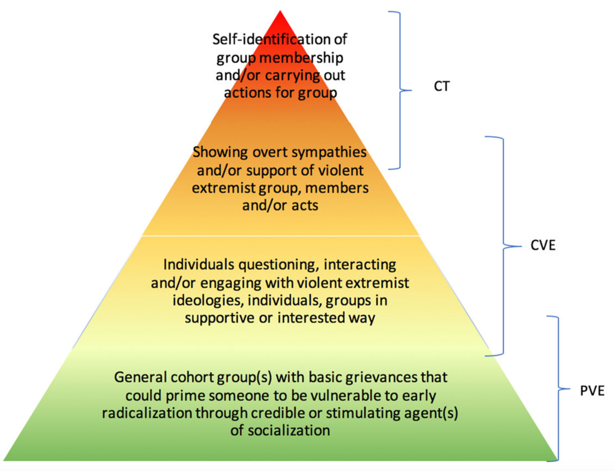
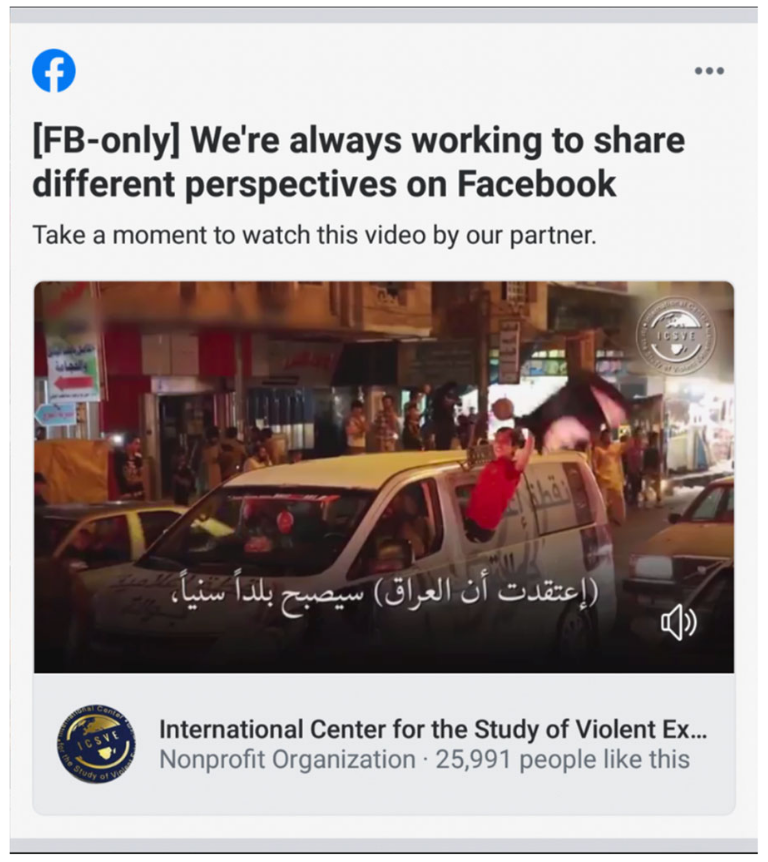
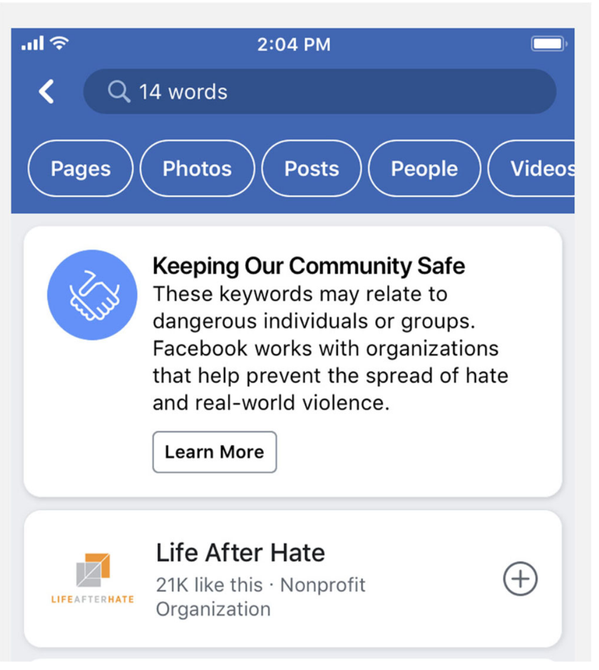
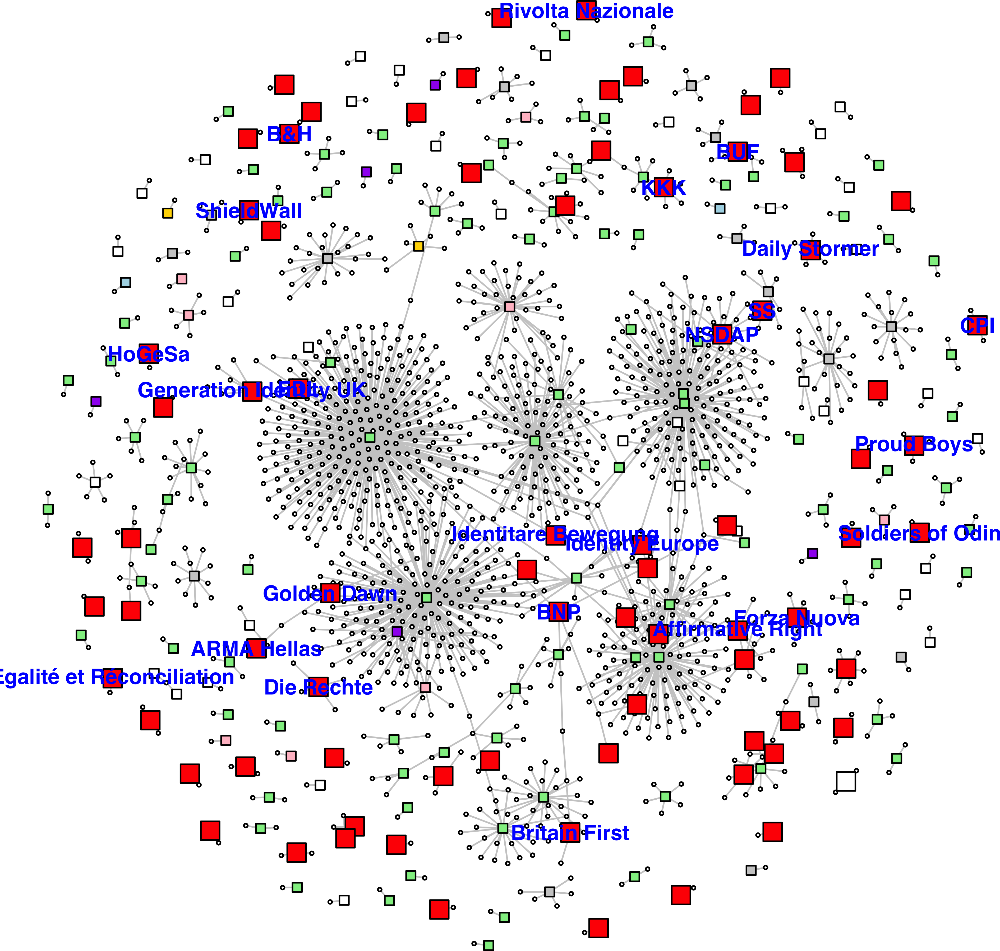
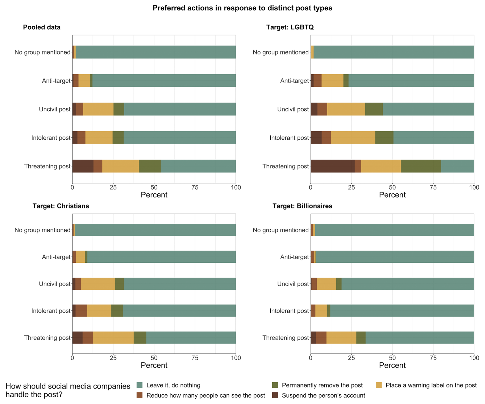
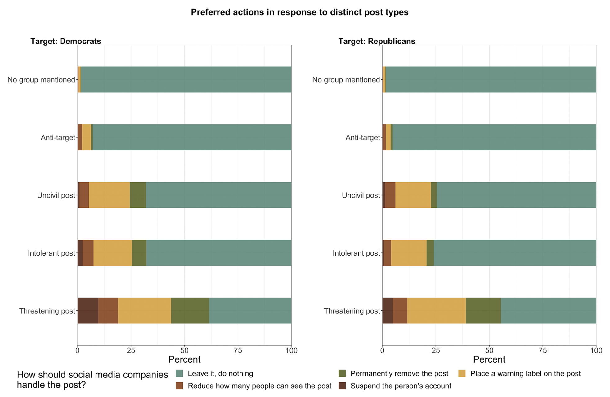

# Opening notes {background-color="#2c844c"}

::: {.tenor-gif-embed data-postid="14209777" data-share-method="host" data-aspect-ratio="1.94" data-width="70%"}
<div class="tenor-gif-embed" data-postid="14209777" data-share-method="host" data-aspect-ratio="1.94" data-width="100%"><a href="https://tenor.com/view/open-gif-14209777">Open Sticker</a>from <a href="https://tenor.com/search/open-stickers">Open Stickers</a></div> <script type="text/javascript" async src="https://tenor.com/embed.js"></script> 
:::

```{=html}
<script type="text/javascript" async src="https://tenor.com/embed.js"></script>
```

<!-- ## Presentation groups -->

<!-- ::: panel-tabset -->
<!-- ## December -->

<!-- | Date    | Presenters                       | Method | -->
<!-- | -------:|:---------------------------------|:------:| -->
<!-- | 4 Dec:  | Shahadaan, Kristine, Daichi      | ethnography |  -->
<!-- | 11 Dec: | Bérénice, Zorka, Victoria, Katharina | content analysis | -->
<!-- | 18 Dec: | Shoam, Aidan, Tara, Sebastian    | QCA |  -->

<!-- : Presentations line-up -->

<!-- ## January -->

<!-- | Date    | Presenters                       | Method | -->
<!-- | -------:|:---------------------------------|:------:| -->
<!-- | 8 Jan:  |                                  | TBD    |  -->
<!-- | 15 Jan: |                                  | TBD    |  -->
<!-- | 22 Jan: |                                  | TBD    |  -->
<!-- | 29 Jan: |                                  | TBD    |  -->

<!-- : Presentations line-up -->

<!-- ::: -->

<!-- []{style="font-size:10px;"} -->

<!-- For a course on 'political violence' and a class on 'state responses: repression', can you suggest some discussion questions to ask students? Ideally, the questions should have multiple choice responses, or yes/no/maybe responses, or strongly agree/agree/disagree/strongly disagree responses, or short-answer (i.e., one or two words should suffice) responses? -->


# Key concepts review {background-color="#2c844c"}

:::: {.columns}
:::{.column width="50%"}
- political violence - [the use of force by a person or group with a political motivation/purpose]{style="color:yellow;"} 
- essay question example 
- concepts from previous class meetings 

:::

::: {.column width="50%"}
<div class="tenor-gif-embed" data-postid="9543307" data-share-method="host" data-aspect-ratio="1.84932" data-width="100%"><a href="https://tenor.com/view/shine-text-share-the-flip-side-sharetheflipsidegifs-stress-exams-gif-9543307">Studying GIF</a>from <a href="https://tenor.com/search/shine+text-gifs">Shine Text GIFs</a></div> <script type="text/javascript" async src="https://tenor.com/embed.js"></script> 
:::
::::

## Klausur essay question example  

:::: {.columns}
:::{.column width="25%"}
1. Broad introduction 
:::

:::{.column width="25%"}
2. Elaborate in detail  
:::

:::{.column width="25%"}
3. Describe examples 
:::

:::{.column width="25%"}
4. Concluding summary 
:::
::::

*What can states do to prevent or reduce political violence? Describe several options and discuss advantages and disadvantages.*

## Key concepts (1)

- **[political violence]{style="color:darkred;"} ** - the use of force by a person or group with a political motivation/purpose
    + e.g., assault, robbery, rioting, insurgency, assassination, terrorism, rebellion, guerrilla warfare and civil war, revolution
    + can be differentiated by nature of the [objectives]{style="color:red;"}, the [targets]{style="color:goldenrod;"} of attacks, the [organisational structure]{style="color:cadetblue;"} of groups, and by the [repertoire of actions]{style="color:violet;"}
    
## Key concepts (2) - causes of PV activity

1. broad environment/contextual factors ([macro-level]{style="color:cadetblue;"}) 
    + *[preconditions]{style="color:darkred;"}*: factors that set the stage for PV over the long run
    + *[precipitants]{style="color:darkred;"}*: specific events that immediately precede the occurrence of PV
2. circumstances and actors ([meso-level]{style="color:cadetblue;"})
    + PV as part of '[strategy]{style="color:darkred;"}' (for certain goals) and may be 'rational'
3. [psychological variables]{style="color:darkred;"} that encourage or inhibit ([micro-level]{style="color:cadetblue;"})
    + ego-defensive needs, cognitive processes, socialization --- but also *normality*
    + evolving dynamics of commitment, risk, solidarity, loyalty, guilt, revenge, isolation

## Key concepts (3)

- **[radicalisation]{style="color:darkred;"}** ([attitudinal]{style="color:red;"}) - social and psychological *[process]{style="color:blue;"}* of increased commitment to extremist political or religious ideology
    + mirrored by **[deradicalisation]{style="color:darkred;"}**
    + *[cognitive alignment]{style="color:darkred;"}* - recognition of some conditions as wrong $\rightarrow$ framing of those conditions as unjust and violence as just $\rightarrow$ singling out of specific responsibilities, and the demonisation of the other
- **[engagement]{style="color:darkred;"}** ([behavioural]{style="color:red;"}) - participation in politically violent activity 
    + mirrored by **[disengagement]{style="color:darkred;"}**
<!-- - 3 dimensions to keep in mind: individual motivations for involvement (micro), networks which facilitate the recruitment process (meso), effects on individuals of repressive strategies (macro) -->

## Key concepts (4) 

- **[strategy]{style="color:darkred;"}** - a combination of a claim (or demand), a tactic, and a site (or venue); alternatively, consisting of 3 elements: 
    1. [Targeting]{style="color:darkred;"} - who/what is being acted upon by tactics
    2. [Tactics]{style="color:darkred;"} - types of collective action and manner of their performance
    3. [Timing]{style="color:darkred;"} - some moments present greater opportunity than others

## Key concepts (5)

- **[radical subcultures]{style="color:darkred;"}** - a cultural group within a larger culture with its own traits, beliefs, and interests, typically distinct from and sometimes at odds with the larger culture
- **[leadership]{style="color:darkred;"}** - Weber's 3 ideal types: legal, traditional, *[charismatic]{style="color:violet;"}*
    + leadership tasks [@Earl2007]

## Key concepts (6)

- **[foreign fighters]{style="color:darkred;"}** - individuals who travel to a conflict zone from another territory (prima facie evidence of radicalism $\rightarrow$ *[engagement]{style="color:darkred;"}* in political violence; a ‘security failure’ by authority of origin state?)
    + motivations: [ideology]{style="color:purple;"}, [benefits]{style="color:green;"}, interpersonal [connections]{style="color:teal;"}, etc.
    + [state response options]{style="color:darkred;"}: praise/support, ignore/disregard, programmatic intervention, criminal justice intervention, forceful intervention

## Key concepts (7)

- **[electoral violence]{style="color:darkred;"}** - coercion directed towards actors and/or objects during the electoral cycle ... part of a menu of electoral manipulation
    + *[intra-systemic violence]{style="color:cadetblue;"}* - “try to win under the existing system”; “suppress or drown out the voices of political opponents”
    + *[anti-systemic violence]{style="color:violet;"}* - “depress participation as much as possible in order to undermine the legitimacy of the election”

## Key concepts (8)

- **[escalation]{style="color:darkred;"}**: a rise in the frequency and/or severity of violent actions
    + framing logics, strategic logics, organisational logics, constituency/social logics
- **[restraint]{style="color:darkred;"}**: a deliberate restriction (either reducing or completely stopping) of violent actions
    + strategic logics, moral logics, logic of ego maintenance, logic of outgroup definition, organisational logic

- **[dimensions of repression/social control]{style="color:darkred;"}** - [identity of repressive agent]{style="color:cadetblue;"}, [character of repressive action]{style="color:goldenrod;"}, whether repressive action is [observable]{style="color:red;"}
    + many repressive options...

## Notable research findings (1), by class number

--2. (a) economic factors are not reliable predictors of terrorist activity; (b) [social factors help drive right-wing terrorism]{style="color:darkorange;"} [@Piazza2017]

--3. (a) paths of radicalisation: [ideological, instrumental, solidaristic]{style="color:darkorange;"} - [@dellaPorta2018-radicalization; @Bosi2012]; (b) 5 [barriers to mass violence]{style="color:darkorange;"}: i. viewed as counterproductive, ii. preference for interpersonal violence, iii. changes in focus availability, iv. internal org. conflict, v. moral apprehension [@SimiWindisch2020]

--5. *[post-conflict radical milieu]{style="color:darkorange;"}* can be key factor in mobilising for political violence [@metodieva2022foreign]

--7. common profile of ISIS foreign fighters: [male, well-educated, urban, unmarried, and young]{style="color:darkorange;"} [@morris2023WhoBecomesForeign]

## Notable research findings (2), by class number

--8. [violence decreases turnout but that the effect is larger for anti-systemic violence]{style="color:darkorange;"}; intra-systemic violence appears intended to [selectively depress turnout among opposition supporters]{style="color:darkorange;"} [@harbers2022ShapingElectoralOutcomes]; non-violent more than twice as likely to achieve full or partial success compared to violent cases [@Chenoweth2011], [nonviolent campaigns are better at eliciting broad and diverse support]{style="color:darkorange;"}, nonviolent campaigns create [more defections among the opposition]{style="color:darkorange;"}, nonviolent campaigns have a [broader set of tactics]{style="color:darkorange;"} at their disposal, nonviolent campaigns often [maintain discipline]{style="color:darkorange;"} even in the face of escalating oppression; violence complementing already and continuing high mobilisation is effective in making regime more sensitive to protest costs [@Kudelia2018]  

## Notable research findings (3), by class number

--10. [people may shift their attitudes about political violence...]{style="color:darkorange;"} when a different movement poses a new situational variation [@setter2022HowSocialMovemenst]; extremists (esp. Islamists) gain more discursive space after attacks, politicians from [right-wing parties were more visible than politicians from left-wing parties in political debates after extreme right and Islamist attacks]{style="color:darkorange;"}, the content of public debates after terrorist attacks was related to the ideological motive behind the attack, Terrorist attacks reduce the public legitimacy of extremist actors and their political agenda in public debates, legitimacy of Islam decreases to a greater extent after Islamist attacks than the legitimacy of nationalism does after extreme right attacks (issues) [@volker2023HowTerroristAttacks]

## Notable research findings (4), by class number

--12. bans: [attitude towards violence not a clearly important factor]{style="color:darkorange;"}, two key conditions: [veto player agreement]{style="color:darkorange;"} and (especially) [securitization]{style="color:darkorange;"} [@BourneVeugelers2022]; bans can be motivated by [social pressure mechanisms]{style="color:darkorange;"}, (specific) [visibility]{style="color:darkorange;"} is important for bans, German government applies *[instrumental logic]{style="color:darkorange;"}* rather than *legal logic* in banning decisions

## Tips for preparing for Klausur

:::: {.columns}
:::{.column width="50%"}
- review class slides
- reread your notes from readings
    * maybe (re-)read a couple of the required readings
- think through cases you know of 
- think through other cases we discussed (through readings or your peers' expertise)

:::

::: {.column width="50%"}

 
:::
::::

## Tips for preparing for Klausur

:::: {.columns}
:::{.column width="50%"}
- review class slides
- reread your notes from readings
    * maybe (re-)read a couple of the required readings
- think through cases you know of 
- think through other cases we discussed (through readings or your peers' expertise)

- **[don't panic]{style="color:cadetblue;"}**

:::

::: {.column width="50%"}
<div class="tenor-gif-embed" data-postid="21430630" data-share-method="host" data-aspect-ratio="1" data-width="100%"><a href="https://tenor.com/view/dont-be-alarmed-willy-wonka-and-the-chocolate-factory-dont-worry-dont-be-afraid-dont-panic-gif-21430630">Dont Be Alarmed Willy Wonka And The Chocolate Factory GIF</a>from <a href="https://tenor.com/search/dont+be+alarmed-gifs">Dont Be Alarmed GIFs</a></div> <script type="text/javascript" async src="https://tenor.com/embed.js"></script> 
 
:::
::::

# Political violence online {background-color="#2c844c"}

:::: {.columns}
:::{.column width="60%"}
- Opening questions: what is political violence online?
- Common uses of online tools by extremists 
- Counterspeech 

:::

::: {.column width="40%"}
<div class="tenor-gif-embed" data-postid="25137295" data-share-method="host" data-aspect-ratio="0.765625" data-width="100%"><a href="https://tenor.com/view/to-be-or-not-to-be-shakespeare-online-offline-nathan-gif-25137295">To Be Or Not To Be Shakespeare GIF</a>from <a href="https://tenor.com/search/to+be+or+not+to+be-gifs">To Be Or Not To Be GIFs</a></div> <script type="text/javascript" async src="https://tenor.com/embed.js"></script> 
:::
::::

## Starting questions 

::: {style="text-align: center; color:indigo; font-size:40px;"}
- What is *violence* online?
    + What forms does it take? (What qualifies as 'violence'?)
    + Where does it happen?
    + Who are the perpetrators? Who are the victims?
    + Are there problems particular to violence online compared to elsewhere?

- How have politically violent groups/actors that you know of used the internet? 
 
:::

## Common uses of online tools by extremists {auto-animate=true}

## Common uses of online tools by extremists {auto-animate=true}

::: footer
[[icons created by Flaticon](https://www.flaticon.com/free-icons/)]{style="font-size:20px;"}
<!-- <a href="https://www.flaticon.com/free-icons/" title="Flaticon">icons created by Freepik - Flaticon</a> -->
:::

:::: {.columns}
:::{.column width="20%"}
[financing]{style="color:darkred;"}

{width=100%}
:::

::: {.column width="20%" .right}

:::

::: {.column width="20%" .right}

:::

::: {.column width="20%" .right}

:::

::: {.column width="20%" .right}

:::
::::

## Common uses of online tools by extremists {auto-animate=true}

::: footer
[[icons created by Flaticon](https://www.flaticon.com/free-icons/)]{style="font-size:20px;"}
<!-- <a href="https://www.flaticon.com/free-icons/" title="Flaticon">icons created by Freepik - Flaticon</a> -->
:::

:::: {.columns}
:::{.column width="20%"}
[training]{style="color:darkred;"}

{width=100%}
:::

::: {.column width="20%" .right}
[financing]{style="color:darkred;"}

{width=100%}

:::

::: {.column width="20%" .right}


:::

::: {.column width="20%" .right}


:::

::: {.column width="20%" .right}


:::
::::

## Common uses of online tools by extremists {auto-animate=true}

::: footer
[[icons created by Flaticon](https://www.flaticon.com/free-icons/)]{style="font-size:20px;"}
<!-- <a href="https://www.flaticon.com/free-icons/" title="Flaticon">icons created by Freepik - Flaticon</a> -->
:::

:::: {.columns}
:::{.column width="20%"}
[coordinating]{style="color:darkred;"}

{width=100%}
:::

::: {.column width="20%" .right}
[training]{style="color:darkred;"}

{width=100%}

:::

::: {.column width="20%" .right}
[financing]{style="color:darkred;"}

{width=100%}

:::

::: {.column width="20%" .right}


:::

::: {.column width="20%" .right}


:::
::::

## Common uses of online tools by extremists {auto-animate=true}

::: footer
[[icons created by Flaticon](https://www.flaticon.com/free-icons/)]{style="font-size:20px;"}
<!-- <a href="https://www.flaticon.com/free-icons/" title="Flaticon">icons created by Freepik - Flaticon</a> -->
:::

:::: {.columns}
::: {.column width="20%" .right}
[recruitment]{style="color:darkred;"}

{width=100%}
:::

:::{.column width="20%"}
[coordinating]{style="color:darkred;"}

{width=100%}
:::

::: {.column width="20%" .right}
[training]{style="color:darkred;"}

{width=100%}

:::

::: {.column width="20%" .right}
[financing]{style="color:darkred;"}

{width=100%}

:::

::: {.column width="20%" .right}


:::
::::


## Common uses of online tools by extremists {auto-animate=true}

::: footer
[[icons created by Flaticon](https://www.flaticon.com/free-icons/)]{style="font-size:20px;"}
<!-- <a href="https://www.flaticon.com/free-icons/" title="Flaticon">icons created by Freepik - Flaticon</a> -->
:::

:::: {.columns}
::: {.column width="20%" .right}
['agitprop']{style="color:darkred;"}

{width=100%}
:::

::: {.column width="20%" .right}
[recruitment]{style="color:darkred;"}

{width=100%}
:::

:::{.column width="20%"}
[coordinating]{style="color:darkred;"}

{width=100%}
:::

::: {.column width="20%" .right}
[training]{style="color:darkred;"}

{width=100%}

:::

::: {.column width="20%" .right}
[financing]{style="color:darkred;"}

{width=100%}

:::
::::

## Extremist uses of online tools - agitprop {auto-animate=true}

:::: {.columns}
::: {.column width="45%" .right}
['agitprop']{style="color:darkred;"}

{width=100%}
:::

::: {.column width="55%" .right}
- (agitation and propaganda)
- setting agenda: [what issue(s)]{style="color:violet;"} to focus on 
- spreading narratives: [how to view those issue(s)]{style="color:cadetblue;"} 
- create and/or distribute related content: [writing]{style="color:red;"}, [pictures]{style="color:teal;"}, [audio]{style="color:purple;"}, [videos]{style="color:goldenrod;"}, [games]{style="color:forestgreen;"}, etc. 
- use multiple channels (e.g., mainstream, like FB, Twitter; fringe, like 4chan, 8kun, gettr)
    + alternative news outlets 

:::
::::

## Common uses of online tools by extremists {auto-animate=true}

:::: {.columns}
::: {.column width="20%" .right}
['agitprop']{style="color:darkred;"}

{width=100%}
:::

::: {.column width="20%" .right}
[recruitment]{style="color:darkred;"}

{width=100%}
:::

:::{.column width="20%"}
[coordinating]{style="color:darkred;"}

{width=100%}
:::

::: {.column width="20%" .right}
[training]{style="color:darkred;"}

{width=100%}

:::

::: {.column width="20%" .right}
[financing]{style="color:darkred;"}

{width=100%}

:::
::::

## Extremist uses of online tools - recruitment {auto-animate=true}

:::: {.columns}
::: {.column width="45%" .right}
[recruitment]{style="color:darkred;"}

{width=100%}
:::

::: {.column width="55%" .right}
- create/manage [online spaces]{style="color:violet;"} (forums, chatrooms, groups)
- communicate with sympathisers 
    + aided by [agitprop]{style="color:darkred;"} that resonates with susceptible individuals 
    + impart sense of [purpose]{style="color:goldenrod;"} or [belonging]{style="color:green;"}

:::
::::

## Common uses of online tools by extremists {auto-animate=true}

:::: {.columns}
::: {.column width="20%" .right}
['agitprop']{style="color:darkred;"}

{width=100%}
:::

::: {.column width="20%" .right}
[recruitment]{style="color:darkred;"}

{width=100%}
:::

:::{.column width="20%"}
[coordinating]{style="color:darkred;"}

{width=100%}
:::

::: {.column width="20%" .right}
[training]{style="color:darkred;"}

{width=100%}

:::

::: {.column width="20%" .right}
[financing]{style="color:darkred;"}

{width=100%}

:::
::::

## Extremist uses of online tools - coordinating {auto-animate=true}

:::: {.columns}
::: {.column width="45%" .right}
[coordinating]{style="color:darkred;"}

{width=100%}
:::

::: {.column width="55%" .right}
- encrypted messaging among group members 
- logistical preparations 
- plan and arrange (privately or publicly) [meetings, events, protests, attacks]{style="color:violet;"} 

:::
::::

## Common uses of online tools by extremists {auto-animate=true}

:::: {.columns}
::: {.column width="20%" .right}
['agitprop']{style="color:darkred;"}

{width=100%}
:::

::: {.column width="20%" .right}
[recruitment]{style="color:darkred;"}

{width=100%}
:::

:::{.column width="20%"}
[coordinating]{style="color:darkred;"}

{width=100%}
:::

::: {.column width="20%" .right}
[training]{style="color:darkred;"}

{width=100%}

:::

::: {.column width="20%" .right}
[financing]{style="color:darkred;"}

{width=100%}

:::
::::

## Extremist uses of online tools - training {auto-animate=true}

:::: {.columns}
::: {.column width="45%" .right}
[training]{style="color:darkred;"}

{width=100%}
:::

::: {.column width="55%" .right}
- [guides or tutorials]{style="color:goldenrod;"} to operational activity: 
    + fleeing to join group 
    + avoiding detection 
    + skills training (fighting, weapons, tools, hacking) 

:::
::::

## Common uses of online tools by extremists {auto-animate=true}

:::: {.columns}
::: {.column width="20%" .right}
['agitprop']{style="color:darkred;"}

{width=100%}
:::

::: {.column width="20%" .right}
[recruitment]{style="color:darkred;"}

{width=100%}
:::

:::{.column width="20%"}
[coordinating]{style="color:darkred;"}

{width=100%}
:::

::: {.column width="20%" .right}
[training]{style="color:darkred;"}

{width=100%}

:::

::: {.column width="20%" .right}
[financing]{style="color:darkred;"}

{width=100%}

:::
::::

## Extremist uses of online tools - financing {auto-animate=true}

:::: {.columns}
::: {.column width="40%" .right}
[financing]{style="color:darkred;"}

{width=100%}
:::

::: {.column width="60%" .right}

```{r}
library(kableExtra)
library(dplyr)

# Create a data frame with your table structure
df <- data.frame(
  # Categories = c(
  #   "1. Donations/self-funding",
  #   "2. Criminal activity",
  #   "3a. Sale of goods (merchandise, music, real estate, etc.)",
  #   "3b. Sale of services (memberships, events, etc.)"
  # ),
  `Legal and/or Non-Violation of Terms` = rep("", 4),
  `Illegal and/or Violation of Terms` = rep("", 4),
  check.names = FALSE
)

kable(df, "html", escape=FALSE, align="cc") %>%
  kable_styling("striped", full_width=FALSE, position="center", font_size=43) %>%
  # column_spec(1, bold = TRUE, background = "#E5E5E5") %>%
  column_spec(1, background="seagreen1", include_thead=T) %>%
  column_spec(2, background="tomato1", include_thead=T) %>%
  add_header_above(c("Legality and/or Terms of Service Compliance"=2)) 

```

:::
::::

## Extremist uses of online tools - financing {auto-animate=true}

:::: {.columns}
::: {.column width="40%" .right}
[financing]{style="color:darkred;"}

{width=100%}
:::

::: {.column width="60%" .right}

```{r}
kable(df, "html", escape=FALSE, align="cc") %>%
  kable_styling("striped", full_width=FALSE, position="center", font_size=32) %>%
  # column_spec(1, bold = TRUE, background = "#E5E5E5") %>%
  column_spec(1, background="seagreen1", include_thead=T) %>%
  column_spec(2, background="tomato1", include_thead=T) %>%
  add_header_above(c("Legality and/or Terms of Service Compliance"=2)) %>% 
  pack_rows("1. Donations/self-funding", 1, 1, background="#E5E5E5", italic=T)

```


:::
::::

## Extremist uses of online tools - financing {auto-animate=true}

:::: {.columns}
::: {.column width="40%" .right}
[financing]{style="color:darkred;"}

{width=100%}
:::

::: {.column width="60%" .right}

```{r}
kable(df, "html", escape=FALSE, align="cc") %>%
  kable_styling("striped", full_width=FALSE, position="center", font_size=32) %>%
  # column_spec(1, bold = TRUE, background = "#E5E5E5") %>%
  column_spec(1, background="seagreen1", include_thead=T) %>%
  column_spec(2, background="tomato1", include_thead=T) %>%
  add_header_above(c("Legality and/or Terms of Service Compliance"=2)) %>% 
  pack_rows("1. Donations/self-funding", 1, 1, background="#E5E5E5", italic=T) %>%
  pack_rows("2a. Sale of goods (merchandise, music, real estate, etc)", 2, 2, background="#E5E5E5", italic=T)

```

:::
::::

## Extremist uses of online tools - financing {auto-animate=true}

:::: {.columns}
::: {.column width="40%" .right}
[financing]{style="color:darkred;"}

{width=100%}
:::

::: {.column width="60%" .right}

```{r}
kable(df, "html", escape=FALSE, align="cc") %>%
  kable_styling("striped", full_width=FALSE, position="center", font_size=32) %>%
  # column_spec(1, bold = TRUE, background = "#E5E5E5") %>%
  column_spec(1, background="seagreen1", include_thead=T) %>%
  column_spec(2, background="tomato1", include_thead=T) %>%
  add_header_above(c("Legality and/or Terms of Service Compliance"=2)) %>% 
  pack_rows("1. Donations/self-funding", 1, 1, background="#E5E5E5", italic=T) %>%
  pack_rows("2a. Sale of goods (merchandise, music, real estate, etc)", 2, 2, background="#E5E5E5", italic=T) %>%
  pack_rows("2b. Sale of services (memberships, events, etc)", 3, 3, background="#E5E5E5", italic=T)

```

:::
::::

## Extremist uses of online tools - financing {auto-animate=true}

:::: {.columns}
::: {.column width="40%" .right}
[financing]{style="color:darkred;"}

{width=100%}
:::

::: {.column width="60%" .right}

```{r}
kable(df, "html", escape=FALSE, align="cc") %>%
  kable_styling("striped", full_width=FALSE, position="center", font_size=32) %>%
  # column_spec(1, bold = TRUE, background = "#E5E5E5") %>%
  column_spec(1, background="seagreen1", include_thead=T) %>%
  column_spec(2, background="tomato1", include_thead=T) %>%
  add_header_above(c("Legality and/or Terms of Service Compliance"=2)) %>% 
  pack_rows("1. Donations/self-funding", 1, 1, background="#E5E5E5", italic=T) %>%
  pack_rows("2a. Sale of goods (merchandise, music, real estate, etc)", 2, 2, background="#E5E5E5", italic=T) %>%
  pack_rows("2b. Sale of services (memberships, events, etc)", 3, 3, background="#E5E5E5", italic=T) %>% 
  pack_rows("3. Criminal activities", 4, 4, background="#E5E5E5", italic=T) 

```

:::
::::


## Common uses of online tools by extremists {auto-animate=true}

:::: {.columns}
::: {.column width="20%" .right}
['agitprop']{style="color:darkred;"}

{width=100%}
:::

::: {.column width="20%" .right}
[recruitment]{style="color:darkred;"}

{width=100%}
:::

:::{.column width="20%"}
[coordinating]{style="color:darkred;"}

{width=100%}
:::

::: {.column width="20%" .right}
[training]{style="color:darkred;"}

{width=100%}

:::

::: {.column width="20%" .right}
[financing]{style="color:darkred;"}

{width=100%}

:::
::::

## Models of 'counterspeech' - Saltman et al. [-@Saltman2021] 

RQs: 

> Beyond measuring the basic metrics of reach and engagement, can [online intervention programmes] show behavioral change and/or sentiment shift in the intended target audience exposed to this content? Could exposure to counterspeech in at-risk or radicalized audiences perhaps have the unintended consequence of further radicalization, or act as a catalyst to the radicalization process? How best can private tech companies work with non-governmental organizations (NGOs) and experts in the PVE/ CVE space?

::: {style="margin-top: -30px;"} 

- [goal? deradicalisation or disengagement?]{style="color:indigo;"} 
- [model of policy remedy? (what actors are involved?)]{style="color:indigo;"} 

::: 

## FB's P/CVE concept - [@Saltman2021]



## two counterspeech modes to test - [-@Saltman2021]

::: {style="margin-top: -30px;"} 

- developed with FB's Counterterrorism and Dangerous Organizations Policy team and the Safety Research team. 

::: {style="margin-top: -30px;"} 

- **[A/B]{style="color:red;"}**: model activated by "a hard indicator of engagement with a violent extremist group or piece of content; sends relevant counterspeech over a period of time. 
    + tested in English (UK) and Arabic (Iraq) spaces
    + partnered with (1) International Center on Security and Violent Extremism (ICSVE) (*U.S.*), (2) ConnectFutures (*UK*), and (3) Adyan Foundation (*Lebanon*)

::: {style="margin-top: -30px;"} 

- **[Redirect initiative]{style="color:red;"}**: assumes passive viewing and engagement with content can be a gateway to active engagements with extremism; aims to intervene 'early', connecting certain search terms to resources and redirects
    + informed by [Life After Hate]{style="color:cadetblue;"} (*U.S.*) NGO

::: 

::: 

::: 

## two counterspeech modes to test - [-@Saltman2021]

:::: {.columns}
:::{.column width="50%"}
A/B mode



:::

::: {.column width="50%"}
Redirect mode 



:::
:::: 

## findings - [@Saltman2021]

1. no evidence that counterspeech does harm
2. A/B test: among highest risk group, decreased engagement with violent extremist content observed
3. focusing on behavioural signals to define an at-risk audience is helpful
4. single, isolated signals of one shared piece of violent extremist content are misleading indicators of individual attitudes
5. counterspeech videos must be short and clear
6. Redirect Initiative (intervening on passive content searches) model yields increases in engagement with online resources and off-line practitioners and resources

## a coda from recent research [@FielitzMarcks2021-7-26] {.smaller}

<!-- FROM @FielitzMarcks2021-7-26 (<https://gnet-research.org/2021/07/26/when-counter-speech-backfires-the-pitfalls-of-strategic-online-interaction/>) -->

::: {style="text-align: center; color:black; font-size:24px;"}
(Authors are writing about right-wing extremism---but their points apply more broadly.)

::: 

::: {style="margin-top: -10px;"} 
> **Counter-speech has become the most important form of action for projects against right-wing extremism on the Internet.**  

- "supporters of far-right organisations are highly resistant to fact-based arguments"
- poorly handled counter-speech risks "triggering defensive reflexes or serving as a stooge [that] far-right online activists can easily [instrumentalise]" --- so may sometimes be better to remain silent, avoid elevating FR narratives
- three dilemmas democratic actors face (cannot 'fight fire with fire'):
    1. **[Polarisation dilemma]{style="color:violet;"}**: using emotional speech (similar to extremists' speech) to counter extremist speech can fuel polarisation, undermining democracy
    2. **[Truth dilemma]{style="color:goldenrod;"}**: spreading fake news (as some extremists do) is inconsistent with good-faith democratic values 
    3. **[Mobilisation dilemma]{style="color:teal;"}**: (digital) mobilisation against extremist speech (a) likely increases attention for extremist speech and (b) can lead to a 'digital arms race'

::: 

# Poll: extremism online {background-color="#2c844c"}

:::: {.columns}
:::{.column width="35%"}
{fig-alt="A QR code for the survey."}

:::

::: {.column width="65%" .center}
<!-- go to <https://www.qr-code-generator.com/>, add the link, and screen shot the QR code -->
Take the survey at **<https://forms.gle/91eNe9j9fPzkqRVz5>**

- Who should [define]{style="color:violet;"} what is extremist content?
- Who should [shape policy]{style="color:violet;"} responding to extremist content?
- What should [predominant approach]{style="color:violet;"} be?

:::
:::: 

::: {style="margin-top: -40px;"}
- Is [deplatforming]{style="color:violet;"} effective for dealing with online extremism?
- Should criminal penalties exist for spreading [disinformation]{style="color:violet;"}?

:::


::: {style="margin-top: -40px;"}
[[Questions about groups]{style="color:violet;"}: (1) Is online activity is essential for the group? (2) Do platform algorithms amplify the group? (3) What does online activity by this group involve? (4) Does the group depend more on open platforms or encrypted/private channels? (5) Most important platform?]{style="font-size: 0.7em;"}

:::

## Groups online

```{ojs}

import { liveGoogleSheet } from "@jimjamslam/live-google-sheet";
import { aq, op } from "@uwdata/arquero";

// UPDATE THE LINK FOR A NEW POLL
surveyResults = liveGoogleSheet(
  "https://docs.google.com/spreadsheets/d/e/" +
    "2PACX-1vRCCNFiUVI8VclRPb-6-teUiMvqZyDKKGIeCZOQYU7JhYwrLPBPKH337eqnrb6YiaVzCSraYw7CeRBC/" +
    "pub?gid=920297838&single=true&output=csv",
  10000, 1, 12); // adjust the last number to select all relevant columns 

respondentCount = surveyResults.length;

likertOrder = [
  "Strongly disagree",
  "Disagree",
  "Neutral",
  "Agree",
  "Strongly agree"
];

ynmOrder = [
  "Yes",
  "No",
  "Maybe"
];

groupOrder = [
  "Antifa",
  "RAF",
  "IS",
  "alQaeda",
  "NPD/Heimat",
  "NSU",
  "PKK"
];

groupColors = [
  "pink",
  "red",
  "grey",
  "black",
  "#d2b48c", // lightbrown - could also use 'peru'
  "brown",
  "green"
];

```

:::: {.columns}
:::{.column width="48%"}
Online is essential to group's activity


```{ojs}
g_online_essentialCounts = aq.from(surveyResults)
  .groupby("g_online_essential", "group")
  .count()
  .objects();

plot_g_online_essential = Plot.plot({
  marks: [
    Plot.frame({
      fill: "#f7f7f7",
      stroke: "black",
      strokeWidth: 1
    }),
    
    Plot.barY(g_online_essentialCounts, {
      fx: "g_online_essential",
      x: "group",
      y: "count",
      fill: "group",
      stroke: "white"
    })
  ],

  color: {
    domain: groupOrder,
    range: groupColors,
    legend: true,
    style: { fontSize: "20px" }
  },

  fx: {
    domain: likertOrder,
    label: "",
    tickRotate: -55
  },

  x: {
    domain: groupOrder,
    axis: null, // clears the entire x-axis (ticks and labels)
    // tickFormat: () => "",
    label: ""
  },

  y: {
    label: ""
  },

  marginBottom: 130,
  style: {
    width: 900,
    height: 500,
    fontSize: 20
  }
});


```
 
:::

:::{.column width="4%"}
<div style="height: 600px; border-left: 2px solid #999; margin: 0 auto;"></div>
:::


::: {.column width="48%"}
Online primarily for...

```{ojs}
// need to replace 'g_online_primarily'

g_online_primarilyCounts = aq.from(surveyResults)
  .groupby("g_online_primarily", "group")
  .count()
  .objects();

plot_g_online_primarily = Plot.plot({
  marks: [
    Plot.frame({
      fill: "#f7f7f7",
      stroke: "black",
      strokeWidth: 1
    }),
    
    Plot.barY(g_online_primarilyCounts, {
      fx: "g_online_primarily",
      x: "group",
      y: "count",
      fill: "group",
      stroke: "white"
    })
  ],

  color: {
    domain: groupOrder,
    range: groupColors,
    legend: true,
    style: { fontSize: "20px" }
  },

  fx: {
    // domain: likertOrder,
    label: "",
    tickRotate: -45
  },

  x: {
    domain: groupOrder,
    axis: null, // clears the entire x-axis (ticks and labels)
    // tickFormat: () => "",
    label: ""
  },

  y: {
    label: ""
  },

  marginBottom: 170,
  style: {
    width: 900,
    height: 500,
    fontSize: 20
  }
});

```

:::
::::

## Groups online

:::: {.columns}
:::{.column width="48%"}
Algorithm amplification?

```{ojs}
g_algo_amplifyCounts = aq.from(surveyResults)
  .groupby("g_algo_amplify", "group")
  .count()
  .objects();

plot_g_algo_amplify = Plot.plot({
  marks: [
    Plot.frame({
      fill: "#f7f7f7",
      stroke: "black",
      strokeWidth: 1
    }),
    
    Plot.barY(g_algo_amplifyCounts, {
      fx: "g_algo_amplify",
      x: "group",
      y: "count",
      fill: "group",
      stroke: "white"
    })
  ],

  color: {
    domain: groupOrder,
    range: groupColors,
    legend: true,
    style: { fontSize: "20px" }
  },

  fx: {
    domain: ynmOrder,
    label: "",
    tickRotate: 0
  },

  x: {
    domain: groupOrder,
    axis: null, // clears the entire x-axis (ticks and labels)
    // tickFormat: () => "",
    label: ""
  },

  y: {
    label: ""
  },

  marginBottom: 130,
  style: {
    width: 900,
    height: 500,
    fontSize: 20
  }
});

```
 
:::

:::{.column width="4%"}
<div style="height: 600px; border-left: 2px solid #999; margin: 0 auto;"></div>
:::


::: {.column width="48%"}
Most important platform for group?

```{ojs}
// need to replace 'g_platform_important'

g_platform_importantCounts = aq.from(surveyResults)
  .groupby("g_platform_important", "group")
  .count()
  .objects();

plot_g_platform_important = Plot.plot({
  marks: [
    Plot.frame({
      fill: "#f7f7f7",
      stroke: "black",
      strokeWidth: 1
    }),
    
    Plot.barY(g_platform_importantCounts, {
      fx: "g_platform_important",
      x: "group",
      y: "count",
      fill: "group",
      stroke: "white"
    })
  ],

  color: {
    domain: groupOrder,
    range: groupColors,
    legend: true,
    style: { fontSize: "20px" }
  },

  fx: {
    // domain: likertOrder,
    label: "",
    tickRotate: -45
  },

  x: {
    domain: groupOrder,
    axis: null, // clears the entire x-axis (ticks and labels)
    // tickFormat: () => "",
    label: ""
  },

  y: {
    label: ""
  },

  marginBottom: 170,
  style: {
    width: 900,
    height: 500,
    fontSize: 20
  }
});

```

:::
::::


## Multi-platform activity [@mitts2025SafeHavensHate] - regulation challenges

- *assumption*: stronger action by platform companies will decrease their ability to exploit the internet
    + this assumption is plausible in [isolated platform perspective]{style="color:darkorange;"}---less so in [multi-platform perspective]{style="color:darkorange;"}
    + [platforms largely moderate content in isolation, but extremist actors coordinate activity across multiple platforms]{style="color:red;"}

- adaptation mechanisms: 
    + [platform migration]{style="color:cadetblue;"}: move to alternative platforms
    + [messaging]{style="color:cadetblue;"}: moderate discourse on regulated platforms
    + [mobilisation]{style="color:cadetblue;"}: problematise platforms' content moderation policies/practices

## Regulation approaches [@gorwa2024PoliticsPlatformRegulation] {auto-animate=true}

- contest
- collaborate
- convince

## Regulation approaches [@gorwa2024PoliticsPlatformRegulation] {auto-animate=true}

- collaborate
- convince

::: {style="margin-top: 1px; font-size: 3em; color: darkred;"}
- contest
:::

- legally binding, enforceable rules
    + [executive]{style="color:cadetblue;"} orders; [legislatures]{style="color:cadetblue;"} pass laws (e.g., data protection, competition regulation, consumer safety; cybersecurity)

## Regulation approaches [@gorwa2024PoliticsPlatformRegulation] {auto-animate=true}

- contest
- collaborate
- convince

## Regulation approaches [@gorwa2024PoliticsPlatformRegulation] {auto-animate=true}

- contest
- convince

::: {style="margin-top: 1px; font-size: 3em; color: darkred;"}
- collaborate
:::

- non-binding, voluntarily enacted rules designed with government input, occasionally featuring binding procedural constraints
    + may be agreed by a mix of industry, firm, and civil society stakeholders &rarr; implemented voluntarily by industry

## Regulation approaches [@gorwa2024PoliticsPlatformRegulation] {auto-animate=true}

- contest
- collaborate
- convince

## Regulation approaches [@gorwa2024PoliticsPlatformRegulation] {auto-animate=true}

- contest
- collaborate

::: {style="margin-top: 1px; font-size: 3em; color: darkred;"}
- convince
:::

- using existing channels to raise grievances rather than striving for new rules
    + often occurs in the shadows, few public-facing elements
    + 'cheap' to pursue and implement &rarr; but also 'cheap' consequences (no binding sanctions, probably least impactful)

## Regulation approaches [@gorwa2024PoliticsPlatformRegulation] {auto-animate=true}

- [contest]{style="color:darkred;"} - legally binding, enforceable rules
- [collaborate]{style="color:darkred;"} - non-binding, voluntarily enacted rules designed with government input, occasionally featuring binding procedural constraints
- [convince]{style="color:darkred;"} - using existing channels to raise grievances rather than striving for new rules

. . . 

- likelihood of approach success depends on [political will]{style="color:darkorange;"} (sufficient demand for change) and [power to intervene]{style="color:darkorange;"} (shaped by state's market power, regulatory capacity, domestic and international context, and norms)
- trend of [platform governance hybridization]{style="color:darkorange;"}

<!-- likelihood of its success are all influenced by two main factors, which I call political will and the power to intervene. -->

<!-- contest (legally binding, enforceable rules), collaborate (non-binding, voluntarily enacted rules designed with government input, occasionally featuring binding procedural constraints), and convince (using existing channels to raise grievances rather than striving for new rules). -->

## Major extant regulation, forums, etc. [cf. @gorwa2024PoliticsPlatformRegulation; @conway2023ViolentExtremismTerrorism] 

- Germany's '[Network Enforcement Law](https://www.gesetze-im-internet.de/netzdg/BJNR335210017.html)' (NetzDG)
- France’s Avia Law (declared [unconstitutional](https://edri.org/our-work/french-avia-law-declared-unconstitutional-what-does-this-teach-us-at-eu-level/) and revised drastically)
- EU’s [Digital Services Act](https://digital-strategy.ec.europa.eu/de/policies/digital-services-act-package) (DSA)
- [Terrorist Content Online](https://home-affairs.ec.europa.eu/policies/internal-security/counter-terrorism-and-radicalisation/prevention-radicalisation/terrorist-content-online_en) (TCO) Regulation
- [Christchurch Call](https://www.christchurchcall.org/)
- [European Union Internet Forum](https://home-affairs.ec.europa.eu/networks/european-union-internet-forum_en) (EUIF)
- [Global Internet Forum for Countering Terrorism](https://gifct.org/) (GIFCT)
    + [hash-sharing database](https://gifct.org/hsdb/)
- [Tech Against Terrorism](https://techagainstterrorism.org/home)

<!-- ## 'dangerous actors' on Meta [@Biddle2021-10-12] -->

<!--  -->

## 'dangerous actors' on Meta [@Biddle2021-10-12] {.smaller}

<!-- :::: {.columns} -->
<!-- :::{.column width="20%"} -->

<!-- - 2021 leak of designated 'dangerous actors' identified by Meta -->
<!--     + used for targeted removal (i.e., deplatforming) -->
<!-- - many similarities with U.S. Terrorist Designation List---but also plenty of difference -->
<!-- - an instance of a platform's content moderation policy in practice -->

<!-- ::: -->

<!-- ::: {.column width="80%" .center} -->

```{r}
library(igraph)
library(tidyr)
library(dplyr)
### TWO-MODE NETWORK VIS
library(readxl)
netprepped <- read_excel("slide_files/13/fb_pros_ALL.xlsx", sheet="Netz")
netprepped <- netprepped %>% tidyr::drop_na(`Affiliated With`)
netprepped_hate <- netprepped %>% subset(Category=="Hate")
netprepped_hate <- netprepped_hate %>% tidyr::drop_na(`Affiliated With`)

# net <- as.network(netprepped, 
#                   bipartite=TRUE, # Nodes number in second mode (orgs)
#                   vertex.attr=attribute_list,
#                   directed=FALSE)
# 
# gplot(net)

g <- graph.data.frame(netprepped, directed=FALSE)
h <- graph.data.frame(netprepped_hate, directed=FALSE)
library(intergraph)
g_n <- intergraph::asNetwork(g)
h_n <- intergraph::asNetwork(h)

# types <- V(g)$type ## getting each vertex `type` let's us sort easily
# types_h <- V(h)$type
# deg <- degree(g)
# deg_h <- degree(h)
# bet <- betweenness(g)
# bet_h <- betweenness(h)
# clos <- closeness(g)
# clos_h <- closeness(h)
# eig <- eigen_centrality(g)$vector
# eig_h <- eigen_centrality(h)$vector
# 
# cent_df <- data.frame(types, deg, bet, clos, eig)
# cent_df_h <- data.frame(deg_h, bet_h, clos_h, eig_h) # types_h,

## good basic plot, but no legend
# plot(
#   g_n,
#   # vertex.cex = sna::degree(cibola_n) / 10,
#   # mode = "kamadakawai",
#   vertex.col = as.factor(netprepped$Ideo),
#   edge.col = "darkgray",
#   displayisolates = FALSE
# )


V(g)$type <- bipartite_mapping(g)$type
# V(g)$shape <- ifelse(V(g)$type, "square", "circle")
# V(g)$size <- ifelse(V(g)$type, 4, 1)
V(g)$size <- case_when(
  V(g)$name=="Generation Identity United Kingdom and Ireland" ~ 4,
  V(g)$name=="British Union of Fascists" ~ 4,
  V(g)$name=="National Socialist German Workers' Party" ~ 4,
  V(g)$name=="Egalité et Réconciliation" ~ 4,
  V(g)$name=="Daily Stormer" ~ 4,
  V(g)$name=="National Corps" ~ 4,
  V(g)$name=="Azov Battalion" ~ 4,
  V(g)$name=="National Squad" ~ 4,
  V(g)$name=="The Affirmative Right" ~ 4,
  V(g)$name=="Ustaše" ~ 4,
  V(g)$name=="American Nazi Party" ~ 4,
  V(g)$name=="ShieldWall" ~ 4,
  V(g)$name=="Lads Society" ~ 4,
  V(g)$name=="Ku Klux Klan" ~ 4,
  V(g)$name=="American Guard" ~ 4,
  V(g)$name=="Misanthropic Division" ~ 4,
  V(g)$name=="Die Rechte" ~ 4,
  V(g)$name=="League of the South" ~ 4,
  V(g)$name=="Golden Dawn" ~ 4,
  V(g)$name=="Altright.com" ~ 4,
  V(g)$name=="Propetarian Institute" ~ 4,
  V(g)$name=="English Defence League" ~ 4,
  V(g)$name=="Russian Imperial Movement" ~ 4,
  V(g)$name=="Patriot Front" ~ 4,
  V(g)$name=="ZBOR" ~ 4,
  V(g)$name=="Hooligans Against Salafists" ~ 4,
  V(g)$name=="Proud Boys" ~ 4,
  V(g)$name=="Blocco Studentesco" ~ 4,
  V(g)$name=="Westboro Baptist Church" ~ 4,
  V(g)$name=="Forza Nuova" ~ 4,
  V(g)$name=="Students for Western Civilization" ~ 4,
  V(g)$name=="Casa Pound Italia" ~ 4,
  V(g)$name=="Kategorie C" ~ 4,
  V(g)$name=="Red Ice Creations" ~ 4,
  V(g)$name=="Skrewdriver" ~ 4,
  V(g)$name=="Blood and Honour" ~ 4,
  V(g)$name=="Liberty Defenders" ~ 4,
  V(g)$name=="Resistance Radio" ~ 4,
  V(g)$name=="European Knights Project" ~ 4,
  V(g)$name=="Britain First" ~ 4,
  V(g)$name=="British National Party" ~ 4,
  V(g)$name=="Afrikaner's Resistance Movement" ~ 4,
  V(g)$name=="American Renaissance" ~ 4,
  V(g)$name=="Defend Europe" ~ 4,
  V(g)$name=="National Socialist Movement" ~ 4,
  V(g)$name=="Temple of Blood" ~ 4,
  V(g)$name=="The Northwest Front" ~ 4,
  V(g)$name=="Mut Zur Warheit" ~ 4,
  V(g)$name=="Aryan Strikeforce" ~ 4,
  V(g)$name=="Canadian Nationalist Front" ~ 4,
  V(g)$name=="Schutzstaffel" ~ 4,
  V(g)$name=="Aryan Nation" ~ 4,
  V(g)$name=="Nova Ordem Social" ~ 4,
  V(g)$name=="Identitare Bewegung" ~ 4,
  V(g)$name=="Creativity Alliance" ~ 4,
  V(g)$name=="Traditionalist Worker Party" ~ 4,
  V(g)$name=="Traditionalist Youth Network" ~ 4,
  V(g)$name=="Soldiers of Odin" ~ 4,
  V(g)$name=="Serbian State Guard" ~ 4,
  V(g)$name=="Forum Umat Islam" ~ 4,
  V(g)$name=="Serikat Pekerja Front" ~ 4,
  V(g)$name=="Identity Europe" ~ 4,
  V(g)$name=="American Identity Movement" ~ 4,
  V(g)$name=="United Patriots Front" ~ 4,
  V(g)$name=="Knights Templar International" ~ 4,
  V(g)$name=="Imperium Europa" ~ 4,
  V(g)$name=="A Voice For Men" ~ 4,
  V(g)$name=="National Policy Institute" ~ 4,
  V(g)$name=="Meat Shits" ~ 4,
  V(g)$name=="National Socialist Liberation Front" ~ 4,
  V(g)$name=="Rivolta Nazionale" ~ 4,
  V(g)$name=="ARMA Hellas" ~ 4,
  V(g)$name=="White Aryan Resistance" ~ 4,
  V(g)$name=="Patr" ~ 4,
  V(g)$name=="Omladinski pokret 64 županije" ~ 4,
  V(g)$name=="Burzum" ~ 4,
  V(g)$name=="National Alliance" ~ 4,
  V(g)$name=="Artpolitinfo" ~ 4,
  V(g)$type==TRUE ~ 3,
  TRUE~1.5
)
# V(g)$label <- ifelse(V(g)$type, V(g)$name, "")
V(g)$label <- case_when(
  ##V(g)$name=="Generation Identity United Kingdom and Ireland" ~ "Generation Identity UK",
  ##V(g)$name=="British Union of Fascists" ~ "BUF",
  V(g)$name=="National Socialist German Workers' Party" ~ "NSDAP",
  ##V(g)$name=="Egalité et Réconciliation" ~ "Egalité et Réconciliation",
  ##V(g)$name=="Daily Stormer" ~ "Daily Stormer",
  # V(g)$name=="National Corps" ~ 6,
  # V(g)$name=="Azov Battalion" ~ 6,
  # V(g)$name=="National Squad" ~ 6,
  ##V(g)$name=="The Affirmative Right" ~ "Affirmative Right",
  # V(g)$name=="Ustaše" ~ 6,
  # V(g)$name=="American Nazi Party" ~ 6,
  ##V(g)$name=="ShieldWall" ~ "ShieldWall",
  # V(g)$name=="Lads Society" ~ 6,
  ##V(g)$name=="Ku Klux Klan" ~ "KKK",
  # V(g)$name=="American Guard" ~ 6,
  # V(g)$name=="Misanthropic Division" ~ 6,
  V(g)$name=="Die Rechte" ~ "Die\nRechte",
  # V(g)$name=="League of the South" ~ 6,
  V(g)$name=="Golden Dawn" ~ "Golden\nDawn",
  # V(g)$name=="Altright.com" ~ 6,
  # V(g)$name=="Propetarian Institute" ~ 6,
  ##V(g)$name=="English Defence League" ~ "EDL",
  # V(g)$name=="Russian Imperial Movement" ~ 6,
  # V(g)$name=="Patriot Front" ~ 6,
  # V(g)$name=="ZBOR" ~ 6,
  ##V(g)$name=="Hooligans Against Salafists" ~ "HoGeSa",
  ##V(g)$name=="Proud Boys" ~ "Proud Boys",
  # V(g)$name=="Blocco Studentesco" ~ 6,
  # V(g)$name=="Westboro Baptist Church" ~ 6,
  V(g)$name=="Forza Nuova" ~ "Forza\nNuova",
  # V(g)$name=="Students for Western Civilization" ~ 6,
  V(g)$name=="Casa Pound Italia" ~ "CPI",
  # V(g)$name=="Kategorie C" ~ 6,
  # V(g)$name=="Red Ice Creations" ~ 6,
  # V(g)$name=="Skrewdriver" ~ 6,
  V(g)$name=="Blood and Honour" ~ "B&H",
  # V(g)$name=="Liberty Defenders" ~ 6,
  # V(g)$name=="Resistance Radio" ~ 6,
  # V(g)$name=="European Knights Project" ~ 6,
  ##V(g)$name=="Britain First" ~ "Britain First",
  ##V(g)$name=="British National Party" ~ "BNP",
  # V(g)$name=="Afrikaner's Resistance Movement" ~ 6,
  # V(g)$name=="American Renaissance" ~ 6,
  # V(g)$name=="Defend Europe" ~ 6,
  # V(g)$name=="National Socialist Movement" ~ 6,
  # V(g)$name=="Temple of Blood" ~ 6,
  # V(g)$name=="The Northwest Front" ~ 6,
  # V(g)$name=="Mut Zur Warheit" ~ 6,
  # V(g)$name=="Aryan Strikeforce" ~ 6,
  # V(g)$name=="Canadian Nationalist Front" ~ 6,
  V(g)$name=="Schutzstaffel" ~ "SS",
  # V(g)$name=="Aryan Nation" ~ 6,
  # V(g)$name=="Nova Ordem Social" ~ 6,
  ##V(g)$name=="Identitare Bewegung" ~ "Identitare Bewegung",
  # V(g)$name=="Creativity Alliance" ~ 6,
  # V(g)$name=="Traditionalist Worker Party" ~ 6,
  # V(g)$name=="Traditionalist Youth Network" ~ 6,
  ##V(g)$name=="Soldiers of Odin" ~ "Soldiers of Odin",
  # V(g)$name=="Serbian State Guard" ~ 6,
  # V(g)$name=="Forum Umat Islam" ~ 6,
  # V(g)$name=="Serikat Pekerja Front" ~ 6,
  ##V(g)$name=="Identity Europe" ~ "Identity Europe",
  # V(g)$name=="American Identity Movement" ~ 6,
  # V(g)$name=="United Patriots Front" ~ 6,
  # V(g)$name=="Knights Templar International" ~ 6,
  # V(g)$name=="Imperium Europa" ~ 6,
  # V(g)$name=="A Voice For Men" ~ 6,
  # V(g)$name=="National Policy Institute" ~ 6,
  # V(g)$name=="Meat Shits" ~ 6,
  # V(g)$name=="National Socialist Liberation Front" ~ 6,
  ##V(g)$name=="Rivolta Nazionale" ~ "Rivolta Nazionale",
  ##V(g)$name=="ARMA Hellas" ~ "ARMA Hellas",
  # V(g)$name=="White Aryan Resistance" ~ 6,
  # V(g)$name=="Patr" ~ 6,
  # V(g)$name=="Omladinski pokret 64 županije" ~ 6,
  # V(g)$name=="Burzum" ~ 6,
  # V(g)$name=="National Alliance" ~ 6,
  # V(g)$name=="Artpolitinfo" ~ 6,
  TRUE~""
)
# V(g)$color <- ifelse(V(g)$type, as.factor(netprepped$Ideo), "white")
V(g)$color <- case_when(
  V(g)$name=="Jalisco Nueva Generación" ~ "grey",
  V(g)$name=="Mara Salvatrucha" ~ "grey",
  V(g)$name=="Cartel de Tijuana Nueva Generacion" ~ "grey",
  V(g)$name=="Gangster Disciples" ~ "grey",
  V(g)$name=="Gente Nueva" ~ "grey",
  V(g)$name=="Cartel del Noreste" ~ "grey",
  V(g)$name=="Cartel Nueva Plaza" ~ "grey",
  V(g)$name=="La Union Tepito" ~ "grey",
  V(g)$name=="Guardia Guerrerense" ~ "grey",
  V(g)$name=="Cartel de Santa Rosa de Lima" ~ "grey",
  V(g)$name=="Hellbanianz" ~ "grey",
  V(g)$name=="Popular Liberation Army [Colombia]" ~ "pink",
  V(g)$name=="Thieves in Law" ~ "grey",
  V(g)$name=="Numbers Gang" ~ "grey",
  V(g)$name=="Comando Classe A" ~ "grey",
  V(g)$name=="Los Viagras" ~ "grey",
  V(g)$name=="Medillin Cartel" ~ "grey",
  V(g)$name=="Generation Identity United Kingdom and Ireland" ~ "red",
  V(g)$name=="British Union of Fascists" ~ "red",
  V(g)$name=="Front Pembela Islam" ~ "seagreen",
  V(g)$name=="National Socialist German Workers' Party" ~ "red",
  V(g)$name=="Egalité et Réconciliation" ~ "red",
  V(g)$name=="Daily Stormer" ~ "red",
  V(g)$name=="National Corps" ~ "red",
  V(g)$name=="Azov Battalion" ~ "red",
  V(g)$name=="National Squad" ~ "red",
  V(g)$name=="The Affirmative Right" ~ "red",
  V(g)$name=="Ustaše" ~ "red",
  V(g)$name=="American Nazi Party" ~ "red",
  V(g)$name=="Patriotic Association of Myanmar" ~ "gold",
  V(g)$name=="Lehava" ~ "lightblue",
  V(g)$name=="ShieldWall" ~ "red",
  V(g)$name=="Grey Wolves" ~ "red",
  V(g)$name=="Lads Society" ~ "red",
  V(g)$name=="Ku Klux Klan" ~ "red",
  V(g)$name=="American Guard" ~ "red",
  V(g)$name=="Misanthropic Division" ~ "red",
  V(g)$name=="Die Rechte" ~ "red",
  V(g)$name=="League of the South" ~ "red",
  V(g)$name=="Golden Dawn" ~ "red",
  V(g)$name=="Altright.com" ~ "red",
  V(g)$name=="Propetarian Institute" ~ "red",
  V(g)$name=="English Defence League" ~ "red",
  V(g)$name=="Russian Imperial Movement" ~ "red",
  V(g)$name=="Patriot Front" ~ "red",
  V(g)$name=="ZBOR" ~ "red",
  V(g)$name=="Hooligans Against Salafists" ~ "red",
  V(g)$name=="Proud Boys" ~ "red",
  V(g)$name=="Blocco Studentesco" ~ "red",
  V(g)$name=="Westboro Baptist Church" ~ "red",
  V(g)$name=="Forza Nuova" ~ "red",
  V(g)$name=="Buddhist Power Force" ~ "gold",
  V(g)$name=="Students for Western Civilization" ~ "red",
  V(g)$name=="Casa Pound Italia" ~ "violet",
  V(g)$name=="Front Mahasiswa Islam" ~ "seagreen",
  V(g)$name=="Majelis Pembela Rasmbullah" ~ "seagreen",
  V(g)$name=="Front Santri Indonesia" ~ "seagreen",
  V(g)$name=="Kategorie C" ~ "red",
  V(g)$name=="Red Ice Creations" ~ "red",
  V(g)$name=="Skrewdriver" ~ "red",
  V(g)$name=="Blood and Honour" ~ "red",
  V(g)$name=="Liberty Defenders" ~ "red",
  V(g)$name=="Resistance Radio" ~ "red",
  V(g)$name=="European Knights Project" ~ "red",
  V(g)$name=="Britain First" ~ "red",
  V(g)$name=="British National Party" ~ "red",
  V(g)$name=="Afrikaner's Resistance Movement" ~ "red",
  V(g)$name=="American Renaissance" ~ "red",
  V(g)$name=="Defend Europe" ~ "red",
  V(g)$name=="National Socialist Movement" ~ "red",
  V(g)$name=="Temple of Blood" ~ "red",
  V(g)$name=="The Northwest Front" ~ "red",
  V(g)$name=="Mut Zur Warheit" ~ "red",
  V(g)$name=="Aryan Strikeforce" ~ "red",
  V(g)$name=="Canadian Nationalist Front" ~ "red",
  V(g)$name=="Schutzstaffel" ~ "red",
  V(g)$name=="Aryan Nation" ~ "red",
  V(g)$name=="Nova Ordem Social" ~ "red",
  V(g)$name=="Identitare Bewegung" ~ "red",
  V(g)$name=="Creativity Alliance" ~ "red",
  V(g)$name=="Traditionalist Worker Party" ~ "red",
  V(g)$name=="Traditionalist Youth Network" ~ "red",
  V(g)$name=="Soldiers of Odin" ~ "red",
  V(g)$name=="Serbian State Guard" ~ "red",
  V(g)$name=="Forum Umat Islam" ~ "red",
  V(g)$name=="Serikat Pekerja Front" ~ "red",
  V(g)$name=="Identity Europe" ~ "red",
  V(g)$name=="American Identity Movement" ~ "red",
  V(g)$name=="United Patriots Front" ~ "red",
  V(g)$name=="Knights Templar International" ~ "red",
  V(g)$name=="Imperium Europa" ~ "red",
  V(g)$name=="A Voice For Men" ~ "red",
  V(g)$name=="National Policy Institute" ~ "red",
  V(g)$name=="Meat Shits" ~ "red",
  V(g)$name=="National Socialist Liberation Front" ~ "red",
  V(g)$name=="Rivolta Nazionale" ~ "red",
  V(g)$name=="ARMA Hellas" ~ "red",
  V(g)$name=="White Aryan Resistance" ~ "red",
  V(g)$name=="Patr" ~ "red",
  V(g)$name=="Omladinski pokret 64 županije" ~ "red",
  V(g)$name=="Patriotic Myanmar Monks Union" ~ "gold",
  V(g)$name=="Burzum" ~ "red",
  V(g)$name=="National Alliance" ~ "red",
  V(g)$name=="Artpolitinfo" ~ "red",
  V(g)$name=="Taliban" ~ "seagreen",
  V(g)$name=="al Qaeda Central Command" ~ "seagreen",
  V(g)$name=="Tehrik-e Taliban Pakistan" ~ "seagreen",
  V(g)$name=="Hizbul Mujahideen" ~ "seagreen",
  V(g)$name=="Hezbollah" ~ "seagreen",
  V(g)$name=="Islamic Revolutionary Corps Guard" ~ "seagreen",
  V(g)$name=="Egyptian Islamic Jihad" ~ "seagreen",
  V(g)$name=="Palestinian Islamic Jihad" ~ "seagreen",
  V(g)$name=="Islamic State" ~ "seagreen",
  V(g)$name=="Ansar al-Islam" ~ "seagreen",
  V(g)$name=="al-Nusrah Front" ~ "seagreen",
  V(g)$name=="Libyan Islamic Fighting Group" ~ "seagreen",
  V(g)$name=="al-Qa'ida in the Arabian Peninsula" ~ "seagreen",
  V(g)$name=="Mujahideen Shura Council in the Environs of Jerusalem" ~ "seagreen",
  V(g)$name=="Hamas" ~ "seagreen",
  V(g)$name=="Hezbollah al-Hejaz" ~ "seagreen",
  V(g)$name=="Haqqani Network" ~ "seagreen",
  V(g)$name=="Lashkar-e Tayyiba" ~ "seagreen",
  V(g)$name=="Abu Sayyaf Group" ~ "seagreen",
  V(g)$name=="Bangsamoro Islamic Freedom Fighters" ~ "seagreen",
  V(g)$name=="Jemaah Islamiyah" ~ "seagreen",
  V(g)$name=="ISIL" ~ "seagreen",
  V(g)$name=="National Thowheed Jama'at" ~ "seagreen",
  V(g)$name=="Al Muhajirun" ~ "seagreen",
  V(g)$name=="Jaish-e-Mohammed Kashmir" ~ "seagreen",
  V(g)$name=="Hezb-e Islami Gulbuddin" ~ "seagreen",
  V(g)$name=="Houthis" ~ "seagreen",
  V(g)$name=="Kurdistan Workers Party" ~ "pink", 
  V(g)$name=="Palestine Liberation Front" ~ "seagreen",
  V(g)$name=="Al-Qaeda in the Islamic Maghreb" ~ "seagreen",
  V(g)$name=="Hayyat Tahrir Al-Sham" ~ "seagreen",
  V(g)$name=="Ahrar al Sham" ~ "seagreen",
  V(g)$name=="Ansar al-Shari'a in Benghazi" ~ "seagreen",
  V(g)$name=="Kata'ib Hizballah" ~ "seagreen",
  V(g)$name=="Boko Haram" ~ "seagreen",
  V(g)$name=="al-Shabaab" ~ "seagreen",
  V(g)$name=="Liberation Tigers of Tamil Eelam" ~ "purple", 
  V(g)$name=="Islamic Jihad Union" ~ "seagreen",
  V(g)$name=="Saraya al Ashtar" ~ "seagreen",
  V(g)$name=="Popular Front for the Liberation of Palestine" ~ "seagreen",
  V(g)$name=="Caucuses Emirate" ~ "seagreen",
  V(g)$name=="Free Syrian Army" ~ "seagreen",
  V(g)$name=="Movement for Unity and Jihad in West Africa" ~ "seagreen",
  V(g)$name=="Askatasuna" ~ "pink", 
  V(g)$name=="Palestinian purple September Organiation" ~ "seagreen",
  V(g)$name=="Ansar al-Shari'a in Tunisia" ~ "seagreen",
  V(g)$name=="Baloch Liberation Front" ~ "purple", 
  V(g)$name=="ISIS" ~ "seagreen",
  V(g)$name=="Parthia Cargo LLC, Mahan Air" ~ "purple", 
  V(g)$name=="Maha Sohon Balakaya" ~ "seagreen",
  V(g)$name=="Rajah Solaiman Movement" ~ "seagreen",
  V(g)$name=="Harakat al-Nujaba" ~ "seagreen",
  V(g)$name=="Jaish al-Muhajireen wal-Ansar" ~ "seagreen",
  V(g)$name=="Commander Nazir Group" ~ "seagreen",
  V(g)$name=="Lashkar-e Balochistan" ~ "seagreen",
  V(g)$name=="Khalistan Zindabad Force" ~ "seagreen",
  V(g)$name=="Devrimci Halk Kurtuluş Cephesi" ~ "seagreen",
  V(g)$name=="Ansar Ghazwat-Ul-Hind" ~ "seagreen",
  V(g)$name=="Conspiracy of Fire Nuclei" ~ "pink", 
  V(g)$name=="Sindudesh Liberation Army" ~ "seagreen",
  V(g)$name=="Harakat ul-Mujahidin" ~ "seagreen",
  V(g)$name=="Movimento Bolivariano Por La Nueva Colombia, Revolutionary Armed Forces of Colombia" ~ "pink", 
  V(g)$name=="Abdallah Azzam Brigades" ~ "seagreen",
  V(g)$name=="Jama'at ul Dawa al-Qu'ran" ~ "seagreen",
  V(g)$name=="Jaysh Al-Islam" ~ "seagreen",
  V(g)$name=="Ansar al-Dine" ~ "seagreen",
  V(g)$name=="Jaysh Rijal al-Tariq al-Naqshabandi" ~ "seagreen",
  V(g)$name=="Asaib Ahl Haq" ~ "seagreen",
  V(g)$name=="United Liberation Front of Asom" ~ "purple", 
  V(g)$name=="Shining Path" ~ "pink", 
  V(g)$name=="Communist Party of the Philippines" ~ "pink", 
  V(g)$name=="Tehreek I Labbaik Pakistan" ~ "seagreen",
  V(g)$name=="International Sikh Youth Foundation" ~ "purple", 
  V(g)$name=="Libyan Islamic Fighters Group" ~ "seagreen",
  V(g)$name=="Lashkar I Jhangvi" ~ "seagreen",
  V(g)$name=="Tehreek Lashkar e Islam Pakistan" ~ "seagreen",
  V(g)$name=="Milatu Ibrahim" ~ "seagreen",
  V(g)$name=="Al Mourabitoon" ~ "seagreen",
  V(g)$name=="Islamic Movement of Uzbekistan" ~ "seagreen",
  V(g)$name=="Armenien Secret Army for the Liberation of Armenia" ~ "seagreen",
  V(g)$name=="Sipah-i-Sahaba Pakistan" ~ "seagreen",
  V(g)$name=="Islamic State Saudi Arabia" ~ "seagreen",
  V(g)$name=="Tehreek Labbaik Ya RasoolAllah - Balochistan" ~ "seagreen",
  V(g)$name=="Muhammad Jamal Network" ~ "seagreen",
  V(g)$name=="Junuud al Sham" ~ "seagreen",
  V(g)$name=="Islamic State in Yemen" ~ "seagreen",
  V(g)$name=="Democratic Front for the Liberation of Palestine - Hawatmeh Faction" ~ "seagreen",
  V(g)$name=="Revolutionary People's Struggle" ~ "pink", 
  V(g)$name=="Firqat Al Ghuraba" ~ "seagreen",
  V(g)$name=="Khalistan Commando Force" ~ "seagreen",
  V(g)$name=="Mujahidin Indonesia Timur" ~ "seagreen",
  V(g)$name=="Higher Military Majsul Shura of the United Mujahideen of the Caucuses" ~ "seagreen",
  V(g)$name=="Al-Gama'a al-Islamiya" ~ "seagreen",
  V(g)$name=="Violent U.S.-based Anti-Government Network" ~ "seagreen",
  V(g)$name=="Tehreek-e-Natez-e-Shariat-e-Mohammadi" ~ "seagreen",
  V(g)$name=="Ansar al-Shari'a in Darnah" ~ "seagreen",
  V(g)$name=="Babbar Khalsa International" ~ "seagreen",
  V(g)$name=="Jamaat Ul Mujahideen Bangladesh" ~ "seagreen",
  V(g)$name=="Fatah al-Islam" ~ "seagreen",
  V(g)$name=="Al-Aqsa Martyrs Brigade" ~ "seagreen",
  V(g)$name=="Shura Council of Benghazi Revolutionaries" ~ "seagreen",
  TRUE~"white"
)

l <- layout_with_graphopt(g)
l <- norm_coords(l, ymin=-1, ymax=1, xmin=-1, xmax=1)

par(mar=c(0,0,0,0))

## https://igraph.org/r/html/1.3.0/layout_.html
plot(g,
     # vertex.size = 4, #igraph::eigen_centrality(cibola_i)$vector * 20,
     layout = l*2.0, # layout_with_graphopt, # layout.kamada.kawai, #layout.fruchterman.reingold, 
     # vertex.color = as.factor(netprepped$Ideo),
     edge.color = "grey60", # "darkblue",
     vertex.color = V(g)$color,
     vertex.shape=c("circle", "square")[match(V(g)$type, c(FALSE, TRUE))],
     vertex.label.family="Helvetica",
     vertex.label.color=c("blue"),
     vertex.label.font=2, # Font: 1plain, 2bold, 3italic, 4bold italic, 5symbol
     vertex.label.cex=0.8
)
legend(
  x = -1.1, y = 1.1, # "bottomleft",
  legend = c("Extreme right", "Islamist", "Drug cartel", "Extreme left"), # "Buddhist nationalist", "Separatist"
  fill = c("red", "seagreen", "grey", "pink"), # "gold", "purple"
  pt.cex = 2,
  pt.bg = c("grey80", "grey80"),
  col = "black",
  bty = "n"
)
legend(
  x = 0.6, y = 1.1, # "bottomleft",
  pch = c(22, 21), # c("circle", "square"),
  legend = c("Organisation", "Individual"),
  pt.cex = c(2, 1),
  pt.bg = c("white", "white"),
  col = "black",
  bty = "n"
)

# par(mfrow=c(2,2), mar=c(0,0,0,0))
# plot(g, rescale=F, edge.color="grey80", layout=l*0.8, vertex.label.cex=0.1)
# plot(g, rescale=F, edge.color="grey80", layout=l*1.0, vertex.label.cex=0.1)
# plot(g, rescale=F, edge.color="grey80", layout=l*1.8, vertex.label.cex=0.1)
# plot(g, rescale=F, edge.color="grey80", layout=l*2.0, vertex.label.cex=0.1)
# dev.off()


# png(file=paste0(as.character(Sys.Date()), "fb_net_final", ".png"), width = 200, height = 200, units = 'mm', res = 1200)
# plot(g,
#      # vertex.size = 4, #igraph::eigen_centrality(cibola_i)$vector * 20,
#      layout = l*1.8, # layout_with_graphopt, # layout.kamada.kawai, #layout.fruchterman.reingold, 
#      # vertex.color = as.factor(netprepped$Ideo),
#      edge.color = "grey80", # "darkblue",
#      vertex.label.family="Helvetica",
#      vertex.label.color=c("blue"),
#      vertex.label.font=2, # Font: 1plain, 2bold, 3italic, 4bold italic, 5symbol
#      vertex.label.cex=0.8
# )
# dev.off()

```

<!-- ::: -->
<!-- ::::  -->

## 'dangerous actors' on Meta [@Biddle2021-10-12]

```{r}
## https://rdrr.io/cran/visNetwork/man/visNetwork-igraph.html

# V(g)$type <- bipartite_mapping(g)$type
# V(g)$shape <- ifelse(V(g)$type, "square", "circle")
V(g)$size <- ifelse(V(g)$type, 60, 1)
V(g)$label.cex = ifelse(V(g)$type, 2, 0.5)

E(g)$width <- 3
E(g)$color <- "blue"

library(visNetwork)
# useful to play around and pull out nodes
visNetwork::visIgraph(g, physics = T, smooth = TRUE, idToLabel = T)

```

::: {.absolute top="180" right="30"}
[CasaPound]{style="color:violet; font-size:25px;"}
:::

**[Extreme right]{style="color:red; font-size:25px;"}**, **[Islamist]{style="color:seagreen; font-size:25px;"}**, **[Drug cartel]{style="color:grey; font-size:25px;"}**, **[Extreme left]{style="color:pink; font-size:25px;"}**, **[Buddhist nationalist]{style="color:gold; font-size:25px;"}**, **[Separatist]{style="color:purple; font-size:25px;"}**

<!-- ## 'dangerous actors' on Meta [@Biddle2021-10-12] -->

```{r}

# library(networkD3)
# wc <- cluster_walktrap(g)
# members <- membership(wc)
# g_d3 <- igraph_to_networkD3(g, group = members)
# 
# forceNetwork(Links = g_d3$links, Nodes = g_d3$nodes,
#            Source = 'source', Target = 'target',
#            NodeID = 'name', Group = 'group',
#            height=600, width=1000,
#            fontSize = 18,
#            charge=-0.1,
#            opacity = 0.7,
#            bounded = TRUE,
#            # colourScale=my_color,
#            # legend = T,
#            zoom = T)

```


## CasaPound v. Facebook [e.g., @GoliaBehring2020-2-18]

- **CasaPound** [e.g., @FroioETAL2020casapound]: (neo-)'fascist' organisation in Italy, highly active on digital media 
- **9.9.2019**: Facebook deactivates CasaPound page (and representatives), arguing the content is 'hate speech' and 'incitement to violence', violating [Facebook’s Terms of Use]{style="color:darkorange;"}
- **CP** argues (before [Court of Rome]{style="color:cadetblue;"}) 'it proposed an update of historical fascism that exclusively values its social policies, and that it has publicly condemned racial laws'; that it does not violate Facebook's terms of service --- and that CP protected by article 21 of the Italian constitution

- see further at: <https://globalfreedomofexpression.columbia.edu/cases/casapound-v-facebook/>


--- 

<!-- define	policy	approach	deplatforming	disinformation -->

```{ojs}
md`## Poll results (Respondents: ${respondentCount}) and CasaPound v. Facebook`
```

- *what is at stake here? who decides? who ought to?*

:::: {.columns}
:::{.column width="50%"}
*define* what is impermissible

```{ojs}
defineCounts = aq.from(surveyResults)
  .select("define")
  .groupby("define")
  .count()
  .derive({ measure: d => "" })

// Calculate the maximum count from your dataset
define_maxCountRE = Math.max(...defineCounts.objects().map(d => d.count));

plot_define = Plot.plot({
  marks: [
    Plot.barY(defineCounts, {
      x: "define",
      y: "count",
      fill: "define",
      stroke: "black",
      strokeWidth: 1
    }),
    Plot.ruleY([respondentCount], { stroke: "#ffffff99" })
  ],
  color: {
    domain: [
      "state actors",
      "platform companies",
      "independent regulator",
      "other"
    ],
    range: [
      "teal",
      "indigo",
      "forestgreen",
      "violet"
    ]
  },
  marginBottom: 200,
  x: { label: "", tickSize: 2, tickRotate: -30, padding: 0.2,
    domain: ["state actors", "platform companies", "independent regulator", "other"]
  },  
  y: {
    label: "",
    tickSize: 10,
    tickFormat: d => d,
    tickValues: Array.from(
      new Set(defineCounts.objects().map(d => d.count))
    ).sort((a, b) => a - b),
    domain: [0, define_maxCountRE]
  },
  facet: { data: defineCounts, x: "measure", label: "" },
  marginLeft: 80,
  style: {
    width: 1600,
    height: 500,
    fontSize: 40,
  },
});

```
 
:::

::: {.column width="50%"}
make *policy* responses

```{ojs}
policyCounts = aq.from(surveyResults)
  .select("policy")
  .groupby("policy")
  .count()
  .derive({ measure: d => "" })

// Calculate the maximum count from your dataset
policy_maxCountRE = Math.max(...policyCounts.objects().map(d => d.count));

plot_policy = Plot.plot({
  marks: [
    Plot.barY(policyCounts, {
      x: "policy",
      y: "count",
      fill: "policy",
      stroke: "black",
      strokeWidth: 1
    }),
    Plot.ruleY([respondentCount], { stroke: "#ffffff99" })
  ],
  color: {
    domain: [
      "state actors",
      "platform companies",
      "independent regulator",
      "other"
    ],
    range: [
      "teal",
      "indigo",
      "forestgreen",
      "violet"
    ]
  },
  marginBottom: 200,
  x: { label: "", tickSize: 2, tickRotate: -30, padding: 0.2,
    domain: ["state actors", "platform companies", "independent regulator", "other"]
  },  
  y: {
    label: "",
    tickSize: 10,
    tickFormat: d => d,
    tickValues: Array.from(
      new Set(policyCounts.objects().map(d => d.count))
    ).sort((a, b) => a - b),
    domain: [0, policy_maxCountRE]
  },
  facet: { data: policyCounts, x: "measure", label: "" },
  marginLeft: 80,
  style: {
    width: 1600,
    height: 500,
    fontSize: 40,
  },
});

```

:::
::::

## CasaPound v. Facebook [e.g., @GoliaBehring2020-2-18]

- **Court decision**:
    + 'Facebook holds a special position and its mission aims to uphold freedom of expression' 
    + CP page deactivation violated its rights as a political party (under **article 49 of the Constitution**)
    + ordered FB to reactivate page(s) and pay a penalty of 800 EUR for each day of deactivation

## CasaPound v. Facebook [e.g., @GoliaBehring2020-2-18]

- **Facebook** appealed (unsuccessfully), saying it is 'a private company operating for profit protected by art. 41 of the Constitution', that:

::: {.absolute .fragment top="170"}
- Zuckerberg initially referred to Facebook as a '[utility]{style="color:cadetblue;"}'... 
:::

> the order had erroneously attributed a [special nature]{style="color:darkorange;"} to the contract between the social network and the user, when it was [instead an ordinary contract under civil law]{style="color:darkorange;"}. In the absence of any legal basis, according to Facebook, it is [not possible to attribute public service obligations to private sector players]{style="color:darkorange;"} such as the protection of freedom of association and expression. Likewise, Facebook argued that it is [not required to ensure special protection]{style="color:darkorange;"} to some users such as organizations engaged in political activities by virtue of their role in the political debate.

<!-- Facebook CEO Mark Zuckerberg actually initially referred to his product as a ‘utility’—reflecting his goal to provide an understated service that was a generally useful and essential part of people’s everyday lives—before being told to re-brand as a ‘platform’ and ‘community’ by company lawyers, who warned that utilities were tightly regulated in many countries and that Zuckerberg’s language bore regulatory risks for the company in the long term (A. Fisher, 2018; Hoffmann, Proferes, and Zimmer, 2018). -->

# Dealing with the extremism online: effects, legitimacy {background-color="#2c844c"}

:::: {.columns}
:::{.column width="50%"}
- deplatforming effects [@Ghaffary2022-2-3; @thomas2023DisruptingHateEffect; @chandrasekharan2017YouCantStay; @rauchfleisch2024ImpactDeplatformingFar]
    + for more, see @mitts2025SafeHavensHate -- [it's a brilliant study!]{style="color:violet;"}
- legitimacy of censorious measures [@pradel2024ToxicSpeechLimited] 

:::

::: {.column width="50%"}
<div class="tenor-gif-embed" data-postid="16047504" data-share-method="host" data-aspect-ratio="1.68421" data-width="100%"><a href="https://tenor.com/view/bane-no-banned-and-you-are-explode-gif-16047504">Bane No GIF</a>from <a href="https://tenor.com/search/bane-gifs">Bane GIFs</a></div> <script type="text/javascript" async src="https://tenor.com/embed.js"></script>

:::
::::

## Predominant approach and deplatforming

:::: {.columns}
:::{.column width="50%"}
should be predominant *approach*

```{ojs}
approachCounts = aq.from(surveyResults)
  .select("approach")
  .groupby("approach")
  .count()
  .derive({ measure: d => "" })

// Calculate the maximum count from your dataset
approach_maxCountRE = Math.max(...approachCounts.objects().map(d => d.count));

plot_approach = Plot.plot({
  marks: [
    Plot.barY(approachCounts, {
      x: "approach",
      y: "count",
      fill: "approach",
      stroke: "black",
      strokeWidth: 1
    }),
    Plot.ruleY([respondentCount], { stroke: "#ffffff99" })
  ],
  color: {
    domain: [
      "do nothing",
      "attach warning",
      "reduce possible views",
      "permanently remove post",
      "suspend poster's account"
    ],
    range: [
      "teal",
      "goldenrod",
      "darkorange",
      "darkolivegreen",
      "darkred"
    ]
  },
  marginBottom: 260,
  x: { label: "", tickSize: 2, tickRotate: -30, padding: 0.2,
    domain: ["do nothing", "attach warning", "reduce possible views", "permanently remove post", "suspend poster's account"]
  },  
  y: {
    label: "",
    tickSize: 10,
    tickFormat: d => d,
    tickValues: Array.from(
      new Set(approachCounts.objects().map(d => d.count))
    ).sort((a, b) => a - b),
    domain: [0, approach_maxCountRE]
  },
  facet: { data: approachCounts, x: "measure", label: "" },
  marginLeft: 80,
  style: {
    width: 1600,
    height: 500,
    fontSize: 40,
  },
});

```
 
:::

::: {.column width="50%"}
*deplatforming* effective?

```{ojs}
deplatformingCounts = aq.from(surveyResults)
  .select("deplatforming")
  .groupby("deplatforming")
  .count()
  .derive({ measure: d => "" })

// Calculate the maximum count from your dataset
deplatforming_maxCountRE = Math.max(...deplatformingCounts.objects().map(d => d.count));

plot_deplatforming = Plot.plot({
  marks: [
    Plot.barY(deplatformingCounts, {
      x: "deplatforming",
      y: "count",
      fill: "deplatforming",
      stroke: "black",
      strokeWidth: 1
    }),
    Plot.ruleY([respondentCount], { stroke: "#ffffff99" })
  ],
  color: {
    domain: [
      "Strongly disagree",
      "Disagree",
      "Neutral",
      "Agree",
      "Strongly agree"
    ],
    range: [
      "red",
      "pink",
      "lightgrey",
      "lightgreen",
      "forestgreen"
    ]
  },
  marginBottom: 180,
  x: { label: "", tickSize: 2, tickRotate: -45,
    domain: ["Strongly disagree", "Disagree", "Neutral", "Agree", "Strongly agree"]
  },  
  y: {
    label: "",
    tickSize: 10,
    tickFormat: d => d,
    tickValues: Array.from(
      new Set(deplatformingCounts.objects().map(d => d.count))
    ).sort((a, b) => a - b),
    domain: [0, deplatforming_maxCountRE]
  },
  facet: { data: deplatformingCounts, x: "measure", label: "" },
  marginLeft: 140,
  style: {
    width: 1350,
    height: 500,
    fontSize: 30,
  }
});

```

:::
::::

## Deplatforming effects

- diminishing the [scale of influence]{style="color:cadetblue;"} [@Ghaffary2022-2-3]
    + Facebook, Youtube: billions of users 
    + Parler, Gettr (e.g.): at most a few million users
    + Telegram: a few hundred million users, little regulation
        * e.g., Proud Boys' use [@bailard2024KeepYourHeads] <!-- Sellner's use [@GartnerETAL2020] -->
        * more emphasis on [content moderation]{style="color:darkred;"} after [CEO's arrest in 2024](https://www.theguardian.com/technology/2024/sep/23/telegram-illegal-content-pavel-durov-arrest) ...

. . . 

- the '[whack-a-mole]{style="color:cadetblue;"}' problem: extremist social media accounts removed, but reappear on other sites and/or under aliases <!-- mentioned in mitts2025SafeHavensHate -->

<!-- a study examining cross-platform activity in the wake of the “Great Deplatforming”—the large wave of account suspensions on mainstream social media that followed the January 6, 2021, attack on the U.S. Capitol—found that it was followed by a large increase in the usage of and spread of toxic content on fringe platforms with more lenient content policies.11 -->

## Deplatforming effects [@thomas2023DisruptingHateEffect]

- RQ: How does removing the *[leadership of online hate organisations]{style="color:darkorange;"}* from online platforms change behaviour in their target audience?
- cases: six network disruptions (i.e., deplatforming) on Facebook
    + NB: *the researchers are/were Meta employees*
- finding: network disruptions [reduced]{style="color:cadetblue;"} the consumption and production of hateful content

> The results suggest that strategies of targeted removals, such as leadership removal and network degradation efforts, can reduce the ability of hate organizations to successfully operate online.

- *BUT*, finding comes from looking at [one platform in isolation]{style="color:darkorange;"}

## Deplatforming effects [@chandrasekharan2017YouCantStay]

- 10 June 2015, Reddit [banned several subreddits]{style="color:darkorange;"}, including: r/fatpeoplehate and r/CoonTown
- *RQ1*: What effect did Reddit’s ban have on the contributors to banned subreddits? 
- *RQ2*: What effect did the ban have on subreddits that saw an influx of banned subreddit users? 
- findings: 
    + many users from banned subreddits became inactive
        * led to a [drop in Reddit users]{style="color:darkorange;"} (some migrated to other platforms)... *[what's the significance of this finding]{style="color:indigo;"}*?
    + volume of *active* users' posting mostly unchanged
    + a dramatic decrease in hate speech usage by the treatment users post-ban

## Content moderation, deplatforming legitimacy [@pradel2024ToxicSpeechLimited] 

- key concept: *[Toxic speech]{style="color:darkred;"}* as consisting of... 
    (a) incivility, 
    (b) intolerance, and 
    (c) violent threats
- experimental design: randomly exposed people (in U.S.) to *[toxic speech]{style="color:darkred;"}* social media posts &rarr; effect on users' content moderation preferences 

## Moderation, deplatforming legitimacy [@pradel2024ToxicSpeechLimited] 




## Moderation, deplatforming legitimacy [@pradel2024ToxicSpeechLimited] 



## A coda: disinformation culpability 

Should criminal penalties exist for spreading disinformation?

```{ojs}
disinformationCounts = aq.from(surveyResults)
  .select("disinformation")
  .groupby("disinformation")
  .count()
  .derive({ measure: d => "" })

// Calculate the maximum count from your dataset
disinformation_maxCountRE = Math.max(...disinformationCounts.objects().map(d => d.count));

plot_disinformation = Plot.plot({
  marks: [
    Plot.barY(disinformationCounts, {
      x: "disinformation",
      y: "count",
      fill: "disinformation",
      stroke: "black",
      strokeWidth: 1
    }),
    Plot.ruleY([respondentCount], { stroke: "#ffffff99" })
  ],
  color: {
    domain: [
      "Yes",
      "No",
      "Maybe"
    ],
    range: [
      "forestgreen",
      "darkred",
      "goldenrod"
    ]
  },
  marginBottom: 80,
  x: { label: "", tickSize: 2, tickRotate: -1, padding: 0.2,
    domain: ["Yes", "No", "Maybe"]
  },  
  y: {
    label: "",
    tickSize: 10,
    tickFormat: d => d,
    tickValues: Array.from(
      new Set(disinformationCounts.objects().map(d => d.count))
    ).sort((a, b) => a - b),
    domain: [0, disinformation_maxCountRE]
  },
  facet: { data: disinformationCounts, x: "measure", label: "" },
  marginLeft: 60,
  style: {
    width: 1600,
    height: 500,
    fontSize: 40,
  },
});

```


# Any feedback for this class? {background-color="#2c844c"}

Anonymous feedback here: <https://forms.gle/NfF1pCfYMbkAT3WP6>

Alternatively, please send me an email: [m.zeller\@lmu.de]{style="color:red;"}

```{r echo=FALSE, message=FALSE, warning=FALSE}
pagedown::chrome_print(file.path("..", "docs/slides", "slides_13.html"))
```

<hr>

[Questions about groups next week]{style="color:violet;"}: (1) is disengagement from this group primarily voluntary? (2) Is most disengagement gradual rather than abrupt? (3) What is the most common 'exit pathway' from this group? (4) Is fear of state repression a major driver of disengagement? (5) Do most members who disengage also deradicalise? 

## References


