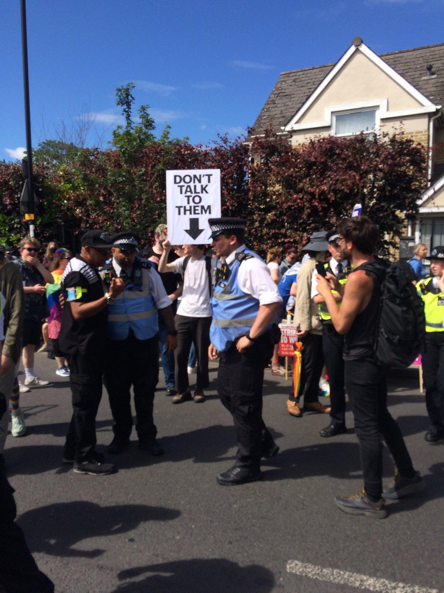
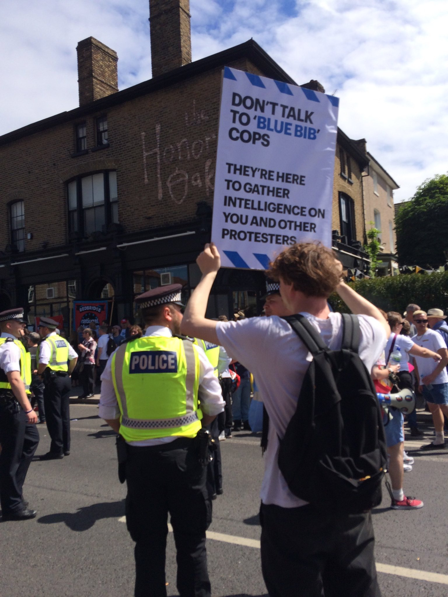
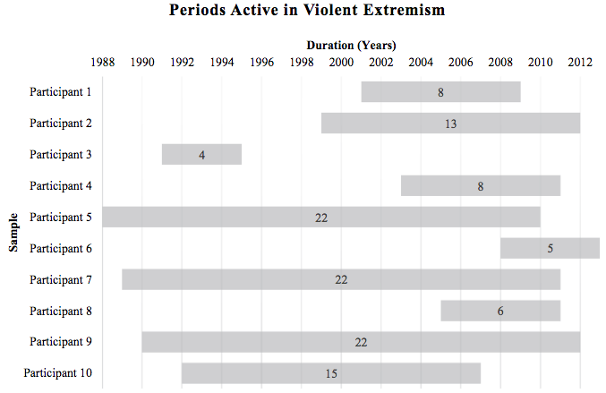

# Opening notes {background-color="#2c844c"}

::: {.tenor-gif-embed data-postid="14209777" data-share-method="host" data-aspect-ratio="1.94" data-width="70%"}
<div class="tenor-gif-embed" data-postid="14209777" data-share-method="host" data-aspect-ratio="1.94" data-width="100%"><a href="https://tenor.com/view/open-gif-14209777">Open Sticker</a>from <a href="https://tenor.com/search/open-stickers">Open Stickers</a></div> <script type="text/javascript" async src="https://tenor.com/embed.js"></script> 
:::

```{=html}
<script type="text/javascript" async src="https://tenor.com/embed.js"></script>
```

<!-- ## Presentation groups -->

<!-- ::: panel-tabset -->
<!-- ## December -->

<!-- | Date    | Presenters                       | Method | -->
<!-- | -------:|:---------------------------------|:------:| -->
<!-- | 4 Dec:  | Shahadaan, Kristine, Daichi      | ethnography |  -->
<!-- | 11 Dec: | Bérénice, Zorka, Victoria, Katharina | content analysis | -->
<!-- | 18 Dec: | Shoam, Aidan, Tara, Sebastian    | QCA |  -->

<!-- : Presentations line-up -->

<!-- ## January -->

<!-- | Date    | Presenters                       | Method | -->
<!-- | -------:|:---------------------------------|:------:| -->
<!-- | 8 Jan:  |                                  | TBD    |  -->
<!-- | 15 Jan: |                                  | TBD    |  -->
<!-- | 22 Jan: |                                  | TBD    |  -->
<!-- | 29 Jan: |                                  | TBD    |  -->

<!-- : Presentations line-up -->

<!-- ::: -->

<!-- []{style="font-size:10px;"} -->

<!-- For a course on 'political violence' and a class on 'state responses: repression', can you suggest some discussion questions to ask students? Ideally, the questions should have multiple choice responses, or yes/no/maybe responses, or strongly agree/agree/disagree/strongly disagree responses, or short-answer (i.e., one or two words should suffice) responses? -->

# Klausur instructions and brief review {background-color="#2c844c"}

:::: {.columns}
:::{.column width="50%"}
- exam-day instructions 
- quick review of Vorlesung material, themes: 
    1. historical experience 
    2. Constitutional Court 
    3. parliamentary system, executive dominance 
    4. cooperative federalism 
    5. elections, parties, and party system change

:::

::: {.column width="50%"}
<div class="tenor-gif-embed" data-postid="16633244770639601466" data-share-method="host" data-aspect-ratio="1.5748" data-width="100%"><a href="https://tenor.com/view/you-can-do-it-reminder-gif-16633244770639601466">You Can Do It Reminder GIF</a>from <a href="https://tenor.com/search/you+can+do+it-gifs">You Can Do It GIFs</a></div> <script type="text/javascript" async src="https://tenor.com/embed.js"></script> 
:::
::::

## Klausur instructions

- [2 February (Monday) at (promptly!) 8.00]{style="color:red;"} in the [AudiMax](https://www.lmu.de/raumfinder/#/building/bw0000/map?room=000000100_)

. . . 

- arrive at [7.45]{style="color:red;"} to get checked in 
- bring your ID!
- consider going to the toilet before entering Audimax... 

## Klausur instructions 

- time management: e.g., 15 minutes each for 3 Vorlesung questions; 45 minutes for 1 essay question
- FIVE questions provided --- THREE must be answered
- Questions consist of **[factual]{style="color:cadetblue;"}** knowledge component and **[analytical]{style="color:cadetblue;"}** component
- Overview of central topics in the lecture plan (under '*Organisatorisches*'). Exam questions relate to these central topics
- Reference to central articles of the Basic Law relevant for some questions (e.g. Eternity clause Art. 79, Paragraph 3 of the Basic Law; Art. 21 bz Regulation of parties)
- details about other countries are not required knowledge

## Quick review of Prof. Bolleyer’s course material

- **FIVE themes in the Vorlesung course**
    1. Germany as system shaped by [historical experience]{style="color:forestgreen;"}
    2. Federal [Constitutional Court]{style="color:violet;"} as above day-to-day politics vs. strategic actor (Vanberg model)
    3. Germany classified as [parliamentary system]{style="color:teal;"} that invites executive dominance
    4. Germany classified as case of [cooperative federalism]{style="color:purple;"} 
    5. [Elections, parties, and party system change]{style="color:goldenrod;"}

## 1. Germany as system shaped by history - basics

1. Constitutional state based on fundamental rights & parliamentary representative democracy 
2. Designed for [power sharing/taming the power]{style="color:forestgreen;"} of the executive
3. [“Semi-sovereign” state]{style="color:forestgreen;"} – democratic principle restricted by constitutionality/court
4. [Central role of the parties]{style="color:forestgreen;"}; simultaneously multi-party system (numerous “veto players”)
5. State of [grand coalitions]{style="color:forestgreen;"}: tension between party competition and cooperation pressures (federalism)
6. [“Delegating state”]{style="color:forestgreen;"} (e.g. collective bargaining, central bank)
7. “Open state” [transfer of sovereignty]{style="color:forestgreen;"} (EU) --> elements counteract the concentration of power in the executive

## 1. Germany as system shaped by history {.smaller}

- Lessons from Weimar: e.g., Eternity clause Art. 79 Abs. 3
- Areas of focus: 
    (1) [constitutional principle vs. democratic principle]{style="color:forestgreen;"} (BRD: constitutional sovereignty, UK: parliamentary sovereignty); 
    (2) [substantive vs. procedural understanding of democracy]{style="color:forestgreen;"} (different from the Weimar Constitution)
- Key concept: *[wehrhafte Demokratie]{style="color:forestgreen;"}*
    + “defensive democracy” --> intended to prevent democracy from abolishing itself through democratic procedures
    + e.g., [Eternity clause]{style="color:forestgreen;"}; [forfeiture of basic rights]{style="color:forestgreen;"} (Art. 18 GG); [group ban]{style="color:forestgreen;"} (Art. 9 Abs 2 GG); [party ban]{style="color:forestgreen;"} (Art. 21 Abs 2 GG); constitutional protection offices; officials’ [duty to be loyal]{style="color:forestgreen;"} to the constitution (Article 5, 33 GG)
- Logic of [consensus democracy]{style="color:forestgreen;"}: gov. responsive to as many citizens as possible; maximal interests integrated into decision-making process --> prevent tyrannous majority


## 2. Federal [Constitutional Court]{style="color:violet;"} 

- [independence of BVerfG]{style="color:violet;"} as sign of separation of powers (checks and balances): “guardian of the constitution”; appointment of judges, required qualifications of judges
- Forms of (self-)limitation
    1. how [political context influences whether the BVerfG]{style="color:violet;"} declares laws unconstitutional (*abstract norm control*)
    2. Court relies on [enforceability]{style="color:violet;"} and [acceptance]{style="color:violet;"} 
    3. Court tend to exercise [restraint in times of crisis]{style="color:violet;"} (e.g. Corona)
    4. Legislators [can change the organisation and resources]{style="color:violet;"} of the court (with a simple majority, no Federal Council veto)
    5. Legislators can change rules by [amending the constitution]{style="color:violet;"}
    6. Federal Constitutional Court only takes [action after a lawsuit]{style="color:violet;"}

## 3. Germany: [parliamentary system]{style="color:teal;"}, executive dominance

::: {style="margin-top: -40px;"} 
- [separation of powers]{style="color:teal;"} (less helpful to understand exec.-leg. relation in parliamentarism --- different in presidentialism)
- Primary characteristic of parliamentarism: dependence of the executive on the legislature 
    + result: [functional interlocking of powers]{style="color:teal;"} - government & government majority/factions dominate legislation (“interlocking” also through the government’s right of initiative)
    + opposition factions exercise '[control rights]{style="color:teal;"}'
- Central institutional mechanisms: 
    + [election of the chancellor]{style="color:teal;"} (chancellor majority)
    + [confidence vote]{style="color:teal;"} and [constructive vote of no confidence]{style="color:teal;"} – promotes stability (cf. Weimar!)

::: 

## 4. Germany classified as case of [cooperative federalism]{style="color:purple;"} {.smaller}

- Cooperative federalism in Germany (vs. dual federalism/separate federalism (e.g. USA))
    + Essentially an executive federalism ([state governments in the Bundesrat]{style="color:purple;"} influence the national constitution, implementation of laws by state administrations centrally)
    + [Distribution of powers that encourages cooperation]{style="color:purple;"}: e.g. competing legislation; community tasks; also: financial integration (community taxes) (vs. clear “separation” in dual/separate federalism)
    + Article 72, Paragraph 2 of the Basic Law “[establishment of equal living conditions in the federal territory]{style="color:purple;"}” (“unitary federalism”) --> Political integration also through voluntary, horizontal cooperation: Conferences of Ministerpräsidenten

- Bundesrat - strong second chamber: legislative power of consent
    + Composition: [government representatives of the states]{style="color:purple;"} (unlike the classic Senate model)

## 5. [Elections]{style="color:goldenrod;"}, parties, and party system change

- **Political participation**: *all activities that citizens do voluntarily with the goal to influence the political system*
    + [conventional]{style="color:goldenrod;"} (e.g., voting) vs. [unconventional]{style="color:goldenrod;"} (e.g., protesting)
        * [trend towards individual participation]{style="color:goldenrod;"} forms---away from collective forms (societal changes such as individualisation, secularisation)
    + Voting/elections are central form of participation
        * [responsiveness mechanism]{style="color:goldenrod;"} (according to voter preference) --> increasing tension here
        * generates: *[legitimation]{style="color:goldenrod;"}*, *[mobilisation]{style="color:goldenrod;"}*, *[recruitment]{style="color:goldenrod;"}*, *[representation]{style="color:goldenrod;"}*, etc.

## 5. Elections, [parties]{style="color:goldenrod;"}, and party system change

- **Parties**: *political groups that present candidates for public office* (Sartori 1976/2000)
    + parties as "[transmission belts]{style="color:goldenrod;"}" (like interest groups), but operate in society and within political institutions
    + in DE, parties are '[institutional actors]{style="color:goldenrod;"}' or '[state organs]{style="color:goldenrod;"}' (Art. 21 GG)
    + central aspects: participation in political [decision-making]{style="color:goldenrod;"}; obligation of [intra-party democracy]{style="color:goldenrod;"}; state [financing]{style="color:goldenrod;"} (and accountability); possible party ban

## 5. Elections, parties, and [party system change]{style="color:goldenrod;"} 

::: {style="margin-top: -40px;"} 
- **party system**: *the system of interactions resulting from inter-party competition* (Sartori 1976)
- focus on **[new 'players']{style="color:goldenrod;"}** in the system or on **[system characteristics]{style="color:goldenrod;"}**
- context: established parties face challenges (shrinking membership, sinking trust, greater vote competition from newcomers [Grüne, AfD, BSW], new cleavages)
- relevant system elements:
    + [format]{style="color:goldenrod;"}: number of parties
    + [fragmentation]{style="color:goldenrod;"}: parties relative size/strength
    + [content]{style="color:goldenrod;"}: policy/ideological position of a parties
    + [polarisation]{style="color:goldenrod;"}: ideological/policy distance between parties 
    + [segmentation]{style="color:goldenrod;"}: coalition potential of parties

::: 

## Vorlesung: example question {.scrollable} 

["How has political participation in Germany changed over the last four decades and what are the key explanatory factors for this?"]{style="color:indigo; font-size:40px;"} 

[„Wie hat sich politische Partizipation in Deutschland in den letzten vier Jahrzehnten gewandelt und was sind zentrale Erklärungsfaktoren dessen?“]{style="font-size:16px;"}

- Remember: questions consist of **factual** knowledge component and **analytical** component
    + no Pro/Contra discussion -- not enough time
- Here, **political participation** is the key concept (*factual knowledge*)
    + what does it mean? Explain it briefly in your answer
    + Discuss briefly: less party participation; expansion of participation forms (e.g., protests, petitions); emergence of online participation --> more individualised participation, less collective
- Causes for these changes (*analytical knowlege*)
    + secularisation (less religious adherence), expansion in education, change in values, technological innovations (for digital participation) --> all favour more individual participation, less collective

# Pointers on research papers {background-color="#2c844c"}

:::: {.columns}
:::{.column width="50%"}
- basics of a good paper: 
    + introduction 
    + main body 
    + conclusion 
- golden rules for any paper

:::

::: {.column width="50%"}
<div class="tenor-gif-embed" data-postid="16527898" data-share-method="host" data-aspect-ratio="1.78771" data-width="100%"><a href="https://tenor.com/view/kermit-the-frog-typing-busy-typewriter-writing-gif-16527898">Kermit The Frog Typing GIF</a>from <a href="https://tenor.com/search/kermit+the+frog-gifs">Kermit The Frog GIFs</a></div> <script type="text/javascript" async src="https://tenor.com/embed.js"></script> 
:::
::::

## Basics of a good paper - introduction 

- [What?]{style="color:cadetblue;"}
    + What is the *[puzzle]{style="color:red;"}* or *[research question]{style="color:red;"}*?
    + There are two types of questions: **interesting** questions and **researchable** questions --- unfortunately, there is quite limited overlap between them...
        * a main challenge in research is to *find a way to transform a big, interesting question into a researchable one* (this is the intricacy of **research design**)
- [Why?]{style="color:cadetblue;"} Theoretical, methodological, and/or practical relevance
- [How?]{style="color:cadetblue;"} Structure of the argument/paper
- About 10% of entire paper

## Basics of a good paper - main body

- Case selection
    + Which cases (what population)? When? Why?
    + Scope conditions
- Phenomenon of interest
    + Definitions $\rightarrow$ systematised concepts $\rightarrow$ indicators/operationalisation $\rightarrow$ data source
    + specify what kind of data you will use and where it comes from
- For descriptive analysis
    + Consider creating a typology/multi-dimensional concept
- For causal analysis: potential causes of your DV/outcome
    + theories, hypotheses, and causal mechanisms

## Basics of a good paper - conclusion

- Brief summary of argument (and findings)
- What is it that you are NOT saying and investigating?
- Future research
- Maximum 10% of text

## Golden rules for any paper

::: {style="margin-top: -40px;"} 
- Structure: paper should have a structure which is 
    + clear, summarised in introduction, explicit as the paper unfolds
    + One paragraph = one idea
    + Help your reader: (i) sum up a section, (ii) link to/justify next section
- Answer the question you have chosen:
    + a tragic mistake is to give a brilliant answer to a question that is subtly different to the one you asked
- Writing:
    + words have precise meanings, use them with care---they are the tools of the scholarly trade!
    + KISS (keep it simple, stupid): clear words; short sentences

::: 

# Disengage, deradicalise {background-color="#2c844c"}

:::: {.columns}
:::{.column width="65%"}
- concepts (refresher)
- some weighty discussion points 
- @Fillieule2009 (*a dense sociological piece*), 'defection'
    + ideology, weakening socialisation 
    + resources, rewards 
    + networks and identities 
    + inconsistent repression effects  

:::

::: {.column width="35%"}
<div class="tenor-gif-embed" data-postid="20225822" data-share-method="host" data-aspect-ratio="1" data-width="100%"><a href="https://tenor.com/view/im-done-real-housewives-of-potomac-its-over-thats-it-karen-huger-gif-20225822">Im Done Real Housewives Of Potomac GIF</a>from <a href="https://tenor.com/search/im+done-gifs">Im Done GIFs</a></div> <script type="text/javascript" async src="https://tenor.com/embed.js"></script> 
:::
::::

::: {style="margin-top: -40px;"} 
- Gaudette et al. [-@GaudetteETAL2022], disengaged but still radical 
- tricky case of deradicalisation 

::: 

## Refresher: (de)radicalisation - core concepts {auto-animate=true}

- [radicalisation]{style="color:darkred;"} (*change in [belief]{style="color:cadetblue;"}*): [process]{style="color:blue;"} of connecting with and adopting radical or extremist ideology---does not necessarily result in violence or 'engaging' in extremist activity
- [engagement]{style="color:darkred;"} (*change in [behaviour]{style="color:violet;"}*): (in this context) [process]{style="color:blue;"} or act of performing radical or extremist activity, especially violence

- [deradicalisation]{style="color:darkred;"} (*change in [belief]{style="color:cadetblue;"}*): "[process]{style="color:blue;"} by which an individual is diverted from an extremist ideology, eventually rejecting an extremist ideology and moderating their beliefs" [@GaudetteETAL2022, p. 1]
- [disengagement]{style="color:darkred;"} (*change in [behaviour]{style="color:violet;"}*): "[process]{style="color:blue;"} by which an individual decides to leave their associated extremist group or movement in order to reintegrate into society" (*Ibid.*)

## Refresher: (de)radicalisation - core concepts {auto-animate=true}

- [deradicalisation]{style="color:darkred;"} (*change in [belief]{style="color:cadetblue;"}*): "[process]{style="color:blue;"} by which an individual is diverted from an extremist ideology, eventually rejecting an extremist ideology and moderating their beliefs" [@GaudetteETAL2022, p. 1]
- [disengagement]{style="color:darkred;"} (*change in [behaviour]{style="color:violet;"}*): "[process]{style="color:blue;"} by which an individual decides to leave their associated extremist group or movement in order to reintegrate into society" (*Ibid.*)

[Why might individuals disengage from politically violent organisations? And deradicalise? Who might be susceptible to disengage and deradicalise, what types of persons?]{style="color:indigo;"}

## Some good discussion points to ponder 

- [How has the process of [disengagement]{style="color:darkred;"} and [deradicalisation]{style="color:darkred;"} changed over the centuries, if it has at all?]{style="color:indigo;"} 

. . . 

- [Are there (predictable) differences in [disengagement]{style="color:darkred;"} and [deradicalisation]{style="color:darkred;"} depending on the politically violent group?]{style="color:indigo;"} 
    + consider group-community interwovenness; perhaps easier to relocate now; but also easier to remain in contact

. . . 

- [Can police, social workers or penal system workers meaningfully influence the process of [disengagement]{style="color:darkred;"} and [deradicalization]{style="color:darkred;"}?]{style="color:indigo;"} 
    + policy evaluation of EXIT programmes?
    + examples of EXIT programmes reaching out to radical communities (operation '[Trojan T-Shirt](https://www.spiegel.de/international/germany/tee-d-off-right-wing-extremists-tricked-by-trojan-shirts-a-779446.html>; <https://home-affairs.ec.europa.eu/networks/radicalisation-awareness-network-ran/collection-inspiring-practices/ran-practices/exit-germany-trojan-t-shirt_en)')

## @Fillieule2009 - 'forms of defection'

<!-- - this is a dense sociological piece -->
<!-- - but is draws in and synthesises a vast array of literature/research -->

- defection, disengagement, withdrawal, disaffiliation, leaving - [some conceptual muddle to address]{style="color:blue;"}
- [collective defection]{style="color:darkred;"} (group splintering or departure of an "entire affinity group")
- [isolated defection]{style="color:darkred;"} (changes to biographical availability, lost commitment) 
    + @Davenport2015, two types: burnout/exhaustion (**[inability]{style="color:cadetblue;"}** to continue) and lost commitment (**[unwillingness]{style="color:cadetblue;"}** to continue)
- Introvigne's (1999) types:
    + *[defectors]{style="color:violet;"}* - leaving org by negotiation/agreement
    + *[apostates]{style="color:violet;"}* - becoming org's professional enemy
    + *[ordinary leave takers]{style="color:violet;"}* - disappear, disengage quietly
    + @Fillieule2009: **this typology is incomplete, needs augmenting**

## @Fillieule2009 - methodological approach

- common ground with Horgan [-@Horgan2008; -@Horgan2014]
- '*move away from focus on determinants and factors to focus instead on [process]{style="color:blue;"}*'
    + consequent methodological choices ...

## @Fillieule2009 - methodological approach

::: {style="margin-top: -30px;"} 
- common ground with Horgan [-@Horgan2008; -@Horgan2014]
- '*move away from focus on determinants and factors to focus instead on [process]{style="color:blue;"}*'
    + consequent methodological choices ...

::: {style="margin-top: -50px;"} 
> we must first investigate the individuals and their life story and then question the manner in which their existence is partly determined by structural factors at the meso and macro levels. Which means adopting the framework of a **comprehensive sociology**, attentive to the justifications of the actors.

<!-- - keep your methods hat on, though, we will check in about this... -->

::: 

::: 

. . . 

::: {style="margin-top: -30px;"} 
- necessity of 'multi-level analysis'
    + [micro]{style="color:blue;"}: dispositions, socialisation; [meso]{style="color:blue;"}: secondary socialisation in protest groups, 'organisational modelling,' strength of 'role taking,' dependence on the group, etc.; [macro]{style="color:blue;"}: political context, repression and opportunities

::: 

## @Fillieule2009 - some additional definitions

- **[radical organisation]{style="color:darkred;"}** - "any form of organization ready to operate outside of the legal framework and to resort to violence, whether because it feels that the conventional forms of action are ineffective, or because repression leaves no other alternative than violence or the dissolution of the group."
- **[violent action]{style="color:darkred;"}** - "a vast array of more or less long lasting or extreme forms of commitment, including violence against oneself (e.g. immolation, suicide attacks) or against others (e.g. assassination, so called 'terrorist' acts, guerilla, etc.)." 

## @Fillieule2009 - theory-building

- two series of [mechanisms]{style="color:blue;"}
    1. the complex effects of organisational moulding on individuals caught up in radical groups
    2. the ambivalent effects of repression and the criminalisation of radical activities

## @Fillieule2009 - ideology, weakening socialisation

::: {style="margin-top: -40px;"} 
- two modes of weakening ideological commitment
    1. due to a [change of political climate]{style="color:cadetblue;"}
        + "*Whalen and Flacks (1989) show that after The Vietnam War ended and the repression of leftist movements intensified in the US, militant groups began to re-evaluate the chances of success of the revolutionary project, as well as the cost of commitment.*"
    2. cracks in consensus, [factions, splits]{style="color:violet;"}
        + e.g., "*... in the context of the failed Red Brigades kidnapping of Aldo Moro in 1977, conflicts emerged between the groups of prisoners and the external management of the movement, at the same time as the state was creating a special category for those who left the organisation and accepted to collaborate with the State, thus providing opportunities for withdrawal and treason (Moretti, 2004).*"

::: 

## @Fillieule2009 - resources, rewards

- **[rewards]{style="color:darkred;"}** - the material or symbolic benefits individuals think they receive from their commitment
- complex dynamic with rewards, though
    + "*the more one had to sacrifice to enter the group and remain a member, the higher the cost of defection*" (cf. Kanter 1968)
- symbolic level, must account for:
    + public image of the group 
    + social legitimacy 
    + acceptance of justification to use of violence

<!-- - **must we here stick to 'comprehensive sociology' approach?** -->

## @Fillieule2009 - social networks and identities

- forms of **[attachment]{style="color:darkred;"}** (Kanter)
    1. maintenance: *sacrifice* and *investment* enhance [attachment]{style="color:darkred;"} ([individual]{style="color:goldenrod;"})
    2. cohesion: *affective links between individuals* and *emotions* enhance [attachment]{style="color:darkred;"} ([collective]{style="color:goldenrod;"})
        + renunciation: withdrawal from  relationships outside group
        + communion: the ‘we’ feeling
    3. control: reciprocal (asserting and giving up of) control relationship enhances [attachment]{style="color:darkred;"}
        + mortification: loss of individuals’ sense of self-determination (replaced by group identification)
        + denial: unconditional dedication to an authority

## @Fillieule2009 - inconsistency of effects of repression

- Repression **[benefiting]{style="color:green;"}** mobilisation:
    + moral shocks, incidents of emotional mobilisation
    + theory of frustration
- Repression **[hindering]{style="color:red;"}** mobilisation:
    + decapitate a movement
    + drive up costs/risks

## responding to (perceived) repression, a recent example (25.6.2023, London)

:::: {.columns}
:::{.column width="50%"}


:::

::: {.column width="50%"}


:::
::::

## @Fillieule2009 - effects of repression

- may lead to [block recruitment]{style="color:darkred;"}: *mobilising entire families from the same villages and associations*
    + PKK, IRA, ETA
- encourages [clandestine activity]{style="color:darkred;"}
- intensifies competition among rival groups

## @Fillieule2009 - methods recommendations

1. move away from [IVs]{style="color:blue;"} and [DVs]{style="color:blue;"}, towards 'thick description'
2. move away from [mono causal explanations]{style="color:blue;"} by discerning factors explaining individual behaviour at the three interrelated micro-meso, micro-macro and meso-macro levels
3. move from *[synchronic]{style="color:blue;"}* (i.e., at one point in time) to *[diachronic]{style="color:blue;"}* (i.e., over time) mechanisms for context, organisational, individual change
4. move away from purely *agency* or purely *structural* approaches, towards '[interactionist sociology]{style="color:blue;"}'
5. focus on [individual level]{style="color:blue;"} (i.e., one’s life course and the justifications they give for their actions) and, through individuals, manifestation of micro-, meso-, and macro-level factors

## disengaged but still radical - Gaudette et al. [-@GaudetteETAL2022]

<!-- ## A brief example of 'disengaged but still radical' consequences -->

<!-- - Bill Ayers, Weather Underground -->
<!-- - Obama campaign 2012 -->

::: {style="margin-top: -30px;"} 
- in-depth interviews with Canadian former right-wing extremists 
    + interview questions provided by Canadian law enforcement officials and local community activists

::: {style="margin-top: -40px;"} 

> [prior to conducting the interviews with formers, we consulted with key stakeholders, namely Canadian law enforcement officials and local community activists, and [they developed a list of interview questions that they would ask formers and those questions were incorporated into the interview guide]{style="color:blue;"}. The purpose of this approach was simple: rather than developing an interview guide that was derived from an academic perspective only, we included interview questions from key stakeholders for the purposes of developing a multidimensional, multi-perspective interview guide.]{style="font-size:26px;"}

- [ethical implications?]{style="color:indigo;"}
- data: 10 former RWEs, recruited using a [snowball sampling]{style="color:blue;"} technique

::: 

::: 

## data [@GaudetteETAL2022] 



## findings [@GaudetteETAL2022] {.smaller}

:::: {.columns}
:::{.column width="50%"}

Reasons for leaving ([note multiplicity of reasons]{style="color:red;"})

|                     | Freq. |
|---------------------|-------|
| Birth of a child    | 4     |
| Reunite with family | 1     |
| Emotional burnout   | 3     |
| Physical burnout    | 1     |
| Disillusionment     | 6     |

- [disengagement]{style="color:darkred;"}: multifaceted and multidimensional process composed of various interrelated reasons
- [generalisability]{style="color:indigo;"}? across movements (other RWE? Islamists? left-wing?)? across countries? across periods?

:::

::: {.column width="50%"}
- [strategies]{style="color:red;"} of [disengagement]{style="color:darkred;"}
    + time away from and placing physical distance between themselves and movement adherents (including imprisonment (p12))
    + leaning on family and friends outside of extremism for support during early disengagement stages
- '[hard-wired beliefs]{style="color:red;"}': disengaged but not deradicalised 
    + retention of radical beliefs are strong predictors of reengagement in violent extremism (Altier, MB, Boyle, EL, & Horgan, J. (2021))

:::
::::

## a tricky case of individual deradicalisation

(in German)

<figure>
<figcaption>Click to listen</figcaption>
<audio controls src="zschaepe.mp3">
        Your browser does not support the
        <code>audio</code> element.
</audio>
</figure>

<https://www.zeit.de/politik/2023-07/sterbehilfe-gesetz-bundestag-nachrichtenpodcast>

. . . 

[should Beate Zschäpe be eligible for a deradicalisation programme? Including the incentives for participation (i.e., sentence reduction)?]{style="color:indigo;"}

# Poll: disengagement in studied groups {background-color="#2c844c"}

:::: {.columns}
:::{.column width="35%"}
{fig-alt="A QR code for the survey."}

:::

::: {.column width="65%" .center}
<!-- go to <https://www.qr-code-generator.com/>, add the link, and screen shot the QR code -->
Take the survey at **<https://forms.gle/8brVvDPCmGZFzQ1K6>**

- [Disengagement]{style="color:violet;"} from this group is primarily [voluntary]{style="color:violet;"}.
- Most [disengagement]{style="color:violet;"} is [gradual]{style="color:violet;"} rather than abrupt.
- most common "[exit pathway]{style="color:violet;"}" from this group?

:::
:::: 

- Fear of state [repression]{style="color:violet;"} is a major [driver of disengagement]{style="color:violet;"}?
- Most members who [disengage]{style="color:violet;"} also [deradicalise]{style="color:violet;"}.

--- 

```{ojs}
md`## Poll results (Respondents: ${respondentCount})`
```


```{ojs}

import { liveGoogleSheet } from "@jimjamslam/live-google-sheet";
import { aq, op } from "@uwdata/arquero";

// UPDATE THE LINK FOR A NEW POLL
surveyResults = liveGoogleSheet(
  "https://docs.google.com/spreadsheets/d/e/" +
    "2PACX-1vTDMrktWyutD4kjgE1IFF6K5wawuYuaLtmdFsAZqBjFz-daxhHuLHufm5uZAUA0uyz-InMqR8Lb4XF7/" +
    "pub?gid=1285259553&single=true&output=csv",
  10000, 1, 7); // adjust the last number to select all relevant columns 

respondentCount = surveyResults.length;

likertOrder = [
  "Strongly disagree",
  "Disagree",
  "Neutral",
  "Agree",
  "Strongly agree"
];

ynmOrder = [
  "Yes",
  "No",
  "Maybe"
];

groupOrder = [
  "Antifa",
  "RAF",
  "IS",
  "alQaeda",
  "NPD/Heimat",
  "NSU",
  "PKK"
];

groupColors = [
  "pink",
  "red",
  "grey",
  "black",
  "#d2b48c", // lightbrown - could also use 'peru'
  "brown",
  "green"
];

```

:::: {.columns}
:::{.column width="48%"}
Disengagement from this group is primarily voluntary

```{ojs}
voluntary_disengageCounts = aq.from(surveyResults)
  .groupby("voluntary_disengage", "group")
  .count()
  .objects();

plot_voluntary_disengage = Plot.plot({
  marks: [
    Plot.frame({
      fill: "#f7f7f7",
      stroke: "black",
      strokeWidth: 1
    }),
    
    Plot.barY(voluntary_disengageCounts, {
      fx: "voluntary_disengage",
      x: "group",
      y: "count",
      fill: "group",
      stroke: "white"
    })
  ],

  color: {
    domain: groupOrder,
    range: groupColors,
    legend: true,
    style: { fontSize: "20px" }
  },

  fx: {
    domain: ynmOrder,
    label: "",
    tickRotate: 0
  },

  x: {
    domain: groupOrder,
    axis: null, // clears the entire x-axis (ticks and labels)
    // tickFormat: () => "",
    label: ""
  },

  y: {
    label: ""
  },

  marginBottom: 130,
  style: {
    width: 900,
    height: 500,
    fontSize: 20
  }
});

```
 
:::

:::{.column width="4%"}
<div style="height: 600px; border-left: 2px solid #999; margin: 0 auto;"></div>
:::


::: {.column width="48%"}
Most disengagement is gradual

```{ojs}
gradual_disengageCounts = aq.from(surveyResults)
  .groupby("gradual_disengage", "group")
  .count()
  .objects();

plot_gradual_disengage = Plot.plot({
  marks: [
    Plot.frame({
      fill: "#f7f7f7",
      stroke: "black",
      strokeWidth: 1
    }),
    
    Plot.barY(gradual_disengageCounts, {
      fx: "gradual_disengage",
      x: "group",
      y: "count",
      fill: "group",
      stroke: "white"
    })
  ],

  color: {
    domain: groupOrder,
    range: groupColors,
    legend: true,
    style: { fontSize: "20px" }
  },

  fx: {
    domain: ynmOrder,
    label: "",
    tickRotate: 0
  },

  x: {
    domain: groupOrder,
    axis: null, // clears the entire x-axis (ticks and labels)
    // tickFormat: () => "",
    label: ""
  },

  y: {
    label: ""
  },

  marginBottom: 130,
  style: {
    width: 900,
    height: 500,
    fontSize: 20
  }
});
```

:::
::::

## Most common 'exit pathways' 

```{ojs}
// need to replace 'exit_pathway'

exit_pathwayCounts = aq.from(surveyResults)
  .groupby("exit_pathway", "group")
  .count()
  .objects();

plot_exit_pathway = Plot.plot({
  marks: [
    Plot.frame({
      fill: "#f7f7f7",
      stroke: "black",
      strokeWidth: 1
    }),
    
    Plot.barY(exit_pathwayCounts, {
      fx: "exit_pathway",
      x: "group",
      y: "count",
      fill: "group",
      stroke: "white"
    })
  ],

  color: {
    domain: groupOrder,
    range: groupColors,
    legend: true,
    style: { fontSize: "20px" }
  },

  fx: {
    // domain: likertOrder,
    label: "",
    tickRotate: -45
  },

  x: {
    domain: groupOrder,
    axis: null, // clears the entire x-axis (ticks and labels)
    // tickFormat: () => "",
    label: ""
  },

  y: {
    label: ""
  },

  marginBottom: 170,
  style: {
    width: 900,
    height: 500,
    fontSize: 20
  }
});

```

## Disengagement driver and deradicalisation

:::: {.columns}
:::{.column width="48%"}
Fear of repression helps drive disengagement?

```{ojs}
repression_fearCounts = aq.from(surveyResults)
  .groupby("repression_fear", "group")
  .count()
  .objects();

plot_repression_fear = Plot.plot({
  marks: [
    Plot.frame({
      fill: "#f7f7f7",
      stroke: "black",
      strokeWidth: 1
    }),
    
    Plot.barY(repression_fearCounts, {
      fx: "repression_fear",
      x: "group",
      y: "count",
      fill: "group",
      stroke: "white"
    })
  ],

  color: {
    domain: groupOrder,
    range: groupColors,
    legend: true,
    style: { fontSize: "20px" }
  },

  fx: {
    domain: likertOrder,
    label: "",
    tickRotate: -55
  },

  x: {
    domain: groupOrder,
    axis: null, // clears the entire x-axis (ticks and labels)
    // tickFormat: () => "",
    label: ""
  },

  y: {
    label: ""
  },

  marginBottom: 130,
  style: {
    width: 900,
    height: 500,
    fontSize: 20
  }
});


```
 
:::

:::{.column width="4%"}
<div style="height: 600px; border-left: 2px solid #999; margin: 0 auto;"></div>
:::

::: {.column width="48%"}
disengagement *and* deradicalisation?

```{ojs}
disengage_deradCounts = aq.from(surveyResults)
  .groupby("disengage_derad", "group")
  .count()
  .objects();

plot_disengage_derad = Plot.plot({
  marks: [
    Plot.frame({
      fill: "#f7f7f7",
      stroke: "black",
      strokeWidth: 1
    }),
    
    Plot.barY(disengage_deradCounts, {
      fx: "disengage_derad",
      x: "group",
      y: "count",
      fill: "group",
      stroke: "white"
    })
  ],

  color: {
    domain: groupOrder,
    range: groupColors,
    legend: true,
    style: { fontSize: "20px" }
  },

  fx: {
    domain: likertOrder,
    label: "",
    tickRotate: -55
  },

  x: {
    domain: groupOrder,
    axis: null, // clears the entire x-axis (ticks and labels)
    // tickFormat: () => "",
    label: ""
  },

  y: {
    label: ""
  },

  marginBottom: 130,
  style: {
    width: 900,
    height: 500,
    fontSize: 20
  }
});

```

:::
::::


# Demobilisation {background-color="#2c844c"}

:::: {.columns}
:::{.column width="65%"}
- organisational demobilisation  
    + survival/resilience of terrorist groups  
        * active support
        * passive support
    + key factors of demobilisation 
    + example of al Qaeda 

:::

::: {.column width="35%"}
<div class="tenor-gif-embed" data-postid="20490322" data-share-method="host" data-aspect-ratio="0.765625" data-width="100%"><a href="https://tenor.com/view/destroyed-gif-20490322">Destroyed GIF</a>from <a href="https://tenor.com/search/destroyed-gifs">Destroyed GIFs</a></div> <script type="text/javascript" async src="https://tenor.com/embed.js"></script> 
:::
::::

<!-- ::: {style="margin-top: -40px;"}  -->

<!-- :::  -->

## Organisational demobilisation - @KurthCronin2006

::: {style="margin-top: -40px;"} 
- Background: grappling with U.S. combat against al-Qaida
- @KurthCronin2006 argues: past experience can (must!) inform attempts to combat al-Qaida (and politically violent groups)

::: {style="margin-top: -50px;"} 

> On average, modern terrorist groups do not exist for long. According to David Rapoport, 90 percent of terrorist organisations have a life span of less than one year; and of those that make it to a year, more than half disappear within a decade.

::: {style="margin-top: -50px;"} 
- Ideology seems to matter: of left-wing, right-wing, or ethnonationlist/separatist groups, [ethnonationalist/separatist have had the longest average life span]{style="color:darkorange;"}
    + [why might this be?]{style="color:indigo;"}

::: 

::: 

::: 

## Organisational demobilisation - @KurthCronin2006

::: {style="margin-top: -40px;"} 
- Background: grappling with U.S. combat against al-Qaida
- @KurthCronin2006 argues: past experience can (must!) inform attempts to combat al-Qaida (and politically violent groups)

::: {style="margin-top: -50px;"} 

> On average, modern terrorist groups do not exist for long. According to David Rapoport, 90 percent of terrorist organisations have a life span of less than one year; and of those that make it to a year, more than half disappear within a decade.

::: {style="margin-top: -50px;"} 
- Ideology seems to matter: of left-wing, right-wing, or ethnonationlist/separatist groups, [ethnonationalist/separatist have had the longest average life span]{style="color:darkorange;"}
    + [why might this be?]{style="color:indigo;"}
    + "*their greater average longevity seems to result, at least in part, from support among the local populace of the same ethnicity for the group’s political or territorial objectives.*"


::: 

::: 

::: 

## Organisational demobilisation - @KurthCronin2006

::: {style="margin-top: -30px;"} 
> Terrorist groups generally cannot survive without either active or passive support from a surrounding population.

::: {style="margin-top: -30px;"} 
- **[Active support]{style="color:goldenrod;"}**: hiding members, raising money, joining the organization
- **[Passive support]{style="color:cadetblue;"}**: ignoring obvious signs of terrorist group activity, declining to cooperate with police investigations, sending money to organizations that act as fronts for the group, expressing support for the group’s objectives

- the need to overcome **[apathy]{style="color:violet;"}**

::: {style="margin-top: -30px;"} 
> Apathy is a powerful force; all else being equal, most people naturally prefer to carry on their daily lives without the threat of being targeted by counterterrorism laws, regulations, sanctions, and raids.

::: 

::: 

::: 

## Organisational demobilisation - @KurthCronin2006 {.smaller}

::: {style="margin-top: -30px;"} 

| Key factors                                               | Notable historical examples                                                                                                                                                                                          |
|-----------------------------------------------------------|----------------------------------------------------------------------------------------------------------------------------------------------------------------------------------------------------------------------|
| Capture/Kill leader(s)                                    | Shining Path; Kurdistan Workers’ Party; Real Irish Republican Army; Aum Shinrikyo                                                                                                                                    |
| Unsuccessful generational transition                      | Red Brigades; Second of June Movement; Weather Underground; Baader-Meinhof group (Red Army Faction); The Order; Aryan Resistance Army                                                                                |
| Achievement of the cause                                  | Irgun/Stern Gang; African National Congress                                                                                                                                                                          |
| Transition to a legitimate political process/negotiations | Provisional Irish Republican Army; Palestinian Liberation Organization; Liberation Tigers of Tamil Eelam; Moro Islamic Liberation Front                                                                              |
| Loss of popular support                                   | Real Irish Republican Army; Basque Homeland and Freedom (ETA); Shining Path                                                                                                                                          |
| Transition toward criminality                             | Abu Sayyaf; Revolutionary Armed Forces of Colombia                                                                                                                                                                   |
| Transition toward full insurgency                         | Khmer Rouge; Guatemalan Labor Party/Guatemalan National Revolutionary Unit; Communist Party of Nepal-Maoists; Kashmiri separatist groups (e.g., Lashkare-Toiba and Hizbul Mujahideen); Armed Islamic Group (Algeria) |

::: 

## Uniqueness of al-Qaida? @KurthCronin2006

- Four characteristics distinguish al-Qaida:  
    1. fluid organisation; 2. recruitment methods; 3. funding; 4. means of communication 

::: {style="margin-top: -30px;"} 
> "No previous terrorist organization has exhibited the complexity, agility, and global reach of al-Qaida, with its fluid operational style based increasingly on **a common mission statement and objectives, rather than on standard operating procedures and an organizational structure**."


> "...many terrorism experts agreed that al-Qaida could best be described as a franchise organization with a marketable 'brand.'"

::: 

## THANK YOU!

- No class next week -- good luck on your exam!
- Essays (for those not taking Klausur) due **[2026-03-07]{style="color:red;"}**
- Thank you for the feedback on course evaluations: **if you have any follow-ups, please write to me or see me during office hours**

::: {style="text-align: center;"}
[Thanks for coming and being great students!]{style="color:forestgreen; font-size:100px;"} 
::: 


# Any questions, concerns, feedback for this class, or for the course? {background-color="#2c844c"}

Anonymous feedback here: <https://forms.gle/NfF1pCfYMbkAT3WP6>

Alternatively, please send me an email: [m.zeller\@lmu.de]{style="color:red;"}

```{r echo=FALSE, message=FALSE, warning=FALSE}
pagedown::chrome_print(file.path("..", "docs/slides", "slides_14.html"))
```

## References


